# Introduction

This post goes through basic concepts that every developer should know or at least be familiar with in some way or the other, it's an entry point to good practices. Most people already do all this without thinking, perhaps the post will just server to illustrate certain actions or thoughts.  
However and as we all know there's never a clear answer when it comes to software engineering, it boils down to two magical words: "***it depends***".

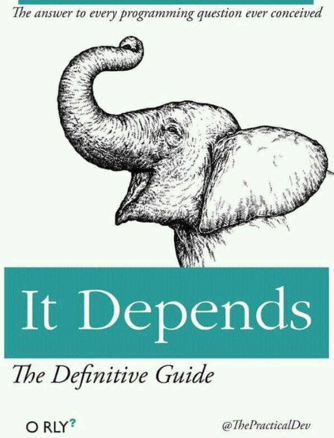

Feel free to correct me or provide feedback, you can find me on twitter [@tekbog](https://twitter.com/tekbog)

# OOP: what a beauty

You look outside and it's a beautiful day, you definitely can miss this weather so you decide to stay home and code.

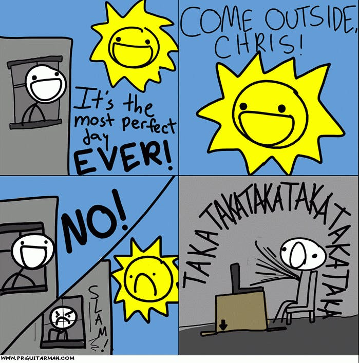

After making a beautiful hello world program you feel good and empowered to try something more advanced, and you wonder, how should you organize or even where to start. So you ask the kind souls at StackOverflow, at which some reply and mention OOP before your thread gets deleted because code monkeys decide to fight over [Objected Oriented Programming](https://en.wikipedia.org/wiki/Object-oriented_programming) VS [Functional Programming](https://en.wikipedia.org/wiki/Functional_programming).

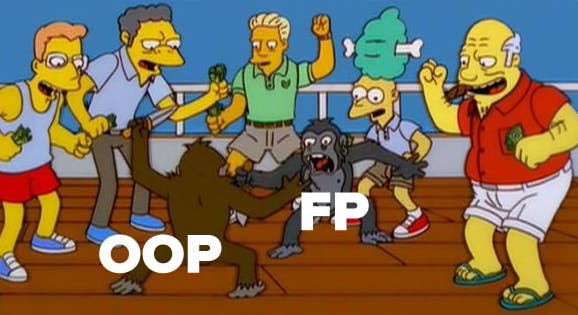

So you start looking at OOP and it makes a lot of sense! You have everything organized in objects that call other objects and are related to one another. It seems secure and it can be as complex as you wish, yet simple to understand. What a concept!

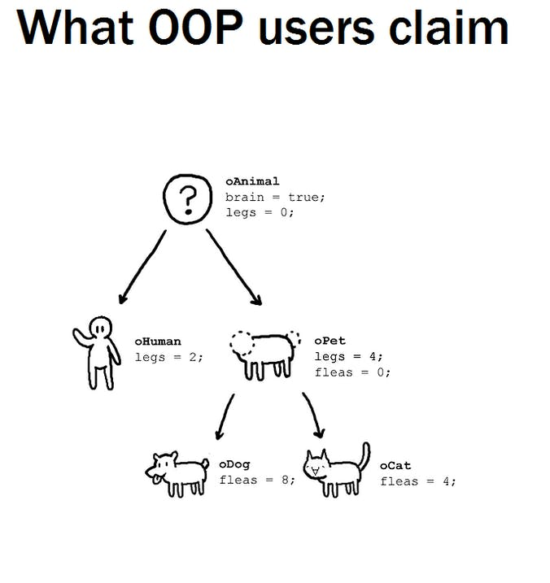

**BUT YOU ARE WRONG**

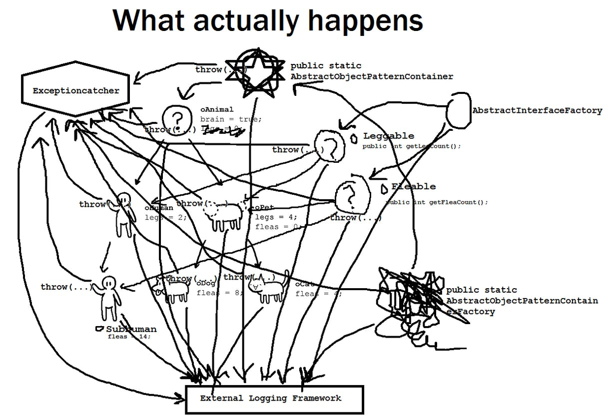

However with good practices and proper object modeling we can avoid having such a mess.

## Concepts

Objects are made through classes, what does this mean?
Classes are blueprints for whatever you want to make. You use that blueprint to create (or instantiate) the object that will run in memory.
The initialised object will have:

- **state** (characteristics)
- **behaviour** (what can it do or what can it be done to it)

*NB: in languages like C++ you need to take care of the memory usage, however a lot of languages have garbage collection implemented nowadays so you don't have to worry about when your objects disappear from memory.*

So, to make things clearer, you have a design called *class* then you use that design to create a new object of that class with which you will be able to interact and use. The interactions are defined (just like instructions) inside the class through state and behaviour. The class defines what you can do with the object and how other objects will be able to interact with said object once it's created.

Both the state and behaviour are modified through:

- attributes: parameters that define the **state** of the object
- methods: functions that define the **behaviour** of the object

The strengths of OOP are as follow

### Encapsulation

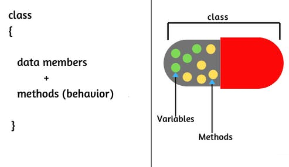

You want to have the data/variables and its behaviour closed in one single unit. Inside you define its behaviour through functions (methods) that you can make public or private to keep the object as hidden and pure as possible.

### Abstraction

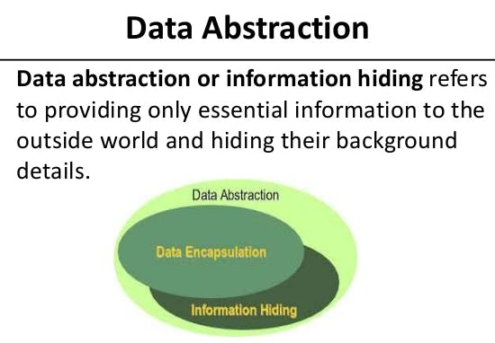

External agents don't need to know what's going on inside a specific object, they just need to know how to use it if needed. With abstraction you hide the internal implementation.  
To explain the concept for example take a random controller, you need to know HOW it works but you don't need to know WHY it works.

If this sounds too similar to encapsulation you can think of it as: abstraction is the theory while encapsulation is the implementation.  
Additionally you can read this [article](https://www.guru99.com/java-data-abstraction.html). The picture is from [this](https://github.com/shiddiqeuy/Java-Abstraction) repo.

### Inheritance

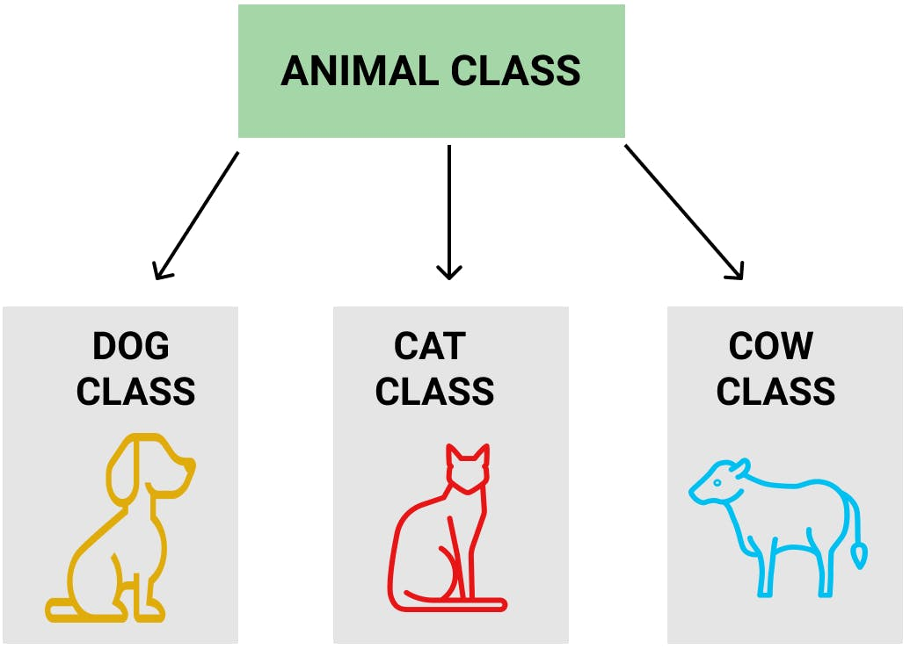

or something a bit more complex
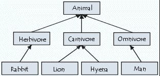

Inheritance provides security and a cleaner -more defined- architecture by basing one object on another, either through inheritance or sub-classes. To use inheritance you can either define an interface and then *implement* it on a new object or you can use an existing class and *extend* it to make a sub-class, with the original class called a super-class.  
You have **interfaces**, **classes** and then there's something in between called **abstract classes** which are just like ordinary classes but unfinished so you can't instantiate them but you can extend them and finish building them.

### Polymorphism

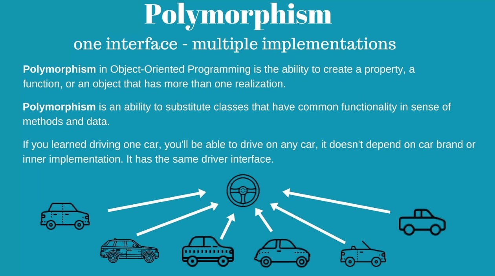

Poly stands for many;  
Morph stands for form.  
The main concept of polymorphism is the ability to have many forms.  
For example an interface can have many implementations. In order to apply polymorphism you just need a core to pull from and *morph* the original object with many *(poly)* changes.

#### Polymorphism vs Inheritance

Things get a bit confusing with polymorphism and inheritance but think about how a class can *inherit* properties from a superclass while an interface can be *implemented* in many different ways making itself polymorphic. Henceforth classes work mostly through inheritance while interfaces work through polymorphism and inheritance.

#### Method Overriding

Also known as [Dynamic Polymorphism](https://www.javatpoint.com/method-overriding-in-java) and Run Time Polymorphism.  
It consists of allowing the subclass to change (override) the method (function) of the superclass. If you have a super class with the method (function) that says run and prints 'superclass runs' you can change the same method in the subclass to print 'subclass runs'.

#### Method Overloading

Also known as Static Polymorphism and Compile Time Polymorphism.  
You define two different methods that are called the same but behave differently with different parameters and at compile time the program decides which method to use.

[Here's a StackOverflow answer](https://stackoverflow.com/questions/20783266/what-is-the-difference-between-dynamic-and-static-polymorphism-in-java) that goes into both method overriding and overloading with a code example.

#### Duck Typing

The principle of [duck typing](https://en.wikipedia.org/wiki/Duck_typing) is related to method overloading and compile-time polymorphism, although mostly known and used in Python.  
The saying goes as "if it walks like a duck and quacks like a duck.. it is a duck". We can apply this logic to our objects, we don't care what they are per se but we care what they do and how their functions work. Therefore you can overload a function (through polymorphism) to do whatever you want, so in this scenario if you have a bird object that does everything a duck is capable of then you call that object a duck.

However in languages like Java or C# duck typing doesn't work as we are usually very concerned as to what type of objects we are working with.

## Inheritance Relationships

There are two key relationships in OOP:

- IS A

IS-A stands for "the object I'm referring to IS An object of another type I'm extending from" in this case if we have a subclass Dog that extends from the Animal class the relationship would be: Dog class IS-A Animal class.  
This example is based on classes but you could also have an interface called Animal and a class called Dog that implements it, also a IS-A relationship.

- HAS A

This relationship is more about usage, it means that an object is using another object without a need to extend or implement it.  
For example our Dog object could have a Toy object and interact with it. Here Dog HAS-A relationship with Toy.

## SOLID Principles

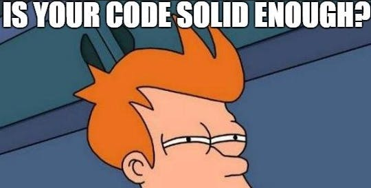

Those were dark times, the dot-com bubble made developers aggressive and savage, nobody followed any rules and the bugs reigned untouchable as software engineers were fighting amongst themselves, blaming each other and not writing tests.
In order to stop this violence and establish the order back in the workplace a prophet called Robert C. Martin came with 5 *solid* principles to put an end to this madness of developers fighting each other due to unreadable and unmaintainable code.

The [SOLID](https://en.wikipedia.org/wiki/SOLID) principles are five main ideas to make your code understandable, flexible and maintainable.

### Single-responsibility principle

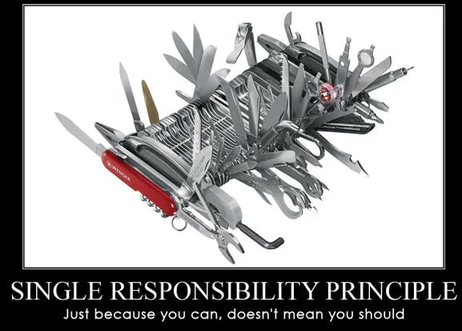

[SRP](https://en.wikipedia.org/wiki/Single-responsibility_principle) is summed up nicely in: "every class/function/module should have only one responsibility and encapsulate that part". And so microservices were born!  
To put an example, if you have a class or a function that has many inputs, conditionals and it's fairly long you probably need to [refactor](https://refactoring.guru/extract-method) that ASAP.

### Open–closed principle

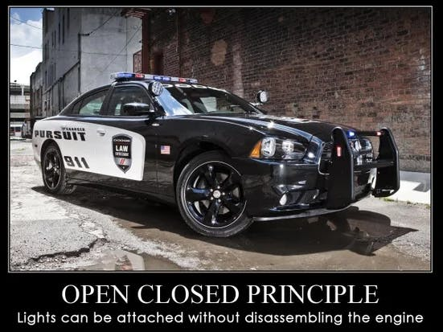

> [Software entities (classes, modules, functions, etc.) should be open for extension, but closed for modification](https://en.wikipedia.org/wiki/Open%E2%80%93closed_principle)

This means that you should be able to always extend a class with new functionality without having to change how it works. It's a key to maintainable code and it's easily achievable with interfaces, you can keep expanding it without the need to change the original interface.

### Liskov substitution principle

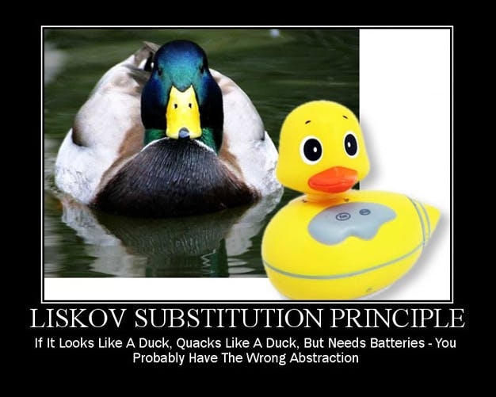

[LSP](https://en.wikipedia.org/wiki/Liskov_substitution_principle) is a bit confusing but basically the Liskov principle says that the subclass should be substitutable for the superclass. This will prevent you from making the wrong decisions when it comes to inheritance and polymorphism, it's easy to extend a class but make sure it's the correct order and implementation.

It's much easier to understand through code, check [this answer from StackOverflow](https://stackoverflow.com/a/44913313/14356309).

### Interface segregation principle

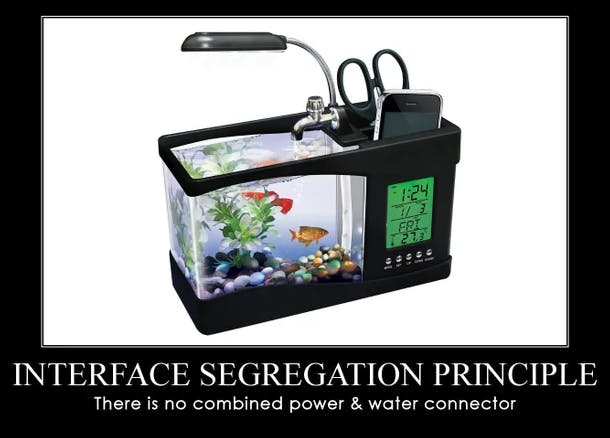

> [ISP](https://en.wikipedia.org/wiki/Interface_segregation_principle) is intended to keep a system decoupled and thus easier to refactor, change, and redeploy. No code should be forced to depend on methods it does not use.

ISP wants you to split the large interfaces and keep it simple, stupid (KISS). The official definition is as follows:

> Clients should not be forced to depend upon interfaces that they do not use.

You don't want a bloated interface that has methods for multiple responsibilities. Split it.

### Dependency inversion principle

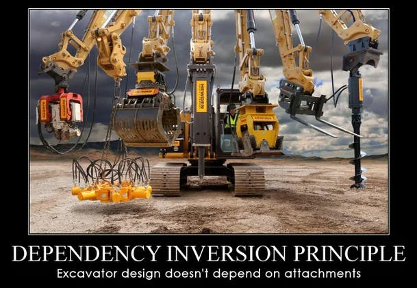

[DIP](https://en.wikipedia.org/wiki/Dependency_inversion_principle) is summed as follows:

- High-level modules should not import anything from low-level modules. Both should depend on abstractions (e.g., interfaces).
- Abstractions should not depend on details. Details (concrete implementations) should depend on abstractions.

It might sound simple but people tend to overlook this principle, however by following the open-closed principle and LSP you will be able to achieve the level of abstraction needed to separate both low and high level components so they never depend on each other.  
If your components are designed to be closed for modification but open for extension (open/closed principle) and you can replace with your implementations your interface (LSP) then you are following DIP. Separate the concern for design through layers of abstraction.

[FreeCodeCamp](https://www.freecodecamp.org/news/a-quick-intro-to-dependency-injection-what-it-is-and-when-to-use-it-7578c84fa88f/) has a nice definition while talking about Dependency Injection (which is a way to follow the dependency inversion principle):

> According to the principles, a class should concentrate on fulfilling its responsibilities and not on creating objects that it requires to fulfill those responsibilities.

## Association: Composition and Aggregation

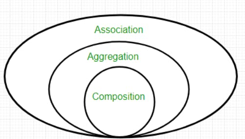

Both composition and aggregation are part of [association, here are some UML diagrams](https://www.guru99.com/association-aggregation-composition-difference.html#uml-composition), which is a way of saying two objects are related (by association). However composition and aggregation [differ](https://stackoverflow.com/a/31600062/14356309).

**Composition** is when a sum of parts build the object, so you need each other, following a two-way association. If you get rid of the composition its parts get deleted.  
[IBM](https://www.ibm.com/docs/en/rsm/7.5.0?topic=diagrams-composition-association-relationships) offers a nice explanation:

> A composition association relationship specifies that the lifetime of the part classifier is dependent on the lifetime of the whole classifier.

**Aggregation** is a more lax composition where objects don't depend on each other for the aggregation to exist. You can have two different objects that work together to build an aggregation but if the aggregation disappears the objects remain, as they are fully separate entities.  
[99guru](https://www.guru99.com/association-aggregation-composition-difference.html#uml-association) defines the aggregation relationship really well:

> an object of one class can own or access the objects of another class.

People tend to mix a bit the terms, more than often you will hear composition but in reality they are talking about aggregation. So just keep in mind when someone mentions composition they might be talking about a lax composition, meaning aggregation. Sometimes it doesn't matter but it might be relevant if you are designing complex systems.

### Composition over Inheritance

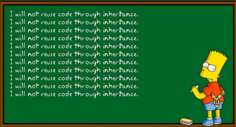

If our code base deviates from the SOLID principles (or any other reason) instead of having a tightly coupled structure based on inheritance you might want to use composition instead.  
Composition is usually just a way of saying that classes might use other classes to build complex interactions instead of relying as heavily on inheritance, this leads to HAS-A relationships (or PART-OF). The term is loosely used and sometimes people confuse aggregation with composition. When someone is talking about [composition over inheritance](https://en.wikipedia.org/wiki/Composition_over_inheritance) they can mean composition or aggregation, either way what they want to achieve is:

- Stronger encapsulation: inheritance needs a link with its subclasses which might weaken encapsulation.
- Easier testing: if you have separate objects without inheritance you can access and test them easier as they are fully separate units.
- Better refactoring: swapping things around is easier when you don't have a whole family of objects depending on it. By adding interfaces and making different classes work with each other you add flexibility which is almost always good.

It's especially strong if you bring [Dependency Injection](https://en.wikipedia.org/wiki/Dependency_injection) into the matter, which is a form of [Inversion of Control](https://en.wikipedia.org/wiki/Inversion_of_control).

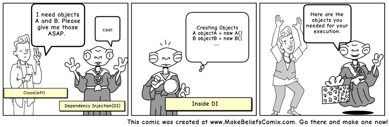

[FreeCodeCamp](https://www.freecodecamp.org/news/a-quick-intro-to-dependency-injection-what-it-is-and-when-to-use-it-7578c84fa88f/) has a nice little tutorial about DI.

## Replace Conditional with Polymorphism

Another benefit and strong point for OOP is how you can use Polymorphism to replace Conditionals. For example if you have a class with a lot of if-else or switch statements you can refactor it with classes through polymorphism. Afterwards just use whatever class you need.  
[Refactor Guru](https://refactoring.guru/replace-conditional-with-polymorphism) offers a nice example.

# Engineering Principles

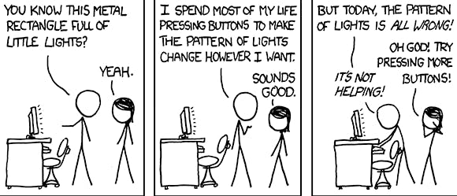

Once again [xkcd](https://xkcd.com/) points out our reality, however by applying certain principles we can get a bit better at organizing the pattern of lights.

## Measure twice and cut once

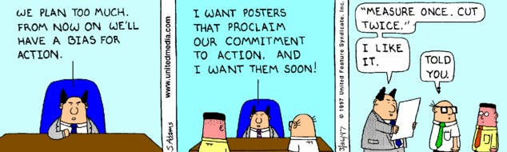

The point here is to think ahead. This depends entirely on what you are doing, for example if you are planning to make a platform but don't know how the schema database is going to look then use NOSQL over SQL.

## Don’t Repeat Yourself (DRY)

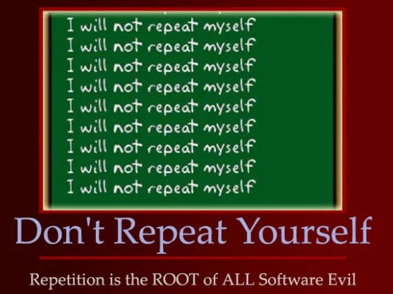

[**DRY**](https://en.wikipedia.org/wiki/Don%27t_repeat_yourself) is a key to be a good programmer. A good way to know when you are repeating yourself is to adhere to the [Rule of Three](https://dev.to/jpswade/rule-of-three-1b9d). If you are using the same code three times you need to refactor!

## Keep It Simple Stupid (KISS)

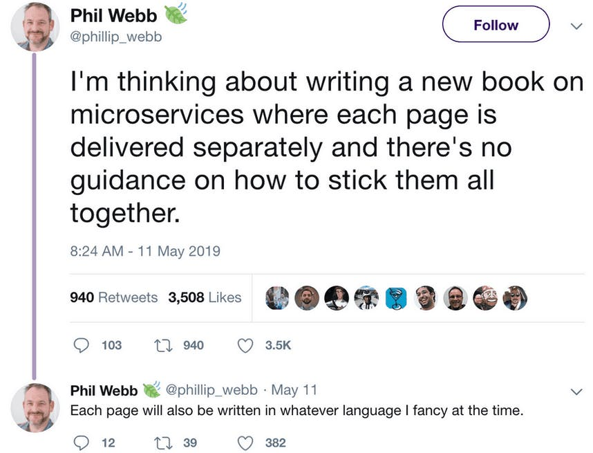

Software engineers have a lot of tools at our disposal which makes us incredible prone to over-engineer everything instead of following [**KISS**](https://en.wikipedia.org/wiki/KISS_principle). Keep things simple and avoid complexity, just make sure you can extend your code when you need to.

[This video about microservices from KRAZAM](https://youtu.be/y8OnoxKotPQ) sums it up or take a look at [the one from fireship](https://youtu.be/Sxxw3qtb3_g) if you are familiar with web development. Although over-engineering also apply to YAGNI rule.

## You Aren’t Gonna Need It (YAGNI)

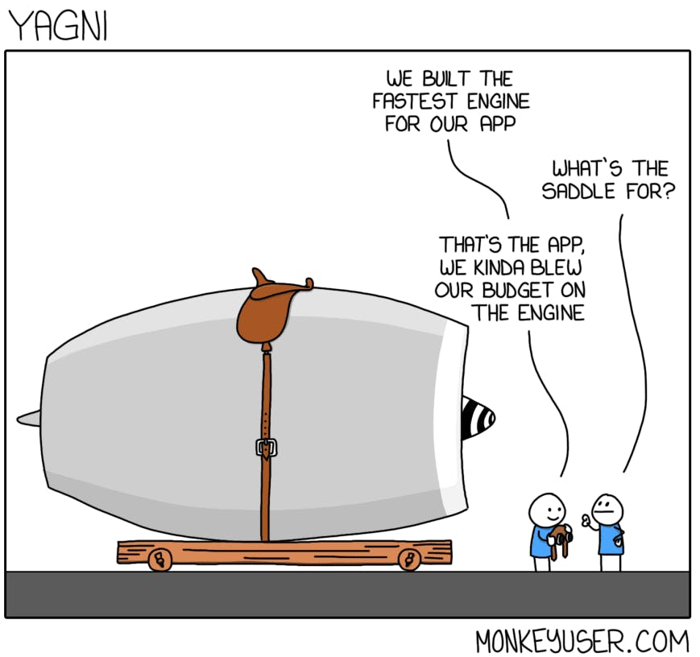

[YAGNI](https://en.wikipedia.org/wiki/You_aren%27t_gonna_need_it) is about focusing on the problem at hand while (just like KISS) minimizing complexity. Focus on keeping things simple yet open to added complexity later on, use the open/closed principle.

## Avoid Premature Optimization

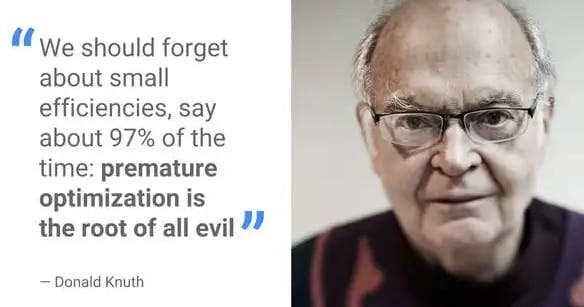

> [premature optimization is the root of all evil](https://wiki.c2.com/?PrematureOptimization)

While we need to keep in mind optimization to avoid performance issues most likely you don't have to optimize that function and make it less readable.

## Principle Of Least Astonishment

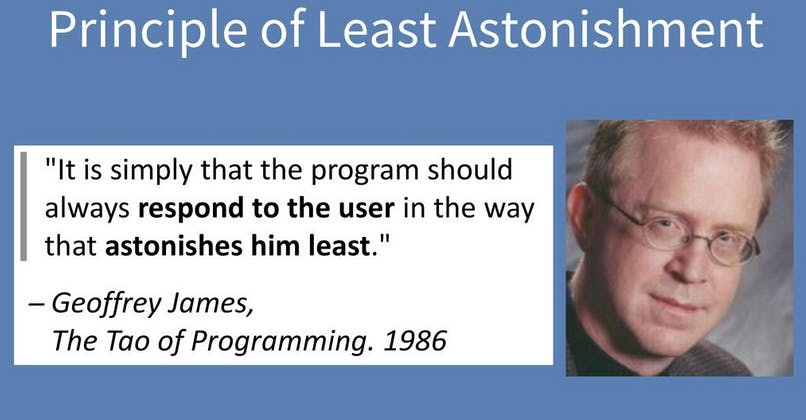

[**POLA**](https://en.wikipedia.org/wiki/Principle_of_least_astonishment) is about being boring. Make sure to not surprise the users or yourself both the code and the UX have to be consistent and predictable.

## Law of Demeter

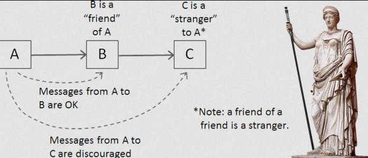

[**LOD**](https://en.wikipedia.org/wiki/Law_of_Demeter) or principle of least knowledge is summed up in 3 points:

- Each unit should have only limited knowledge about other units: only units "closely" related to the current unit.
- Each unit should only talk to its friends; don't talk to strangers.
- Only talk to your immediate friends.

Read more [here](http://mi.codes/programming-principles-the-law-of-demeter-lod/).

This introduces the concepts of **coupling** and **cohesion**.

- Decoupling: try to reduce the number of connections between different classes.
- Cohesion: the associated classes must be in one module/package/directory.

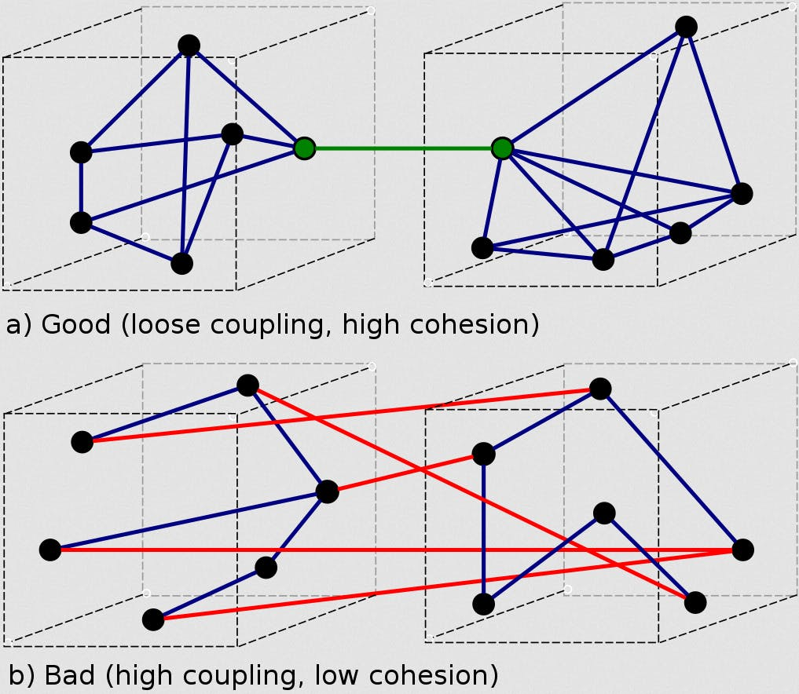

# OOP Modeling

You know the good principles, so time to write code! But wait, first you should model your ideas for a simpler implementation. Software engineers use [UML](https://en.wikipedia.org/wiki/Unified_Modeling_Language) to design their systems.  
I will have another blog post on the topic, what follows is a very small introduction with resources.

## UML basics

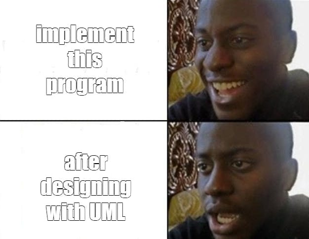

The point of a UML diagram is to put together classes, abstract classes and interfaces together (amongst other things) so you can visualize how your software is going to work and start implementing the correct OOP hierarchies.  
You can find a small introduction from [TutorialsPoint here](https://www.tutorialspoint.com/object_oriented_analysis_design/ooad_uml_basic_notation.htm). And if you want to watch a video [FreeCodeCamp](https://youtu.be/WnMQ8HlmeXc) is your answer.

One of the most basic things you should be familiar with are the UML arrows:

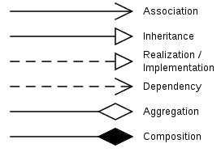

## Design Patterns

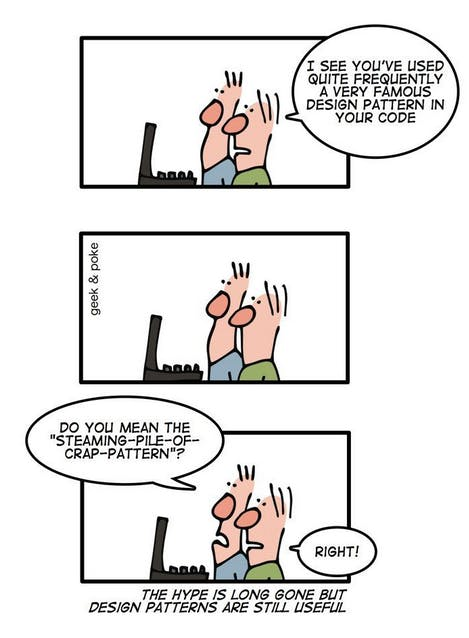

[**Design patterns**](https://en.wikipedia.org/wiki/Software_design_pattern) are solutions to common architecture problems. If you have ever heard about Factory Method or Singleton those are creational design patterns, there are three types: **Creational**, **Structural** and **Behavioral**.
[Refactoring Guru](https://refactoring.guru/design-patterns) is one of the best at explaining them.

Additionally I highly recommend this [video series from
Christopher Okhravi](https://www.youtube.com/watch?v=v9ejT8FO-7I&list=PLrhzvIcii6GNjpARdnO4ueTUAVR9eMBpc) if you are unfamiliar with the matter.
