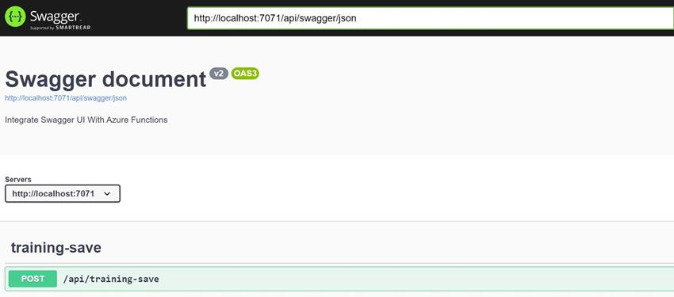
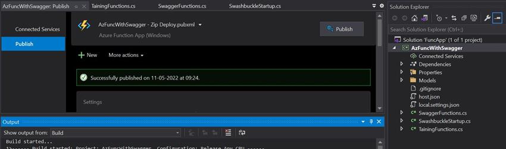
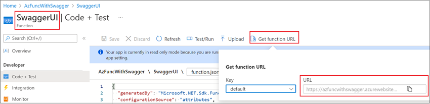
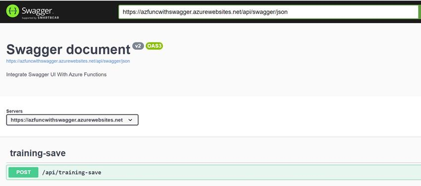

# How To Configure Swagger In Azure Functions APIs

This article demonstrates how we can integrate swagger for API documentation for Azure Function APIs. As we know, Swagger UI offers a web-based UI that provides information about REST APIs service (In our case HTTP trigger Azure functions).

Let’s see step by step to understand integration of Swagger UI.

## Step 1 – Create Azure Functions Project and Install Required Nuget

Open visual studio 2019 and create new azure function project with empty template. Let’s install below packages -

```
<PackageReference Include="AzureExtensions.Swashbuckle" Version="3.3.2" />
<PackageReference Include="Microsoft.NET.Sdk.Functions" Version="3.0.11" />
```

Please note that these packages may vary based on your .NET version and Azure Function version.

## Step 2 - Add Swagger and Swagger UI functions

Let’s add HTTP trigger function for swagger and swagger UI.

```
public static class SwaggerFunctions {
    [SwaggerIgnore]
    [FunctionName("Swagger")]
    public static Task < HttpResponseMessage > Swagger(
            [HttpTrigger(AuthorizationLevel.Anonymous, "get", Route = "swagger/json")] HttpRequestMessage req,
            [SwashBuckleClient] ISwashBuckleClient swasBuckleClient) {
            return Task.FromResult(swasBuckleClient.CreateSwaggerJsonDocumentResponse(req));
        }
        [SwaggerIgnore]
        [FunctionName("SwaggerUI")]
    public static Task < HttpResponseMessage > SwaggerUI(
        [HttpTrigger(AuthorizationLevel.Anonymous, "get", Route = "swagger/ui")] HttpRequestMessage req,
        [SwashBuckleClient] ISwashBuckleClient swasBuckleClient) {
        return Task.FromResult(swasBuckleClient.CreateSwaggerUIResponse(req, "swagger/json"));
    }
}
```

## Step 3 - Add Startup code for Swashbuckle

Add or modify startup code and add required swagger configuration as per below.

```
[assembly: WebJobsStartup(typeof(AzFuncWithSwagger.SwashbuckleStartup))]
namespace AzFuncWithSwagger {
    public class SwashbuckleStartup: FunctionsStartup {
        public override void Configure(IFunctionsHostBuilder builder) {
            builder.AddSwashBuckle(Assembly.GetExecutingAssembly(), opts => {
                opts.AddCodeParameter = true;
                opts.Documents = new [] {
                    new SwaggerDocument {
                        Name = "v1",
                            Title = "Swagger document",
                            Description = "Integrate Swagger UI With Azure Functions",
                            Version = "v2"
                    }
                };
                opts.ConfigureSwaggerGen = x => {
                    x.CustomOperationIds(apiDesc => {
                        return apiDesc.TryGetMethodInfo(out MethodInfo mInfo) ? mInfo.Name : default (Guid).ToString();
                    });
                };
            });
        }
    }
}
```

## Step 4 – Add a HTTP trigger function to Test

Let’s add sample HTTP trigger function to see the API definition from swagger and Test the function. In case you have Http Trigger Functions that you do not want to add to Swagger, then we can use SwaggerIgnoreAttribute.

```
public static class TainingFunctions {
    [FunctionName("training-save")]
    [ProducesResponseType(typeof(TrainingResponse), (int) HttpStatusCode.OK)]
    public static async Task < IActionResult > Run(
        [HttpTrigger(AuthorizationLevel.Anonymous, "post", Route = null)]
        [RequestBodyType(typeof(TrainingRequest), "request")] HttpRequest req, ILogger log) {
        log.LogInformation("C# HTTP trigger function processed a request.");
        string requestBody = await new StreamReader(req.Body).ReadToEndAsync();
        TrainingRequest data = JsonConvert.DeserializeObject < TrainingRequest > (requestBody);
        var responseMessage = new TrainingResponse {
            Id = Guid.NewGuid(), TrainingData = data
        };
        return new OkObjectResult(responseMessage);
    }
}
```

Here, I used request and response model for my HTTP trigger functions for demonstration purpose.

## Step 5 – Run and Test Azure Functions locally

If we run the azure function locally, we will see azure function swagger UI URL http://localhost:7071/api/swagger/ui

If we open this URL in browser it will display like this and we can make HTTP request.



## Step 6 – Deploy Functions in Azure and Test

Once azure function is created in azure then we need to download the publish profile. Using this profile, we can publish our code directly from visual studio 2019.



Once published is successful in Azure then we can make find and copy swagger URL and test the HTTP trigger function.





Awesome! We are able see API definition and make HTTP request from Azure Function swagger UI.

Please note, for the simplicity purpose, we used AuthorizationLevel.Anonymous. But this is not a secure way. To make it secure, we need to Authorize these APIs with Bearer token.

Happy Learning!
