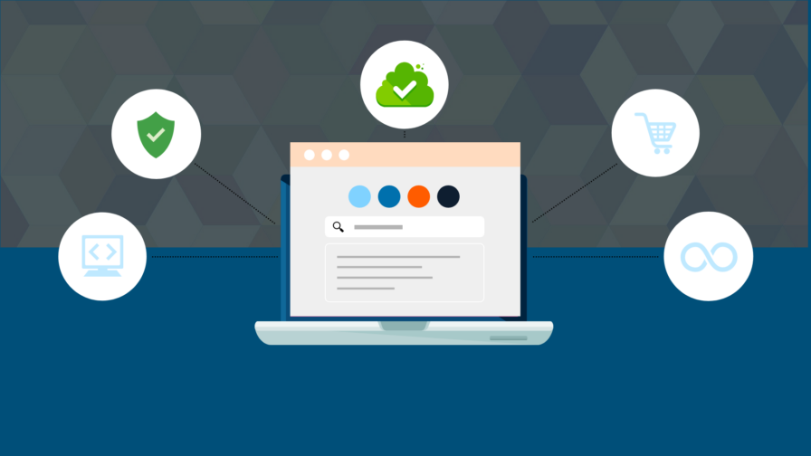
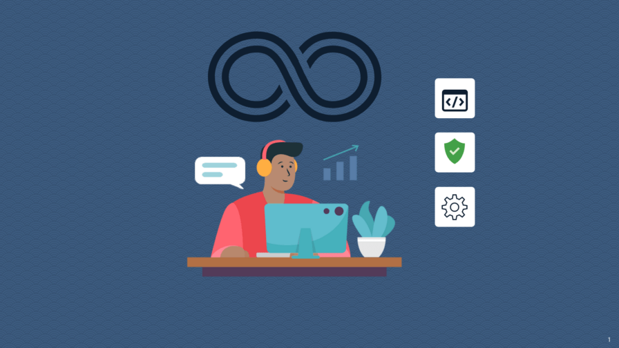
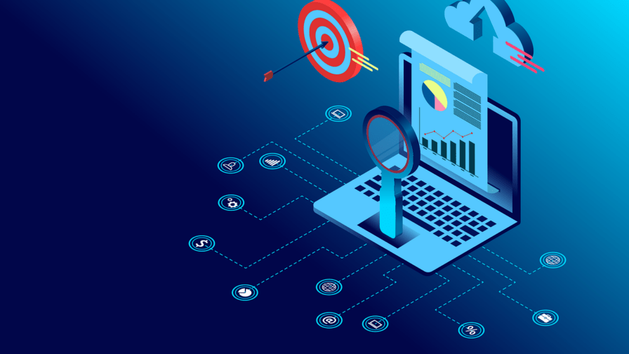

# Building Microservices With Security in Mind

How can the banking sector leverage microservices without compromising cybersecurity? The Fintech sector is offering key solutions in this field: discover them in this article with insights by Credemtel, the software house company inside Credem banking group.

Last update May 5, 2022 by [Codemotion](https://www.codemotion.com/magazine/author/codemotion-2/)

## How the banking sector will change thanks to FinTech

The banking sector has evolved significantly thanks to [FinTech](https://www.codemotion.com/magazine/ai-ml/data-science/key-skills-for-fintech-developers-codemotion-magazine/). The sector is still set to experience significant changes due to open **architecture, microservices, and other innovations**. Here are some of the changes the banking sector is set to experience:

- With an open architecture, banks can **sell in-house and third-party products and services**. This will be beneficial to clients as they will get everything they need in a single place.

- Banks will be able to **detect any security threats** long before they can pose a threat.

- Security will be enhanced with the use of services like OpenID. This **decentralized platform** allows users to store their passwords and personal details, meaning they can conveniently use lots of passwords for their online accounts.

Banks and other fintech companies can implement changes and add features quickly with microservices.

[Credemtel](https://www.credemtel.it/) is an example of this: the company is working on an **open architecture for SME customers** in order to create a federation of businesses inside and outside the Credem group and developing innovative services that use **billing data to perform reconciliation and financial analysis** through bank transaction data.

## From Microservices to dotNet 6

Microservices have lots of benefits when **developing open architecture applications**. Microsoft has made heavy investments to improve the requirements of architectures that are based on microservices. The **main benefit of using microservices** is that they make it easier to develop, test, and deploy specific parts of a Fintech application.

You can also scale individual parts of the Fintech application individually. This way, features can be implemented quickly, and businesses can easily take advantage of opportunities as they come.

dotNet 6 is the **fastest full-stack web framework**, and companies running on the cloud will especially save money with this framework.

### Microservices implementation journey

When implementing your microservices journey, you will first need to identify the baseline technological layers. With this information, you will be able to come up with the necessary architecture and design. Concerning **cyber security, the idea is to delegate all security checks to api gateway** implementing authentication and authorization in that layer.

As you chalk out the necessary layers, keep in mind the fact that you will need high levels of efficiency and the capacity to scale as the business grows. Those approaches give cloud readiness to the architecture

### Solutions offered using dotNet architecture

The dotNet 6 architecture helps to solve various issues when building apps with microservices. With its new minimal APIs feature, dotNet 6 simplifies lots of processes and even makes others unnecessary. Some solutions offered with ASP.NET Core architecture include:

- Rapid development
- Cloud-based configurations
- Cross-platform support

These benefits are especially useful to businesses that need high levels of flexibility and scalability. Also, you should use it if your main priority is **quick application development**. dotNET 6 generally makes microservices and open architecture development remarkably easy. While the classic version of this framework was limited, it has now been developed to run on Mac, Linux, and Windows.

## DevSecOps implementation

DevSecOps introduces automation and other features into DevOps.

DevSecOps is a natural extension of DevOps. It expedites the **delivery of apps by introducing features like automation, tight feedback loops, agility, and cross-functional collaboration** into the development of the applications.

With a successful DevSecOps implementation, you will add security testing to the CI/CD pipeline and throughout the software development lifecycle. That means **you will not just run the tests** towards the end of the development lifecycle.

A successful DevSecOps implementation will also make **security the responsibility of every developer involved in the project**. This is because they will be able to see security issues in their native workflows.

### Automating TDD with NUnit

Test-driven development or TDD is a great way of finding and fixing problems early in the development cycle of your app. If you often find yourself wary of changing existing code, you will especially find TDD useful. Since you will have a chance to spot issues with the code early, the entire development process will be extremely flexible.

You can automate TDD with NUnit. Once you install the latest version of NUnit, you will get a dll that you can use to access the NUnit framework. You may also want to **install TestDriven.net** for better integration of Visual Studios. To run the tests, you can add a [TestFixture] attribute to the class. If you want to test the methods, you can add the [Test] attribute. In case you get an unexpected exception or a failed assertion, you will know that the test failed.

### Code Analysis with Sonarqube

Another aspect of DevSecOps implementation **is code analysis**. This can be done with Sonarqube. This tool collects and analyzes source codes, after which it will generate reports for the code quality. By combining static and dynamic analysis tools, Sonarqube is able to analyze the quality of the codes continually.

As a developer, this tool will **make it easier to find out where the code is messing up**, and you will also be able to determine what kind of problem it is. For example, the report may indicate that the code is messing up because of styling issues or code duplication. Sonarqube also helps developers identify “code smells” and suggest some solutions in order to fix it.  This tool can also identify most common security vulnerabilities

Sonarqube has several tiers, and you can choose one based on the level of development you need. To install Sonarqube, you can either use a ZIP file or a docker image. Once it’s installed, you can log in to http://localhost:9000 and follow these steps to analyze a project:

Click the ‘Click new project’ option

- Indicate that you want to create the project manually
- Add a project key and display name, then click the Set Up option
- Then you can generate a token and select the main language of your project
- You can then follow the instructions indicated to run an analysis on your project

You also have to download and execute a scanner on your code.

Sonarqube is a key tool for code analysis.

### Dataops: How to use RedGate

You can move to true dataops with the SQL Source Control RedGate tool. The main reason to include your database in the **DevOps strategy is to make the delivery of database changes faster**. It also helps to improve the reliability of those changes and minimizes deployment failures. With Redgate Deploy, you will first have to start from a known database version in source control. You will be able to build any version of the database in source control as you prepare for release. You can read more about Redgate dataops [here](https://www.red-gate.com/products/redgate-deploy/).

### Azure DevOps Pipeline

Azure DevOps pipeline automatically builds and tests code projects. It combines continuous integration (CI) and continuous delivery (CD) to test, build, and ship codes.

## UI layer with Angular

Angular is the best front-end frameworks for open architecture apps. When developing your Fintech app, you will find it beneficial to create the **UI layer with Angular**. As the Angular community has grown, lots of UI libraries have been included in this framework. Therefore, using Angular will simplify your web development process significantly.

## How to implement RabbitMq with MassTransit

RabbitMQ is a message broker, meaning it accepts, stores, and transmits messages from one application to another. With this tool, you will be able to build decoupling and performant applications. On the other hand, MassTransit is a free open-source distributed app framework for dotNet 6 applications. It makes it possible to relay messages using RabbitMQ.

To implement **Rabbit MQ with MassTransit**, you will first need to spin up a RabbitMQ server using Docker. You can then define a dotNet class or interface and create the project.

After that, you can create a producer using MassTransit, and this should be implemented as an ASP.NET Core Web API. You should then configure MassTransit to use RabbitMQ in program.cs. In the final step, you have to call AddMassTransitHostedService, and this will automatically handle the movement of the bus.

Next, you have to create an OrderDTo class, which is meant to work as the parameter for the endpoint method. Once the DTO is defined, **you should proceed to create an API controller that will create the event or message**. To do this, it will have to use the OrderCreated interface. You also need to inject an IPublishEndpoint into the controller in order to publish the event.

Once everything is done, you can return an OkResult.

The next step is to now create a Consumer using a dotNet console application. When this is configured to receive messages, you will have to start the bus. You can do this by calling StartAsync on the buscontrol. To stop buscontrol, you can call StopAsync.

## Why using OpenID for authentication protocol

OpenID is a **decentralized authentication protocol** that can help to accelerate the signup process on Fintech websites and applications. With this protocol, users will not have to go through lots of steps in order to gain access to their accounts. The process can be completed with a single click. It is also worth noting that people have multiple accounts online, and this tool can help them keep track of the passwords they use for different platforms. Details such as your birthdate are also stored on the platform and can be filled automatically when signing into a site.

## Distributed Observability and Monitoring

Monitoring and observability in Microservices can help bring insight into the state of the system.

Monitoring refers to the practice of **watching the state of an application** using pre-defined metrics. While this is important, it can be hard to implement in a distributed system like microservices. With such systems, **observability can be very useful in understanding the internal state of a system**. Observability allows developers to ask arbitrary questions about the behaviour of the system, and this can give them insight into the behaviour of the system.

### CorrelationId propagation for distributed tracing

A CorrelationID is an identifier that is attached to messages and requests. Once the data is collected in a centralized system, the correlation ID will help you see the flow of the message.

### Monitoring via Prometheus and Grafana

Prometheus is a monitoring system that stores time-series data, and it uses a modern alerting approach. On the other hand, Grafana allows the developers to visualize the stored information.
