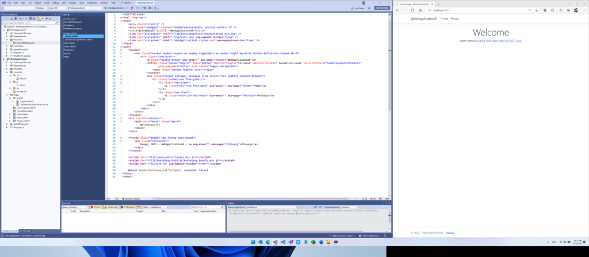
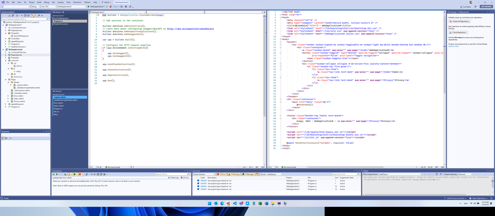
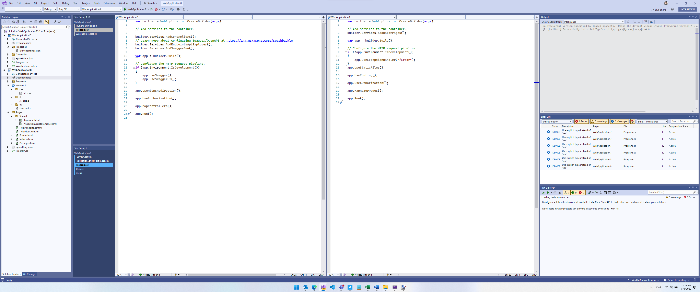
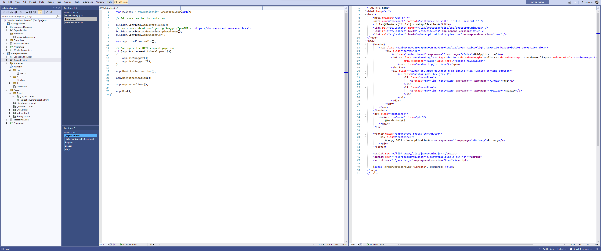

# Visual Studio on an ultra-wide monitor

Mads K

May 5th, 2022[13](https://devblogs.microsoft.com/visualstudio/visual-studio-on-an-ultra-wide-monitor/#comments "Jump to comments")

A growing number of Visual Studio customers use ultra-wide monitors today. Ultra-wide means wider than a traditional 16:9 widescreen display – usually 3440×1440 or larger resolution. They seem to be gaining popularity among developers and I’m curious how Visual Studio can use all this extra space. So, [I asked people on Twitter](https://twitter.com/mkristensen/status/1521184244852088834?s=20&t=Fc5DrDXkjl0k2XqEJry6pQ) to send me screenshots of their ultra-wide Visual Studio layouts. Based on those screenshots, I constructed some different layouts that you might find inspiration in for your own ultra-wide setup.

## 1. Making room for the app

This layout has Visual Studio take up two thirds of the width to the left and the app worked on to the right – in this case an ASP.NET website running in the browser. The vertical tabs give room for extra lines of code and allow plenty of room for documents. Notice how the Error List and Output Window are docked side-by-side at the bottom.

## 2. Documents in the middle

Sometimes you need a lot of tool windows visible during development. This layout places tool windows on both sides of the documents and at the bottom. Still, there’s enough room for two vertical tab groups, so you can have two documents visible simultaneously. Vertical tabs give extra lines of code without compromising the size of the open documents. Some might find all these windows too busy, but I think having all that information visible is a fantastic use of space.

## 3. Everything in columns

By moving the bottom tool windows to the right there is now plenty of room for two side-by-side documents at full height. This feels clean and comfortable to me. The code is in the center with the supporting tool windows to each side.

## 4. Distraction free combination

This is using layout #2 or #3 as the base and then entering Visual Studio’s full screen mode by hitting **Shift+Alt+Enter**. That hides all tool windows and toolbars and maximizes the main window, so you can focus on coding. However, you’d probably want Solution Explorer visible too, so show it while in full screen mode by clicking **View -> Solution Explorer**.

## Saved Window Layouts

You can easily switch between various layouts using the [Saved Window Layouts](https://www.youtube.com/watch?v=HTwqjthUppc) feature in Visual Studio. That allows you to save the different layouts and apply them whenever you want. This is helpful when undocking your laptop, or to optimize the layout based on the type of solution you’re working on.

## Additional resources

To dive deeper into window management with Windows 11, check out [Microsoft PowerToys for Windows](https://docs.microsoft.com/en-us/windows/powertoys/). It has a feature called [FancyZones](https://docs.microsoft.com/en-us/windows/powertoys/fancyzones) that adds extra capabilities to arrange your windows. For an easy way to open files into a new vertical tab group, install the free Tweaks ([VS2019](https://marketplace.visualstudio.com/items?itemName=MadsKristensen.Tweaks2022), [VS2022](https://marketplace.visualstudio.com/items?itemName=MadsKristensen.Tweaks2022)) extensions for Visual Studio. It provides a command in the context menu of Solution Explorer called *Open on the Side*.

There’s an open feature request for making vertical/horizontal tab layout save with window layouts. If that’s something you are interested in, please [vote and comment on it](https://developercommunity.visualstudio.com/t/Save-Tab-Layout-orientation-horizontal/937677?space=8&q=vertical+layout&ftype=idea&stateGroup=active).

How do you optimize Visual Studio for your ultra-wide monitor? How can we make the experience better? Let us know in the comments below.

##### [Mads Kristensen](https://devblogs.microsoft.com/visualstudio/author/madsk) Principal Program Manager, Visual Studio

**Follow**
