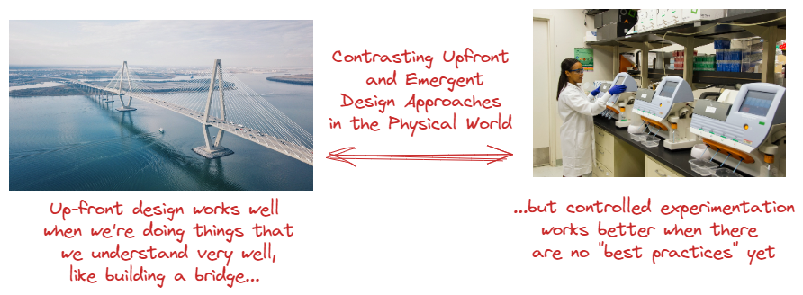

# Why You Should Care About Software Architecture

May 17, 2022
9
min read

by

#### Write for InfoQ

**Join a community of experts.** Increase your visibility. Grow your career.[Learn more](https://docs.google.com/forms/d/e/1FAIpQLSehsV5jwuXFRFPIoOQoSXm9aRjYam9bQjKbEHvGZBxsioyGGw/viewform)

### Key Takeaways

- Software developers are often distrustful of architecture practices, and are leaning toward avoiding conscious architecture-focused activities in favor of architectural designs emerging from self-organizing teams;
- A conscious architectural focus is necessary in order to address the limitations of emerging architecture, and meet the initial quality attribute requirements;
- Software architectures are driven by Quality Attribute Requirements (QARs), and not taking them into account in the initial iterations often creates issues when the software system is being deployed beyond an initial pilot phase with a small number of users;
- Greater awareness of the implicit architectural decisions they are making, and forcing these decisions to be made explicitly, can help development teams make better, more informed decisions using the empirical data they gain from their sprints/iterations;
- Refactoring and excessive componentization can result in a fragmented view of the solution, and as a result, no one has a complete understanding of what is going on;
- Modern architecture practices such as Continuous Architecture and Evolutionary Architecture provide tools for making architectural decisions more explicit, enabling developers to deliver more sustainable software products.

Many software developers are distrustful of architecture practices. They associate these practices with rigid and overbearing processes, and with significant upfront planning and design.

As a result, they believe that if they follow those practices, it may take them a long time to finally deliver something that may not even be what the customer wanted.

They would rather focus on understanding what the customer requires and deliver it using agile processes consisting of small and quick iterations.

Following these processes, some of them believe, the architecture will “emerge,” without requiring a conscious planning or architectural focus. Because of these beliefs, they may not think that software architecture is important, and may not even care about it.

The emergent architecture approach often delivers a product that initially provides the functionality required by the customer, which is a good start.

But, without explicit concerns for the sustainability of that product, it has the potential of decay that renders the product unsupportable well before its desired retirement.

By focusing on key quality attributes such as performance, scalability, security, and resilience, an intentional approach to software architecture can help to extend the life of the product, making it sustainable over a longer period.

Figure 1 compares the upfront and emergent design approaches in the physical world.

**Figure 1: Comparing upfront and emergent design approaches**

The up-front design approach works well when we’re doing things that we understand very well, and that we’ve done many times before. Examples include building a skyscraper, digging a canal, manufacturing a product, or building a bridge. We can apply “best practices” and rely on what’s worked in the past in these situations.

Up-front design doesn’t work when we’re dealing with something completely new, something we don’t understand well, or something that is changing so fast that “best practices” don’t exist yet. In these circumstances, controlled experimentation, the foundation of the scientific revolution, can help us to seek a deeper understanding of the problem and possible solutions. The resulting solution “emerges,” but along a path directed by intentional experiments.

Both approaches are valuable, but in very different circumstances, one dealing with largely known things, and the other exploring new opportunities and possibilities in a changing world.

The trouble with a strictly emergent approach is that controlled experimentation may not result in a sustainable solution in a reasonable amount of time, and with an acceptable amount of rework. Software architecture practices can help to guide experiments by asking better questions, earlier, to reduce the time and cost of delivering a sustainable product while still reaping the benefits of an agile approach.

## How architecture emerges

As we discussed in a [previous article](https://www.infoq.com/articles/what-software-architecture/), the essence of architecture consists of the set of decisions that define and constrain the technical aspects of the product. These decisions exist regardless of which approach the team takes, and whether they make the decisions consciously or tacitly. These decisions focus on how the product deals with quality attribute requirements or QARs.

QARs also exist either explicitly or implicitly, though being explicit about them makes them easier to address and to ensure that the product meets them. For example, users generally expect that their products will be responsive whenever they are using them, regardless of how many other people are also using the product. Being explicit about what “responsive” means, and how many concurrent users the product can support without becoming “unresponsive” will help the development team make better decisions about their technical approach; statements such as “the system must be fast” or “the system must be scalable” do not help the team to make better technical decisions.

Assessing quality attribute requirements and designing an architecture to implement those requirements involves some amount of upfront planning, and is a key driver to the success of a software system for the following reasons:

- Software architectures are driven by QARs, and not taking them into account in the initial iterations often creates issues when the software system is being deployed beyond an initial pilot phase with a small number of users. As a result, significant architectural, design, and code refactoring may be needed when key quality attribute requirements (such as performance, security, or scalability) must be met, and this may create a software architecture with a high degree of volatility. Additionally, the cost of refactoring can soar if the architectural design does not strongly implement abstraction and isolation of its components.
- A conscious architectural focus is necessary in order to address the limitations of emerging architecture, and meet the initial quality attribute requirements. For example, incorporating a simple monitoring framework in the initial architectural design is key to ensuring that the software system is resilient and performs as expected, in addition to providing useful information on the actual usage of the system as well as a feedback loop on its architectural design.
- Refactoring and excessive componentization can result in a fragmented view of the solution, and as a result, no one has a complete understanding of what is going on. There may be a lack of awareness of which version of components are being used, and the Service Level Agreements (SLAs) of each component may not be documented. Microservice architectures using a separate datastore for each service may result in data consistency issues. On the other hand, monolithic solutions suffer from poor sustainability but have high internal coherence. Both approaches have strengths and weaknesses.

## Is your software system sustainable?

Broadly speaking, achieving “sustainability” is the focus on architectural work in software products. A software product can be considered sustainable if it is capable of meeting its current requirements, including QARs, without jeopardizing its ability to meet future requirements. As we stated in the previous section, quality attribute requirements drive the architecture, and meeting key QARs is essential to create sustainable architectural designs. Unfortunately, software systems “wear out” over time, as functional enhancements are being implemented, and new design decisions are made, which may stretch or even break the original architectural design. Common causes of “wear” include:

- Original design decisions that are being made obsolete, due to a lack of knowledge or understanding from the developers who maintain the system. Decisions and assumptions associated with the design of “worn out” systems are rarely accurately documented. Software systems start decaying when people are no longer around to ask or answer questions. Asking questions is an important technique to assess the health of a software system, assuming that knowledgeable resources are available to answer the questions.
- Technical debt that is approaching the point where operation and support of the system are no longer feasible or cost-effective and it becomes impossible to implement new functionality.
- Developers attempting to reuse existing blocks of code in a different component, assuming that new functionality can be implemented by making minor changes to the code being copied. Sadly, they may not fully understand the architectural context that the original code was relying upon, and reusing that code in a different component may create unwanted side effects later, such as performance, scalability, or availability issues. These software changes increase technical debt and degrade the overall quality of the system unless technical debt can be rapidly addressed.
- Evolution of technology, causing software systems to run on technological platforms that they weren’t designed for. Some older software systems have experienced “catastrophic success,” as they lasted much longer than initially planned, and their technical debt has become very high and very difficult and expensive to “repay.” The cost of repaying that amount of technical debt may be similar to or even exceed the cost of completely replacing that software system.
- Failure of assumptions. Systematic bodies of logic, including software systems, eventually break down because of a failure of assumptions, and software developers may not be aware of the assumptions they are making. Hidden assumptions can be thought of as constraints on the system. It is important to clearly articulate all assumptions and to keep that information current. Quality attribute requirements are themselves assumptions that require validation, and their implementation needs to be empirically tested and confirmed, using automation if possible. Performance, scalability, resilience (for example, using an approach similar to [Netflix’s simian army](https://netflixtechblog.com/the-netflix-simian-army-16e57fbab116)), and security are good examples. The objectives of automated testing of quality attributes are to continuously test assumptions (for example, are the QARs still realistic?), and to guide the evolution of the software system.

Software systems created with intentional architecture eventually lose their architectural integrity when features are added without much consideration or understanding of the original architecture (something that we may call the “law of architectural entropy”). As a result, they may no longer be sustainable.

## Assessing software architecture fitness

How do you know when your software system is wearing out, the same way you know when your car tires are wearing out and need to be replaced? Just as a physician may use many different kinds of tools to assess the health of an individual (EKG, MRI, CT, blood tests, physical examination), different tools help a team assess software architecture fitness. Older systems may be difficult to understand because, as we mentioned earlier, their design decisions and assumptions are often not documented, and documentation, when it exists, is likely to be outdated. “Software archaeology” tools and skills are often required to understand and assess their architectural design. Overall, there are many tools available to assess software architecture fitness, including:

- Architecture reviews (especially peer reviews) are an effective tool for assessing the fitness of the architectural design of a software system, especially if they focus on trade-offs (for example, the Architecture Tradeoff Assessment Method ([pdf](https://resources.sei.cmu.edu/asset_files/TechnicalReport/2000_005_001_13706.pdf)) from CMU/SEI).
- Automated software quality assessment tools (e.g. [CAST](https://www.castsoftware.com/)), but people need to accept the results.
- Code reviews (especially automated code reviews) are very useful to ensure code quality. Pair programming is an alternative approach to achieving this goal.
- Fitness Functions implementations, such as automated performance tests.
- Instrumentation framework implementations, including web service monitoring tools, to provide feedback loops for the software architecture.
- Technical debt identification and assessment, including flagging decisions that increased technical debt.
- Automated testing tools (especially load/scaling/resilience testing).
- Defect trends analysis (which is a proxy for technical debt), requires discipline around capturing that data in a consistent way. The goal is to look for increasing instability.
- Production incident trend analysis—same requirements and goal as for defect trend analysis.
- Security testing tools. The goal when using these tools is to look for risk exposure.

## Conclusion

In the two-decade-old conflict between “big upfront designs” and agile practices, software developers have struggled to find a meaningful compromise between these two approaches, and have leaned away from conscious architecture-focused activities in favor of architectural designs emerging from self-organizing teams. As a result, they often believe that software architecture is not that important. Greater awareness of the implicit decisions they are making, and forcing these decisions to be made explicitly, can help development teams make better, more informed decisions using the empirical data they gain from their Sprints/iterations. Modern architecture practices such as [Continuous Architecture](https://continuousarchitecture.com/) and [Evolutionary Architecture](https://evolutionaryarchitecture.com/) provide tools for making architectural decisions more explicit, enabling developers to deliver more sustainable software products.

For more information, please see [Continuous Architecture in Practice](https://continuousarchitecture.com/), by Murat Erder, Pierre Pureur, and Eoin Woods, and [Continuous Architecture: Sustainable Architecture in an Agile and Cloud-Centric World](https://stackoverflow.blog/2022/02/24/sustainable-architectures-in-a-world-of-agile-devops-and-cloud/), by Murat Erder and Pierre Pureur.

## About the Authors

#### **Pierre Pureur**

Pierre Pureur is an experienced software architect, with extensive innovation and application development background, vast exposure to the financial services industry, broad consulting experience and comprehensive technology infrastructure knowledge. His past roles include serving as Chief Enterprise Architect for a major financial services company, leading large architecture teams, managing large-scale concurrent application development projects and directing innovation initiatives, as well as developing strategies and business plans. He is coauthor of the books "Continuous Architecture in Practice: Scalable Software Architecture in the Age of Agility and DevOps"(2021) and "Continuous Architecture: Sustainable Architecture in an Agile and Cloud-Centric World" (2015) and has published many articles and presented at multiple software architecture conferences on this topic.

Show more

#### **Kurt Bittner**

Kurt Bittner has more than 30 years of experience delivering working software in short, feedback-driven cycles. He has helped a wide variety of organizations adopt agile software delivery practices, including large banking, insurance, manufacturing, and retail organizations, as well as large government agencies. He has worked for or with large software delivery organizations including Oracle, HP, IBM, and Microsoft, and is a former technology industry analyst with Forrester Research. His focus is on helping organizations build strong, self-organizing, high-performance teams that deliver solutions that customers love. He is the author of four books on software development-related topics, including The Nexus Framework for Scaling Scrum. He is based in Boulder, Colorado and serves as VP of Enterprise Solutions for Scrum.org.

Show more
