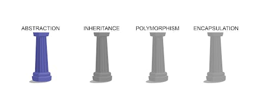
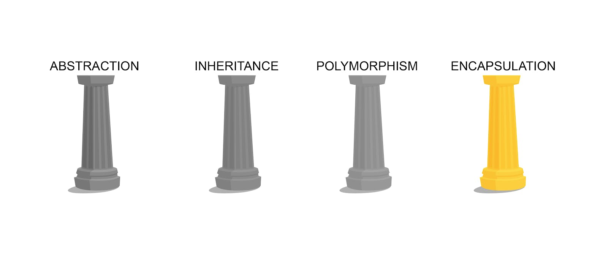
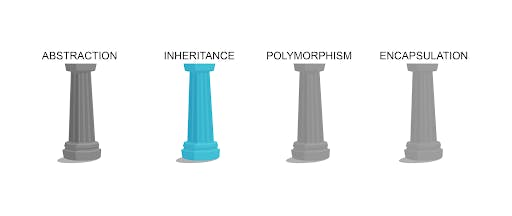
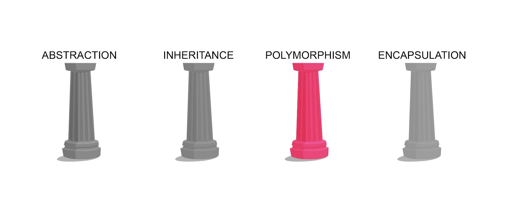

# Object-Oriented Programming Explained Like Never Before

## The only article you need to learn about Object-Oriented Programming

### Table of contents

## Introduction

Object-oriented programming (OOP) is a programming paradigm fundamental to many programming languages, including Java and C++. In this article, we will help you understand the important concepts of OOP. It is recommended that you keep on writing the code given in this article side by side in your console and keep on doing experiments. So, let's begin without any further ado .


## Prerequisites ‍♂️

- Ensure that you have your development environment setup ️
- Basic knowledge of JavaScript ‍
- Eyes

## What the heck is Object-Oriented Programming (OOP)?

Let's break this term down into chunks and try to understand what it means. The term **Object-Oriented** means that the software is designed around data, or objects, rather than function and logic. And, the term **Programming** (we all know) is the process of creating a set of instructions that tell a computer how to perform a task. The programming language that we are going to use in this article is **JavaScript**.


## OOP's Concepts ⚙️

- Class
- Object
- Pillars of OOPs
  - Abstraction
  - Encapsulation
  - Inheritance
  - Polymorphism

Don't get horrified by seeing these weird and long names. These are just some important terminologies used in Object-Oriented Programming. And, I promise you that you will get a great knowledge of OOP after reading this article . Do let me know in the comments if I resolved my promise or not. Let's discuss these topics in detail!

### Class

A class is a user-defined blueprint or prototype from which objects are created. It represents the set of properties or methods that are common to all objects of one type. Let's say, a car company manufactures cars. So, that company must be having some blueprints or prototypes to manufacture different types of cars. This prototype can be used to build many different cars with the same features. See the example below for a better understanding.

```
// A class is declared with the 'class' keyword
class Car {
    // A constructor is a special function that creates and initializes an object instance of a class
    constructor(name, color, maxSpeed, horsePower) {
        this.name = name;
        this.color = color;
        this.maxSpeed = maxSpeed;
        this.horsePower = horsePower;
    }

    // Note the use of the ```this``` keyword in the constructor above. As the name suggests, it is used to refer to the current instance of the class
}
```

Now, our car prototype is ready! You can create a car by passing it the required arguments like this

```
const myCar = new Car('Car-A', 'blue', 100, 50);

// Note the use of the ```new``` keyword. It is used to tell the compiler that we are creating a new instance of the ```Car``` class. If you will not use the ```new``` keyword while creating instances of any class, an error will be thrown.
```

Now, we made our own car too but we cannot drive it . That's bad!


So, how can we do this? Well, to run our car, we need to use a method. A method is simply a function that is written inside a class. Let's add a `drive` method to our `Car` class.

```
class Car {
    constructor(name, color, maxSpeed, horsePower) {
        this.name = name;
        this.color = color;
        this.maxSpeed = maxSpeed;
        this.horsePower = horsePower;
        this.isRunning = false;
    }

    drive = () => {
        this.isRunning = true;
        console.log(`${this.name} is running at a speed of ${this.maxSpeed}mph`);
    }
}
```

Note that in the above example, we have added a new property `isRunning` and it's set to false and the user cannot modify it by passing arguments to the constructor function. Then, we have created a method named `drive` which sets `isRunning` to true and logs the details.

**Note:** Don't forget to use the `this` keyword inside of the class while playing with the properties of the object.

Now, I believe, that you are well-versed with the concept of **classes** now. Let's move on to Objects.


### Objects

An object is a basic unit of Object-Oriented Programming and represents real-life entities. These are instances of the class which you have created. Every object has two things:

- **State:** It is represented by the properties of an object.
- **Behavior:**  It is represented by the methods of an object.

In our Car example, the property `isRunning` of our car represents the state of the car whether it's idle or running. And, the method `drive` is a behavior of our car which describes what the car can do. We can have more behaviors too such as drift, turnOnMusic, stop, etc. Try to implement some of these interesting behaviors and tell about them in the comments section below .

### Pillars of Object-Oriented Programming

There are four pillars on which the whole Object-Oriented Programming is based. These pillars are s follows:

- Abstraction
- Encapsulation
- Inheritance
- Polymorphism

Let's discuss each of them in detail! LFG

### Abstraction



Data Abstraction is the property by virtue of which only the essential details are displayed to the user. The complex or the non-essential units are not displayed to the user. In simple words, abstraction means data hiding.

Abstraction is all about keeping your code clean and simple for the programmer using it, whether that is you or someone else. It also makes sure that you or someone else in your team doesn't modify something by mistake.


Let's say, driving our car is very complex like turning on the engine, pulling down the pistons, etc. So, by creating a `drive` method, we abstract out the inner complexities of running a car. By doing this, our fellow programmers can simply call the `myCar.drive()` without worrying about how the code actually runs.

The car companies also do this. You never see how the car is working. You simply turn the key and the car starts ️. The driver need not worry about the inner complexities of the design of the car.

To your surprise, you have been using abstraction almost all the time in JavaScript in some way . For example, while dealing with methods of the Math class, you need not worry about the inner complexities and working of that method.

This might be the code of the `Math.abs` function :

```
class Math {
    // When you use the 'static' keyword with a method or a property, you can access that method or property without creating an instance of that class
    static abs = num => {
        if (num < 0) {
            return num * (-1);
        }
        return num;
    }
}
```

but the programmer need not worry about this. That's the power of abstraction.

> So, abstraction is the process of removing complex code from the scripts where other programmers will see it, and only exposing the functionality other programmers really need.

### Encapsulation



Abstraction and Encapsulation go hand in hand. Much like abstraction, encapsulation focuses heavily on maintaining a level of separation between the underlying complexity of your code and other code that uses it. Due to their similarity, you will sometimes see some followers of OOP practices group abstraction and encapsulation into a single pillar, typically under the header of encapsulation. While abstraction is all about summarizing code to make it simpler for other programmers, encapsulation is all about protecting values and data as if they are enclosed in a capsule , so that you control what others do and do not have access to.

A major theme of encapsulation is safety in code . In other words, the process of ensuring that code is only used as it is intended to be used, and the values and data you are manipulating cannot be corrupted. In encapsulated code, other programmers cannot easily change the values of variables or the properties of objects. It is impossible to account for all of the different ways that other scripts might access your code, so it's far better to encapsulate what you have created so it can only perform as intended.

Accessibility of variables and methods is a major consideration in encapsulation. As a general rule, you want to keep your variables private as often as possible, and set methods to public only when you are sure that you need to call them from anywhere. Otherwise, they can be used by anyone.

An easy way to implement encapsulation is to declare the variables are not meant to be used by the user as private. Have a look at the code below for a better understanding:

```
class Car {
    #isRunning;    // Private fields must be declared in an enclosing class with a hashtag (#) as prefix

    constructor(name, color, maxSpeed, horsePower) {
        this.name = name;
        this.color = color;
        this.maxSpeed = maxSpeed;
        this.horsePower = horsePower;
        this.#isRunning = false;
    }

    drive = () => {
        this.#isRunning = true;
        console.log(`${this.name} is running at a speed of ${this.maxSpeed}mph`);
    }

    stop = () => {
        this.#isRunning = false;
        console.log(`${this.name} stopped!`);
    }
}

const teslaModel3 = new Car('Model 3', 'Red', 162, 283);
teslaModel3.drive();
console.log(teslaModel3.isRunning);    // 'undefined' will be logged as private fields cannot be accessed outside of a class due to their protection level
teslaModel3.stop();
```

Setters and getters are generally used while encapsulating code.

The get syntax binds an object property to a function that will be called when that property is looked up.

The set syntax binds an object property to a function to be called when there is an attempt to set that property.

```
class Car {
    #isRunning;

    constructor(name, color, maxSpeed, horsePower) {
        this.name = name;
        this.color = color;
        this.maxSpeed = maxSpeed;
        this.horsePower = horsePower;
        this.#isRunning = false;
    }

    // Note that we can check if the car is running or not, by writing myCar.isRunning but cannot modify the actual #isRunning property or read it directly
    get isRunning() {
        return this.#isRunning;
    }

    // Note that this will allow the users to modify the value of the #isRunning property too and that's not what we want as this disobeys the principle of encapsulation, so it's better to comment it out
    /*
        set isRunning(value) {
            this.#isRunning = value;    // Here, the value refers to the value that will be assigned to myCar.isRunning
        }
    */

    drive = () => {
        this.#isRunning = true;
        console.log(`${this.name} is running at a speed of ${this.maxSpeed}mph`);
    }

    stop = () => {
        this.#isRunning = false;
        console.log(`${this.name} stopped!`);
    }
}
```

**Note:** The identifier of setters and getters must be different from the actual property name.

> So, encapsulation protects your code by controlling the ways values are accessed and changed so that your code is only used as explicitly designed. Like abstraction, encapsulation places a layer of separation between the underlying complexity of your code and the programmers who might be accessing it.

### Inheritance



Inheritance, much like the name implies, focuses on parent-child relationships between different objects. We inherit some characteristics from our parents and our children inherit some characteristics from us. In the same way, inheritance in OOP focuses on the parent-child relationship. We create a parent class and one or more child class inherits from that parent class.

Inheritance is the process of creating a primary class (also known as a parent class or base class or superclass) from which other classes (called child classes or derived classes or subclasses) can be created. A child class takes on or inherits all of the features of the parent class automatically.

For example, we want to create two types of cars: A sedan and a Hatchback.

For this, we need to create respective classes:

```
// Sedan
class Sedan {
    #isRunning;
    #type = 'Sedan';

    constructor(name, color, maxSpeed, horsePower) {
        this.name = name;
        this.color = color;
        this.maxSpeed = maxSpeed;
        this.horsePower = horsePower;
        this.#isRunning = false;
    }

    drive = () => {
        this.#isRunning = true;
        console.log(`${this.name} is a ${this.#type} and is running at a speed of ${this.maxSpeed}mph`);
    }

    stop = () => {
        this.#isRunning = false;
        console.log(`${this.name} stopped!`);
    }
}

// Hatchback
class Hatchback {
    #isRunning;
    #type = 'Hatchback';

    constructor(name, color, maxSpeed, horsePower) {
        this.name = name;
        this.color = color;
        this.maxSpeed = maxSpeed;
        this.horsePower = horsePower;
        this.#isRunning = false;
    }

    drive = () => {
        this.#isRunning = true;
        console.log(`${this.name} is a ${this.#type} and is running at a speed of ${this.maxSpeed}mph`);
    }

    stop = () => {
        this.#isRunning = false;
        console.log(`${this.name} stopped!`);
    }
}
```

Now, we can create Sedans and Hatchbacks individually but this procedure leads to unnecessary redundancy of code which is a very poor practice . Instead of doing this, we can use the concept of Inheritance to make this task easier.

```
class Car {
    #isRunning;   

    constructor(name, color, maxSpeed, horsePower) {
        this.name = name;
        this.color = color;
        this.maxSpeed = maxSpeed;
        this.horsePower = horsePower;
        this.#isRunning = false;
    }

    drive = () => {
        this.#isRunning = true;
        console.log(`${this.name} is running at a speed of ${this.maxSpeed}mph`);
    }

    stop = () => {
        this.#isRunning = false;
        console.log(`${this.name} stopped!`);
    }
}

class Sedan extends Car {
    #type = 'Sedan';

    constructor(name, color, maxSpeed, horsePower) {
        super(name, color, maxSpeed, horsePower);
    }

    get type() {
        return this.#type;
    }
}

class Hatchback extends Car {
    #type = 'Hatchback';

    constructor(name, color, maxSpeed, horsePower) {
        super(name, color, maxSpeed, horsePower);
    }

    get type() {
        return this.#type;
    }
}
```


In the above example, many new things are going on but don't worry, it's all a piece of cake (lol, I am eating a literal cake, right now). The first thing, you will notice is the `extends` keyword. This keyword specifies that the current class is inheriting from a class named after the `extends` keyword. Then, we used the `super` keyword inside the keyword. This keyword simply calls the constructor of the parent class; in this case, the constructor of the `Car` class. Then, we used a getter to access the type of Car.

**Note:** You must use the `super` function in a derived class even if the constructor of the superclass doesn't accept any arguments.

There are three types of inheritance:

- Single
- Hierarchical
- Multi-level

**Single:** It is the type of inheritance in which there is one base class and one derived class.

Example:

```
class Polygon {
    constructor(numberOfSides) {
        this.numberOfSides = numberOfSides;
    }
}

class Square extends Polygon {
    constructor(sideLength) {
        super(4);
        this.sideLength = sideLength;
    }

    calculatePerimeter = () => this.sideLength * 4;
    calculateArea = () => this.sideLength ** 2;
}
```

**Hierarchical:** This is the type of inheritance in which there are multiple classes derived from one base class. This type of inheritance is used when there is a requirement for one class feature that is needed in multiple classes.

Example:

```
class Polygon {
    constructor(numberOfSides) {
        this.numberOfSides = numberOfSides;
    }
}

class Square extends Polygon {
    constructor(sideLength) {
        super(4);
        this.sideLength = sideLength;
    }

    calculatePerimeter = () => this.sideLength * 4;
    calculateArea = () => this.sideLength ** 2;
}

class Rectangle extends Polygon {
    constructor(length, breadth) {
        super(4);
        this.length = length;
        this.breadth = breadth;
    }

    calculatePerimeter = () => 2 * (this.length + this.breadth);
    calculateArea = () => this.length * this.breadth;
}
```

**Multi-Level:** When one class is derived from another derived class then this type of inheritance is called multilevel inheritance.

Example:

```
class Human {
    constructor(name, age) {
        this.name = name;
        this.age = age;
    }

    walk = () => console.log(`${this.name} is walking...`);
}

class Student extends Human {
    constructor(name, age, standard) {
        super(name, age);
        this.standard = standard;
    }

    introduce = () => {
        console.log(`I, ${this.name}, am ${this.age} years old and I study in class ${this.standard}`);
    }
}

class Boy extends Student {
    #gender = "Male";

    constructor(name, age, standard) {
        super(name, age, standard);
    }    

    get gender() {
        return this.#gender;
    }
}

class Girl extends Student {
    #gender = "Female";

    constructor(name, age, standard) {
        super(name, age, standard);
    }    

    get gender() {
        return this.#gender;
    }
}
```

> So, inheritance helps you create interrelationships between your classes that ultimately help to reduce the total amount of code you need to write.

### Polymorphism



Inheritance and Polymorphism go hand in hand. Although inheriting core functionality from a parent class can be helpful, there are many situations where you don’t want the child class to perform exactly the same action as the parent class. Polymorphism allows you to change the functionality of what an object inherits from its parent class. These changes are accomplished through the process known as **method overriding**.

For example, we want the students to tell whether they are a boy or a girl.

To do this, we override the `introduce` method.

```
class Human {
    constructor(name, age) {
        this.name = name;
        this.age = age;
    }

    walk = () => console.log(`${this.name} is walking...`);
}

class Student extends Human {
    constructor(name, age, standard) {
        super(name, age);
        this.standard = standard;
    }

    introduce = () => {
        console.log(`I, ${this.name}, am ${this.age} years old and I study in class ${this.standard}`);
    }
}

class Boy extends Student {
    #gender = "Male";

    constructor(name, age, standard) {
        super(name, age, standard);
    }    

    introduce = () => {
        console.log(`I, ${this.name}, am ${this.age} years old and I study in class ${this.standard}. I am a boy!`);
    }

    get gender() {
        return this.#gender;
    }
}

class Girl extends Student {
    #gender = "Female";

    constructor(name, age, standard) {
        super(name, age, standard);
    }    

    introduce = () => {
        console.log(`I, ${this.name}, am ${this.age} years old and I study in class ${this.standard}. I am a girl!`);
    }

    get gender() {
        return this.#gender;
    }
}
```

> So, polymorphism helps you create interrelationships between your classes that ultimately help to reduce the total amount of code you need to write.

## Final Thoughts

We covered all the important topics of Object-Oriented Programming and I believe that you are now confident enough to use OOP in your next project.

You can refer to these videos to learn more about OOP:

I strongly recommend you to complete the course on OOP by [freeCodeCamp](https://kumartul.hashnode.dev/freeCodeCamp.org).

I hope you enjoyed reading it as much as I had enjoyed writing it.
Thanks!
