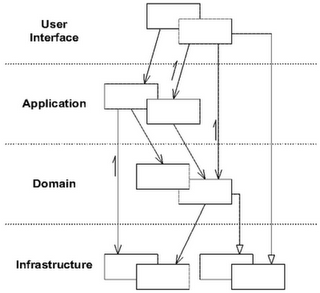
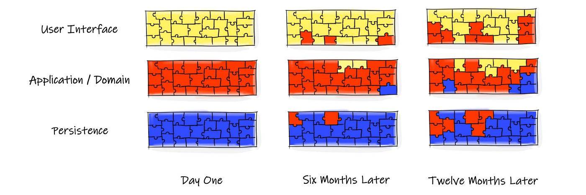
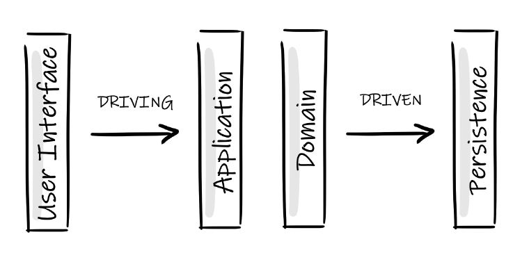
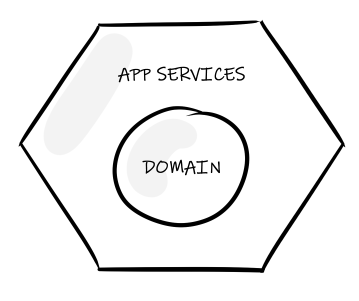
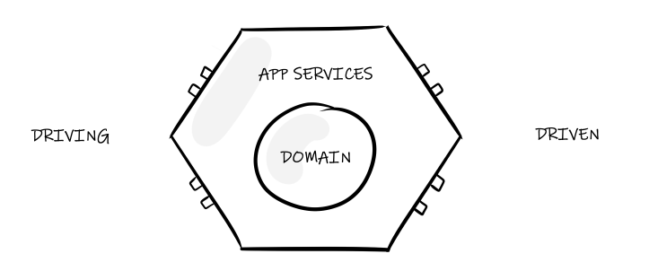
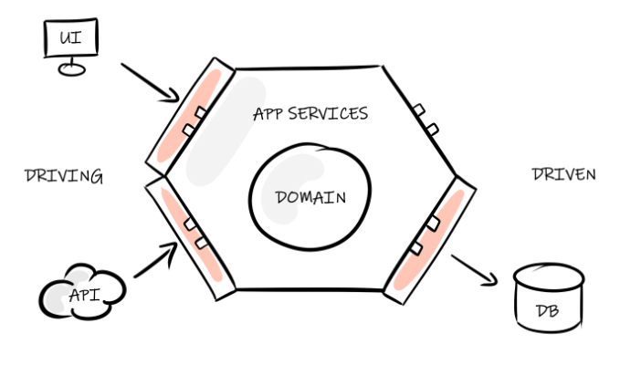

# Hexagonal Architecture from the Ground Up

Photo by [Donny Jiang](https://unsplash.com/@dotnny?utm_source=unsplash&utm_medium=referral&utm_content=creditCopyText) on [Unsplash](https://unsplash.com/s/photos/hexagon?utm_source=unsplash&utm_medium=referral&utm_content=creditCopyText)

Running a traditional farm must be an absolute nightmare. You’ve got to feed the animals, muck them out, schedule visits from the vet, plant crops, keep pests at bay, and juggle hundreds of other tasks concurrently.

Just keeping everything in the right place must be a full time job. Chickens wander off mindlessly to be snapped up by foxes, sheep jump fences and thorny brambles invade your land.

Separating the different functional areas of a farm is key to its successful management. Keep those chickens away from the cornfields, and put up strong fences to stop the cows leaving town.

Photo by [Markus Spiske](https://unsplash.com/@markusspiske?utm_source=unsplash&utm_medium=referral&utm_content=creditCopyText) on [Unsplash](https://unsplash.com/s/photos/farmland?utm_source=unsplash&utm_medium=referral&utm_content=creditCopyText)

# Clean separation

Similarly, half the battle in any non-trival software project is managing complexity. In fact, you could argue that the main role of any software professional is to tame complexity to make the systems on which we work *easy to change*.

Carving out the functional areas of your application is key to making it manageable. We don’t want to confuse the concerns of your persistence framework with the core business logic, user interface or anything else that’s going on in the code. As per the [*Single Responsibility Principle*](https://betterprogramming.pub/revisiting-solid-927e6a5202d3), we want to gather together the things that change for the same reasons and separate those things that change for different reasons. Doing so makes reasoning about your code, testing it and plain old maintenance, much simpler.

> *Gather together the things that change for the same reasons. Separate those things that change for different reasons — Single Responsibility Principle*

# Layered architecture

One of the most common patterns for managing separation of concerns is through use of a layered architecture.

From Domain Driven Design by Eric Evans

The layers capture the related parts of the application. The parts that change for similar reasons are kept together (cohesion) and are separated out from less heavily associated parts of the program (decoupling). Any layer should depend only on parts of itself or the layers below it. This gives us the ability to work in one area of the application without having to worry about other concerns.

This is a simple to understand and widely used pattern that is great for a lot of software. It isn’t, however, without its share of problems.

# When layers become lasagna

Despite the clear separation of a layered architecture, the boundaries aren’t always well maintained.

Whether consciously or not, developers will occasionally blur the lines of the architecture to get a feature out the door. For example, using a database stored procedure to perform a business level task spreads a concern across multiple layers. This may not be obvious when you’re down in the weeds, so over months the layers begin to seep into one another, mixing together, spoiling many of the benefits of the architecture.

Additionally, a layered approach hints at a single dimension of architecture. What if you need more than just a user interface to drive the application — the addition of a CLI, REST API, or event stream as an input? You could add these into a layered architecture, for sure, but they don’t quite fit the one-dimensional mental model.

# Driving and driven

Let’s flip a layered architecture on its side.

The user interface *drives* the application. It is the source of all interactions. The core of the software (the domain and it’s application services) react to the interactions of the *driving* side, and depend on the lower layer(s) to help it serve those requests. We can say that those lower (rightmost) layers are *driven*.

An interesting symmetry exists here. Both the *driving* and *driven* sides are interactions with things *outside* of our application. They don’t provide core value in themselves — that’s the job of the domain — they instead assist us in getting that core value out into the world.

The value the software provides is held in those middle layer(s), and we should make interfacing with them — which includes testing — as clean as possible. Similarly, we want to prevent outside concerns from encroaching on the core purpose of our software.

# Hexagonal architecture / ports & adapters

Now that we’ve asserted the centre of our application as the most valuable part, we can shift our architecture about to protect it.

The key change we’ll make is for dependencies to point inward — *at the domain* — rather that to the next layer in the chain as before. Doing so allows us to inject specifics (databases, user-interfaces, etc) as needed and to leave our core abstractions clean and untouched.

> Abstractions should not depend on details. Details (concrete implementations) should depend on abstractions — Dependency Inversion Principle

## The application and domain

We begin with the domain model. We wrap this in application services (the same as our application layer) as the core of our software.

This bundle is generally tech-agnostic — it concerns only the problem our software is built to solve. This makes it much simpler to reason about, to discuss with domain experts and to test. We’re no longer juggling orthogonal concerns in our head as we develop.

## Ports to the outside world

Of course, we need to plug something into this core or it’s completely useless. This is where **ports** come in.

A **port** is just an interface. On the *driving* side, this interface is to call our software, to ask questions of it — for example, deposit $10 into my bank account. On the *driven* side we have interfaces that will be called by the domain to use external resources — databases, external APIs, etc.

The “*hexagonal*” part of a hexagonal architecture is to demonstrate that an application may have many different things plugged into these ports. We may drive the software with both a GUI and a test harness, or plug-in different database technologies on the back-end.

## Plugging in with adapters

Ports are just interfaces, so we need something to implement them. The systems we want to interface with aren’t going to be compatible so we need to use the **adapter** pattern to translate from one domain to another.

Each port can be mounted by an adapter to allow external systems to speak to our application, or (on the right hand side) for our application to talk to external systems.

As mentioned before, these adapters are *injected* so that the abstractions in the centre of our diagram don’t rely on the specifics outside it.

# Conclusion

This is the final form of the hexagonal architecture. We’ve moved from a well-intentioned, but eventually coupled, architecture in the guise of layers to a much cleaner, more robust one.

Ports and adapters allow us to maintain solid boundaries in the system, keeping unrelated things well partitioned. The fact we have multiple ports around the hexagon allow us to plug in more than one system per port and, through test adapters, to ensure that we don’t accidentally couple the inner core with outer layers (through triangulation).

Of course, everything comes at a cost. Port interfaces need to be defined, and adapters need to be developed to translate between the semantics of the outer and inner layers. This is not completely trivial, and does come with some maintenance overhead / boilerplate.

For simple software a hexagonal architecture is almost certainly overkill. For more complex applications though — especially those with a busy domain, or that are following *Domain Driven Design* — it can be an extremely valuable addition to your toolbox to help keep software simple to understand and simple to evolve.

# Resources
