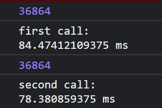
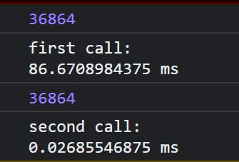

# Preface

In this article, I'll simply introduce memoization and help you build a common memoization function.

# Introduction

Suppose you come across a piece of code that has expensive calculations in it and takes quite some time to fully execute. We would like to minimize the calculations for repeat arguments to save time. Let us understand this with code.

```
function slowProduct(num1, num2) {
  for (let i = 0; i <= 100000000; i++) {}
  return num1 * num2;
}

console.time("first call");
console.log(slowProduct(192, 192));
console.timeEnd("first call");

console.time("second call");
console.log(slowProduct(192, 192));
console.timeEnd("second call");
```

Here, I have a slowProduct() function inside which is a `for loop` to simulate an expensive calculation. I have called the function twice with the same arguments. Upon opening the console we can see the output along with the time taken for them to fully execute.



Now, what if didn't calculate the value again and stored/cached it so that we can save future calculation time?

# So what is memoization?

Memoization is a speed optimization technique in programming, where given a function, you return a cached version of the output if the same inputs are used. A memoized function remembers the results of output for a given set of inputs.

Now let us first think about how we want to take inputs.

```
function slowProduct(num1, num2) {
  for (let i = 0; i <= 100000000; i++) {}
  return num1 * num2;
}

const memoizedProduct = myMemoize(slowProduct);

console.time("first call");
console.log(memoizedProduct(192, 192));
console.timeEnd("first call");

console.time("second call");
console.log(memoizedProduct(192, 192));
console.timeEnd("second call");
```

- We want a custom memoization function, `myMemoize()` which would take a callback function, in this case, it would be our `slowProduct()` function.
- The `myMemoize()` function would then return us a function which we would store in a variable `memoizedProduct`.
- We would then pass our arguments to `memoizedProduct()` function.

## myMemoize() function

```
// fn in this case would be slowProduct
const myMemoize = function (fn) {
  let res = {}; // an object which would store our cached results

  return function (...args) {
// we want an array of all the arguments we receive
// here args would look like [192,192]

    let argsCache = JSON.stringify(args); // argsCache = '192,192'

// if we receive new arguments and don't find the computed answer
// then compute and store the answer in res object
    if (!res[argsCache]) {
       res[argsCache] = fn(...args); 
/*The res object would look like this
res={
  '192,192': 36864,
}
*/
    }

    return res[argsCache];
  };
};
```

## The complete code

```
const myMemoize = function (fn) {
  let res = {};
  return function (...args) {
    let values = JSON.stringify(args);
    if (!res[values]) {
      res[values] = fn(...args);
    }
    return res[values];
  };
};

const memoizeProduct = myMemoize(slowProduct);

function slowProduct(num1, num2) {
  for (let i = 0; i <= 100000000; i++) {}
  return num1 * num2;
}

console.time("first call");
  console.log(memoizeProduct(192, 192));
console.timeEnd("first call");

console.time("second call");
  console.log(memoizeProduct(192, 192));
console.timeEnd("second call");
```

and the output in the console would look like this



Voila! We have memoized our `slowProduct` function! The second calculation didn't execute the callback provided, instead it looked inside the `res` object and extracted the already calculated answer.

## A minor change

We can make a small change to our `myMemoize` function to accept context if provided.

```
const myMemoize = function (fn, context) {
  let res = {};
  return function (...args) {
    let values = JSON.stringify(args);
    if (!res[values]) {
        res[values] = fn.call(context || this, ...args); 
// we will use call method to explicitly bind the callback to the context
// if no context is present then just use "this"
    }
    return res[values];
  };
};
```

# Conclusion

Memoization is a great way to improve performance in our projects. We can always combine this with other optimizations to get better performances.
