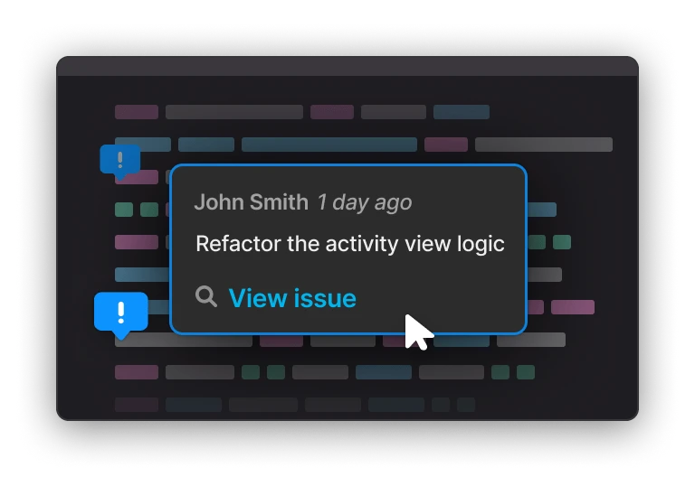
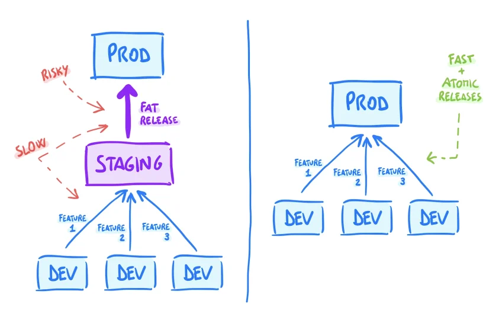

# Do you really need a Staging environment?

### Or does it bring more problems than it solves?

Most companies I know use *staging* or *pre-production* environments to test recent changes before they are released to real users.

This lets them discover more bugs, but it also increases the **cost and complexity** of their delivery process.

In recent years, anything that delays or makes the release slower, like testing environments and complex branching structures, have been put under discussion, with more and more teams gravitating towards **simpler setups**.

That’s because the faster and the more often you release software, [the less risk you take](https://refactoring.fm/p/how-shipping-fast-changes-your-life?s=w), and the more effective you are. Top-performing teams know this, and they adopt a **continuous delivery** approach that favors atomic releases and *always-deployable* software.

This article isn’t meant to be a *hot take*, but rather an objective analysis of the upsides and downsides of using a Staging environment. The goal is to help you get clarity about what is best for your product and your workflow.

This is also a *multi-player* effort that involved several folks from the [Refactoring community](https://refactoring.substack.com/p/community) like [Alex](https://www.linkedin.com/in/alex-stoia-6b759944), [Zach](https://medium.com/@zdwolfe), and [Yurii](https://www.linkedin.com/in/meakovski/?originalSubdomain=ua), who shared their takes and helped heavily with this.

We are going to cover:

- **What is a Staging environment?** — definitions first.
- **The problems with Staging** — technical and process issues.
- ⛵ **How to live without Staging** — while minimizing release risk.
- **When to keep Staging** — what are the scenarios where it pays off.

Let’s dive in

Before we start, I am happy to spend a few words to promote **[Stepsize](https://www.stepsize.com/?utm_source=referral&utm_medium=refactoring&utm_campaign=refactoringclub)**, a fantastic product whose founders I have been in touch with for a long time.

Stepsize allows engineers to create and view code issues, like technical debt and refactoring work, directly from your VSCode and JetBrains editors.

It integrates with other tools like Jira, GitHub, or Linear, so you can link issues to code without context switching, and make them visible in your codebase. **It helps you fix your tech debt and ship 2x faster** — you should definitely check it out.

Refactoring readers get a special **50% discount** for the first 3 months on the team plan, by using the *REFACTORINGCOMMUNITY* code.

[Learn more about Stepsize ✨](https://www.stepsize.com/?utm_source=referral&utm_medium=refactoring&utm_campaign=refactoringclub)

Now back to the article

## What is a Staging environment?

Staging is a safe space where teams can test their software in an “*as-close-to-production-as-possible*” environment, before the actual release.

It was originally conceived in the era of software shipped in boxes, when there wasn’t a controllable production environment to test or gather data from.

If you use Staging, your release process might be something like this:

1. **Merge feature branch** — on the Staging branch (e.g. “develop”), after running automated tests.
2. **Release on Staging** — this should be automated after the merge.
3. **Test on Staging** — QA and possibly feedback from product and non-tech stakeholders.
4. **Release to production** — merge the Staging branch to production and release.

There are alternatives, of course:

- If you do *trunk-based development*, you may not have a “develop” branch that gets merged to production, but rather push feature branches to staging, and after testing merge the feature branch directly to the trunk.
- You may have more than one *intermediate* environment. Some teams have separate envs for QA, pre-production, and more. For the sake simplicity, we will use the word “*Staging*” to mean any of these intermediate envs.

So, the role of Staging is clear. It is a shared place where you do some testing before the release.

What is bad about it?

## The Problems with Staging

Staging environments suffer from two main issues:

1. **They are often not reliable** — because it is hard and expensive to keep them at parity with production.
2. **They make releases many times slower** — by introducing an additional release level and batching changes together.

Let’s see why these are serious problems.

### 1) It is hard to keep Staging at parity with production

For Staging to be useful, it has to catch a special kind of issues that 1) would happen in production, but 2) wouldn’t happen on a developer's laptop.

What are these? They might be problems with data migrations, database load and queries, and other infra-related problems.

To make Staging catch these issues, you need to keep it at parity with production on data and infrastructure. This is hard and expensive — think about it, if it wasn’t so, you would just spin dev environments that look like prod.

The whole point of having a single, shared environment for testing instead of many individual ones is that the latter would be too expensive to maintain.

> *The way I see it, fundamentally, this is a resources management problem. If I wouldn't be looking at costs the dev environments could be designed and made powerful enough to satisfy all needs.*  
> — [Alex Stoia](https://ro.linkedin.com/in/alex-stoia-6b759944), CTO at Innertrends

To maintain such parity, you bear two costs:

- **Infrastructure cost** — the cost of running the hardware.
- **Upkeep cost** — the maintenance cost to keep environments aligned.

While there isn’t much you can do about the former, the latter is less of a concern when you use *[infrastructure-as-code](https://en.wikipedia.org/wiki/Infrastructure_as_code)* and modern DevOps tech.

> *If components are built from scratch to be aware of their environment, and the component's infrastructure code and configuration are both hierarchical, it's not much additional effort to maintain a staging environment. I have on more than one occasion "spun up a quick burner environment" for a project only to tear it down and not feel any regret on wasted time.*
>
> — [Zach Wolfe](https://medium.com/@zdwolfe), Senior Software Engineer at Amazon

In my experience, however, most companies cut corners on this and end up with Staging setups that look nothing like production. For example, they may hold a small fraction of the database, or run on totally different instances.

This defeats the purpose of Staging and makes it unable to do its job.

### 2) Releases are many times slower

There is no way around it. This might be for a good cause, but it’s important to understand the full consequences.

When your release time is fast — like, **10 minutes** fast — good things happen:

- Devs retain a strong **feedback loop**. They don’t need to context switch and can monitor impact on production effectively.
- You are able to make **multiple releases** every day.
- You make small, **atomic releases**, which are inherently small risk.

When releases take **one hour** or more, because they get bottlenecked on Staging, a vicious cycle happens:

- Devs start to **context switch** to other tasks while the release is in progress.
- **Less testing** and monitoring in production gets done because devs lose control of when code is actually released.
- “**Only in the morning**” releases (or worse, “only beginning of the week”), instead of multiple times a day.
- Multiple **features are batched** and released together for convenience, which makes releases riskier, harder to debug, and it further muddies single devs’ ownership.

In a Staging workflow, releases are slower because of more steps, and bigger because of batching.

## ⛵ How to live without Staging

Here are techniques that help you create a release process that doesn’t involve a Staging environment:

### 1) Use remote dev environments

Make developers write code in remote, containerised environments. They can use their IDE + SSH, or browser-based solutions like [Gitpod](https://gitpod.io/) or [Codespaces](https://github.com/features/codespaces).

This is a reality for many companies now, including both snappy startups and incumbents like [Github](https://github.blog/2021-08-11-githubs-engineering-team-moved-codespaces) and [Linkedin](https://engineering.linkedin.com/blog/2021/building-in-the-cloud-with-remote-development).

This approach has many upsides, but a crucial one is you can make the dev environment much closer to production than a regular laptop, reducing the need for Staging.

[Alex](https://ro.linkedin.com/in/alex-stoia-6b759944) does this with his team

> *Our dev environment(s) reside on servers that are setup with dockers which simulate with a good approximation the production environment. In this way developers just need the Visual Studio Code IDE with Remote-SSH extension to access it. So nothing is kept or run locally on their device. From this perspective the dev environment comes really close to the staging environment concept.*

You can learn more about cloud dev environments in a previous Refactoring article:

- **[Coding in the Browser](https://refactoring.fm/p/cloud-development?s=w)**

### 2) Use preview links for QA

Staging environments are also used for QA and general product testing of new features. You can reduce this need by creating ad-hoc preview links for such testing.

- For **frontend** features, you can easily spin these up with services like [Vercel](https://vercel.com/) of [Netlify](https://www.netlify.com/).
- For **backend** or **full-stack** features, you can share your own env with [Ngrok](https://ngrok.com/), or even more easily if you use a remote solution like [Gitpod](https://gitpod.io/), mentioned above.

### 3) Use feature flags

Feature flags are a way to enable / disable features without making a new release.

With feature flags, you can deploy some code and verify its behavior before turning it on to all users, or turn off a feature that performs unexpectedly without rolling back the code.

By gating features that are not ready for public viewing, you can merge code earlier and make incremental releases, reducing the risk of each release, even without a Staging environment.

[LaunchDarkly](https://launchdarkly.com/) is the most popular tool I know for managing feature flags. You can check out [this guide](https://launchdarkly.com/blog/what-are-feature-flags/) to learn more about feature flags in general.

### 4) Invest in observability

Whether you use Staging or not, you should get good at testing in production.

Testing in production has a bad rep because most people interpret it as testing *only* in production. I mean, instead, testing *also* in production.

Whenever you deploy something, you should always check its impact on your systems. For engineers, this is a crucial aspect of their work that promotes ownership and a general DevOps culture.

To be effective at testing in prod, you need to instrument your systems and make them *observable*. That includes investing in logs, metrics, distributed tracing, and more.

This fantastic article by Charity Majors explains why testing in production is a superpower:

- **[I test in prod](https://increment.com/testing/i-test-in-production/)**

### 5) Make Staging optional

Let’s say you have pondered all of the above, and figured out that 1) a large chunk of changes could go straight to production, but 2) there are still 20% of cases where you definitely need Staging (see “when to use staging” below).

The easiest improvement you can make is to turn Staging into an *optional* step in your release process. You separate the Staging workflow from your main branching strategy, and give developers the agency to choose to either deploy to production or test on Staging first, based on risk and complexity.

Sometimes, when we design processes, we limit ourselves by thinking that things can only be *always* or *never*. There are often good solutions in between. This reminds me of the [Ship / Show / Ask framework](https://refactoring.fm/p/code-reviews?s=w#:~:text=5)%20Consider%20the%20Ship%20/%20Show%20/%20Ask%20framework) for code reviews.

## When to use Staging

The main scenarios in which you can make the case for using a Staging environment are when you have to handle complexity with **data** and/or **infrastructure**.

### 1) Complex data workflows

[Yurii Mykytyn](https://www.linkedin.com/in/meakovski/?originalSubdomain=ua), Director of Engineering at Rebbix, identifies two use cases around data:

- **Regulations & restrictions** — sometimes developers are not allowed to access some data, like user data or financial data (e.g. with agencies, contractors, and public companies). In this case, devs should rely on a shared environment.
- **Migrations and big database changes** — these are hard to test on your laptop, cannot be gated by feature flags, and can be destructive if they go wrong. Also, more in general, cases when you need to manipulate production data to achieve complex application states.

Alex, who runs a data-heavy company, also weighs in on this:

> *The only thing that cannot be solved easily is the data problem. When you run algorithms or apply complex processing pipelines on data there is a significant difference on how the systems behaves with small/decent amounts (controlled) vs large amounts (where it gets unpredictable and diverse). So the dev environments - where we try to use fake data similar to production, or exported small amounts of production scrambled data, and have limited processing "power" -  is not totally reliable at the end of the day.  
>   
> So, for us, staging is the environment where we can test, safely, as a last step, our code on real production data, at scale.*

### 2) Complex infrastructure

For complex architectures made of tens of different services, it may be hard to create dev environments that hold the full infrastructure, and it is easier to let developers handle one service at the time, while accessing others in a shared environment.

Zach and Yurii commented on this

> *I agree in an architecture with few components it might be undue effort to create a staging environment. For service oriented architectures with dozens of components, though, having a staging environment increases the speed of release, not the other way around.*
>
> — Zach
>
> *Sometimes the data and infrastructure are just too big to be run on your machine. With modern tooling like k8s, you can run a single instance of the service you're currently working on your machine and everything else transparently runs in the cloud, connecting seamlessly to your code.*
>
> — Yurii

## Resources

Here are some articles to learn more

- **[Why we don’t use a Staging environment](https://squeaky.ai/blog/development/why-we-dont-use-a-staging-environment)** — This article by Squeaky got to the front page of Hacker News and generated a heated debate. It describes Staging shortcomings and an alternative workflow to release software. It is well-written but a bit naive on a few points (e.g. you can’t feature flag everything — see migrations), and I feel it doesn’t give Staging enough credit.
- **[I test in prod](https://increment.com/testing/i-test-in-production/)** — Charity Majors explains why you should always test in production and how. An important topic that doesn’t get enough attention.
- **[What are Feature Flags](https://launchdarkly.com/blog/what-are-feature-flags/)** — Using feature flags regularly can dramatically change your workflow. Probably more than you realize. This article by LaunchDarkly does a good job at explaining why.
- **[How Shipping Fast Changes Your Life](https://refactoring.fm/p/how-shipping-fast-changes-your-life?s=w)** — a previous Refactoring article about the first, second, and third-order effects of your release speed on your team. The title is not an exaggeration.

## How would you rate this edition?

**[Amazing](https://reactions.sparkloop.app/questions/3129/react?with=1) • [Great](https://reactions.sparkloop.app/questions/3129/react?with=2) • [Good](https://reactions.sparkloop.app/questions/3129/react?with=3) • [OK](https://reactions.sparkloop.app/questions/3129/react?with=4) • [Meh](https://reactions.sparkloop.app/questions/3129/react?with=5)**
