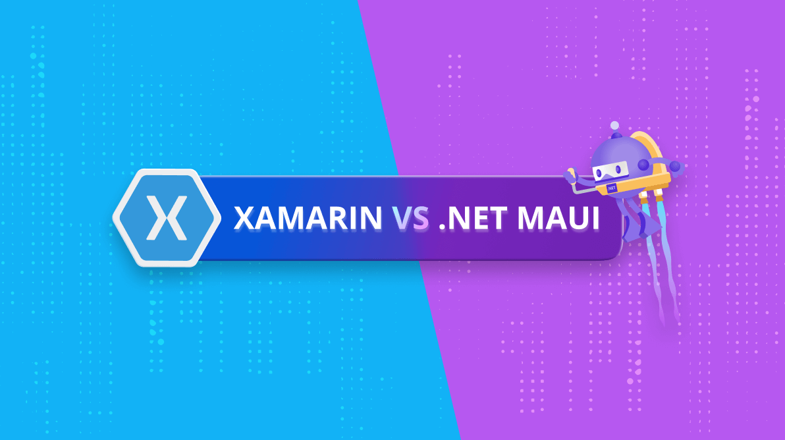
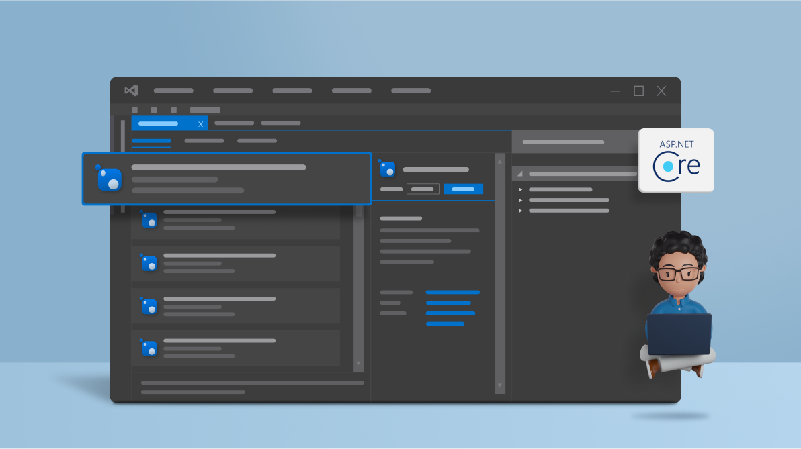

New Product Launch**BoldDesk**: Help desk ticketing software starts at $10 for 3 agents.

[Try it for free.](https://www.bolddesk.com/?utm_source=syncfusionheader&utm_medium=referral&utm_campaign=bolddesk)

- [Contact Us](https://www.syncfusion.com/company/contact-us)

[Sign in to Syncfusion](https://www.syncfusion.com/account/login?ReturnUrl=https://www.syncfusion.com/blogs/post/xamarin-versus-net-maui.aspx)

- Products**
- [Solution Services](https://www.syncfusion.com/products/solution-services)
- Learning & Support**
- [Pricing](https://www.syncfusion.com/sales/products)
- Company**
- [FREE TRIAL](https://www.syncfusion.com/downloads)

none

[**  Blog Home](https://www.syncfusion.com/blogs)

none

nonenone

# Xamarin Versus .NET MAUI

- [Selva Ganapathy Kathiresan](https://www.syncfusion.com/blogs/author/selva-ganapathy-k)
- May 31, 2022

I hope you are all now familiar with these two names, [Xamarin.Forms](https://dotnet.microsoft.com/en-us/apps/xamarin "Xamarin.Forms") and [.NET MAUI](https://dotnet.microsoft.com/en-us/apps/maui ".NET MAUI"), especially if you are going to develop cross-platform apps. When trying to choose one or the other, some of you might be uncertain.

In this blog, I will try to help you better understand the differences between Xamarin.Forms and .NET MAUI.

## Xamarin.Forms: Overview

Xamarin.Forms is generally used to develop native cross-platform apps. Basically, Xamarin.Forms is a layer of abstraction that allows interaction of the shared code with the underlying platform code of Android, iOS, and Windows.

Using Xamarin.Forms, a cross-platform mobile app developer can save development time by writing all of their business logic in a single language. Almost 90% of the code required to develop an app is shared across platforms, letting you achieve native performance and the same look on each.

## .NET MAUI: Overview

As you know, the .NET Multi-platform App UI is popularly known as .NET MAUI. It is used to build native cross-platform apps with .NET for Android, iOS, macOS, and Windows. .NET MAUI is built on top of Xamarin.Forms, evolving the platform to the next level.

With .NET MAUI, Microsoft begins a journey to create a unified .NET platform as a single base class for .NET Core and Mono/Xamarin together.

## Commonalities

Since .NET MAUI is an evolution of Xamarin.Forms, they have most of their features in common. You can get almost all things in .NET MAUI that Xamarin has, like controls, layouts, Shell, gestures, templates, and cross-platform APIs for device features. You can find all these in .NET MAUI with a different namespace.

## Xamarin versus .NET MAUI

Even though there are many things in common between Xamarin.Forms and .NET MAUI, there are a lot of differences, too. I will spend the rest of this blog discussing the main 15 differences.

### 1. Platform Architecture

First and foremost, the main change in platform architecture is that .NET MAUI is integrated with .NET 6.0 to be a part of the **[Journey to One .NET](https://www.youtube.com/watch?v=ctSqiD8BGPM "The Journey to One .NET: YouTube Video")**.

| Xamarin | .NET MAUI |
| Xamarin.Forms-Architecture.png Xamarin.Forms Architecture | NET-MAUI-Architecture.png .NET MAUI Architecture |

### 2. Project Structure

The main difference between Xamarin.Forms and .NET MAUI starts with their project structure.

| Xamarin | .NET MAUI |
| Uses separate projects for each platform. | Single project structure: each platform can be targeted using devices about to be deployed. |
| Platform-dependent files and code are maintained under different projects. | The platform-dependent files and code are maintained under [platform folders and platform filename targets](https://docs.microsoft.com/en-us/dotnet/maui/platform-integration/configure-multi-targeting "Configure multi-targeting in .NET MAUI") such as MainPage.android.cs and MainPage.iOS.cs. |
| Project system: **Franken-proj**. | Project system: **SDK Style**. |

With Xamarin.Forms, developers may become frustrated working with multiple projects targeting multiple platforms; keeping images, fonts, and platform-related code organized; adding different dependencies, and resolving them if they’re referenced as NuGet packages. Encountering these problems, developers are now addressed in .NET MAUI with a single project.

Since .NET MAUI is a simple project app, it works on a multitarget-based structure. A .NET MAUI app contains a **Platforms** folder, with subfolders representing platforms such as Android, iOS Maccatalyst, and Windows to target platform-specific code that starts the app on platforms. It can also be multitargeted based on your own file name. Generally, the file name target pattern is to include the platform as an extension in the file name. For example:

- MainPage.android.cs targeting Android
- MainPage.iOS.cs targeting iOS and Mac
- MainPage.Windows.cs targeting Windows

### 3. Supported Platforms and Versions

The main difference in platform support between Xamarin and .NET MAUI is in their support for Windows. Xamarin supports UWP, whereas .NET MAUI supports WinUI. Have a look at the following table for support version details.

| Xamarin | .NET MAUI |
| **Primary support**    - Android 4.4 (API 19) or higher ([more details](https://docs.microsoft.com/en-us/xamarin/get-started/supported-platforms#android-platform-support "Android platform support")). - iOS 9 or higher. - UWP: Windows 10, build 10.0.16299.0 or greater for .NET Standard 2.0 support. | **Primary support**    - Android 5.0 (API 21) or higher. - iOS 10 or higher. - macOS 10.13 or higher - WinUI: Windows 11 and Windows 10 version 1809 or higher |
| **Additional platform support**    - Samsung Tizen - macOS 10.13 or higher - GTK# - WPF | **Additional platform support**    - Tizen, supported by Samsung. - Linux, supported by the community. |

### 4. .NET CLI

Another major difference is that .NET MAUI runs on .NET CLI. The [.NET command-line interface (CLI)](https://docs.microsoft.com/en-us/dotnet/core/tools/ ".NET CLI overview") is a cross-platform toolchain for developing, building, running, and publishing .NET apps. This .NET CLI provides .NET MAUI apps with a seamless build and run experience.

| Xamarin | .NET MAUI |
| Xamarin supports .NET Framework to build and run apps. | .NET MAUI supports the .NET CLI toolchain to build, run, and publish .NET apps. |

### 5. Renderer and Handler Architectures

In Xamarin, controls are made with renderers. When developers want to customize a native controls’ UI, they must use a custom renderer to do so. These renderers cost the users heavily in terms of performance and app size.

But .NET MAUI uses handler architecture that is very loosely coupled with native assembly. With a native platform, this results in a lightweight app with better performance.

You can use renderers here if needed. You can reuse Xamarin.Forms custom renderer when porting.

| Xamarin | .NET MAUI |
| Uses renderer architecture. | Uses [handler architecture](https://www.syncfusion.com/blogs/post/how-to-customize-net-maui-controls-with-handler-architecture.aspx "Blog: Customize .NET MAUI Controls with Handler Architecture"). |
| Tightly coupled with native controls. | Loosely coupled with native controls. |
| You cannot use handlers here. | You can use renderers here if needed. You can [reuse Xamarin.Forms custom renderer](https://www.syncfusion.com/blogs/post/how-to-reuse-xamarin-forms-custom-renderers-in-net-maui.aspx "Blog: How to Reuse Xamarin.Forms Custom Renderers in .NET MAUI") when porting. |
| Xamarin-Renderer-Architecture-1.png Xamarin Renderer Architecture | NET-MAUI-Handler-Architecture.png .NET MAUI Handler Architecture |

### 6. .NET 6

.NET MAUI is integrated into .NET 6, whereas Xamarin.Forms is a .NET Framework. Due to .NET 6 integration, you can use the following .NET 6 and C#10 features in .NET MAUI:

- Nullable enable/disable and nullable reference types
- [Source Generators](https://docs.microsoft.com/en-us/dotnet/csharp/roslyn-sdk/source-generators-overview "Source Generators in .NET MAUI")
- [Record structs](https://docs.microsoft.com/en-us/dotnet/csharp/whats-new/csharp-10#record-structs "Record structs in C# 10")
- [Interpolated string handlers](https://docs.microsoft.com/en-us/dotnet/csharp/whats-new/csharp-10#interpolated-string-handler "Interpolated string handlers in C# 10")
- [global using directives](https://docs.microsoft.com/en-us/dotnet/csharp/whats-new/csharp-10#global-using-directives "Global using directives in C# 10")

**Note:** If you are porting your app from Xamarin.Forms to .NET MAUI, you may not be able to use all these .NET 6.0 and C# features, because you may face limitations on your existing code.

### 7. Resource Maintenance

.NET MAUI took over Xamarin in terms of resources, especially in terms of images. You do not need to maintain a set of images for the platform- or device-specific needs. A single SVG image is enough to meet all platform and device requirements. The SVG image gets turned into a .png image to work on all platforms.

| Xamarin | .NET MAUI |
| Resources include images and classes. | Resources include classes like MauiImage and MauiResources. |
| Need to maintain resolution-based images for platform-specific devices. | With the help of SVG images, there is no need to maintain platform-specific or device-specific images. |
| Resource files need to be maintained separately for each platform. | Resources can be maintained in a single location. |

### 8. Hot Reload Support

Support for hot reload in Xamarin versus .NET MAUI is detailed in the table.

| Xamarin | .NET MAUI |
| **.NET hot reloads**    - Does not support (but UWP has limited support for runtime edits using .NET’s edit and continue feature). | **.NET hot reloads**    - Complete [.NET hot reloads](https://docs.microsoft.com/en-us/visualstudio/debugger/hot-reload?view=vs-2022 "Write and debug running code with Hot Reload in Visual Studio") support is available. |
| **XAML hot reload**    - **Experimental:** SDK 4.x and Visual Studio 2019 prior to version 16.9. - **Feature complete:** SDK 5.x and Visual Studio 2019 version 16.9 or newer. | **XAML hot reload**    - Complete support available. |

### 9. Graphics APIs

In Xamarin, there is no direct API available to fulfill any drawing requirements. You have to do it on the native side using renderers. But .NET MAUI now abstracts native drawing and brings you better graphics APIs.  The cross-platform graphics functionality in .NET MAUI provides a drawing canvas for drawing and painting shapes.

The brush is the primary type.

| Xamarin | .NET MAUI |
| No graphics available. | Graphics modes such as [paint](https://docs.microsoft.com/en-us/dotnet/maui/user-interface/graphics/paint "Paint graphical objects in .NET MAUI"), [winding,](https://docs.microsoft.com/en-us/dotnet/maui/user-interface/graphics/windingmodes "Winding modes in .NET MAUI") [blend](https://docs.microsoft.com/en-us/dotnet/maui/user-interface/graphics/blendmodes "Blend modes in .NET MAUI") are available. |
| Custom drawing is not possible. | Drawing graphics is possible. |
| Color is the primary type. | Brush is the primary type. |

### 10. Configuring Resources and Services

Unlike Xamarin, .NET MAUI apps are bootstrapped using the [.NET Generic Host](https://docs.microsoft.com/en-us/dotnet/core/extensions/generic-host ".NET Generic Host documentation"). So, if you want to initialize any fonts, services, or third-party libraries, it can be done through that from a single location.

### 11. Accessibility

Typically in Xamarin, we use automation properties and native APIs to provide proper accessibility to screen readers for text in the controls used in an app.

But .NET MAUI provides *semantic properties* to provide accessibility values in apps (you can use *automation properties* in .NET MAUI, but the recommended approach is *semantic* *properties*).

### 12. Supported Patterns

Another important difference is pattern support.

| Xamarin | .NET MAUI |
| - [MVVM](https://en.wikipedia.org/wiki/Model%E2%80%93view%E2%80%93viewmodel "Wikipedia page for Model–view–viewmodel") (model-view-viewmodel) - [RxUI](https://www.reactiveui.net/docs/ "ReactiveUI documentation")(ReactiveUI) patterns | - [MVVM](https://en.wikipedia.org/wiki/Model%E2%80%93view%E2%80%93viewmodel "Wikipedia page for Model–view–viewmodel") (model-view-viewmodel) - [RxUI](https://www.reactiveui.net/docs/ "ReactiveUI documentation")(ReactiveUI) patterns - MVU patterns (still experimental) |

### 13. Blazor apps

Developing Blazor hybrid apps is not possible in Xamarin, but you can build [.NET MAUI Blazor apps](https://docs.microsoft.com/en-us/aspnet/core/blazor/hybrid/tutorials/maui?view=aspnetcore-6.0 "Build a .NET MAUI Blazor app documentation").

### 14. Cross-platform APIs for device features

Both Xamarin and .NET MAUI can provide the following cross-platform APIs for native device features. According to this [Microsoft documentation](https://docs.microsoft.com/en-us/dotnet/maui/what-is-maui "What is .NET MAUI?"), the following are the cross-platform APIs available.

- Access to sensors, such as the accelerometer, compass, and gyroscope on devices.
- Ability to check the device’s network connectivity state, and detect changes.
- Provide information about the device the app is running on.
- Copy and paste text to the system clipboard, between apps.
- Pick single or multiple files from the device.
- Store data securely as key/value pairs.
- Utilize built-in text-to-speech engines to read text from the device.
- Initiate browser-based authentication flows that listen for a callback to a specific app registered URL.

Cross-platform APIs for device features are also integrated with MAUI under **Microsoft.Maui.Essentials** namespace.

| Xamarin | .NET MAUI |
| Cross-platform APIs for device features can be carried out using [Xamarin.Essentials](https://docs.microsoft.com/en-us/xamarin/essentials/ "Xamarin.Essentials documentation"). | Cross-platform APIs for device features are also integrated with MAUI under **Microsoft.Maui.Essentials** namespace. |

### 15. Multiple Windows

In .NET MAUI, [multiple windows](https://docs.microsoft.com/en-us/dotnet/maui/fundamentals/windows#multi-window-support "Multi-window support for .NET MAUI") can be opened on Android, iOS on iPad, Mac Catalyst, and Windows at a time. This support is not available in Xamarin.

## Conclusion

I hope you are now clearer about the differences between Xamarin and .NET MAUI. In terms of learning, you can pick up .NET MAUI quickly if you are well versed in Xamarin. Since .NET MAUI is an improvement on Xamarin, developer productivity will also be improved.

[Xamarin.Forms](https://dotnet.microsoft.com/apps/xamarin/xamarin-forms "Xamarin.Forms") has been with us for nearly seven years! It has played a crucial role in cross-platform app development and has helped countless developers succeed year after year. But now it’s time to say goodbye to Xamarin.Forms and happily welcome [.NET MAUI](https://github.com/dotnet/maui ".NET MAUI GitHub demos"). It’s going to help us be even more successful in app development.

At Syncfusion, we strive to build world-class products that can exceed developer requirements. We are very thankful for your great response to our [Xamarin controls](https://www.syncfusion.com/xamarin-ui-controls "Syncfusion Xamarin UI controls"). Your support and feedback helped in making our Xamarin controls a market leader. With the same spirit, we are delivering our [.NET MAUI controls](https://www.syncfusion.com/maui-controls "Syncfusion .NET MAUI controls"), which will perform even better. Please try them out!

If you have any feedback or any special requirements or controls needed for Syncfusion’s .NET MAUI support, please let us know in the comments below. You can also contact us through our [support forum](https://www.syncfusion.com/forums "Syncfusion support forum"), [support portal](https://support.syncfusion.com/ "Syncfusion support portal"), or [feedback portal](https://www.syncfusion.com/feedback/xamarin-forms "Syncfusion Feedback Portal"). We are always happy to assist you!

## Related blogs

- [View PDF Pages as Thumbnails Using Xamarin.Forms PDF Viewer](https://www.syncfusion.com/blogs/post/view-pdf-pages-as-thumbnails-using-xamarin-forms-pdf-viewer.aspx "Blog: View PDF Pages as Thumbnails Using Xamarin.Forms PDF Viewer")
- [Replicating an App Login Screen in Xamarin.Forms](https://www.syncfusion.com/blogs/post/replicating-an-app-login-screen-in-xamarin-forms.aspx "Blog: Replicating an App Login Screen in Xamarin.Forms")
- [Handling Overlay Elements in .NET MAUI with ZIndex](https://www.syncfusion.com/blogs/post/handling-overlay-elements-in-net-maui-with-zindex.aspx "Blog: Handling Overlay Elements in .NET MAUI with ZIndex")
- [Syncfusion .NET MAUI 2022 Roadmap](https://www.syncfusion.com/blogs/post/syncfusion-net-maui-2022-roadmap.aspx "Blog: Syncfusion .NET MAUI 2022 Roadmap")

### Tags:

- [.NET MAUI](https://www.syncfusion.com/blogs/tag/net-maui), [Microsoft](https://www.syncfusion.com/blogs/tag/microsoft), [Mobile](https://www.syncfusion.com/blogs/tag/mobile), [Xamarin.Forms](https://www.syncfusion.com/blogs/tag/xamarin-forms)

 

[Selva Ganapathy Kathiresan](https://www.syncfusion.com/blogs/author/selva-ganapathy-k)

Selva Ganapathy Kathiresan is a Senior Product Manager at Syncfusion and a Microsoft MVP (2014), who sees through the development of Layout and Editors. His areas of expertise are .NET MAUI, Xamarin, WPF, UWP and other .NET Frameworks.

[ More Posts](https://www.syncfusion.com/blogs/author/selva-ganapathy-k)

You must be [logged in](https://www.syncfusion.com/account/login?ReturnUrl=https://www.syncfusion.com/blogs/post/xamarin-versus-net-maui.aspx%23comments) to post a comment.

Be the first to get updates

Subscribe RSS feed  **

Popular Now

[Announcing New SaaS Help Desk Software: BoldDesk!](https://www.syncfusion.com/blogs/post/announcing-new-saas-help-desk-software-bolddesk.aspx)

[Top 10 .NET Core Libraries Every Web Developer Should Know](https://www.syncfusion.com/blogs/post/top-10-net-core-libraries-every-web-developers-should-know.aspx)

[How to Build CRUD REST APIs with ASP.NET Core 3.1 and Entity Framework Core,...](https://www.syncfusion.com/blogs/post/how-to-build-crud-rest-apis-with-asp-net-core-3-1-and-entity-framework-core-create-jwt-tokens-and-secure-apis.aspx)

[6 Easy Ways to Export Data to Excel in C#](https://www.syncfusion.com/blogs/post/6-easy-ways-to-export-data-to-excel-in-c-sharp.aspx)

0.56

[Privacy Policy](https://www.syncfusion.com/privacy) | [Terms of Use](https://www.syncfusion.com/terms-of-use)

###### [Copyright © 2001 - 2022 Syncfusion Inc. All Rights Reserved](https://www.syncfusion.com/copyright)

###### Fax: +1 919.573.0306

###### US: +1 919.481.1974

## UK: +44 20 7084 6215

[Facebook **](https://www.facebook.com/Syncfusion)   [Linkedin **](https://www.linkedin.com/company/syncfusion?trk=top_nav_home)   [Twitter **](https://twitter.com/Syncfusion)   [Youtube **](https://www.youtube.com/syncfusioninc)

## Toll Free: 1-888-9DOTNET

mobile
