# Things You Should Know About Databases

This is the first post in a series called Things You Should Know. Think of it as a primer to level set from base principles on various topics. Today we are discussing databases!

[Mahdi Yusuf](https://architecturenotes.co/author/myusuf3/)
June 27, 2022 — 13 minutes read

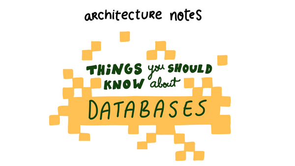

Things you should know about databases

It is often surprising how little is known about how databases operate at a surface level, considering they store almost all of the states in our applications. Yet, it's foundational to the overall success of most systems. So today, I will explain the two most important topics when working with RDBMSs indexes and transactions.

So, without fully getting into the weeds on database-specific quirks, I will cover everything you *should* understand about RDBMS indexes. I will touch briefly on transactions and isolation levels and how they can impact your reasoning about specific transactions.

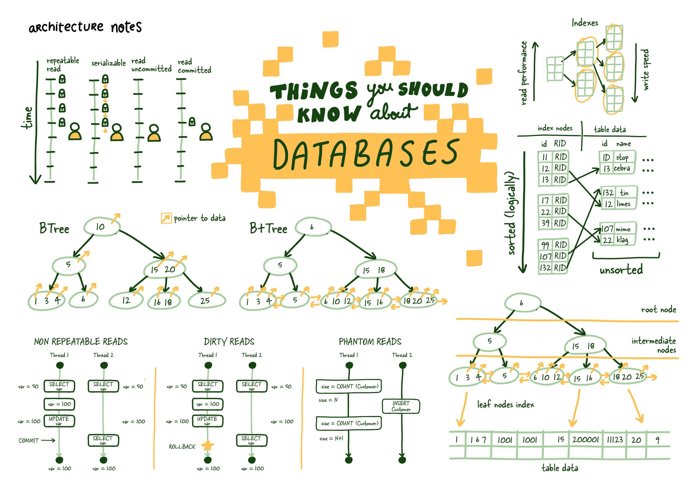

#### What is an RDBMS?

## What is an index?

Indexes are a data structure that helps decrease the look-up time of requested data. Indexes achieve this with the additional costs of storage, memory, and keeping it up to date (slower writes), which allows us to skip the tedious task of checking every table row.

Like an index in the back of a textbook, it helps you get to the right page. I am not a great fan of the book analogy, it quickly falls apart as we dig deeper into database indexes, but it is an excellent way to introduce the topic.

### Why do we need indexes?

Small amounts of data are manageable but, (think of an attendance list for a small class) when they get larger (think birth registry for a large city) less so. Everything that used to be quick gets slower, too slow.

Think about how your strategy would change if you had to find something on 1 page vs. thousand pages of names. No, **seriously**, take a second and think.

Some database has implemented almost all the good strategies you can come up with at some point. As they grow, systems collect and store more data, eventually leading to the problem above.

We need indexes to help us get the relevant data we need as quickly as possible.

### How do indexes work?

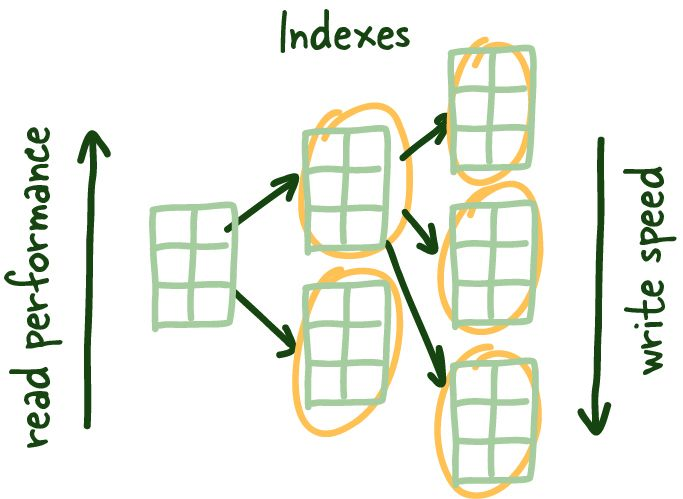

Read performance increases as you index the data, but that comes at the cost of write performance since you need to keep index up to date.

So one of the solutions question that is often posed above is to store this data logically on how you would search it. Meaning if you want to search the list by name you would sort the list by first name. There are few issues with that strategy. I will pose them mostly as questions for the reader here:

1. What if you want to search the data in multiple ways?
2. How would you deal with adding new data to the list? Is that fast?
3. How would you deal with updates?
4. Whats is the O notation on these tasks?

Something to **think** about. Regardless of your original strategy we definitely need a way to maintain order so we can quickly get relevant unordered data (more on that soon)

We are hoping to build the largest system design community on the internet! We would love for you to join us. You can find us here on [Twitter](https://twitter.com/arcnotes). You can reach the author [here](https://twitter.com/myusuf3) too for feedback.

Lets take the Figure 1.1 below.

```
+─────+─────────+──────────────+
| id  | name    | city         |
+─────+─────────+──────────────+
| 1   | Mahdi   | Ottawa       |
| 2   | Elon    | Mars         |
| 3   | Jeff    | Orbit        |
| 4   | Klay    | Oakland      |
| 5   | Lebron  | Los Angeles  |
+─────+─────────+──────────────+
```

Figure 1.1 Small table that is easily read from disk quickly.

The underlying data is spread around storage with no order and allocated perceivably randomly. Nowadays, most production servers come with SSDs, but there are some cases where you would want (HDD) spinning disks, but honestly, the reasons are getting less and less as prices for SSDs come down significantly.

#### SSD vs. HDD

Now reading in that small amount of data into memory is quite fast and relatively trivial to scan. Now what if the data we are searching across can't be cached entirely in memory? or the time to read all the data from disk is taking too long?

```
+──────────+─────────+───────────────────+
| id       | name    | city              |
+──────────+─────────+───────────────────+
| 1        | Mahdi   | Ottawa            |
| 2        | Elon    | Mars              |
| 3        | Jeff    | Orbit             |
| 4        | Klay    | Oakland           |
| 5        | Lebron  | Los Angeles       |
| ...      | ...     | ...               |
| 1000000  | Steph   | San Francisco     |
| 1001000  | Linus   | Portland          |
+───────+─────────+──────────────────────+
```

Figure 1.2 Large Table that doesn't fit entirely in memory and is spread across disk.

So here is where most developers go – I have seen this problem before; we need some dictionary (hash map) and a way to get to the specific row we are looking for without having to scan the slow disk, reading tons of blocks to see if the data we need is there.

These are called **index leaf nodes** are given a specific column to index, they can store the location of the matching row(s)

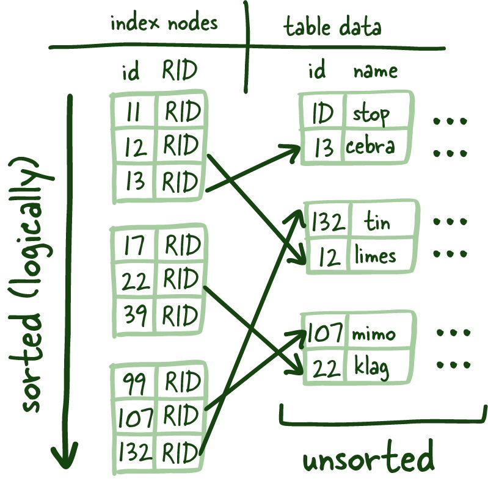

These index leaf nodes are the mapping between the indexed column and where the corresponding row lives on the disk. This gives us a quick way to get to a specific row if you reference it by indexed column. Scanning the index can be much faster since it is a compact representation (fewer bytes) of the column you are searching by. It saves you time reading a bunch of blocks looking for the requested data and is much more convenient to cache, further speeding up the entire process.

## Scale of data often works against you, and balanced trees are the first tool in your arsenal against it.

These indexes leaf nodes are of uniform size, and we are trying to store as many of these leaf nodes as a possible per block. Since this structure requires things to be sorted (logically, not physically on disk), we need to solve the problem of having to add and remove data quickly; the good ol' linked list manages this, more specifically, a doubly linked list.

#### Blocks

The benefits here are twofold: it allows us to read the index leaf nodes both forward and backward and quickly rebuild the index structure when we remove or add new rows since we are just modifying pointers—potent stuff.

#### Linked List

Since these leaf nodes aren't arranged physically on disk in order (remember pointers maintain the sorting in the doubly linked list), we need a way to get to the correct index leaf nodes.

### Balanced Trees (B-Trees)

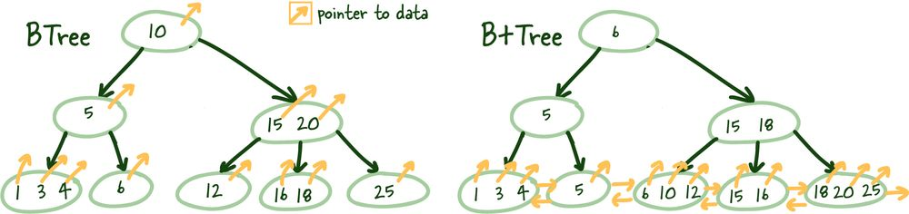

Structual difference BTrees vs. B+Trees

So you might wonder where you made a massive error to find yourself reading about B-Trees you hated from school. I get it these things are boring, but they are powerful and worth understanding.

B+Trees allows us to build a tree structure where each intermediate node points to the highest node value of its respective leaf nodes. It gives us a clear path to find the index leaf node that will point to the necessary data.

This structure is built from the bottom up so that an intermediate node covers all leaf nodes until we reach the root node at the top. This tree structure gets its name *balanced* because the depth is uniform across the entire tree.

#### B-Tree vs. B+Tree

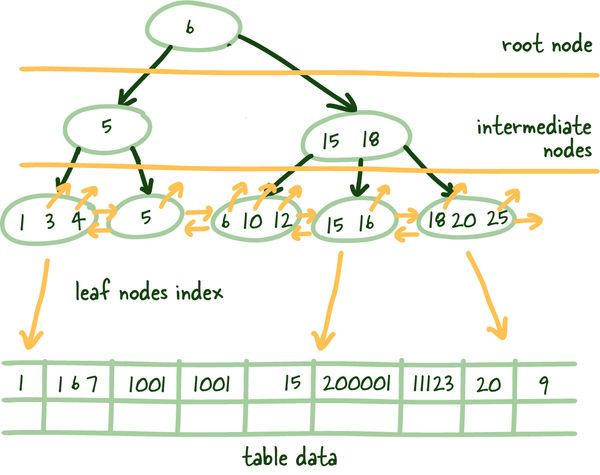

How B+Trees are used in RDBMSs

### Logarithmic Scalability

I want to take a brief aside here to hit home the power of this structure. Of course, most developers are aware of the exponential growth of data and, ideally, your company's valuations. But unfortunately, scale of data often works against you, and balanced trees are the first tool in your arsenal against it.

Depending on the number of items the intermediate nodes can reference (M) plus the overall tree (N) depth, we can reference M to the N objects.

Here is a table illustrating the concept with an M value of 5.

| Tree Height (N) | Index Leaf Nodes |
| --- | --- |
| 3 | 125 |
| 4 | 625 |
| 5 | 3125 |
| 6 | 15625 |
| 7 | 78125 |
| 8 | 390625 |
| 9 | 1953125 |

So as the number of index leaf nodes increases exponentially, the tree height grows incredibly slowly (logarithmically) relative to the number of index leaf nodes. This coupled with balanced tree height, allows for almost instant identification of relevant index leaf nodes that point to actual data on disk.

Ain't that a beautiful sight!

## What is a transaction?

A transaction is a unit of work you want to treat as a single unit. Therefore, it has to either happen in full or not at all. I would argue most systems don't need to manage transactions manually, but there are situations where the increased flexibility is instrumental in achieving the desired effect. Transactions mainly deal with the **I** in **ACID,** Isolation.

#### What is ACID?

These can be done automatically for you so you aren't even aware they are taking place, or you can create them manually like so:

```
-- Manual transaction with commit. 
BEGIN;
SELECT * FROM people WHERE id =1;
COMMIT or ROLLBACK;
```

Figure 1.3 How to create a manual transaction.

We will focus on the time between **BEGIN** and **COMMIT** or **ROLLBACK** and what happens to various other transactions acting on the same data.

#### COMMIT/ROLLBACK

### Read Phenomena

Several read phenomena can occur in these isolations, and understanding them is essential in debugging your systems and honestly helping understand what kind of inconsistencies your system can tolerate.

**Non-repeatable reads**

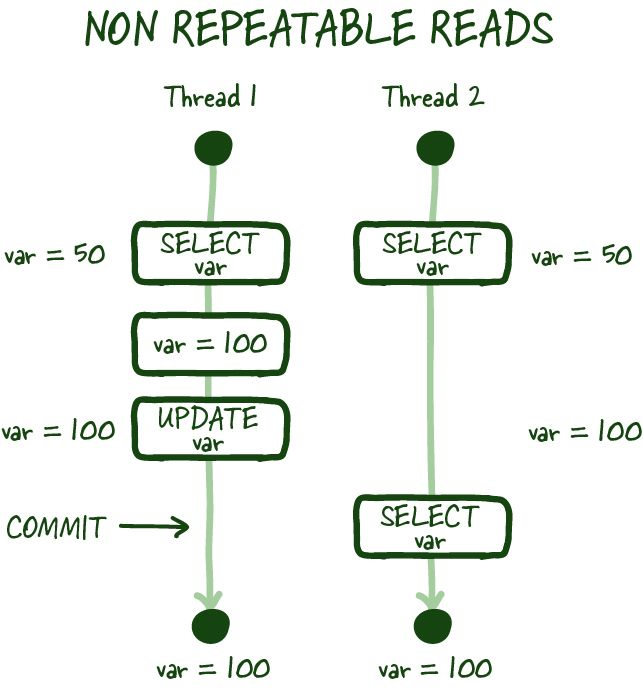

Non-repeatable reads example

As in the image above, non-repeatable reads occur if you cannot get a consistent view of the data between two subsequent reads during your transaction. In specific modes, concurrent database modification is possible, and there can be scenarios where the value you just read can be modified, resulting in a non-repeatable read.

**Dirty reads**

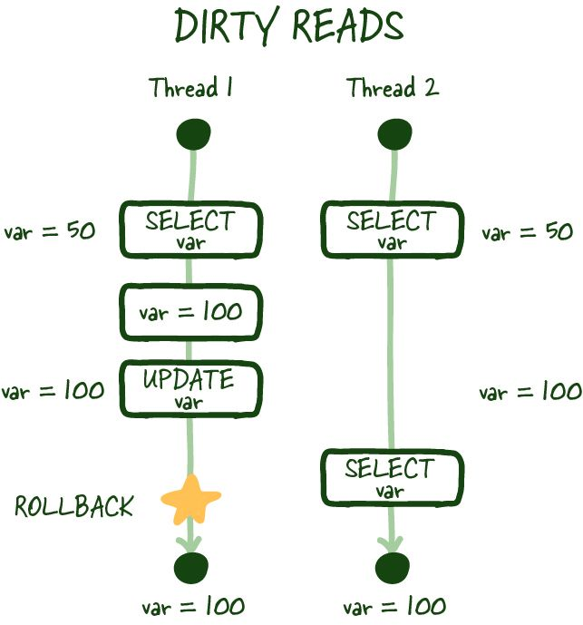

Dirty read example

Similarly, a dirty read occurs when you perform a read, and another transaction updates the same row but doesn't commit the work, you perform another read, and you can access the uncommitted (dirty) value, which isn't a durable state change and is inconsistent with the state of the database.

**Phantom reads**

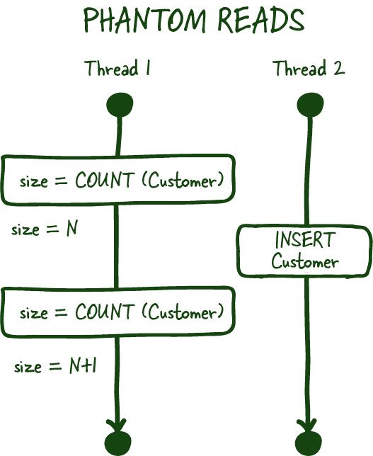

Phantom read example

Phantom reads are another committed read phenomena, which occurs when you are most commonly dealing with aggregates. For example, you ask for the number of customers in a specific transaction. Between the two subsequent reads, another customer signs up or deletes their account (committed), which results in you getting two different values if your database doesn't support range locks for these transactions.

#### Range Locks

### Isolation Levels

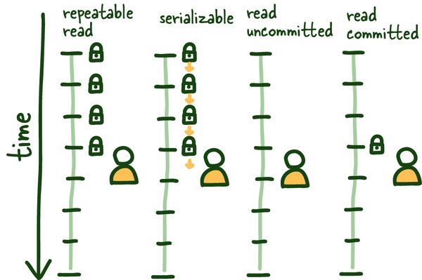

4 Isolation levels for SQL Standard

The SQL standard defines 4 standard isolation levels these can and should be configured globally (insidious things can happen if we can't reliably reason about isolation levels).

### REPEATABLE READ

Let's start with *REPEATABLE READ.* It is relatively straightforward to understand and sets the table for the remainder of the isolation levels. This isolation level ensures consistent reads within the transaction established by the first read. This view is maintained in several ways; some affect the overall system's performance, others don't, but outside this post's scope.

See the graphic above; once we do our first read, that view is locked for the duration of the transaction, so anything that happens outside the context of this transaction is of no consequence, committed or otherwise.

This isolation level protects us from several known isolation issues, mainly non-repeatable and dirty reads. It does have the minor data inconsistency while its locked to specific view of the database; keeping transactions short-lived as possible here is beneficial.

### SERIALIZABLE

This operating mode can be the most restrictive and consistent since it allows only one query to be run at a time.

All types of reading phenomena are no longer possible since the database runs the queries one by one, transitioning from one stable state to the next. There is more nuance here, but more or less accurate.

*It is essential to note in this mode to have some retry mechanism since queries can fail due to concurrency issues.*

Newer distributed databases take advantage of this isolation level for consistency guarantees. [CockroachDB](https://www.cockroachlabs.com/) is an example of such a database. Worth a look.

### READ COMMITTED

This isolation mode is different from *REPEATABLE READ* in that each read creates its own consistent (committed) snapshot of time. As a result, this isolation mode is susceptible to *phantom reads* if we execute multiple reads within the same transaction.

### READ UNCOMMITTED

Alternatively, *the READ UNCOMMITTED* isolation level doesn't maintain any transaction locking and can see uncommitted data as it happens, leading to dirty reads. The stuff of nightmares... in some systems.

There you have it, The **Things You Should Know** About Databases

If you enjoyed this, we have a ton more content like this on the way! We strive to make all these detailed and nuanced topics understandable and highlight where you would run into them!   
  
Signing up or sharing it with someone who you think could benefit from this write up would be really appreciated.

Feedback is appreciate and can be directed at @[myusuf3](https://twitter.com/myusuf3) on Twitter!

Processing your application
Please check your inbox and click the link to confirm your subscription.
There was an error sending the email

## References

[Relational database - Wikipedia

Wikimedia Foundation, Inc.Contributors to Wikimedia projects

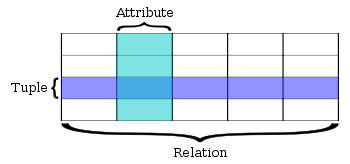](https://en.wikipedia.org/wiki/Relational_database)

[B+Tree index structures in InnoDB

[This post refers to innodb\_ruby version 0.8.8 as of February 3, 2014.] In On learning InnoDB: A journey to the core, I introduced the innodb\_diagrams project to document the InnoDB internals, whic…

Jeremy ColeJeremy Cole

](https://blog.jcole.us/2013/01/10/btree-index-structures-in-innodb/)

[ACID - Wikipedia

Wikimedia Foundation, Inc.Contributors to Wikimedia projects

](https://en.wikipedia.org/wiki/ACID)

[Serializable Transactions | CockroachDB Docs

Follow a demonstration of the importance of SERIALIZABLE isolation for data correctness

CockroachDB Docs

](https://www.cockroachlabs.com/docs/stable/demo-serializable.html)

[Who has to add the right indexes to an SQL database?

Database indexes must fit to the queries. Therefore, it has to be done by those writing the queries.


](https://use-the-index-luke.com/sql/preface)

[Isolation (database systems) - Wikipedia

Wikimedia Foundation, Inc.Contributors to Wikimedia projects

](https://en.wikipedia.org/wiki/Isolation_(database_systems))

[Snapshot Isolation in SQL Server

In this article, we will explore the use of snapshot isolation using row versioning as an alternative to the classic ANSI SQL transaction levels

SQL Shack - articles about database auditing, server performance, data recovery, and moreGerald Britton

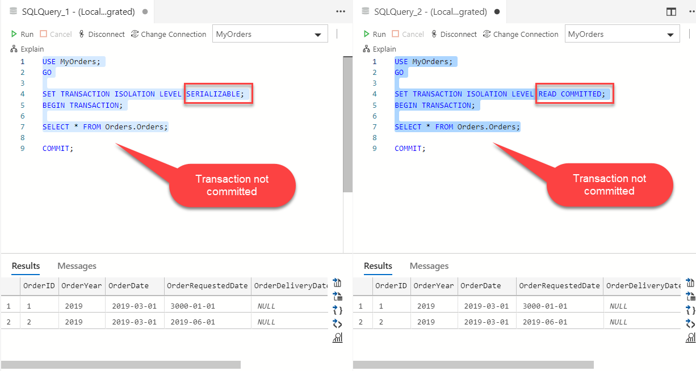](https://www.sqlshack.com/snapshot-isolation-in-sql-server/)

Share this post

The link has been copied!
