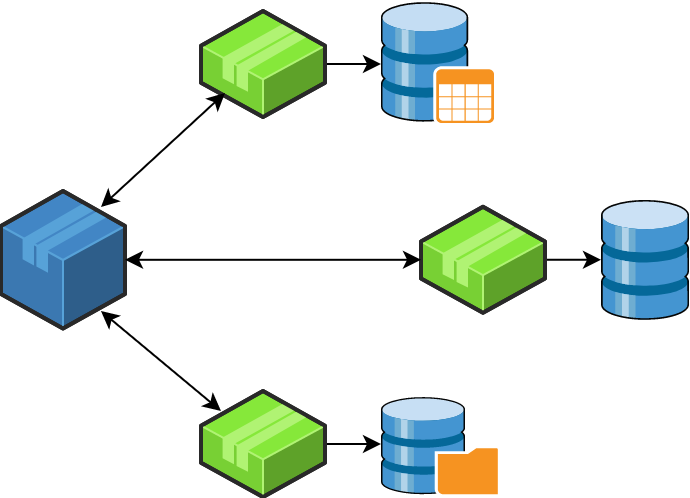
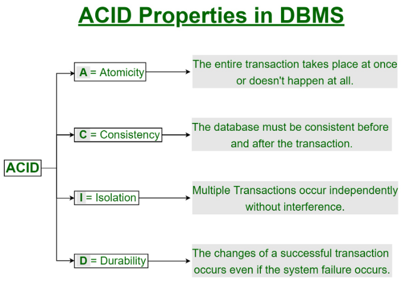
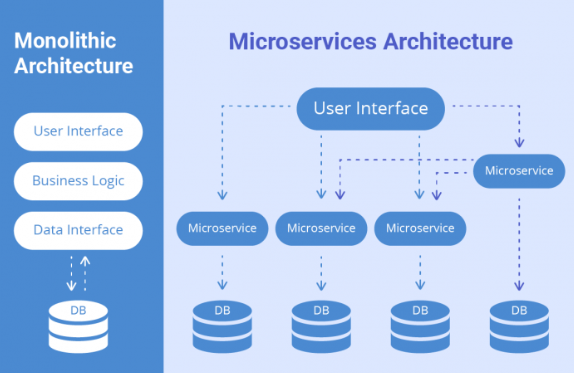
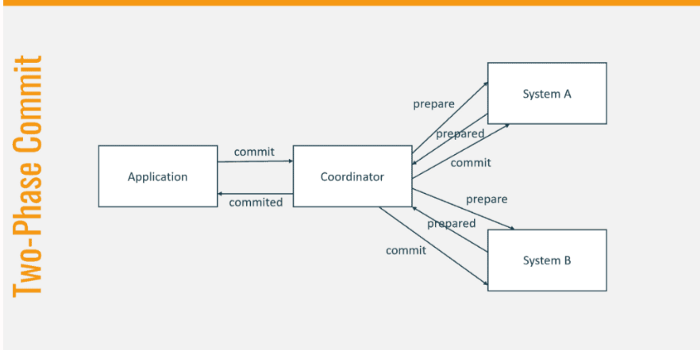
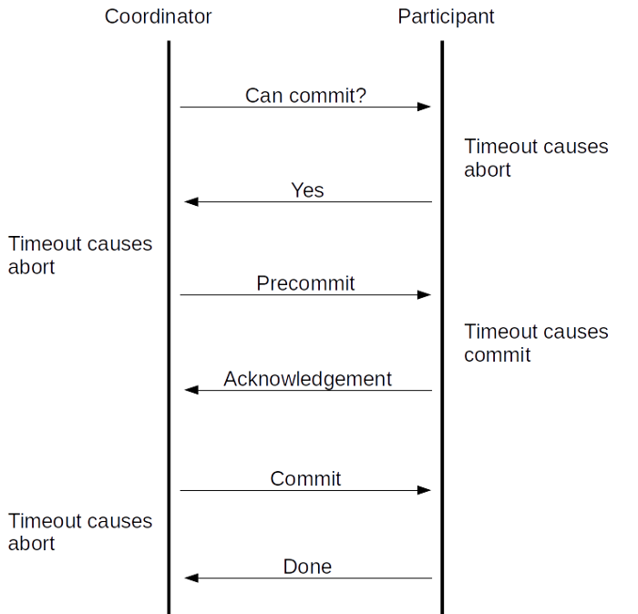

# Distributed Transaction Management in Microservices — Part 1



Image Source: [https://miro.medium.com/max/690/1\*ZbA4HrE9XKF4FziPs2MNfQ.png](https://miro.medium.com/max/690/1*ZbA4HrE9XKF4FziPs2MNfQ.png)

Hello everyone. In this article, we are going to see about distributed transaction management across Microservices.

## What is a transaction?

A transaction is nothing but a series of actions that must execute successfully. Even if one of the operations fails, the entire steps must be rolled back in order to leave the application in the previous stable state. A transaction has the following ACID properties



Image Source: <https://media.geeksforgeeks.org/wp-content/cdn-uploads/20191121102921/ACID-Properties.jpg>

## Transactions in Monolith and Microservices

In a traditional Monolithic application, there will be a single large application connecting to a single large database and such applications stick to ACID properties. The transaction boundary starts inside the service layer and can be committed or rolled back based on the outcome of all the steps in that transaction. In the case of Microservices, each microservice runs a specific business area and maintains the **Single Repository Principle(SRP)**, which means each microservice maintains its own database and another service should not the other service’s database directly. So the transactions are distributed across the microservices.

**Example: Let us consider an online order processing for the Monolith and Microservices Architecture for the below scenario**

1. The user adds a product to a cart on an e-commerce site and buys it
2. An order is created for the user with an order number generated
3. The item stock is reduced by 1 as the user has bought the product
4. An invoice is generated for the item
5. Payment has been completed successfully
6. The invoice is sent to the user via email



Image Source: <https://www.sam-solutions.com/blog/wp-content/uploads/2017/10/Monolithic-vs-Microservices-architecture-image-704x540.png>

In the Monolith application, all the steps take place inside the single application and single database. All the steps are executed from a service class; if any of the steps fail, the whole transaction can be rolled back.

In the case of a Microservice application, each of the above steps takes place individually inside the specific microservice and its specific database

- Order will be processed in the Order service
- Stocks are checked and calculated inside the Account Service
- Invoice is processed by Invoice Service
- Payment is processed in the Payment service
- Email is triggered by the Notification service

Since each of the steps runs inside a different microservice and its database, maintaining the ACID principle for the entire transaction is extremely difficult and complicated. **It is better to avoid distributed transaction management completely if possible.**

If not, then there are some standard patterns for the distributed transaction management

## Patterns for Distributed Transaction Management

1. Synchronous Patterns

- Two-Phase Commit
- Three Phase Commit

2. Asynchronous Pattern

- Orchestration-Based Saga Pattern
- Choreography-Based Saga Pattern

# **Synchronous Patterns**

**Two-Phase Commit (2 PC)**

2 Phase Commit is a standard protocol to handle distributed transactions using 2 stages namely Prepare stage and the Commit stage. There is a transaction coordinator component that coordinates the entire transaction by talking to all the services



Image Source: <https://thorben-janssen.com/wp-content/uploads/2020/02/Distributed-Transactions-2phase-commit-1024x576.png>

**Success Scenario**

1. The transaction coordinator instructs each service to prepare for **commit** and every service then checks if the commit can be done without any issue
2. After checking, each service sends a **Prepared** response to the coordinator.
3. Once the Coordinator receives all the Prepared responses, it tells all the services to **commit** the data into the database
4. Now the transaction is successful and all the changes get committed across the services

**Rollback Scenario**

1. The transaction coordinator instructs each service to prepare for **commit** and every service then checks it the commit can be done without any issue
2. After checking, imagine that one service responds with **failed** status
3. The Coordinator will send an **abort** command to abort the transaction to rollback any changes performed in the transaction to maintain the ACID principles

**Drawbacks of 2PC**

1. It is very slow as the coordinator waits for all the responses and the transaction takes a long time to commit
2. The data in every DB is locked until the commit or abort command is issued. These locks will slow down the system and causes a degradation in performance.

## Three Phase Commit (3 PC)

A two-phase commit protocol cannot recover from a failure of both the coordinator and a cohort member during the **Commit phase**.

The 3 PC is an extension of 2 Phase Commit and the commit phase is divided into 2 phases. 3 Phase commit is designed for fault-tolerance when the coordinator or any other services go down by using the ***prepare-to-commit*** *phase.*



Image Source: <https://xenovation.com/images/articles/development/java/2and3PhaseCommit/3-phase-commit-protocol.png>

1. If the transaction coordinator fails before sending the **prepared-to-commit** command to the microservices, then the other services will imagine that the operation was aborted
2. The coordinator will not send a **doCommit** message to all the services until they have sent ACK for prepared-to-commit
3. This will make sure that none of the services are blocked and waiting for other services

**Failure Scenario**

1. The pre-commit stages help the system to be recovered when the coordinator or a service or both fails during commit phase
2. When the new transaction coordinator takes over after the coordinator has failed during the commit phase, it queries all the services to see which state they are in
3. If the services are in commit phase, then the new coordinator will know that the previous coordinator has issued the commit command before crashing
4. If any of the services did not receive **prepare-to-commit** command, then the new coordinator will know that the previous coordinator has crashed even before it completed prepare-to-commit phase
5. Hence it can safely abort the transaction

## **Drawbacks of Three-Phase Commit**

- The 3 PC has to be implemented carefully to make sure that the network partitioning does not cause inconsistencies in the transaction
- 3 PC has more overhead as it involves one more step

# The need for asynchronous pattern

While the Two-Phase commit and Three Phase commit work for distributed transactions across microservices, they are not efficient as it is blocking and synchronous in nature.

Generally, a database system completes a transaction within 50 ms. But microservices have a long delay as the transaction hops through different services through RPS and hence the locking for a long time becomes a bottle beck to the system. The deadlock could also arise between the transactions in the synchronous pattern.

All these drawbacks paved the way for the asynchronous way using the Saga pattern which relies on eventual consistency and does not maintain atomicity

In this article, we saw what is a transaction and how it works in Monolith and Microservices. We also saw what are Two-Phase commit and Three Phase commits and their drawbacks.

In the next article, we will be exploring the Saga-based patterns which are asynchronous and reactive

[## Distributed Transaction Management in Microservices — Part 2 — Saga Pattern

### Hello everyone. This article is a continuation of the previous article

dineshchandgr.medium.com](https://dineshchandgr.medium.com/distributed-transaction-management-in-microservices-part-2-saga-pattern-53808a55e641)

Thanks for reading and stay tuned!!!

```
If you like to get more updates from me, please follow me on Medium and subscribe to email alert. If you are considering to buy a medium membership, please buy through my referral link https://dineshchandgr.medium.com/membership
```
