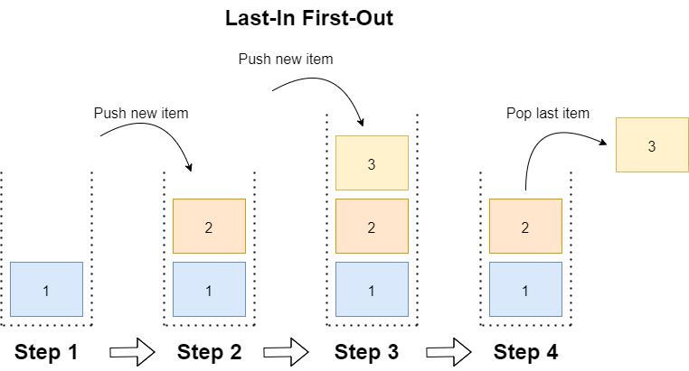

# Stack in C#

Posted by [Code Maze](https://code-maze.com/author/codemazecontributor/ "Posts by Code Maze") | Updated Date Jun 2, 2022 | [0](https://code-maze.com/stack-csharp/#comments)

In this article, we are going to study Stack in C#, a collection of objects implementing the last-in-first-out method.

To download the source code for this article, you can visit our [GitHub repository](https://github.com/CodeMazeBlog/CodeMazeGuides/tree/main/collections-csharp/StackInCSharp).

Let’s start.

## What is Stack in C#?

Stack in C# is one of the many collections available to us in C#**. We use Stack when we want the last added element to be the first one to go.**

Let’s imagine having to stack some dining plates and then having to set them on a table. The dining plate on the top (the last added to the stack) will be removed first, while the one on the bottom will remain on the stack for longer.

A practical implementation in the software would be an undo-redo operation in a common editor, where we can use a stack to store all the performed operations by a user and then use it to retrieve them from the most recently performed action to the oldest one.

In summary, **we use Stack in C# when we need to store data that respect the LIFO (Last-In-First-Out) method.**

LIFO is different from FIFO. If you’re interested in the First-In-First-Out method, check out our [Queue in C#](https://code-maze.com/queue-csharp/) article.

We can create a stack in C# using the `Stack` class. When we add an item to a stack we say that we are **pushing** the item, while when we remove it we are **popping** the item.

**When we initialize a Stack, it has a capacity that indicates the number of elements it can store**. We will see that it is increased as we add more items to Stack. The `Count` property, on the other hand, tells us how many elements are effectively contained in Stack.

[](https://code-maze.com/wp-content/uploads/2022/05/StackWithSteps.drawio.png)

### Generic and Non-Generic Collections

C# includes the generic version `Stack<T>` as well, which is more commonly used than the non-generic one. **If we opt-in for the non-generic `Stack`, we can add elements of** **different types** (a string, an integer, etc for example).

Since we don’t know the type of all the items during the compile time, **the compiler needs to perform the cast between** `object` **and the actual type of every item**, and this affects the performance.

The generic version, instead, permits us to specify the same type `<T>` for all the items we are going to add to the collection. `Stack<T>` collection is in the `System.Collections.Generic` namespace.

## Stack in C# Constructors

Both the non-generic and the generic versions of `Stack` have three constructors.

Let’s start with the non-generic case:

Stack firstNonGenericStack = newStack();

It initializes an empty stack, having the default initial capacity. For the non-generic `Stack` class, the default initial capacity is ten. Invoking `firstNonGenericStack.Count` we will obtain zero since it doesn’t contain any element yet.

The second constructor is `Stack(ICollection)`:

List<string> letters = newList<string>(){"a", "b", "c"};

Stack secondNonGenericStack = newStack(letters);

```
List<string> letters = new List<string>(){ "a", "b", "c" };
Stack secondNonGenericStack = new Stack(letters);
```

This constructor creates a `Stack` starting from a collection derived from `ICollection` the interface. In this case, we created a stack with the elements contained in the list `letters`. The number of copied elements (three in this case) is equal to the initial capacity of `Stack`, and it is also equal to the value obtained by calling `lettersStack.Count`.

The last constructor is `Stack(Int32)`, where the integer represents the initial capacity of `Stack`:

Stack thirdNonGenericStack = newStack(5);

Here, we are creating a stack specifying the initial capacity of five.

Let’s see what happens with the generic counterparts of the constructors:

Stack<int> firstGenericStack = newStack<int>();

We created a Stack that can store only `int` items, having a default initial capacity. For the generic stack, the default initial capacity is zero.

The second constructor takes an `IEnumerable<T>` as input, and it creates a stack starting from this collection:

List<string> letters = newList<string>(){"a", "b", "c"};

Stack<string> secondGenericStack = newStack<string>(letters);

```
List<string> letters = new List<string>(){ "a", "b", "c" }; 
Stack<string> secondGenericStack = new Stack<string>(letters);
```

In this case, we created `secondGenericStack` containing the elements from the `letters` list.

Finally, the third constructor for the generic case is `Stack<T>(Int32)`:

Stack<int> thirdGenericStack = newStack<int>(5);

It is a stack that contains only integer values with a capacity of five.

## Stack in C# Properties and Methods

We can now explore some of the most commonly used properties and methods of Stack in C#.

### Count

The `Count` property returns the number of elements stored in Stack:

List<string> letters = newList<string>(){"a", "b", "c"};

Stack lettersStack = newStack(letters);

Console.WriteLine($"lettersStack contains {lettersStack.Count} itemsn"); //lettersStack contains 3 items

```
List<string> letters = new List<string>() { "a", "b", "c" };
Stack lettersStack = new Stack(letters);

Console.WriteLine($"lettersStack contains {lettersStack.Count} itemsn"); //lettersStack contains 3 items
```

### Push()

We can add an item to `Stack` by using the `Push` method. **For a non-generic Stack, like** `lettersStack`**, a push operation is allowed for any item of a type derived by** `object?`.

So let’s define a class `Page` we’re going to work with:

publicclassPage

{

publicPage(string title, DateTime lastUpdateTime)

{

Title = title;

LastUpdateTime = lastUpdateTime;

}

publicstring Title {get; set; }

publicDateTime LastUpdateTime {get; set; }

}

```
public class Page
{
    public Page(string title, DateTime lastUpdateTime)
    {
        Title = title;
        LastUpdateTime = lastUpdateTime;
    }

    public string Title { get; set; }

    public DateTime LastUpdateTime { get; set; }
}
```

We can add a `Page` to the non-generic `lettersStack`:

Page page = newPage("New page", DateTime.now);

Console.WriteLine($"lettersStack contains {lettersStack.Count} items"); //lettersStack contains 3 items

lettersStack.Push(page);

lettersStack.Push(1);

lettersStack.Push("hello");

Console.WriteLine($"lettersStack contains {lettersStack.Count} items");//lettersStack contains 6 items

```
Page page = new Page("New page", DateTime.now);

Console.WriteLine($"lettersStack contains {lettersStack.Count} items"); //lettersStack contains 3 items
lettersStack.Push(page);
lettersStack.Push(1);
lettersStack.Push("hello");

Console.WriteLine($"lettersStack contains {lettersStack.Count} items");//lettersStack contains 6 items
```

The number of items contained in `lettersStack` increases as we push new elements.

Since in the generic case `Stack<T>` handles **the elements of the same type**, we can define a `pageStack` stack which can handle `Page` items and then push two pages into it:

Stack<Page> pageStack = newStack<Page>();

var page1 = newPage("The first visited page", DateTime.Now);

var page2 = newPage("The second visited page", DateTime.Now);

pageStack.Push(page1);

pageStack.Push(page2);

```
Stack<Page> pageStack = new Stack<Page>();

var page1 = new Page("The first visited page", DateTime.Now);
var page2 = new Page("The second visited page", DateTime.Now);

pageStack.Push(page1);
pageStack.Push(page2);
```

For both the generic and non-generic cases, when the number of elements stored in `Stack` reaches its capacity, then the capacity of `Stack` is doubled. This is the default behavior of `Stack`.

### Peek()

**The** `Peek()` **method returns the last added element, but it doesn’t modify the stack**:

object? lastAddedItem = lettersStack.Peek();

var lastVisitedPage = pageStack.Peek();

Console.WriteLine($"the first retrieved element in lettersStack is {lastAddedItem}");

Console.WriteLine($"the first retrieved element in pageStack is {lastVisitedPage.Title}");

Console.WriteLine($"lettersStack contains {lettersStack.Count} items");

Console.WriteLine($"pageStack contains {pageStack.Count} itemsn");

```
object? lastAddedItem = lettersStack.Peek(); 
var lastVisitedPage = pageStack.Peek();

Console.WriteLine($"the first retrieved element in lettersStack is {lastAddedItem}");
Console.WriteLine($"the first retrieved element in pageStack is {lastVisitedPage.Title}");
Console.WriteLine($"lettersStack contains {lettersStack.Count} items");
Console.WriteLine($"pageStack contains {pageStack.Count} itemsn");
```

In both cases, the `Count` property doesn’t change:

the first retrieved element in lettersStack is hello

the first retrieved element in pageStack is The second visited page

lettersStack contains 6 items

pageStack contains 2 items

```
the first retrieved element in lettersStack is hello
the first retrieved element in pageStack is The second visited page
lettersStack contains 6 items
pageStack contains 2 items
```

If we call `Peek()` method on an empty Stack, it throws a `System.InvalidOperationException: Stack empty` exception. For the **generic Stack** (`pageStack`), we can use the `TryPeek(out T result)` method, which checks if `Stack` is empty and if there are any items to peek at.

If there’s an object in `Stack`, it returns true and the object as a out value, false otherwise:

var result = pageStack.TryPeek(out topPage);

Console.WriteLine($"TryPeek returns: {result}");

Console.WriteLine($"The title of the topPage in pageStack is: {topPage?.Title}");

Console.WriteLine($"pageStack contains {pageStack.Count} itemsn");

```
var result = pageStack.TryPeek(out topPage);

Console.WriteLine($"TryPeek returns: {result}");
Console.WriteLine($"The title of the topPage in pageStack is: {topPage?.Title}");
Console.WriteLine($"pageStack contains {pageStack.Count} itemsn");
```

The output parameter is the page on the top of `Stack`:

TryPeek returns: True

The title of the topPage in pageStack is: The second visited page

pageStack contains 2 items

```
TryPeek returns: True
The title of the topPage in pageStack is: The second visited page
pageStack contains 2 items
```

### Pop()

The `Pop()` method **removes and returns the last element added** to `Stack`, and it is equivalent for both the non-generic and generic cases:

object? lastAddedItem = lettersStack.Pop();

var lastVisitedPage = pageStack.Pop();

Console.WriteLine($"The first retrieved element in lettersStack is {lastAddedItem}");

Console.WriteLine($"The first retrieved element in pageStack is {lastVisitedPage.Title}");

Console.WriteLine($"lettersStack contains {lettersStack.Count} items");

Console.WriteLine($"pageStack contains {pageStack.Count} itemsn");

```
object? lastAddedItem = lettersStack.Pop();
var lastVisitedPage = pageStack.Pop();

Console.WriteLine($"The first retrieved element in lettersStack is {lastAddedItem}");
Console.WriteLine($"The first retrieved element in pageStack is {lastVisitedPage.Title}");
Console.WriteLine($"lettersStack contains {lettersStack.Count} items");
Console.WriteLine($"pageStack contains {pageStack.Count} itemsn");
```

In this case, `lastAddedItem` is `hello` and `lastVisitedPage` is `"The second visited page"`, since they are the last added elements to `lettersStack` and `pageStack` respectively.

Both `lettersStack` and `pageStack` won’t contain anymore these elements, since we removed them using `Pop()`:

The first retrieved element in lettersStack is hello

The first retrieved element in pageStack is The second visited page

lettersStack contains 5 items

pageStack contains 1 items

```
The first retrieved element in lettersStack is hello
The first retrieved element in pageStack is The second visited page
lettersStack contains 5 items
pageStack contains 1 items
```

If we call `Pop()` method to an empty Stack, it will throw a `System.InvalidOperationException: Stack empty` exception. To avoid this issue, **for the generic stack** (`pageStack`) there is the `TryPop(out T result)` method, returning true if there is an object on the top of `Stack`, false otherwise:

bool result = pageStack.TryPop(outvar topPage);

Console.WriteLine($"TryPop returns: {result}");

Console.WriteLine($"the topPage in pageStack is: {topPage?.Title}");

Console.WriteLine($"pageStack contains {pageStack.Count} itemsn");

```
bool result = pageStack.TryPop(out var topPage);

Console.WriteLine($"TryPop returns: {result}");
Console.WriteLine($"the topPage in pageStack is: {topPage?.Title}");
Console.WriteLine($"pageStack contains {pageStack.Count} itemsn");
```

This will print out:

TryPop returns: True

the title of the topPage in pageStack is: The first visited page

pageStack contains 1 items

```
TryPop returns:  True
the title of the topPage in pageStack is: The first visited page
pageStack contains 1 items
```

### Clear()

The `Clear()` method removes all the elements from a stack. After this operation, `Stack` will be empty:

lettersStack.Clear();

Console.WriteLine($"lettersStack contains {lettersStack.Count} itemsn");//lettersStack contains 0 items

```
lettersStack.Clear();

Console.WriteLine($"lettersStack contains {lettersStack.Count} itemsn");//lettersStack contains 0 items
```

As we expect, `lettersStack` contains 0 items:

## **Stack** **Thread Safety**

Let’s see how Stack deals with thread safety in C#.

### Non-Generic Case

Sometimes, we need to access the same stack from multiple threads and this can lead to unexpected behaviors. T**o avoid these problems, we can use the** `Synchronized` **wrapper, used to return a thread-safe wrapper for** `Stack`**:**

Stack synchronizedStack = Stack.Synchronized(lettersStack);

`Stack.Synchronized` takes as input the non-generic `Stack` and returns a wrapper around it. Now, if we call the `IsSynchronized` property (that checks if the access to `Stack` is thread-safe),  for both:

Console.WriteLine($"lettersStack is thread-safe: {lettersStack.IsSynchronized}"); //False

Console.WriteLine($"synchronizedStack is thread-safe: {synchronizedStack.IsSynchronized}"); //True

```
Console.WriteLine($"lettersStack is thread-safe: {lettersStack.IsSynchronized}"); //False
Console.WriteLine($"synchronizedStack is thread-safe: {synchronizedStack.IsSynchronized}"); //True
```

### Generic Case

For the generic stack, we should use `ConcurrentStack<T>`:

ConcurrentStack<Page> threadSafePageStack = newConcurrentStack<Page>();

As with the non-generic case, the `ConcurrentStack<T>` class is a wrapper around `Stack<T>`, providing thread safety, and using locking to synchronize different threads internally.

## Conclusion

In this article, we’ve learned about both the non-generic and the generic versions of Stack in C#. We’ve shown how to add and remove elements to stacks, and how to implement a thread-safe stack if we need to.
