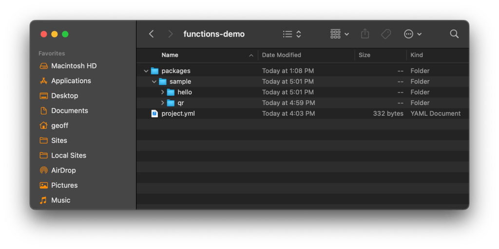

# Let’s Make a QR Code Generator With a Serverless Function!

QR codes are funny, right? We love them, then hate them, then love them again. Anyways, they’ve lately been popping up again and it got me thinking about how they’re made. There are like a gazillion QR code generators out there, but say it’s something you need to do on your own website. [This package](https://github.com/soldair/node-qrcode) can do that. But it’s also weighs in at a hefty 180 KB for everything it needs to generate stuff. You wouldn’t want to serve all that along with the rest of your scripts.

Now, I’m relatively new to the concept of cloud functions, but I hear that’s the bee’s knees for something just like this. That way, the function lives somewhere on a server that can be called when it’s needed. Sorta like a little API to run the function.

Some hosts offer some sort of cloud function feature. [DigitalOcean happens to be one of them!](https://www.digitalocean.com/products/functions) And, like Droplets, functions are pretty easy to deploy.

### Create a functions folder locally

DigitalOcean has a CLI that with a command that’ll scaffold things for us, so `cd` wherever you want to set things up and run:

```
doctl serverless init --language js qr-generator
```

Notice the language is explicitly declared. DigitalOcean functions also support PHP and Python.

We get a nice clean project called `qr-generator` with a `/packages` folder that holds all the project’s functions. There’s a sample function in there, but we can overlook it for now and create a `qr` folder right next to it:



That folder is where both the `qrcode` package and our `qr.js` function are going to live. So, let’s `cd` into `packages/sample/qr` and install the package:

```
npm install --save qrcode
```

Now we can write the function in a new `qr.js` file:

```
const qrcode = require('qrcode')

exports.main = (args) => {
  return qrcode.toDataURL(args.text).then(res => ({
    headers:  { 'content-type': 'text/html; charset=UTF-8' },
    body: args.img == undefined ? res : ``
  }))
}

if (process.env.TEST) exports.main({text:"hello"}).then(console.log)
```

All that’s doing is requiring the the `qrcode` package and exporting a function that basically generates an `` tag with the a base64 PNG for the source. We can even test it out in the terminal:

```
doctl serverless functions invoke sample/qr -p "text:css-tricks.com"
```

### Check the config file

There is one extra step we need here. When the project was scaffolded, we got this little `project.yml` file and it configures the function with some information about it. This is what’s in there by default:

```
targetNamespace: ''
parameters: {}
packages:
  - name: sample
    environment: {}
    parameters: {}
    annotations: {}
    actions:
      - name: hello
        binary: false
        main: ''
        runtime: 'nodejs:default'
        web: true
        parameters: {}
        environment: {}
        annotations: {}
        limits: {}
```

See those highlighted lines? The `packages: name` property is where in the `packages` folder the function lives, which is a folder called `sample` in this case. The `actions/ name` property is the name of the function itself, which is the name of the file. It’s `hello` by default when we spin up the project, but we named ours `qr.js`, so we oughta change that line from `hello` to `qr` before moving on.

### Deploy the function

We can do it straight from the command line! First, we connect to the DigitalOcean sandbox environment so we have a live URL for testing:

```
## You will need an DO API key handy
doctl sandbox connect
```

Now we can deploy the function:

```
doctl sandbox deploy qr-generator
```

Once deployed, we can access the function at a URL. What’s the URL? There’s a command for that:

```
doctl sbx fn get sample/qr --url
https://faas-nyc1-2ef2e6cc.doserverless.co/api/v1/web/fn-10a937cb-1f12-427b-aadd-f43d0b08d64a/sample/qr
```

Heck yeah! No more need to ship that entire package with the rest of the scripts! We can hit that URL and generate the QR code from there.

### Demo

We `fetch` the API and that’s really all there is to it!
