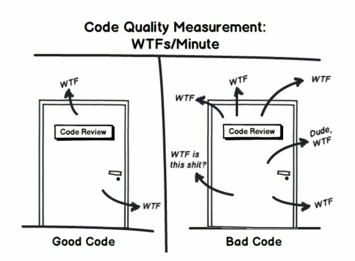
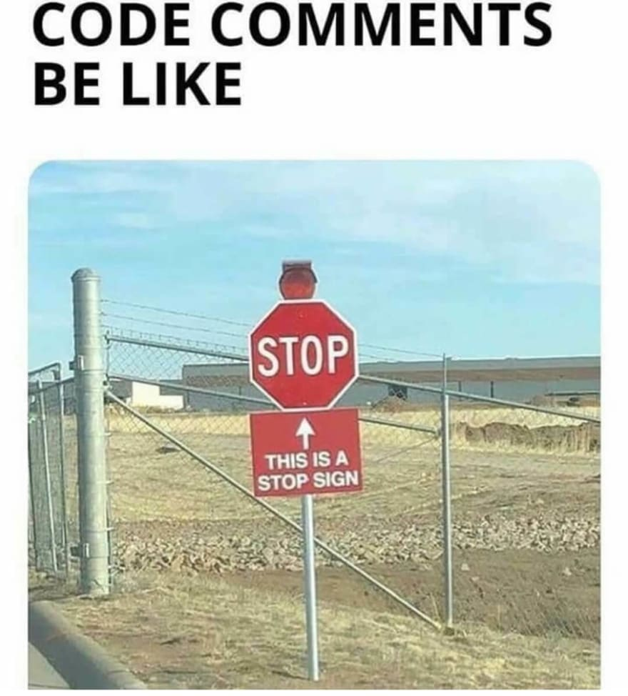
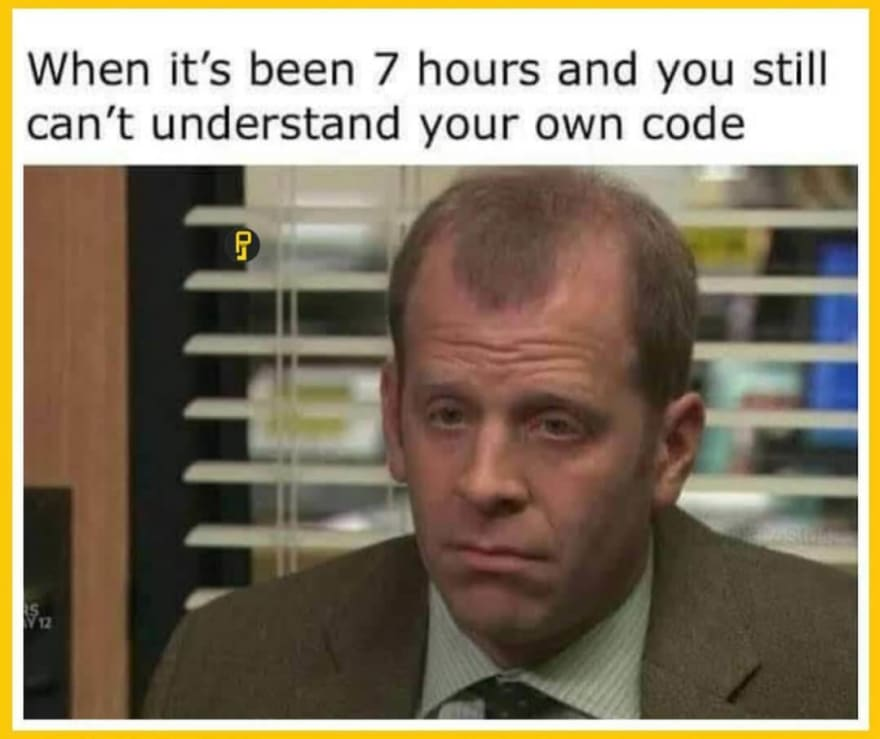
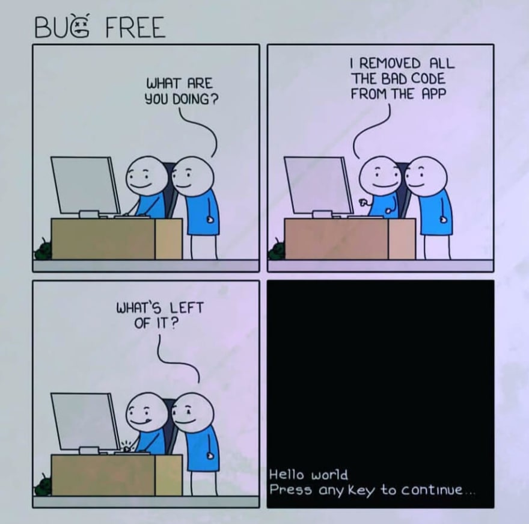

# 5 things I wish I knew before starting serious development (a journey into code perfection)

Writing code that does the job is easy. Writing a beautiful code that is worthy of being called clean could be more troublesome. There are many opinions about what a clean code is. Some say it should be elegant, nice and pleasant. Others say it should be easily readable. Whatever definition you find, you can notice that the idea is for the author to care about the code that's being created.

According to Uncle Bob, the ratio between reading and writing code is equal to 10:1. Because of this, it's important to make sure the code meets the principles mentioned in this article (and many, many more that are not mentioned). Writing quality code is harder and takes more time, but trust me, it's a good investment.

There are several rules that you can follow while writing code that will improve its quality and take you a step closer to clean code mastery.

[](https://res.cloudinary.com/practicaldev/image/fetch/s--EBI0qvQG--/c_limit%2Cf_auto%2Cfl_progressive%2Cq_auto%2Cw_880/https://dev-to-uploads.s3.amazonaws.com/uploads/articles/fnmbt5nwnarqmrqgzb6f.jpg)

## Use names that represent your intentions

Names are a fundamental part of writing code. There are names of the functions, parameters, classes, files, and folders. Using the right name can be crucial. Look at it as a time investment - it takes some, but it saves more.

The name of the function or class should be an answer to every potential question - it should indicate why it exists, what it does and how it's meant to be used. If the name requires a comment it may be an indication it does not represent the intention.

You can notice it's not easy to understand what the meaning of the field (even with the comment as the description):

```
m: number; // solving time
```

The name *m* does not explain anything - it doesn't indicate what the actual purpose of the field, and even the comment isn't precise enough. The below example of the name is much better as it answers every potential question about it and does not require any additional explanation:

```
solvingTimeInMinutes: number;
```

The same goes for functions. What's the purpose of the function below?

```
function calculate(value: number) {
  return (5 / 9) * (value - 32);
}
```

It's quite difficult to say, even though it's just a one-liner function. That's because the name and the parameter are not self-explanatory. Here's the same function, but represented with a clear intention:

```
function fahrenheitToCelsius(fahrenheit: number) {
  return (5 / 9) * (fahrenheit - 32);
}
```

To learn more about good naming practices search for:

> programming naming conventions

## Avoid comments (until you really need them)

A good comment can be a lifesaver. An unclear one can be deceptive and cause confusion. Unnecessary comments should be avoided, as the clean code should be self-explanatory and should tell the story on its own.

[](https://res.cloudinary.com/practicaldev/image/fetch/s--tnr0NMG2--/c_limit%2Cf_auto%2Cfl_progressive%2Cq_auto%2Cw_880/https://dev-to-uploads.s3.amazonaws.com/uploads/articles/v18zls1xp0i4wc9du8xg.jpg)

Here's an exaple of a very bad comment:

```
// Always returns true
function returnFalse() {
  return false;
}
```

The function above does not do what the comment says. Just imagine using a wrongly commented function in some real-world scenario. The consequences could be bad, right?

Same goes for the below situation:

```
// Checks if player takes part in rating
if (player.contexts.includes(PlayerContext.RankPlayer) && player.isActive())
```

It's much better to restructure the code and use something like this:

```
if (player.takesPartInRating())
```

The instruction above is much cleaner than its previous version - it clearly explains its purpose without the need for a comment.

But there's more than this - having code that regurarly uses comments as a sort of documentation requires more resources to keep it updated. You not only have to work on the code, but you also have to work on the comments to make sure they represent the intention behind the code. You also have to remember to keep them updated!

Another example of poor practice is keeping the commented-out code in the repository. There's nothing worse than the code like this:

```
const player = this.service.getPlayer();
player.initializeSession();
// player.setSessionStartTime();
// player.setNewlyCreatedSession();
```

The other developers working on that code will think the commented-out part is an important one and it should be kept for some reason. This leads to keeping some old junk code in the codebase, which should be avoided. Instead of commenting on the code, it should be removed.

In most cases seeing a comment means the code could be better, but there are some exceptions. One of them is a TODO comment.

```
// @TODO: integrate with amazing-service once it's ready
function doSomethingAmazing(): void {
  (...)
}
```

TODO comments indicate tasks that should be done, but are impossible to do right now. It can be a reminder to remove old functions or an indication that some problem should be solved. Most of the IDEs have features that allow targeting TODO comments quickly - they should be regularly targeted and solved.

Another example of a valuable comment is the one that describes the decision behind the code. Sometimes we are forced to use some frameworks or browser-specific stuff - in that case, a comment can be a lifesaver and reduce the time needed to understand it.

```
// Fix for scroll position computations
// See https://github.com/swimlane/ngx-datatable/issues/669 for details
setTimeout(() => 
  this.doSomething();
}, 200);
```

It's important to get rid of any noise in the code, but also take advantage of the knowledge that some comments are valuable and can be helpful.

To learn more about good comments practices and how to write code without the need for comments search for:

> programming comments best practices  
> programming self-documenting code

## Keep your code formatted

You only get one chance to make a first impression. That's why you should really focus on the code formatting as it's the first thing everyone reading the code sees. It's an aspect that instantly makes a statement about code quality and its consistency. The code should always be perfectly formatted and it's every line polished.

It's important to specify the rules of formatting code in the project to keep it consistent. Each project is different so the rules may also be different, but once we decide on them, they should be respected. Many tools can help to automatically format the code according to the rules.

What do you think about the below code?

```
  function  doSomethingAmazing ()  : void
    {
const data = this.service.loadData();

  data.executeImportantLogic() ;

    if(data.somethingHappening)
{

data.executeMoreImportantLogic();
 }

this.service.saveData(data);

 }
```

The function above would compile without any problem, but is it even readable? It's formatted very poorly and it becomes impossible to understand. As you can see the indent level is not respected (or even specified), there are many unnecessary blank spaces and blank lines that make it impossible to effectively read it.

We can format the function above like this:

```
function doSomethingAmazing(): void {
  const data = this.service.loadData();
  data.executeImportantLogic();

  if (data.somethingHappening) {
    data.executeMoreImportantLogic();
  }

  this.service.saveData(data);
}
```

It's much better this way, right?

It's important to stick to the guidelines of the language we use while formatting the code. Each language or framework comes with its own formatting standards that should be known and respected. Respecting them is crucial as it helps new team members in writing their first code in the project. With every new custom formatting rule, it becomes more difficult for newcomers to quickly adapt to it (and also for older team members).

Creating code that works is not enough. To keep code clean we need to focus on its formatting, which will improve its quality.

To learn more about code formatting search for:

> code formatting best practices  
> ***insert your technology*** coding style guide

## Keep your functions short (and their purpose straight)

One of the main principles of creating functions should be to keep them short and simple. Functions should be easy to understand as they focus on one thing only. Honoring that rule will greatly reduce the time needed to understand it.

It should also operate on one level of abstraction to prevent mixing up less important technical details with crucial logic. The abstraction in this case means a metaphorical layer in which we create the functions. If we had a function that creates a list and increments it, it would operate on two levels of abstraction: first for creating the list, second for incrementing it.

Let's analyse the below function (but don't spend too much time on this):

```
function solveTask(solution: TaskSolution): void {
  const player = this.playerService.getPlayer();

  if (!player.gamingProfile) {
    this.profileService.createNewProfileForPlayer(player);

    this.playerService.startSession();

    if (this.settingsService.notificationsEnabled) {
      this.notificationService.notify('Player profile session started.');
    }
  }

  const solutions = this.trainingService.getTaskSolutions(player);

  if (!solutions.any(sol => sol.id === solution.id)) {
    this.trainingService.reportPlayerSolution(solution, player);

    if (this.settingsService.notificationsEnabled) {
      this.notificationService.notify('Task completed!');
    }

    const achievementReached = this.achievementService.reportSolutionEvent(solution, player);

    if (achievementReached && this.settingsService.notificationsEnabled) {
      this.notificationService.notify('Achievement unlocked!');
    }
  }
}
```

[](https://res.cloudinary.com/practicaldev/image/fetch/s---6SrAYUl--/c_limit%2Cf_auto%2Cfl_progressive%2Cq_auto%2Cw_880/https://dev-to-uploads.s3.amazonaws.com/uploads/articles/t1ybwh07o4fdtpqkor4n.jpg)

As you can see the function above is not too long, but it fails the important principles we've covered before. Firstly, it does more than one thing. Secondly, it does not operate on one abstraction level - it mixes different abstraction levels. Also, there's a code duplication there as the same code exists more than once. This function could be restructured by decomposing as per the below:

```
function solveTask(solution: TaskSolution): void {
  const player = this.playerService.getPlayer();
  this.handleGamingProfileCreation(player);
  this.handleReportingSolvedTask(player, solution);
}
```

Which would then use the functions below:

```
function handleGamingProfileCreation(player: Player): void {
  if (this.hasGamingProfile(player)) {
    return;                                                
  }

  this.createPlayerGamingProfile(player);
}

function handleReportingSolvedTask(player: Player, solution: TaskSolutin): void {
  if (this.alreadySolvedTask(player, solution)) {
    return;
  }

  this.reportSolvedTask(player, solution);
}
```

The functions *handleGamingProfileCreation* and *handleTaskSolving* have been decomposed from the original function.

This way *solveTask* function does one thing only - solves a task. It's operating on its abstraction level and it delegates its original logic into functions that are smaller, more focused, and easier to understand. Note that each function operates on a different abstraction level - one handles gaming profile creation and the other one handles reporting of the solved task.

The decomposing process we've covered may become very handy in restructuring (or creating) complex functions and can lead to a cleaner and better code.

It's worth mentioning that not all of the code should be decomposed into small functions. Some cases could lead to having 10 different functions that are used only in our decomposed function. It's a trap that should be avoided if possible. You should make decisions about decomposition based on the function readability. If you struggle with that, there are some questions worth asking that may be helpful in making the decision:

- Will someone else make use of that function?
- Can the decomposed function be public?
- Will it help in creating unit tests?
- Am I getting rid of complexity or adding it?

To learn more about creating quality functions search for:

> programming functions good practices  
> programming functions abstractions  
> programming refactoring decomposition

## Be a team player

The last (but not least) rule while working on the code quality is to be a team player. Most of the projects are developed by a multi-developer team. That's why it becomes crucial to cooperatively work on the code quality.

[](https://res.cloudinary.com/practicaldev/image/fetch/s--SILPvCQn--/c_limit%2Cf_auto%2Cfl_progressive%2Cq_auto%2Cw_880/https://dev-to-uploads.s3.amazonaws.com/uploads/articles/u1w88funcgb9gba3mqz4.jpg)

Being a team player is also treating the code as *ours*, not *mine* or *theirs*. Each team member is evenly responsible for its quality. There will be many cases in which you will encounter code blocks that were written in the past and require some treatment, e.g. badly named fields or wrongly formatted functions. In those cases the rule of leaving the code in a better shape than we saw it comes to life - it's not forbidden to improve code that someone else wrote earlier as we all work on the same codebase. The code will benefit greatly from respecting this rule, as its quality will always increase.

It's also important to remember, especially while doing code reviews, that we are reviewing someone else's code and not the actual person - this is a crucial part of keeping team spirit and respecting each other. This way of thinking about the code also helps in sharing code with others - as it decreases the fear of being offended by another project member. It also increases the discussions about the code itself, which is a key aspect of constantly increasing code quality.

## Conclusion

A professional developer should always write the best code possible. It isn't easy, it's the process of constantly learning new aspects of improving things, but it's the way to go as it decreases many potential issues and increases overall quality.

**Writing code is a work of art - it should be perfect, but perfect doesn't always mean the same.**
