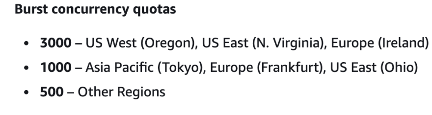

[](https://dev.to/pedramha)

[Pedram Hamidehkhan](https://dev.to/pedramha)

Posted on 10 de jun.

# Solving the Cold Start Challenge for Lambda Function Using Terraform Cloud

[#aws](https://dev.to/t/aws)
[#lambd](https://dev.to/t/lambd)
[#iac](https://dev.to/t/iac)
[#terraform](https://dev.to/t/terraform)

In this post we are going to properly address the cold starts for Lambda Functions. In a later post we will create a private module which facilitates consumption of this module.

Start in an empty directory and create the following files:

```
    "main.tf"
    "variables.tf"
    "output.tf"
    "terraform.auto.tfvars"
```


In the "main.tf" file add the following to it.

```
    provider "aws" {
        region = "eu-central-1"
    }
```


One quick note: please NEVER add your credentials here! Ideally, store credentials as environment variables in Terraform Cloud.   
Now open the terminal and execute the "terraform init" command. This will initialize our directory with the AWS provider.  
To deploy the lambda function, we will need to upload the packaged code to S3. So I am also leveraging the random provider to make sure that the S3 Bucket is unique.

```
    resource "random_pet" "lambda_bucket_name" {
      prefix = "test"
      length = 4
    }

    resource "aws_s3_bucket" "lambda_bucket" {
      bucket = random_pet.lambda_bucket_name.id
      acl    = "private"
        tags = {
        "env" = "test"
      }
    }
```


The two resources above will just create a random bucket.  
The following command will allow me to package the code before uploading it to S3 (I prefer to avoid the local executioner whenever possible):

```
    data "archive_file" "lambdaFunc_lambda_bucket" {
      type = "zip"

      source_dir  = var.src_path
      output_path = var.target_path
    }
```


After that I create the bucket for my deployment artifact:

```
    resource "aws_s3_bucket_object" "lambdaFunc_lambda_bucket" {
      bucket = aws_s3_bucket.lambda_bucket.id

      key    = var.target_path
      source = data.archive_file.lambdaFunc_lambda_bucket.output_path

      etag = filemd5(data.archive_file.lambdaFunc_lambda_bucket.output_path)
        tags = {
        "env" = "test"
      }
    }
```


Now things get more interesting. When you deploy a lambda function, you can specify a few parameters that are relevant when you want to deploy in production. One is of course, the reserved concurrency. AWS limits the number of concurrent executions per account and per region.

[](https://res.cloudinary.com/practicaldev/image/fetch/s--ey60x-38--/c_limit%2Cf_auto%2Cfl_progressive%2Cq_auto%2Cw_880/https://dev-to-uploads.s3.amazonaws.com/uploads/articles/ysa34t25ia444488o2rj.png)

Therefore for having predictability for our concurrency and not having our Lambda function throttled by other lambdas, we set this parameter.

```
    resource "aws_lambda_function" "lambdaFunc" {
      function_name = var.function_name

      s3_bucket = aws_s3_bucket.lambda_bucket.id
      s3_key    = aws_s3_bucket_object.lambdaFunc_lambda_bucket.key

      runtime = var.lambda_runtime
      handler = var.handler

      source_code_hash = data.archive_file.lambdaFunc_lambda_bucket.output_base64sha256

      role                           = aws_iam_role.lambda_exec.arn
      reserved_concurrent_executions = var.concurrent_executions
      tags = {
        "env" = "test"
      }
    }
```


Now we get to the most important port, Cold Start. As officially suggested by AWS, I will be leveraging provisioned concurrency to deploy the lambda function. There are many solutions which use aws cloud watch as rules, but I really believe that provisioned concurrency is much simpler and comfortable to use. Moreover, in order to use the provisioned concurrency, we will need to create an Alias. This Alias can also serve as a way to do Blue Green or Canary deployments, which we will hopefully cover in a future post.

```
    resource "aws_lambda_alias" "con_lambda_alias" {
      name             = "lambda_alias"
      description      = "for blue green deployments OR for concurrency"
      function_name    = aws_lambda_function.lambdaFunc.arn
      function_version = var.function_version
    }

    resource "aws_lambda_provisioned_concurrency_config" "config" {
      function_name                     = aws_lambda_alias.con_lambda_alias.function_name
      provisioned_concurrent_executions = var.provisioned_concurrent_executions
      qualifier                         = aws_lambda_alias.con_lambda_alias.name
    }
```


Please note that I used variables as the value for these parameters. These variables have defaults. Feel free to change them as your use case requires. Also please be aware that the provisioned concurrency is going to cost you as AWS keeps a warm instance of your application somewhere.

Lastly, we need a basic policy for our lambda function.

```
    resource "aws_iam_role" "lambda_exec" {
      name = "serverless_lambda"
      assume_role_policy = jsonencode(
        {
          "Version" : "2012-10-17",
          "Statement" : [
            {
              "Effect" : "Allow",
              "Principal" : {
                "Service" : "lambda.amazonaws.com"
              },
              "Action" : "sts:AssumeRole"
            }
          ]
        }
      )
    }
```


In the "variables.tf" file add the following to it:

```
    variable "function_name" {
      type    = string
      default = "test-function"
    }

    variable "src_path" {
      type = string
    }

    variable "target_path" {
      type = string
    }

    variable "lambda_runtime" {
      type    = string
      default = "nodejs12.x"
    }

    variable "handler" {
      type    = string
      default = "index.handler"
    }

    variable "region" {
      type    = string
      default = "eu-central-1"
    }

    variable "concurrent_executions" {
      type    = string
      default = "1"
    }

    variable "provisioned_concurrent_executions" {
      type    = string
      default = "1"
    }

    variable "function_version" {
      type    = string
      default = "1"
    }
```


And in the "terraform.auto.tfvars" file add the following content:

```
    src_path    = "./src"  //the path to the source code for lambdafunction
    target_path = "./artifacts/lambda_deployment.zip" //the path for the deployment artifact
```


You can of course bring your own lambda function, but if you don't have one, create a folder called "src and a file in it called "index.handler" and add the following to it:

```
    exports.handler =  async (event) => {
      const payload = {
        date: new Date(),
        message: 'Terraform is awesome!'
      };
      return JSON.stringify(payload);
    };
```


Now you can deploy the application using Terraform CLI or Terraform Cloud. For the CLI version, simply run

```
    "terraform apply -auto-approve"
```


If you want to use Terraform Cloud to have "GitOps" use the following documentation:

<https://www.hashicorp.com/resources/a-practitioner-s-guide-to-using-hashicorp-terraform-cloud-with-github>

This problem might have been difficult to solve, but I can guarantee that it is much harder to communicate the solution to someone properly.  
I will create another blog post explaining how you can optimally share this solution with someone inside your organization.

GitHub Repository: <https://github.com/pedramha/terraform-aws-lambda>  
Youtube: <https://www.youtube.com/watch?v=e0QplrqH0J4>

Thank you!  
Pedram

## Discussion (0)


[Code of Conduct](https://dev.to/code-of-conduct)
•
[Report abuse](https://dev.to/report-abuse)

## Read next

[

### AWS Lambda vs. Cloudflare Workers vs. AWS Cloudfront Function cold start comparison with Ddosify Cloud

Fatih Baltacı - May 6](https://dev.to/fatihbaltaci/aws-lambda-vs-cloudflare-workers-cold-start-comparison-with-ddosify-cloud-36n1)
[

### Amazon S3 Buckets

Delia Ayoko - May 26](https://dev.to/aws-builders/amazon-s3-buckets-3210)
[

### Removing sensitive information from HTTP headers in Lambda functions

Arpad Toth - May 26](https://dev.to/aws-builders/removing-sensitive-information-from-http-headers-in-lambda-functions-kon)
[

### Creating an EC2 instance on AWS using Terraform ?

MakendranG - May 25](https://dev.to/makendrang/creating-an-ec2-instance-on-aws-using-terraform--41ki)

[
Pedram Hamidehkhan](https://dev.to/pedramha)

- Joined

  24 de ago. de 2021

### More from [Pedram Hamidehkhan](https://dev.to/pedramha)

[Basic serverless CRUD Application with CDK for Terraform

#aws
#cdk
#terraform
#serverless](https://dev.to/pedramha/basic-serverless-crud-application-with-cdk-for-terraform-5g3d)
[Building a Sample Lambda Function and API Gateway with CDK for Terraform

#cdk
#terraform
#aws
#typescript](https://dev.to/pedramha/building-a-sample-lambda-function-and-api-gateway-with-cdk-for-terraform-36c2)
[Create Static Website on AWS using Terraform

#aws
#terraform
#webdev
#html](https://dev.to/pedramha/create-static-website-on-aws-using-terraform-3d9g)

[DEV Community](https://dev.to/) — A constructive and inclusive social network for software developers. With you every step of your journey.

Built on [Forem](https://www.forem.com/) — the [open source](https://dev.to/t/opensource) software that powers [DEV](https://dev.to/) and other inclusive communities.

Made with love and [Ruby on Rails](https://dev.to/t/rails). DEV Community © 2016 - 2022.

[' fill='%231AB3A6' data-evernote-id='771' class='js-evernote-checked'%3e %3cpath d='M4.603 1.438a8.056 8.056 0 017.643 5.478 8.543 8.543 0 00-3.023 5.968H8.054C3.606 12.884 0 9.296 0 4.87V1.468a.03.03 0 01.03-.03h4.573zM23.97 6.515a.03.03 0 01.03.03v2.833c0 4.11-3.354 7.442-7.491 7.442h-2.881v5.726h-2.305V14.53l.022-1.145c.294-3.843 3.526-6.87 7.469-6.87h5.155z' data-evernote-id='772' class='js-evernote-checked'%3e%3c/path%3e %3c/g%3e %3cdefs data-evernote-id='773' class='js-evernote-checked'%3e %3cclipPath id='clip0' data-evernote-id='774' class='js-evernote-checked'%3e %3cpath fill='%23fff' d='M0 0h24v24H0z' data-evernote-id='775' class='js-evernote-checked'%3e%3c/path%3e %3c/clipPath%3e %3c/defs%3e %3c/svg%3e)](https://www.forem.com/)
