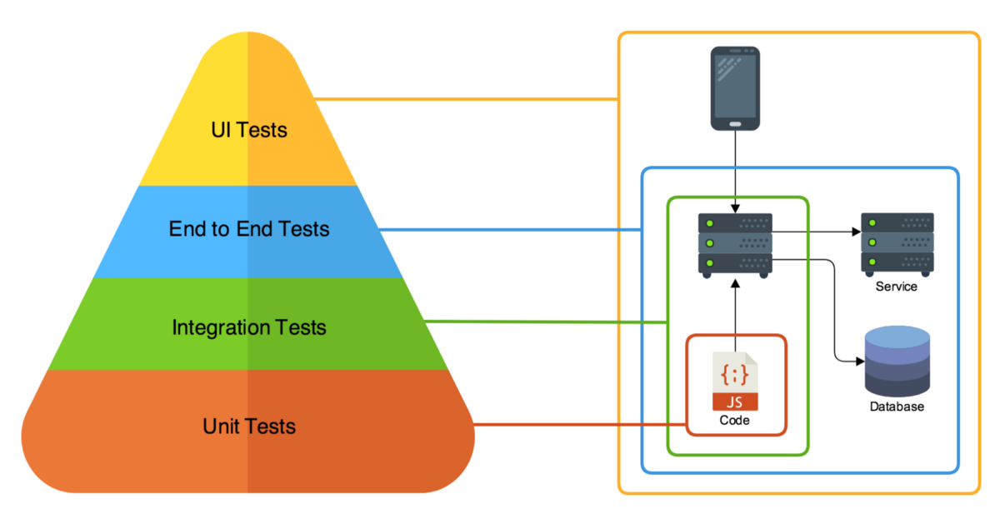

# Why End-to-End (E2E) Testing is Often Good Enough

End-to-End tests are the way to ensure sanity and the integrity of a system as a whole. It lies in the upper tier of the [testing pyramid](https://semaphoreci.com/blog/testing-pyramid) right below UI testing; in E2E testing, we pick user scenarios and test if all components of the system produce desired outputs when they interact. For certain apps, E2E tests are more critical than UI testing and can give better results. In this post, we will discuss what E2E testing is and how it can make our systems more resilient and reliable.

Software today consists of many small components, each built with specific requirements that are optimized for the best outcome. Each of these components has an impact on how the system works. Testing these components in isolation might ensure stability on the component level, but it cannot guarantee that the system fulfills requirements. In order to ensure that all of these components work together to deliver the required output to end-users, one must test the system as a whole in an environment that is similar to production.

E2E tests are found below UI testing near the top of the testing pyramid because they are more costly in terms of resources and more sensitive to small changes made in the system. But they can provide much more confidence, as they are executed in exactly the same way as the system.

Let’s dive into E2E tests more to understand their importance, benefits, and challenges. We will also look at the tools that are available that make E2E testing a joyous experience, and how we can better integrate E2E tests into CI workflows for quality assurance.

## **Why E2E tests?**

Systems today are developed in small parts by different teams, often using different tech stacks . To make sure that each component is delivering the correct output, teams often write unit and integration test suites. When these components are put together to achieve desired outputs, i.e. the application, one has to ensure that they are fulfilling all the requirements.

Ensuring the integrity of complete systems is only possible when all of these components are tested together in an environment that is similar to the production environment. Any fault or issue in a component or any loophole in the integration of components may cause the system to crumble. To be confident about how the system will work for end-users, one must test common user scenarios and ensure that the desired outputs are achieved.

E2E tests are the way to achieve this confidence, by ensuring that the system as whole is fulfilling all requirements and that all components are functioning well together. In other words, E2E testing ensures that the system is working as intended, i.e. that the system functions well in common user scenarios and that there is data integrity across various components. This prevents regression in composite scenarios, use cases, and workflows.

## **How E2E testing differs from UI testing**

Main purpose for UI testing is to check if a system’s UI is delivering inputs & outputs correctly, which can be done by mocking backend services. On the other hand, E2E tests are focused on the integrity of the system itself, and don’t  go through the UI. Let’s take an example of a payment process where our system communicates with an external API for the user’s payment. UI tests for this feature might fail because of an errant extra modal being rendered over the input field or some incorrect validation being placed on the UI layer, even if the backend is working just fine. Such cases can generate false alarms for teams; resulting in headaches and reduced confidence in existing tests.

For some systems UI testing might not be so critical, but the integrity of all other components is crucial and requires continuous checking. E2E tests can be super helpful in ensuring system function. Fleet monitoring or analytics logging systems are some of the best examples for such cases.

## **E2E testing process**

E2E tests should validate all user cases to see if the system is working as expected. Hence, these tests should cover all relevant scenarios for each user case . Like other tests, E2E tests also go through planning, design, execution, and analysis phases.

Let’s consider an example of an e-commerce company with a website, mobile app, and backend service. Let’s go over what each stage will look like.

### **Planning**

The planning phase includes analyzing business requirements and relevant scenarios for each requirement. For example, we have to test scenarios related to login, signup, cart, checkout, and payment. These user cases will have different conditions, e.g. what happens when the payment gateway is not responding or when a promo code is applied and discounts are calculated.

### **Design**

Once the requirement analysis is complete, we can design the test cases. Each user case can be mapped into a suite of test cases, which covers all relevant conditions for that journey. To keep our CI pipeline fast, tests should be designed in a way that we execute them in parallel without depending on each other. For example, we can have test suites for login, signup, and cart; all can run in parallel without impacting each other.

### **Execution**

E2E tests are intended to run in an environment like the one where the app will run. Usually, these shadow environments are set up before the CI pipeline starts and are torn down after the CI pipeline is complete. In our scenario, we must test if all of the app’s components are working together properly.

### **Analysis**

Once execution completes, we can analyze the results and see if the system is working as expected. The reasons for all failing tests are determined and reports are sent to relevant stakeholders. This can sometimes be a costly part of E2E testing, as it’s not very simple to identify which component or part of the system is causing a given problem. Nevertheless, it is easier to analyze broken tests than it is to lose users because of system errors.

## **Pitfalls of E2E testing**

End-to-End tests are great, but come with their own set of problems. They are notoriously flaky and often fail for unexpected and unforeseeable reasons. They are heavily dependent on the environment; keeping purity and predictability intact is tough. False positives happen often–mostly because of small issues with the environment. Systems might rely on third party integration that can affect the execution of tests, etc..

Now, let’s talk about a few common pitfalls.

### **Simulation & shadow environments**

Creating environments similar to production might be costly and challenging at the same time. For systems spanning several microservices, it can also be resource-intensive. Additionally, for mobile apps, the testing environment must connect with real devices; simulating location changes or other sensors can be challenging for GPS-based apps.

### **Maintenance**

Systems relying on external services may have to maintain simulations along with the code base.

### **Team structure**

With distributed architectures, micro-frontends, or microservices there’s also the big question of who’s in charge of writing these tests. Since they span multiple components, there’s no single team responsible for writing E2E tests. In most cases, these tests are written by a centralized quality assurance team that works closely with the DevOps and business teams. This may vary from organization to organization and can be a bit challenging to manage.

## **Benefits of E2E testing**

The testing pyramid places E2E tests in the upper tier right below UI testing and suggests having fewer 2E tests than unit & integration tests because they can be costly and hard to maintain. Since we are not testing smaller components, a small number of tests can cover most user cases. And, despite their faults, the fruit they bear generally makes the effort worthwhile.

Now, let’s discuss some of the benefits briefly.

### **User experience**

Simulating the real user scenarios can help developers determine how a failing test would impact the user. This makes it easier to provide a consistent user experience as we add more features to the app.

### **Verifying real-world cases**

Testers often worry about missing a bug or writing a test that does not verify real-world behavior. Other parts of the test pyramid (Unit & Integration tests) cannot guarantee that all use cases are covered in apps being shipped to users. Writing tests from the user’s perspective often avoids both problems and gives the tester a greater sense of accomplishment.

### **Reliability**

Since E2E tests are performed in environments similar to production, one can ensure that the system remains stable and is capable of handling edge cases.

## **Tools for E2E testing**

There are many tools available today to make writing E2E tests fun; we have compiled a list of a few of them. Please feel free to leave a comment if you think we should add more to the list. Here are a few top tools to test APIs:

- Postman – a great tool to periodically test APIs with monitors and support for different environments.
- Assertible – focused on reliability, it supports running API tests after deployment
- JMeter – though it was created for stress testing, it can also be leveraged for E2E tests for APIs

## **E2E tests for CI environments**

If it is not fast enough to give rapid feedback, the CI pipeline can become a bottleneck in development cycles. Some say that E2E tests are inherently the slowest and add overhead to the CI process, but if your CI environments are fast and tests are written smartly, the results can be the exact opposite.

One of the best solutions to get E2E tests to integrate better  into CI pipelines is to have the ability to execute them in parallel; using  standalone private CI execution machines also alleviates some potential problems. SemaphoreCI offers both of these truly awesome features that can help you accelerate the execution of E2E tests and gain confidence about function of your systems.

## **Final words**

E2E testing is at the top of the [testing pyramid](https://semaphoreci.com/blog/testing-pyramid), but it can be as effective as other types of testing to ensure the performance & reliability of the system for end-users. While it is true that they are often hard to maintain and execute, the level of confidence and benefits that they provide make them worth the effort.

Correct implementation and the right CI tool can make E2E testing a blast and, thus, a more integral part of development cycles. It can also be leveraged to ensure high availability for a system .
