# Books I’ve read

Tiny summary but **detailed notes for each**. Use the ISBN number to find it from your local library or anywhere else. **This page will constantly update as I read more**, so bookmark it if you want to check back in a few months.

Sorted with **my top recommendations up top**. Sort by
[title](https://sive.rs/book?sort=title),
[newest](https://sive.rs/book?sort=date), or
[best](https://sive.rs/book?sort=rating).

And **please read [this FAQ page](https://sive.rs/bfaq) about these notes**, if you have any questions.
You can also [email me](https://sive.rs/contact).

Search these books:

---

[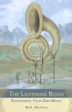](https://sive.rs/book/ListeningBook)

## [The Listening Book - by W.A. Mathieu](https://sive.rs/book/ListeningBook)

Date read: 2021-09-03. How strongly I recommend it: **10**/10

Everyone should read this book of little essays about listening. It teaches your ears to pay more attention. It calls your attention to sounds you hadn’t noticed. It’s beautifully written, and makes your life better. I read it twice, 24 years ago, and reading it again this week, it was even better than I remembered.

**[Read my notes](https://sive.rs/book/ListeningBook)**, or go to the [Amazon page](https://www.amazon.com/s?k=9781590308318&tag=sivers-20) for details and reviews.

## [Open Borders - by Bryan Caplan](https://sive.rs/book/OpenBorders)

Date read: 2021-08-30. How strongly I recommend it: **10**/10

A nonfiction comic book, by an economist, about unrestricted immigration. What? Yeah. Everyone should read it. This fun easy read of a single well-argued point will change your mind no matter what your previous stance. Brilliant illustration by Zach Weinersmith helps make the topic stick. NOTE: Don’t try to read it on a little black-and-white Kindle. It really is a comic book and needs to be read full-size in color.

**[Read my notes](https://sive.rs/book/OpenBorders)**, or go to the [Amazon page](https://www.amazon.com/s?k=1250316960&tag=sivers-20) for details and reviews.

[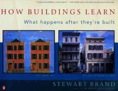](https://sive.rs/book/HowBuildingsLearn)

## [How Buildings Learn - by Stewart Brand](https://sive.rs/book/HowBuildingsLearn)

Date read: 2021-08-02. How strongly I recommend it: **10**/10

I’ve read this book three times since 1999, and gifted it many times to others. It’s changed the way I look at buildings. I read it again now because I’m building a new house. Its main idea is that all buildings are predictions, and all predictions are wrong, so design to make them easy to change. I think of it metaphorically in life: assuming my predictions about what I want will probably be wrong, so make my life easy to change. Get the paper book because the photos are crucial.

**[Read my notes](https://sive.rs/book/HowBuildingsLearn)**, or go to the [Amazon page](https://www.amazon.com/s?k=0140139966&tag=sivers-20) for details and reviews.

[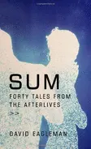](https://sive.rs/book/Sum)

## [Sum: Forty Tales from the Afterlives - by David Eagleman](https://sive.rs/book/Sum)

Date read: 2017-09-27. How strongly I recommend it: **10**/10

Awesomely creative think-piece. 40 very short fictional stories about what happens when you die. The framework is inspiring for anyone: coming up with 40 different answers to any one question. But they’re also just brilliant ideas and powerful little fables. I just read it a 2nd time and love it even more now.

**[Read my notes](https://sive.rs/book/Sum)**, or go to the [Amazon page](https://www.amazon.com/s?k=0307377342&tag=sivers-20) for details and reviews.

[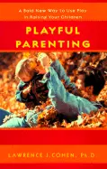](https://sive.rs/book/PlayfulParenting)

## [Playful Parenting - by Lawrence Cohen](https://sive.rs/book/PlayfulParenting)

Date read: 2016-06-05. How strongly I recommend it: **10**/10

I’ve read many books on parenting, but this one is the best. It’s genius. My top recommendation for everyone with a kid age 1-13. Its point is that children communicate through play. So, to reach them: play! Anything can be done through play: teaching, emotional connection, processing difficult situations, and even discipline can be made playful. Read the whole book instead of just my notes, since my little take-away ideas are just reminders of the spirit of the book. I re-read these notes almost every week to remind me how to be a great parent. My kid is always thankful (communicated through giddy laughter) when I remember and use this approach.

**[Read my notes](https://sive.rs/book/PlayfulParenting)**, or go to the [Amazon page](https://www.amazon.com/s?k=0345438973&tag=sivers-20) for details and reviews.

[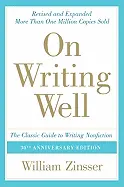](https://sive.rs/book/OnWritingWell)

## [On Writing Well - by William Zinsser](https://sive.rs/book/OnWritingWell)

Date read: 2015-08-01. How strongly I recommend it: **10**/10

Great blunt advice about writing better non-fiction. So inspiring.

**[Read my notes](https://sive.rs/book/OnWritingWell)**, or go to the [Amazon page](https://www.amazon.com/s?k=0060891548&tag=sivers-20) for details and reviews.

[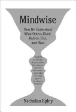](https://sive.rs/book/Mindwise)

## [Mindwise: How We Understand What Others Think, Believe, Feel, and Want - by Nicholas Epley](https://sive.rs/book/Mindwise)

Date read: 2014-10-01. How strongly I recommend it: **10**/10

Many new brilliant insights, especially about over-estimating the differences between you and others, thereby separating into us-vs-them tribalism. Scan to the end of my notes, to see. If you know more books like this, please recommend them to me. I adore this subject.

**[Read my notes](https://sive.rs/book/Mindwise)**, or go to the [Amazon page](https://www.amazon.com/s?k=0307595919&tag=sivers-20) for details and reviews.

[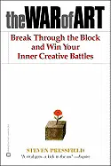](https://sive.rs/book/WarOfArt)

## [The War of Art - by Steven Pressfield](https://sive.rs/book/WarOfArt)

Date read: 2012-01-05. How strongly I recommend it: **10**/10

Have you experienced a vision of the person you might become, the work you could accomplish, the realized being you were meant to be? Are you a writer who doesn’t write, a painter who doesn’t paint, an entrepreneur who never starts a venture? Then you know what “Resistance” is. This book is about that. Read it.

**[Read my notes](https://sive.rs/book/WarOfArt)**, or go to the [Amazon page](https://www.amazon.com/s?k=0446691437&tag=sivers-20) for details and reviews.

[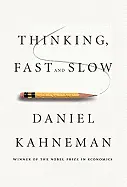](https://sive.rs/book/ThinkingFastAndSlow)

## [Thinking, Fast and Slow - by Daniel Kahneman](https://sive.rs/book/ThinkingFastAndSlow)

Date read: 2011-12-08. How strongly I recommend it: **10**/10

If you liked “Predictably Irrational” or “Stumbling on Happiness” or any of those pop-psychology books, well, this is the Godfather of all of their work. Huge thorough book gives a great overview of much of his work. Read the other quotes on Amazon about it.

**[Read my notes](https://sive.rs/book/ThinkingFastAndSlow)**, or go to the [Amazon page](https://www.amazon.com/s?k=0374275637&tag=sivers-20) for details and reviews.

[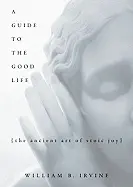](https://sive.rs/book/StoicJoy)

## [A Guide to the Good Life: The Ancient Art of Stoic Joy - by William Irvine](https://sive.rs/book/StoicJoy)

Date read: 2010-09-26. How strongly I recommend it: **10**/10

Almost too personal for me to give an objective review, because I found when reading it that the quirky philosophy I've been living my life by since 17 matches up exactly with a 2000-year-old philosophy called Stoicism. Mine was self-developed haphazardly, so it was fascinating to read the refined developed original. Really resonated.

**[Read my notes](https://sive.rs/book/StoicJoy)**, or go to the [Amazon page](https://www.amazon.com/s?k=0195374614&tag=sivers-20) for details and reviews.

[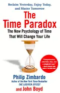](https://sive.rs/book/TimeParadox)

## [The Time Paradox - by Philip Zimbardo and John Boyd](https://sive.rs/book/TimeParadox)

Date read: 2009-04-03. How strongly I recommend it: **10**/10

Profound idea that everyone has a primary time focus: either Future-focused, Present-focused, or Past-focused. Fascinating implications of each. Because I'm so future-focused, reading this book helped me understand people who are very present-focused. Also great advice on shifting your focus when needed. I read it 7 years ago, but still think about it almost every day.

**[Read my notes](https://sive.rs/book/TimeParadox)**, or go to the [Amazon page](https://www.amazon.com/s?k=1416541993&tag=sivers-20) for details and reviews.

[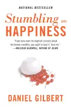](https://sive.rs/book/StumblingOnHappiness)

## [Stumbling on Happiness - by Daniel Gilbert](https://sive.rs/book/StumblingOnHappiness)

Date read: 2007-07-11. How strongly I recommend it: **10**/10

Not at all new-agey, as the title might suggest. Harvard professor of psychology has studied happiness for years, and shares factual findings that will change the way you look at the world.

**[Read my notes](https://sive.rs/book/StumblingOnHappiness)**, or go to the [Amazon page](https://www.amazon.com/s?k=1400077427&tag=sivers-20) for details and reviews.

[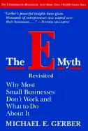](https://sive.rs/book/EMythRevisited)

## [E-Myth Revisited - by Michael Gerber](https://sive.rs/book/EMythRevisited)

Date read: 2004-02-26. How strongly I recommend it: **10**/10

Absolutely everyone who is an entrepreneur or wants to be one needs to read this book. I first read it after 10 years of successfully running my company, and was still blown away and totally humbled by its wisdom. Re-reading it today, I'm amazed how my view of business was completely changed by this one little book. See my notes for examples, but definitely read the book itself to get the real impact.

**[Read my notes](https://sive.rs/book/EMythRevisited)**, or go to the [Amazon page](https://www.amazon.com/s?k=0887307280&tag=sivers-20) for details and reviews.

[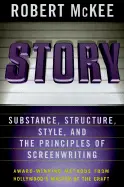](https://sive.rs/book/Story)

## [Story - by Robert McKee](https://sive.rs/book/Story)

Date read: 2021-12-26. How strongly I recommend it: **9**/10

A masterpiece about screenwriting. Everyone who writes fiction must read this book. Cinema fans should read this book, even if you have no intention to write. It’s a film school masterclass. It also has surprisingly good insights into life: the story we all create by living.

**[Read my notes](https://sive.rs/book/Story)**, or go to the [Amazon page](https://www.amazon.com/s?k=9780060391683&tag=sivers-20) for details and reviews.

[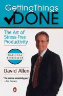](https://sive.rs/book/GettingThingsDone)

## [Getting Things Done - by David Allen](https://sive.rs/book/GettingThingsDone)

Date read: 2021-04-30. How strongly I recommend it: **9**/10

Classic book with near-cult following. How to manage every last itty bitty tiny thing in your life. Keep your inbox empty. Re-read 16 years later. Still great.

**[Read my notes](https://sive.rs/book/GettingThingsDone)**, or go to the [Amazon page](https://www.amazon.com/s?k=0142000280&tag=sivers-20) for details and reviews.

[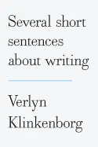](https://sive.rs/book/ShortSentences)

## [Several Short Sentences About Writing - by Verlyn Klinkenborg](https://sive.rs/book/ShortSentences)

Date read: 2021-03-28. How strongly I recommend it: **9**/10

The 2nd-best and most-radical book about great writing. It tells you to focus entirely on the sentence, an approach that was already my favorite, which is why I bought this book. It recommends you boldly eliminate transitions and conjunctions, split compound sentences, don't save your point for the end, and revise by deleting. This is the first book I've seen printed as one sentence per line — a way I've been writing for many years, and now printed in my book “How to Live”.

**[Read my notes](https://sive.rs/book/ShortSentences)**, or go to the [Amazon page](https://www.amazon.com/s?k=0307266346&tag=sivers-20) for details and reviews.

[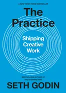](https://sive.rs/book/Practice)

## [The Practice - by Seth Godin](https://sive.rs/book/Practice)

Date read: 2021-01-15. How strongly I recommend it: **9**/10

The subtitle “Shipping Creative Work” sums it up well. It’s a great call-to-action, giving you the right mindset to create the thing you know you need to do. Very encouraging and motivating. Every creative person needs this.

**[Read my notes](https://sive.rs/book/Practice)**, or go to the [Amazon page](https://www.amazon.com/s?k=0593328973&tag=sivers-20) for details and reviews.

[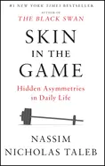](https://sive.rs/book/SkinInTheGame)

## [Skin in the Game - by Nassim Nicholas Taleb](https://sive.rs/book/SkinInTheGame)

Date read: 2020-08-15. How strongly I recommend it: **9**/10

Taleb is always filled with surprising ideas and confrontational bragging. Ignore the hot air and gather the gems. Great thoughts around putting your ass on the line with consequences — not just thinking things in theory but doing things in reality — in the real world.

**[Read my notes](https://sive.rs/book/SkinInTheGame)**, or go to the [Amazon page](https://www.amazon.com/s?k=0425284646&tag=sivers-20) for details and reviews.

[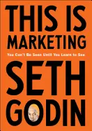](https://sive.rs/book/ThisIsMarketing)

## [This Is Marketing - by Seth Godin](https://sive.rs/book/ThisIsMarketing)

Date read: 2019-08-02. How strongly I recommend it: **9**/10

A must-read for every entrepreneur. A holistic, generous, human, emotional, long-term, story-driven approach to your business. The world would be a much better place if businesses were led this way. You'll have a competitive advantage if you do this, since so few do.

**[Read my notes](https://sive.rs/book/ThisIsMarketing)**, or go to the [Amazon page](https://www.amazon.com/s?k=0525540830&tag=sivers-20) for details and reviews.

[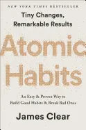](https://sive.rs/book/AtomicHabits)

## [Atomic Habits - by James Clear](https://sive.rs/book/AtomicHabits)

Date read: 2018-12-29. How strongly I recommend it: **9**/10

I was doubtful, but everyone kept telling me it’s awesome, so I reluctantly read it. Holy crap! It’s GREAT! Feels like the definitive masterpiece on the subject of how to make good habits and break bad ones. Very focused on helping you take action. Very relatable and inspiring.

**[Read my notes](https://sive.rs/book/AtomicHabits)**, or go to the [Amazon page](https://www.amazon.com/s?k=0735211299&tag=sivers-20) for details and reviews.

[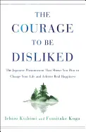](https://sive.rs/book/Disliked)

## [The Courage to Be Disliked - by Ichiro Kishimi and Fumitake Koga](https://sive.rs/book/Disliked)

Date read: 2018-07-25. How strongly I recommend it: **9**/10

Wow. A profound little philosophy book from Japan, communicating the psychology of Alfred Adler - a rival of Freud. Told as a conversation between an angry student and a patient teacher. A little book so good that I rushed home from other activities to keep reading it, and finished in a day. A surprisingly fresh perspective on how to live. (The “disliked” part is not the point, so don’t let the title distract you.)

**[Read my notes](https://sive.rs/book/Disliked)**, or go to the [Amazon page](https://www.amazon.com/s?k=1501197274&tag=sivers-20) for details and reviews.

[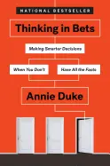](https://sive.rs/book/ThinkingInBets)

## [Thinking in Bets - by Annie Duke](https://sive.rs/book/ThinkingInBets)

Date read: 2018-06-02. How strongly I recommend it: **9**/10

Amazing point: Would your belief in something stand up to the question, “Wanna bet?” If you had to gamble significant money on that belief, would you still feel 100% about it? Or maybe more honestly 60%? This creates healthy skepticism encouraging you to seek the best information instead of just defending your belief. Now objective accuracy wins instead of argument.

**[Read my notes](https://sive.rs/book/ThinkingInBets)**, or go to the [Amazon page](https://www.amazon.com/s?k=0735216355&tag=sivers-20) for details and reviews.

[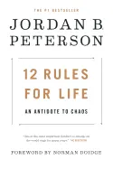](https://sive.rs/book/12RulesForLife)

## [12 Rules for Life - by Jordan Peterson](https://sive.rs/book/12RulesForLife)

Date read: 2018-04-10. How strongly I recommend it: **9**/10

A unique thinker with strong opinions presented as indisputable fact. More surprisingly interesting ideas than almost any book I've ever read. Extremely thoughtful, but occasionally abruptly concludes with an unsupported point. It has a conservative “this is how it is” certainty. It’s a broad collection of thoughtful insights on life, mixed with a lot of Bible interpretation.

**[Read my notes](https://sive.rs/book/12RulesForLife)**, or go to the [Amazon page](https://www.amazon.com/s?k=0345816021&tag=sivers-20) for details and reviews.

[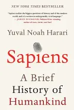](https://sive.rs/book/Sapiens)

## [Sapiens - by Yuval Noah Harari](https://sive.rs/book/Sapiens)

Date read: 2017-08-15. How strongly I recommend it: **9**/10

I resisted reading this popular history of mankind, because it came out when I had just finished “Guns, Germs, and Steel” and “Cows, Pigs, Wars, and Witches”, on the same subject. But wow - this book is at its best when the author is sharing his personal perspective about binding myths, humanism, and other ways that “truths” are not true. And you get an interesting history of the world along with it. Strange mix of history and philosophy.

**[Read my notes](https://sive.rs/book/Sapiens)**, or go to the [Amazon page](https://www.amazon.com/s?k=0062316095&tag=sivers-20) for details and reviews.

[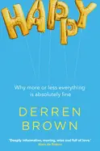](https://sive.rs/book/Happy)

## [Happy - by Derren Brown](https://sive.rs/book/Happy)

Date read: 2017-03-05. How strongly I recommend it: **9**/10

Brilliant and profound yet totally entertaining philosophy book by one of my favorite people. Gives an approachable overview of past philosophies and shows how they apply to your life today better than the harmful pop-self-help-positivity stuff. Amazing perspectives on desires, death, relationships, anger, and how being present doesn’t matter as much as the story you tell yourself afterwards. He has a fun writing style that’s not reflected in my notes here. Get the book.

**[Read my notes](https://sive.rs/book/Happy)**, or go to the [Amazon page](https://www.amazon.com/s?k=0552172359&tag=sivers-20) for details and reviews.

[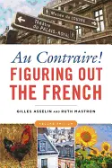](https://sive.rs/book/AuContraire)

## [Au Contraire: Figuring Out the French - by Gilles Asselin and Ruth Mastron](https://sive.rs/book/AuContraire)

Date read: 2016-10-11. How strongly I recommend it: **9**/10

The absolute best book I've ever found on explaining the mindset of a country. (Runner-up is “Watching the English” by Kate Fox.) I wish every country had a book this deep. Not just what but why! Also appreciate the bold writing, skipping caveats.

**[Read my notes](https://sive.rs/book/AuContraire)**, or go to the [Amazon page](https://www.amazon.com/s?k=1931930929&tag=sivers-20) for details and reviews.

[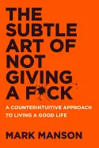](https://sive.rs/book/NotFuck)

## [The Subtle Art of Not Giving a Fuck - by Mark Manson](https://sive.rs/book/NotFuck)

Date read: 2016-09-26. How strongly I recommend it: **9**/10

The opposite of every other book. Don’t try. Give up. Be wrong. Lower your standards. Stop believing in yourself. Follow the pain. And oh yeah, kill yourself. Each point is profoundly true, useful, and more powerful than the usual positivity. Succinct but surprisingly deep, I read it in one night, then read it again a month later.

**[Read my notes](https://sive.rs/book/NotFuck)**, or go to the [Amazon page](https://www.amazon.com/s?k=0062457713&tag=sivers-20) for details and reviews.

[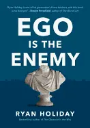](https://sive.rs/book/EgoEnemy)

## [Ego Is the Enemy - by Ryan Holiday](https://sive.rs/book/EgoEnemy)

Date read: 2016-08-01. How strongly I recommend it: **9**/10

Forget yourself and focus on the work. Be humble and persistent. Value discipline and results, not passion and confidence. Be lesser, do more. This message is crucial, but the opposite of almost every other book. I wish everyone would read this. I need to re-read it each year. It's that important. It's easy to read this and say “oh yeah I've got my ego under control”, but the problem is deeper than that.

**[Read my notes](https://sive.rs/book/EgoEnemy)**, or go to the [Amazon page](https://www.amazon.com/s?k=1591847818&tag=sivers-20) for details and reviews.

[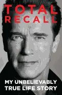](https://sive.rs/book/TotalRecall)

## [Total Recall - by Arnold Schwarzenegger](https://sive.rs/book/TotalRecall)

Date read: 2016-05-05. How strongly I recommend it: **9**/10

I was not expecting to love this so much! I'm not a fan of his, but MAN his ambitious mindset, especially in his early days when he first moved to America, is so inspiring. Both on the movie-star side and real-estate side. If you need a role model or inspiration for thinking big, this is it. (Skip the final section on his governor days.) I was telling friends stories and thoughts about this book for weeks afterwards.

**[Read my notes](https://sive.rs/book/TotalRecall)**, or go to the [Amazon page](https://www.amazon.com/s?k=1410452107&tag=sivers-20) for details and reviews.

[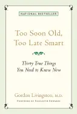](https://sive.rs/book/30TrueThings)

## [Too Soon Old, Too Late Smart: Thirty True Things You Need to Know Now - by Gordon Livingston](https://sive.rs/book/30TrueThings)

Date read: 2016-04-26. How strongly I recommend it: **9**/10

Powerful and profound life lessons from a psychiatrist who's been listening to people's problems for decades.

**[Read my notes](https://sive.rs/book/30TrueThings)**, or go to the [Amazon page](https://www.amazon.com/s?k=1569244197&tag=sivers-20) for details and reviews.

[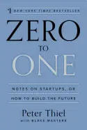](https://sive.rs/book/ZeroToOne)

## [Zero to One - by Peter Thiel and Blake Masters](https://sive.rs/book/ZeroToOne)

Date read: 2016-03-10. How strongly I recommend it: **9**/10

Brilliant, bold, and clear thoughts about how to make a big Silicon Valley size company. Other great insights like definite/indefinite optimism/pessimism.

**[Read my notes](https://sive.rs/book/ZeroToOne)**, or go to the [Amazon page](https://www.amazon.com/s?k=0804139296&tag=sivers-20) for details and reviews.

[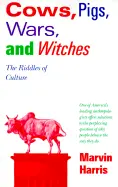](https://sive.rs/book/CowsPigsWarsWitches)

## [Cows, Pigs, Wars, and Witches - by Marvin Harris](https://sive.rs/book/CowsPigsWarsWitches)

Date read: 2016-02-19. How strongly I recommend it: **9**/10

Mind-blowing anthropology. Great argument that the reasons that religions worship cows or hate pigs, that tribes wage wars, or Europe's 200 years of witch hunts, are all very practical economic reasons usually unknown to the participants or washed out of history. But they're revealed here in zoomed-out hindsight. My notes here can't describe it. You have to read the whole book. Riveting.

**[Read my notes](https://sive.rs/book/CowsPigsWarsWitches)**, or go to the [Amazon page](https://www.amazon.com/s?k=0679724680&tag=sivers-20) for details and reviews.

[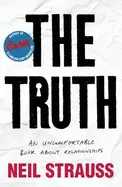](https://sive.rs/book/TheTruth)

## [The Truth - by Neil Strauss](https://sive.rs/book/TheTruth)

Date read: 2015-11-22. How strongly I recommend it: **9**/10

Deep look at romantic relationships. Neil’s autobiography of transformation from being a womanizing sex addict, through therapy, concluding with commitment to his girlfriend. But interlaced in his story are powerful lessons about relationships.

**[Read my notes](https://sive.rs/book/TheTruth)**, or go to the [Amazon page](https://www.amazon.com/s?k=0060898763&tag=sivers-20) for details and reviews.

[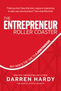](https://sive.rs/book/RollerCoaster)

## [The Entrepreneur Roller Coaster - by Darren Hardy](https://sive.rs/book/RollerCoaster)

Date read: 2015-08-01. How strongly I recommend it: **9**/10

Rar! My heart rate is racing as I tear through this riveting book. Darren captures and spreads the entrepreneurial spirit better than anyone I know. I've been a successful entrepreneur for 25 years but The Entrepreneur Roller Coaster just got me more excited and enlightened than I've been in a long time. You must read and USE this immediately!

**[Read my notes](https://sive.rs/book/RollerCoaster)**, or go to the [Amazon page](https://www.amazon.com/s?k=0990798623&tag=sivers-20) for details and reviews.

[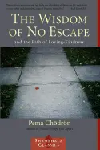](https://sive.rs/book/WisdomOfNoEscape)

## [The Wisdom of No Escape - by Pema Chödrön](https://sive.rs/book/WisdomOfNoEscape)

Date read: 2015-04-16. How strongly I recommend it: **9**/10

Powerful thoughts on not running, distracting, or escaping, but sticking with something all the way through.

**[Read my notes](https://sive.rs/book/WisdomOfNoEscape)**, or go to the [Amazon page](https://www.amazon.com/s?k=1570628726&tag=sivers-20) for details and reviews.

[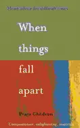](https://sive.rs/book/WhenThingsFallApart)

## [When Things Fall Apart - by Pema Chödrön](https://sive.rs/book/WhenThingsFallApart)

Date read: 2014-11-30. How strongly I recommend it: **9**/10

Profound philosophy on facing the negative emotions head-on and getting to know them well, instead of trying to avoid them or escape.

**[Read my notes](https://sive.rs/book/WhenThingsFallApart)**, or go to the [Amazon page](https://www.amazon.com/s?k=1570623449&tag=sivers-20) for details and reviews.

[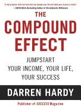](https://sive.rs/book/CompoundEffect)

## [The Compound Effect - by Darren Hardy](https://sive.rs/book/CompoundEffect)

Date read: 2014-07-17. How strongly I recommend it: **9**/10

Classic self-help book, in the best sense. Inspired the hell out of me. Mostly fundamentals I had heard before, but put in a very energetic go-do-it way. As he says, “You already know all that you need to succeed. You don’t need to learn anything more. If all we needed was more information, everyone with an Internet connection would live in a mansion, have abs of steel, and be blissfully happy.”

**[Read my notes](https://sive.rs/book/CompoundEffect)**, or go to the [Amazon page](https://www.amazon.com/s?k=159315724X&tag=sivers-20) for details and reviews.

[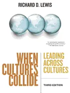](https://sive.rs/book/WhenCulturesCollide)

## [When Cultures Collide - by Richard D. Lewis](https://sive.rs/book/WhenCulturesCollide)

Date read: 2014-07-16. How strongly I recommend it: **9**/10

Masterpiece of cultural observations. I wish there were more books like this. My Wood Egg books were created with the same goal. Insights into different countries' cultures. Some amazing, like the reason for American's lack of manners, or Japanese procedures. My detailed notes don't do it justice because I practically underlined the entire book, I loved it so much.

**[Read my notes](https://sive.rs/book/WhenCulturesCollide)**, or go to the [Amazon page](https://www.amazon.com/s?k=1904838022&tag=sivers-20) for details and reviews.

[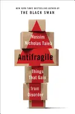](https://sive.rs/book/Antifragile)

## [Antifragile - by Nassim Nicholas Taleb](https://sive.rs/book/Antifragile)

Date read: 2013-05-15. How strongly I recommend it: **9**/10

Bold perspectives, unusual ideas, and surprisingly wise advice around an interesting subject of the “opposite of fragile.” Looking through that lens at health, education, governments, business, and life philosophy. Very inspiring, and sparks a lot of further discussion.

**[Read my notes](https://sive.rs/book/Antifragile)**, or go to the [Amazon page](https://www.amazon.com/s?k=1400067820&tag=sivers-20) for details and reviews.

[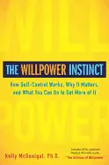](https://sive.rs/book/WillpowerInstinct)

## [The Willpower Instinct - by Kelly McGonigal](https://sive.rs/book/WillpowerInstinct)

Date read: 2013-02-05. How strongly I recommend it: **9**/10

Amazing book about willpower from Stanford psychology professor who teaches just this. Killer first point: The best way to improve your self-control is to see how and why you lose control. This is a better book than the other book on Willpower here on my list, because it's more actionable, better written, better presented. Really amazing (IF you act on it!)

**[Read my notes](https://sive.rs/book/WillpowerInstinct)**, or go to the [Amazon page](https://www.amazon.com/s?k=1583334386&tag=sivers-20) for details and reviews.

[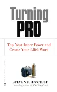](https://sive.rs/book/TurningPro)

## [Turning Pro - by Steven Pressfield](https://sive.rs/book/TurningPro)

Date read: 2012-10-25. How strongly I recommend it: **9**/10

In the same vein as his other books “Do the Work” and ”War of Art” - but a message that needs to be said again and again to really get through. It's all about the resistance, avoiding distractions, getting serious. Here he dives more into the mindset shift of thinking of your art as a hobby versus a real career. This stuff shakes me to the core, every time.

**[Read my notes](https://sive.rs/book/TurningPro)**, or go to the [Amazon page](https://www.amazon.com/s?k=1936891034&tag=sivers-20) for details and reviews.

[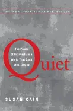](https://sive.rs/book/Quiet)

## [Quiet - by Susan Cain](https://sive.rs/book/Quiet)

Date read: 2012-09-22. How strongly I recommend it: **9**/10

Any introvert should like this book. Wonderful info and insights about introversion. It'll help you defend your preference for low-stimulus environments. Since reading it, I feel better about insisting on my quiet/alone time.

**[Read my notes](https://sive.rs/book/Quiet)**, or go to the [Amazon page](https://www.amazon.com/s?k=0307352145&tag=sivers-20) for details and reviews.

[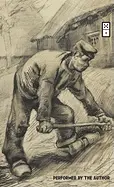](https://sive.rs/book/DoTheWork)

## [Do the Work - by Steven Pressfield](https://sive.rs/book/DoTheWork)

Date read: 2011-10-25. How strongly I recommend it: **9**/10

A true manifesto. A call to action. A kick in the butt for any creative person. Great thoughts on overcoming the resistance to creating.

**[Read my notes](https://sive.rs/book/DoTheWork)**, or go to the [Amazon page](https://www.amazon.com/s?k=1936719010&tag=sivers-20) for details and reviews.

[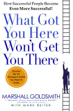](https://sive.rs/book/WhatGotYouThere)

## [What Got You Here Won't Get You There - by Marshall Goldsmith](https://sive.rs/book/WhatGotYouThere)

Date read: 2011-08-22. How strongly I recommend it: **9**/10

Aimed at already-successful people. The personality traits that brought you to success (personal discipline, saying yes to everything, over-confidence) are the same traits that hold you back from going further! (Where you need to listen to lead, and don't let over-confidence make you over-commit.) Stinging counter-intuitive insights that hit very close to home for me. Great specific suggestions for how to improve.

**[Read my notes](https://sive.rs/book/WhatGotYouThere)**, or go to the [Amazon page](https://www.amazon.com/s?k=1401301304&tag=sivers-20) for details and reviews.

[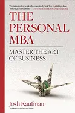](https://sive.rs/book/PersonalMBA)

## [The Personal MBA - by Josh Kaufman](https://sive.rs/book/PersonalMBA)

Date read: 2011-02-16. How strongly I recommend it: **9**/10

Wow. A masterpiece. This is now the one “START HERE” book I'll be recommending to everybody interested in business. An amazing overview of everything you need to know. Covers all the basics, minus buzz-words and fluff. Look at my notes for an example, but read the whole book. One of the most inspiring things I've read in years. Want proof? I asked the author to be my coach/mentor afterwards. It's that good.

**[Read my notes](https://sive.rs/book/PersonalMBA)**, or go to the [Amazon page](https://www.amazon.com/s?k=1591843529&tag=sivers-20) for details and reviews.

[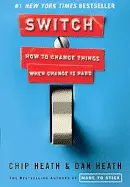](https://sive.rs/book/Switch)

## [Switch - by Chip Heath and Dan Heath](https://sive.rs/book/Switch)

Date read: 2010-05-10. How strongly I recommend it: **9**/10

Great great great great GREAT psychology book about real ways to make change last - both personal and organizational. So many powerful insights, based on fact not theory. Inspiring counterintuitive stories of huge organizational change against all odds. Highly recommended for everyone.

**[Read my notes](https://sive.rs/book/Switch)**, or go to the [Amazon page](https://www.amazon.com/s?k=0385528752&tag=sivers-20) for details and reviews.

[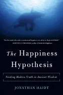](https://sive.rs/book/HappinessHypothesis)

## [The Happiness Hypothesis - by Jonathan Haidt](https://sive.rs/book/HappinessHypothesis)

Date read: 2010-05-01. How strongly I recommend it: **9**/10

Psychology professor's digestible but deep insight into how our minds work, around the topic of happiness. Great metaphor of a rider on the back of an elephant. Rider is reasoning, elephant is emotions. Rider has limited control of what the elephant does. Surprising insights into ethics and morality. See my notes for great quotes, but read the whole well-written book.

**[Read my notes](https://sive.rs/book/HappinessHypothesis)**, or go to the [Amazon page](https://www.amazon.com/s?k=0465028020&tag=sivers-20) for details and reviews.

[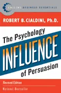](https://sive.rs/book/Influence)

## [Influence - by Robert Cialdini](https://sive.rs/book/Influence)

Date read: 2009-08-15. How strongly I recommend it: **9**/10

Classic book on the psychology of persuasion. I read it 15 years ago, thought about it ever since, and re-read it now. How to get a 700% improvement in volunteers. How to sell more by doubling your prices. How to make people feel they made a choice, when really you made it for them.

**[Read my notes](https://sive.rs/book/Influence)**, or go to the [Amazon page](https://www.amazon.com/s?k=006124189X&tag=sivers-20) for details and reviews.

[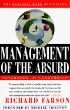](https://sive.rs/book/ManagementOfTheAbsurd)

## [Management of the Absurd - by Richard Farson](https://sive.rs/book/ManagementOfTheAbsurd)

Date read: 2009-04-14. How strongly I recommend it: **9**/10

Counter-intuitive lessons about management. Highly recommended for managers and leaders, but also teachers and parents.

**[Read my notes](https://sive.rs/book/ManagementOfTheAbsurd)**, or go to the [Amazon page](https://www.amazon.com/s?k=0684830442&tag=sivers-20) for details and reviews.

[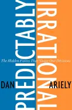](https://sive.rs/book/PredictablyIrrational)

## [Predictably Irrational - by Dan Ariely](https://sive.rs/book/PredictablyIrrational)

Date read: 2008-08-11. How strongly I recommend it: **9**/10

My favorite type of book: pointing out and understanding all of the counter-intuitive things people do.

**[Read my notes](https://sive.rs/book/PredictablyIrrational)**, or go to the [Amazon page](https://www.amazon.com/s?k=006135323X&tag=sivers-20) for details and reviews.

[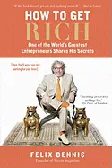](https://sive.rs/book/HowToGetRich)

## [How to Get Rich - by Felix Dennis](https://sive.rs/book/HowToGetRich)

Date read: 2008-06-18. How strongly I recommend it: **9**/10

Shockingly honest thoughts from a filthy rich bastard.

**[Read my notes](https://sive.rs/book/HowToGetRich)**, or go to the [Amazon page](https://www.amazon.com/s?k=1591842050&tag=sivers-20) for details and reviews.

## [The Ultimate Sales Machine - by Chet Holmes](https://sive.rs/book/UltimateSalesMachine)

Date read: 2008-06-12. How strongly I recommend it: **9**/10

After reading E-Myth Revisited, this is the best book I’ve seen on how to turn it into real results, step-by-step. Not ambiguous. Very “do it like this”.

**[Read my notes](https://sive.rs/book/UltimateSalesMachine)**, or go to the [Amazon page](https://www.amazon.com/s?k=1591842158&tag=sivers-20) for details and reviews.

## [The 4-Hour Work Week - by Tim Ferriss](https://sive.rs/book/4HourWorkWeek)

Date read: 2008-05-15. How strongly I recommend it: **9**/10

Brilliant reversal of all of the “how to manage all your crap” books. This one tells you how to say “no” to the crap, set expectations on your terms, and be just as effective in a fraction of the time. This is perfect for musicians with other responsibilities (day jobs) that need more free time to actually make music!

**[Read my notes](https://sive.rs/book/4HourWorkWeek)**, or go to the [Amazon page](https://www.amazon.com/s?k=0307353133&tag=sivers-20) for details and reviews.

## [The Smartest Investment Book You'll Ever Read - by Daniel R. Solin](https://sive.rs/book/SmartestInvestmentBook)

Date read: 2008-05-14. How strongly I recommend it: **9**/10

An itty-bitty quick-read no-fluff book with the wisest succinct advice to investors: You can't predict the future, and neither can anyone else. Determine your asset allocation, stick with cheap broad indexes, and rebalance occasionally.

**[Read my notes](https://sive.rs/book/SmartestInvestmentBook)**, or go to the [Amazon page](https://www.amazon.com/s?k=0399532838&tag=sivers-20) for details and reviews.

## [The Wisdom of Crowds - by James Surowiecki](https://sive.rs/book/WisdomOfCrowds)

Date read: 2008-04-16. How strongly I recommend it: **9**/10

Mind-blowing examples of how groups of diverse people acting independently are smarter than any one person in the group. Has huge implications for management, markets, decision-making, and more.

**[Read my notes](https://sive.rs/book/WisdomOfCrowds)**, or go to the [Amazon page](https://www.amazon.com/s?k=0385721706&tag=sivers-20) for details and reviews.

## [The Paradox of Choice - Why More is Less - by Barry Schwartz](https://sive.rs/book/ParadoxOfChoice)

Date read: 2007-07-11. How strongly I recommend it: **9**/10

Faced with many options or decisions in your life? This will change the way you look at them. We feel worse when we have too many options.

**[Read my notes](https://sive.rs/book/ParadoxOfChoice)**, or go to the [Amazon page](https://www.amazon.com/s?k=0060005688&tag=sivers-20) for details and reviews.

## [Made to Stick - by Chip Heath and Dan Heath](https://sive.rs/book/MadeToStick)

Date read: 2007-03-12. How strongly I recommend it: **9**/10

Actually analyzing what makes certain ideas or stories more memorable than others! Fascinating. Apply this wisdom to your songs, bio/story, communication with fans, etc.

**[Read my notes](https://sive.rs/book/MadeToStick)**, or go to the [Amazon page](https://www.amazon.com/s?k=1400064287&tag=sivers-20) for details and reviews.

## [The Art of Profitability - by Adrian Slywotzky](https://sive.rs/book/ArtOfProfitability)

Date read: 2005-12-02. How strongly I recommend it: **9**/10

25 different models of profitability presented in examples you can relate to your own business, making you realize profit-sources you’d never thought of before.

**[Read my notes](https://sive.rs/book/ArtOfProfitability)**, or go to the [Amazon page](https://www.amazon.com/s?k=0446692271&tag=sivers-20) for details and reviews.

## [The Minimalist Entrepreneur - by Sahil Lavingia](https://sive.rs/book/MinimalistEntrepreneur)

Date read: 2022-04-30. How strongly I recommend it: **8**/10

A must-read for any potential founder of a small online business. Brilliant insights into starting something simply and sensibly. Best guide to the new world of starting from anywhere.

**[Read my notes](https://sive.rs/book/MinimalistEntrepreneur)**, or go to the [Amazon page](https://www.amazon.com/s?k=0593192397&tag=sivers-20) for details and reviews.

## [Four Thousand Weeks - by Oliver Burkeman](https://sive.rs/book/4000Weeks)

Date read: 2022-02-21. How strongly I recommend it: **8**/10

Give up hope and embrace your limits. Everything you do means giving up something else. Say yes to less. He’s one of my favorite authors, so wonderfully thorough, but I already agree and am living this way. (My “Hell Yeah or No” was about this subject.) Still, I’d recommend it to anyone.

**[Read my notes](https://sive.rs/book/4000Weeks)**, or go to the [Amazon page](https://www.amazon.com/s?k=0374159122&tag=sivers-20) for details and reviews.

## [How to Live on 24 Hours a Day - by Arnold Bennett](https://sive.rs/book/Live24Hrs)

Date read: 2022-01-25. How strongly I recommend it: **8**/10

Delightful quick droll funny old book from 1908 about how to make the best use of your time. I like his written voice. I like his points on poetry, novels, curiosity, empathy, martyrs, reading the news, and of course making the most of every minute you have.

**[Read my notes](https://sive.rs/book/Live24Hrs)**, or go to the [Amazon page](https://www.amazon.com/s?k=935417924X&tag=sivers-20) for details and reviews.

## [How to Think More Effectively - by the School of Life](https://sive.rs/book/ThinkEffectively)

Date read: 2022-01-21. How strongly I recommend it: **8**/10

Great little book by Alain de Botton with quick pop-philosophy and life advice. Surprisingly good insights on how to be a better friend and listener, using envy, writing like Proust, and the companionship of book subjects.

**[Read my notes](https://sive.rs/book/ThinkEffectively)**, or go to the [Amazon page](https://www.amazon.com/s?k=1912891131&tag=sivers-20) for details and reviews.

## [All I Really Need to Know I Learned in Kindergarten - by Robert Fulghum](https://sive.rs/book/Fulghum1)

Date read: 2021-10-31. How strongly I recommend it: **8**/10

I read and loved these stories 30 years ago, so read again for tips on story-telling. I admire his way of taking tiny concrete every-day things or situations, and relating them to life-size big-picture humanity themes.

**[Read my notes](https://sive.rs/book/Fulghum1)**, or go to the [Amazon page](https://www.amazon.com/s?k=9780345466174&tag=sivers-20) for details and reviews.

## [Nonviolent Communication - by Marshall Rosenberg](https://sive.rs/book/NonviolentCommunication)

Date read: 2021-10-20. How strongly I recommend it: **8**/10

After years of so many people telling how much this book has helped them, I finally read it. And yeah, it’s impressive. Very compassionate and actively empathetic. Everyone who communicates should read this and take it to heart.

**[Read my notes](https://sive.rs/book/NonviolentCommunication)**, or go to the [Amazon page](https://www.amazon.com/s?k=189200528X&tag=sivers-20) for details and reviews.

## [The Psychology of Money - by Morgan Housel](https://sive.rs/book/PsychologyMoney)

Date read: 2020-10-01. How strongly I recommend it: **8**/10

Thoughts on wealth, greed, and happiness. Good insights into the investing mindset. Well-written without fluff. Some great counter-intuitive surprises.

**[Read my notes](https://sive.rs/book/PsychologyMoney)**, or go to the [Amazon page](https://www.amazon.com/s?k=0857197681&tag=sivers-20) for details and reviews.

## [Stillness Is the Key - Ryan Holiday](https://sive.rs/book/Stillness)

Date read: 2020-06-25. How strongly I recommend it: **8**/10

Peaceful thoughts on inner tranquility and focus. Great writer, solid ideas, I love this. Read my notes for an idea, but definitely read the whole book.

**[Read my notes](https://sive.rs/book/Stillness)**, or go to the [Amazon page](https://www.amazon.com/s?k=0525538585&tag=sivers-20) for details and reviews.

## [Everything Is Fucked - by Mark Manson](https://sive.rs/book/Fucked)

Date read: 2019-07-27. How strongly I recommend it: **8**/10

Philosophy made relatable. Great points about taking feelings seriously, pain as the speed of light, humanity as an ends not means, and democracy acknowledging human nature. Sections on Nietzsche and Kant are fascinating, not academic. The second half grabbed me the most.

**[Read my notes](https://sive.rs/book/Fucked)**, or go to the [Amazon page](https://www.amazon.com/s?k=0062888439&tag=sivers-20) for details and reviews.

## [Stubborn Attachments - by Tyler Cowen](https://sive.rs/book/StubbornAttachments)

Date read: 2019-04-15. How strongly I recommend it: **8**/10

Subtitle “A Vision for a Society of Free, Prosperous, and Responsible Individuals” gives a hint of its contents. I love these kinds of books: full of well-considered, smart, rational and surprising ideas from an economist.

**[Read my notes](https://sive.rs/book/StubbornAttachments)**, or go to the [Amazon page](https://www.amazon.com/s?k=1732265135&tag=sivers-20) for details and reviews.

## [Watching the English - by Kate Fox](https://sive.rs/book/WatchingTheEnglish)

Date read: 2018-10-01. How strongly I recommend it: **8**/10

The first book I read about a country’s philosophy, and still one of the best. (Au Contraire, about the French, is the other.) I re-read it now 11 years later, and loved her insights and writing. Active anthropology. A must-read if you’re spending time in England.

**[Read my notes](https://sive.rs/book/WatchingTheEnglish)**, or go to the [Amazon page](https://www.amazon.com/s?k=185788616X&tag=sivers-20) for details and reviews.

## [The Consolations of Philosophy - by Alain De Botton](https://sive.rs/book/ConsolationsOfPhilosophy)

Date read: 2018-08-28. How strongly I recommend it: **8**/10

How can the lessons of philosophers change your life? Thoughtful, unique, and funny book (cute illustrations) with some insightful ideas around that.

**[Read my notes](https://sive.rs/book/ConsolationsOfPhilosophy)**, or go to the [Amazon page](https://www.amazon.com/s?k=0679779175&tag=sivers-20) for details and reviews.

## [Story of Philosophy - by Will Durant](https://sive.rs/book/StoryOfPhilosophy)

Date read: 2018-07-20. How strongly I recommend it: **8**/10

Profiles of some top philosophers: Plato, Aristotle, Bacon, Voltaire, Kant, Schopenhauer, Nietzsche. But wow - Durant’s writing steals the show. A hundred various thoughts to digest.

**[Read my notes](https://sive.rs/book/StoryOfPhilosophy)**, or go to the [Amazon page](https://www.amazon.com/s?k=0671739166&tag=sivers-20) for details and reviews.

## [Innumeracy - by John Allen Paulos](https://sive.rs/book/Innumeracy)

Date read: 2017-10-09. How strongly I recommend it: **8**/10

Why are so many people so mathematically illiterate? (Hence the title: illiteracy → innumeracy.) I wish I was an expert at this. I love it when someone is able to blow apart a claim in a minute, or know a good versus bad deal, just by running the numbers. I’d love to get great at this, then re-learn almost everything in life, but now with this additional lens.

**[Read my notes](https://sive.rs/book/Innumeracy)**, or go to the [Amazon page](https://www.amazon.com/s?k=0809058405&tag=sivers-20) for details and reviews.

## [The Dip - by Seth Godin](https://sive.rs/book/Dip)

Date read: 2017-03-15. How strongly I recommend it: **8**/10

Tiny quick read with a punchy point: Anything worth doing has a painfully-hard middle period, which is where most people quit. But knowing this in advance, ask yourself seriously if you really have the dedication to stick it through that hard time. If not, then don’t begin! Quit in advance! But if so, then expect that dark dip, and don’t quit when you’re in it. Read the whole book if this applies to you. There’s not a wasted page.

**[Read my notes](https://sive.rs/book/Dip)**, or go to the [Amazon page](https://www.amazon.com/s?k=1591841666&tag=sivers-20) for details and reviews.

## [The Road Less Traveled - by M. Scott Peck](https://sive.rs/book/RoadLessTraveled)

Date read: 2016-10-26. How strongly I recommend it: **8**/10

Profound truths and bold opinions on discipline, life, and love, written by a psychiatrist in 1978. It's been a best-seller all these years for a good reason.

**[Read my notes](https://sive.rs/book/RoadLessTraveled)**, or go to the [Amazon page](https://www.amazon.com/s?k=0743238257&tag=sivers-20) for details and reviews.

## [Guns, Germs, and Steel - by Jared Diamond](https://sive.rs/book/GunsGermsSteel)

Date read: 2016-07-25. How strongly I recommend it: **8**/10

Why did the people of certain continents succeeded in invading other continents and conquering or displacing their people? Fascinating world history. Winner of the Pulitzer Prize. See the notes.

**[Read my notes](https://sive.rs/book/GunsGermsSteel)**, or go to the [Amazon page](https://www.amazon.com/s?k=0393061310&tag=sivers-20) for details and reviews.

## [Steal Like an Artist - by Austin Kleon](https://sive.rs/book/StealLikeAnArtist)

Date read: 2016-05-10. How strongly I recommend it: **8**/10

Short, inspiring insights into creativity and the creative life: the day job, the mindset, etc. Also read his other book “Show Your Work”.

**[Read my notes](https://sive.rs/book/StealLikeAnArtist)**, or go to the [Amazon page](https://www.amazon.com/s?k=0761169253&tag=sivers-20) for details and reviews.

## [A Mind for Numbers - by Barbara Oakley](https://sive.rs/book/MindForNumbers)

Date read: 2015-03-03. How strongly I recommend it: **8**/10

Thought I was getting a book about math, but ended up being a surprisingly good book about learning in general. Main points are about diffused thinking vs focused thinking.

**[Read my notes](https://sive.rs/book/MindForNumbers)**, or go to the [Amazon page](https://www.amazon.com/s?k=039916524X&tag=sivers-20) for details and reviews.

## [Smartcuts - by Shane Snow](https://sive.rs/book/Smartcuts)

Date read: 2014-11-20. How strongly I recommend it: **8**/10

Inspiring study of how successful people took smart shortcuts and bypassed the long-slogging dues-paying process. Great insights on momentum. Read the whole book for specific stories of Jimmy Fallon, Skrillex, Elon Musk, David Heinemeier Hansson, and Michelle Phan.

**[Read my notes](https://sive.rs/book/Smartcuts)**, or go to the [Amazon page](https://www.amazon.com/s?k=0062302450&tag=sivers-20) for details and reviews.

## [Superhuman by Habit - by Tynan](https://sive.rs/book/SuperhumanByHabit)

Date read: 2014-10-10. How strongly I recommend it: **8**/10

Great little manifesto about habits. Very well thought-through practical applications, tips, and philosophies on creating and sustaining the habits you want.

**[Read my notes](https://sive.rs/book/SuperhumanByHabit)**, or go to the [Amazon page](https://www.amazon.com/s?k=B00NGC8I9E&tag=sivers-20) for details and reviews.

## [The Obstacle Is the Way - by Ryan Holiday](https://sive.rs/book/ObstacleIsTheWay)

Date read: 2014-06-30. How strongly I recommend it: **8**/10

A succinct adrenaline-generating call to clear thinking and rational action. Many historical examples. Incredibly inspiring.

**[Read my notes](https://sive.rs/book/ObstacleIsTheWay)**, or go to the [Amazon page](https://www.amazon.com/s?k=1591846358&tag=sivers-20) for details and reviews.

## [The Antidote: Happiness for People Who Can't Stand Positive Thinking - by Oliver Burkeman](https://sive.rs/book/Antidote)

Date read: 2014-06-28. How strongly I recommend it: **8**/10

Surprisingly deep and philosophical. The first book I've read in years that makes me want to read it twice. The title and cover make it seem like light pop, but it's a wonderfully-cynical British journalist diving into Stoicism, meditation, death, etc.

**[Read my notes](https://sive.rs/book/Antidote)**, or go to the [Amazon page](https://www.amazon.com/s?k=0865478015&tag=sivers-20) for details and reviews.

## [Decisive - by Chip and Dan Heath](https://sive.rs/book/Decisive)

Date read: 2014-06-27. How strongly I recommend it: **8**/10

Interesting and insightful dive into the subject of how to make big decisions. Specific useful advice.

**[Read my notes](https://sive.rs/book/Decisive)**, or go to the [Amazon page](https://www.amazon.com/s?k=0307956393&tag=sivers-20) for details and reviews.

## [5 Elements of Effective Thinking - by Edward B. Burger and Michael Starbird](https://sive.rs/book/EffectiveThinking)

Date read: 2013-08-30. How strongly I recommend it: **8**/10

Short and brilliant book with tips on being a better thinker. Being persistent, thorough, rooted in fundamentals, creative, and a more active learner. Surprisingly inspiring.

**[Read my notes](https://sive.rs/book/EffectiveThinking)**, or go to the [Amazon page](https://www.amazon.com/s?k=0691156662&tag=sivers-20) for details and reviews.

## [The Icarus Deception - by Seth Godin](https://sive.rs/book/IcarusDeception)

Date read: 2013-01-11. How strongly I recommend it: **8**/10

VERY interesting. Seth is moving from talking about business to talking about being an artist in the broad sense of anyone who creates (and ships!) something daring and new. I loved the distinction between the industrialist and the artist, as it helped me give a term for something I'd experienced: not being able to relate at all to those who just want to grow business for business' sake, whereas I always saw my business like a creative art project. The book stays very high-level, so don't look for “TO-DO” type tips.

**[Read my notes](https://sive.rs/book/IcarusDeception)**, or go to the [Amazon page](https://www.amazon.com/s?k=1591846072&tag=sivers-20) for details and reviews.

## [So Good They Can't Ignore You - by Cal Newport](https://sive.rs/book/SoGood)

Date read: 2012-10-07. How strongly I recommend it: **8**/10

Shockingly smart thoughts about your career. A must-read for anyone who is not loving their work, wanting to quit their job, and follow their passion, or not sure what to do next. I'm recommending this many times a week to people who email me with these kinds of questions. Best book I've ever read on the subject. See https://commoncog.com/blog/so-good-they-cant-ignore-you/ for a better summary.

**[Read my notes](https://sive.rs/book/SoGood)**, or go to the [Amazon page](https://www.amazon.com/s?k=1455509124&tag=sivers-20) for details and reviews.

## [Mastery - by George Leonard](https://sive.rs/book/Mastery)

Date read: 2012-10-01. How strongly I recommend it: **8**/10

A description of the path to mastery in any field: to enjoy regular practice for its own sake, to push your capabilities but to accept the plateau, to surrender to the path and exercises your teacher gives you. Stay focused, not distracted like the dabbler, impatient like the obsessive, or complacent like the hacker.

**[Read my notes](https://sive.rs/book/Mastery)**, or go to the [Amazon page](https://www.amazon.com/s?k=0452267560&tag=sivers-20) for details and reviews.

## [The Little Book of Talent - by Daniel Coyle](https://sive.rs/book/LittleBookOfTalent)

Date read: 2012-09-08. How strongly I recommend it: **8**/10

First he wrote The Talent Code, which I also highly recommend, then he distilled all that research about deliberate practice into 52 actionable tips. Amazing and inspiring, you can read the whole thing in 90 minutes, then get to work!

**[Read my notes](https://sive.rs/book/LittleBookOfTalent)**, or go to the [Amazon page](https://www.amazon.com/s?k=034553025X&tag=sivers-20) for details and reviews.

## [What Technology Wants - by Kevin Kelly](https://sive.rs/book/WhatTechnologyWants)

Date read: 2012-04-26. How strongly I recommend it: **8**/10

Fascinating historical and philosophical perspective on technology, where it's come from, where it's going.

**[Read my notes](https://sive.rs/book/WhatTechnologyWants)**, or go to the [Amazon page](https://www.amazon.com/s?k=0143120174&tag=sivers-20) for details and reviews.

## [The Developing World - by Fredrik Härén](https://sive.rs/book/DevelopingWorld)

Date read: 2011-12-28. How strongly I recommend it: **8**/10

This is a wonderfully one-sided book that shows how exciting the big growth of China, India, Sri Lanka, Singapore, Myanmar, Malaysia, Indonesia, South Africa, Turkey, and Korea are. He's found great examples of people and companies doing really innovative things, but most of all it's a mindset.

**[Read my notes](https://sive.rs/book/DevelopingWorld)**, or go to the [Amazon page](https://www.amazon.com/s?k=9197547077&tag=sivers-20) for details and reviews.

## [Willpower - by Roy Baumeister and John Tierney](https://sive.rs/book/Willpower)

Date read: 2011-09-09. How strongly I recommend it: **8**/10

You have a finite amount of willpower that becomes depleted as you use it. Two traits that consistently predict “positive outcomes” in life: intelligence and self-control. Most major problems, personal and social, center on failure of self-control. When people were asked about their failings, a lack of self-control was at the top of the list. So let's talk about self-control....

**[Read my notes](https://sive.rs/book/Willpower)**, or go to the [Amazon page](https://www.amazon.com/s?k=1594203075&tag=sivers-20) for details and reviews.

## [Power of Full Engagement - by Jim Loehr and Tony Schwartz](https://sive.rs/book/PowerOfFullEngagement)

Date read: 2011-09-03. How strongly I recommend it: **8**/10

The authors worked with the best athletes and executives for years, and found that the best ones knew how to push themselves, then recuperate, push, recuperate. Take this same approach to your emotional, mental, physical, and even spiritual life, and it's a powerful metaphor. Think of sprints, not marathons. Be fully in whatever you're in, then give time to recuperate. But push further each time, past your comfort zone, like a good exercise plan.

**[Read my notes](https://sive.rs/book/PowerOfFullEngagement)**, or go to the [Amazon page](https://www.amazon.com/s?k=0743226755&tag=sivers-20) for details and reviews.

## [Moonwalking with Einstein - by Joshua Foer](https://sive.rs/book/MoonwalkingEinstein)

Date read: 2011-06-18. How strongly I recommend it: **8**/10

For those fascinated with memory. Riveting page-turner about a journalist (with no particularly good memory) who went to cover a memory championship event. Intrigued and befriending some competitors, he starts practicing, and a year later wins the U.S. memory championship event himself. Inspiring dive into the subject of memorization.

**[Read my notes](https://sive.rs/book/MoonwalkingEinstein)**, or go to the [Amazon page](https://www.amazon.com/s?k=159420229X&tag=sivers-20) for details and reviews.

## [Practicing Mind - by Thomas Sterner](https://sive.rs/book/PracticingMind)

Date read: 2011-05-27. How strongly I recommend it: **8**/10

Great simple philosophy: Life itself is one long practice session. Everything in life worth achieving requires practice. Practice is not just for artistic or athletic skill, but practicing patience, practicing communication, practicing anything you do in life. The process/practice itself is the real goal, not the outcome.

**[Read my notes](https://sive.rs/book/PracticingMind)**, or go to the [Amazon page](https://www.amazon.com/s?k=0977657205&tag=sivers-20) for details and reviews.

## [Mindset - by Carol Dweck](https://sive.rs/book/Mindset)

Date read: 2010-11-27. How strongly I recommend it: **8**/10

Crucial distinction: People in a “fixed” mindset believe that you \*are\* great or flawed. People in a “growth” mindset believe your greatness (or flaws) are because of your actions. The fixed mindset is very harmful in every area of life (work, art, relationships, business, etc.) We get our initial mindset from our environment. When parents say, “You are great,” instead of ”You did great work,” they accidentally create the “fixed” mindset.

**[Read my notes](https://sive.rs/book/Mindset)**, or go to the [Amazon page](https://www.amazon.com/s?k=0345472322&tag=sivers-20) for details and reviews.

## [Art and Fear - by David Bayles and Ted Orland](https://sive.rs/book/ArtAndFear)

Date read: 2010-11-23. How strongly I recommend it: **8**/10

For artists and musicians only: beautiful insights into the creative process.

**[Read my notes](https://sive.rs/book/ArtAndFear)**, or go to the [Amazon page](https://www.amazon.com/s?k=0961454733&tag=sivers-20) for details and reviews.

## [Drive - by Daniel Pink](https://sive.rs/book/Drive)

Date read: 2010-09-01. How strongly I recommend it: **8**/10

Essential for all managers. Deep surprising study of motivation at work. Extrinsic vs intrinsic. Work vs play. When money is used as an external reward for some activity, the subjects lose intrinsic interest for the activity.

**[Read my notes](https://sive.rs/book/Drive)**, or go to the [Amazon page](https://www.amazon.com/s?k=1594488843&tag=sivers-20) for details and reviews.

## [On Writing - by Stephen King](https://sive.rs/book/OnWriting)

Date read: 2010-05-05. How strongly I recommend it: **8**/10

Great thoughts about writing (mostly books) from one of the most successful writers ever. Oddly doubles as an autobiography, telling many stories about his life from childhood.

**[Read my notes](https://sive.rs/book/OnWriting)**, or go to the [Amazon page](https://www.amazon.com/s?k=0743455967&tag=sivers-20) for details and reviews.

## [The Geography of Bliss - by Eric Weiner](https://sive.rs/book/GeographyOfBliss)

Date read: 2010-01-20. How strongly I recommend it: **8**/10

Cranky NPR reporter dives deep into Iceland, Bhutan, Qatar, Holland, Switzerland, Thailand, India and Moldova to find out why people are happy (or not) in each. So beautifully written with astounding insights into culture and happiness. Amazing. Been thinking about it for weeks afterwards.

**[Read my notes](https://sive.rs/book/GeographyOfBliss)**, or go to the [Amazon page](https://www.amazon.com/s?k=044669889X&tag=sivers-20) for details and reviews.

## [The Investor's Manifesto - by William J. Bernstein](https://sive.rs/book/InvestorsManifesto)

Date read: 2009-11-12. How strongly I recommend it: **8**/10

Absolutely my favorite author and advisor on the subject of investing. Anyone with any money to invest (or already invested) please read this book. Such clear thinking, using only facts, and using numbers not guesses. Modern portfolio theory: use passive indexes of the entire market, no speculation, no stock picking, and avoid the entire fee-sucking financial industry.

**[Read my notes](https://sive.rs/book/InvestorsManifesto)**, or go to the [Amazon page](https://www.amazon.com/s?k=0470505141&tag=sivers-20) for details and reviews.

## [How We Decide - by Jonah Lehrer](https://sive.rs/book/HowWeDecide)

Date read: 2009-11-10. How strongly I recommend it: **8**/10

Brilliant book with one clear message: our emotional brain is faster and usually smarter than our logical brain. Our emotions are trained by years of logic and experience, retaining it all for real wisdom. Many decisions are better made by going with the gut feeling. Gets a little too technical with deep brain/neuro/cortex talk, but brings it back to usable points.

**[Read my notes](https://sive.rs/book/HowWeDecide)**, or go to the [Amazon page](https://www.amazon.com/s?k=0618620117&tag=sivers-20) for details and reviews.

## [Discover Your Inner Economist - by Tyler Cowen](https://sive.rs/book/InnerEconomist)

Date read: 2009-10-19. How strongly I recommend it: **8**/10

Recommendations for the transactions of life. When to give to charity, what restaurants to choose, what insurance to buy, etc. He makes a rational case for these, often surprising, from an economics point of view.

**[Read my notes](https://sive.rs/book/InnerEconomist)**, or go to the [Amazon page](https://www.amazon.com/s?k=0452289637&tag=sivers-20) for details and reviews.

## [The Talent Code - by Daniel Coyle](https://sive.rs/book/TalentCode)

Date read: 2009-08-22. How strongly I recommend it: **8**/10

A great book showing that deep practice - (struggling in certain targeted ways - operating at the edges of your ability, where you make mistakes - experiences where you're forced to slow down, make errors, and correct them) - is what really makes you improve at anything.

**[Read my notes](https://sive.rs/book/TalentCode)**, or go to the [Amazon page](https://www.amazon.com/s?k=055380684X&tag=sivers-20) for details and reviews.

## [Ignore Everybody - by Hugh MacLeod](https://sive.rs/book/IgnoreEverybody)

Date read: 2009-06-28. How strongly I recommend it: **8**/10

Brilliant succinct wisdom on creativity from an artist. Seth Godin says, "Hugh harangues and encourages and pushes and won't sit still until you, like him, are unwilling to settle." I highly recommend this to all musicians, artists, and entrepreneurs. Even those that prefer not to read much. :-)

**[Read my notes](https://sive.rs/book/IgnoreEverybody)**, or go to the [Amazon page](https://www.amazon.com/s?k=159184259X&tag=sivers-20) for details and reviews.

## [Tribes - by Seth Godin](https://sive.rs/book/Tribes)

Date read: 2008-11-17. How strongly I recommend it: **8**/10

Inspiring look at what it takes to organize and mobilize groups of people.

**[Read my notes](https://sive.rs/book/Tribes)**, or go to the [Amazon page](https://www.amazon.com/s?k=1591842336&tag=sivers-20) for details and reviews.

## [How to Talk to Anyone - by Leil Lowndes](https://sive.rs/book/HowToTalkToAnyone)

Date read: 2008-09-12. How strongly I recommend it: **8**/10

Wonderful considerate book about conversational people skills. (Warning: it’s written in an extremely flowery style, but try to see past that to get to the good stuff.) Gives specific instructions that are really useful for people who are not naturals. Just do what this book says, and people will warm up to you.

**[Read my notes](https://sive.rs/book/HowToTalkToAnyone)**, or go to the [Amazon page](https://www.amazon.com/s?k=007141858X&tag=sivers-20) for details and reviews.

## [Brain Rules - by John Medina](https://sive.rs/book/BrainRules)

Date read: 2008-08-26. How strongly I recommend it: **8**/10

New scientific insights into why our brains work this way, and how to use what we now know to learn or work better.

**[Read my notes](https://sive.rs/book/BrainRules)**, or go to the [Amazon page](https://www.amazon.com/s?k=0979777704&tag=sivers-20) for details and reviews.

## [You, Inc - The Art of Selling Yourself - by Harry Beckwith](https://sive.rs/book/YouInc)

Date read: 2008-07-26. How strongly I recommend it: **8**/10

One of my favorite authors, and a massive inspiration for my e-book. This is his newest, but read anything he’s done. It’s all top-notch insights on making life easier by being more considerate, whether you call that marketing or just life.

**[Read my notes](https://sive.rs/book/YouInc)**, or go to the [Amazon page](https://www.amazon.com/s?k=0446578215&tag=sivers-20) for details and reviews.

## [The Innovator's Solution - by Clayton Christensen](https://sive.rs/book/InnovatorsSolution)

Date read: 2006-09-21. How strongly I recommend it: **8**/10

Required reading for business-owners and investors. Shows how technology improves faster than people's ability to use it, so when someone says a technology is “not good enough”, add “yet” and prepare for disruption.

**[Read my notes](https://sive.rs/book/InnovatorsSolution)**, or go to the [Amazon page](https://www.amazon.com/s?k=1578518520&tag=sivers-20) for details and reviews.

## [Small is the New Big - by Seth Godin](https://sive.rs/book/SmallIsTheNewBig)

Date read: 2006-09-08. How strongly I recommend it: **8**/10

I’m a massive fan and disciple. A collection of his short insightful posts from his blog, all thought-provoking and inspiring for anybody marketing anything, even music.

**[Read my notes](https://sive.rs/book/SmallIsTheNewBig)**, or go to the [Amazon page](https://www.amazon.com/s?k=1591841267&tag=sivers-20) for details and reviews.

## [The 48 Laws of Power - by Robert Greene and Joost Elffers](https://sive.rs/book/48LawsOfPower)

Date read: 2003-05-06. How strongly I recommend it: **8**/10

Warning: some think this book is pure evil. But power exists, so it can only help to understand it better, even if you choose not to wield it.

**[Read my notes](https://sive.rs/book/48LawsOfPower)**, or go to the [Amazon page](https://www.amazon.com/s?k=0140280197&tag=sivers-20) for details and reviews.

## [The Courage to Be Happy - by Ichiro Kishimi and Fumitake Koga](https://sive.rs/book/Courage2bHappy)

Date read: 2022-06-01. How strongly I recommend it: **7**/10

The sequel to the great “Courage to be Disliked”. The philosophy of Alfred Adler, on education, self-reliance, coming to terms with your past, focusing on solutions instead of problems, and active loving. Be warned, the format is strange: a dialog between an angry youth and calm philosopher. You can skim over what the youth says, since it's just angry objections.

**[Read my notes](https://sive.rs/book/Courage2bHappy)**, or go to the [Amazon page](https://www.amazon.com/s?k=1982123001&tag=sivers-20) for details and reviews.

## [Essays and Aphorisms - by Arthur Schopenhauer](https://sive.rs/book/EssaysAphorisms)

Date read: 2022-05-06. How strongly I recommend it: **7**/10

Classic philosophy. I strongly disagreed with his thoughts on the meaning of life, on women, and some on religion. But the rest were fascinating and worthy of deeper reflection. Too much to summarize. See notes.

**[Read my notes](https://sive.rs/book/EssaysAphorisms)**, or go to the [Amazon page](https://www.amazon.com/s?k=0140442278&tag=sivers-20) for details and reviews.

## [Wanting - by Luke Burgis](https://sive.rs/book/Wanting)

Date read: 2022-02-27. How strongly I recommend it: **7**/10

Pop explanation of René Girard’s anthropology of mimetic theory. We all imitate, but are rarely aware of it. Many relatable examples, though not a clear takeaway.

**[Read my notes](https://sive.rs/book/Wanting)**, or go to the [Amazon page](https://www.amazon.com/s?k=1250262488&tag=sivers-20) for details and reviews.

## [Beyond Order - by Jordan Peterson](https://sive.rs/book/BeyondOrder)

Date read: 2022-02-10. How strongly I recommend it: **7**/10

Deep philosophy. Interesting voice. Great uncommon insights. Jungian. Brings almost any topic back to stories. Story of Pinnochio, stories in the Bible, story of your life. Stresses the importance of convention and social norms. 1st chapter had me talking about this book with friends immediately, loving it. 2nd chapter onwards, it was a tougher read. Needs a ruthless editor.

**[Read my notes](https://sive.rs/book/BeyondOrder)**, or go to the [Amazon page](https://www.amazon.com/s?k=0593084640&tag=sivers-20) for details and reviews.

## [The Art of Creative Thinking - by Rod Judkins](https://sive.rs/book/CreativeThinking)

Date read: 2022-01-29. How strongly I recommend it: **7**/10

89 little inspiring thoughts and observations around the creative process written by someone who’s been in the thick of it for decades

**[Read my notes](https://sive.rs/book/CreativeThinking)**, or go to the [Amazon page](https://www.amazon.com/s?k=0399176837&tag=sivers-20) for details and reviews.

## [Will - by Will Smith and Mark Manson](https://sive.rs/book/Will)

Date read: 2021-12-02. How strongly I recommend it: **7**/10

I loved this so much I couldn’t stop, and read in one sitting for 8 hours straight. I love autobiographies that distill lessons from their success. Similar to “Total Recall” by Schwarzenegger. I love reading the mindsets of the super-ambitious. Knowing Mark Manson’s writing so well, it’s fascinating to notice where it subtly changes voice from Will to Mark. Great insights. Really an ideal autobiography.

**[Read my notes](https://sive.rs/book/Will)**, or go to the [Amazon page](https://www.amazon.com/s?k=1984877925&tag=sivers-20) for details and reviews.

## [Cognitive Behavioral Therapy for Dummies - by Rob Willson and Rhena Branch](https://sive.rs/book/CBDummies)

Date read: 2020-09-22. How strongly I recommend it: **7**/10

If you haven’t looked into cognitive behavioral therapy, please do. It’s a clunky name but a great mindset. My notes here will give you an idea of what it’s about. It’s very effective for depression, anxiety, and more.

**[Read my notes](https://sive.rs/book/CBDummies)**, or go to the [Amazon page](https://www.amazon.com/s?k=1119601126&tag=sivers-20) for details and reviews.

## [Prisoners of Geography - by Tim Marshall](https://sive.rs/book/PrisonGeo)

Date read: 2019-10-15. How strongly I recommend it: **7**/10

The world's cultures and politics are this way because of geography : oceans, rivers, mountains, deserts, farmable land, etc. Fascinating for me because I'd never looked at this world this way before.

**[Read my notes](https://sive.rs/book/PrisonGeo)**, or go to the [Amazon page](https://www.amazon.com/s?k=1501121472&tag=sivers-20) for details and reviews.

## [Finland Culture Shock - by Deborah Swallow](https://sive.rs/book/FinlandCS)

Date read: 2019-10-05. How strongly I recommend it: **7**/10

Surprisingly insightful. Much better than expected. An outsider’s insights into Finnish culture. I read it on my way to Finland, and swooned at the description of what sound like my kind of people. My experience in Finland mostly matches the book’s description, except I was in louder central Helsinki, so the anti-social silence was not on display. The book has a list of spectrums of culture which could be a good framework to categorize various countries’ cultures.

**[Read my notes](https://sive.rs/book/FinlandCS)**, or go to the [Amazon page](https://www.amazon.com/s?k=076145506X&tag=sivers-20) for details and reviews.

## [Life 3.0 - by Max Tegmark](https://sive.rs/book/Life30)

Date read: 2019-03-15. How strongly I recommend it: **7**/10

A deep, bold, and visionary dive into Artificial Intelligence and its many implications. One of the most interesting books I've ever read. If you haven't read much of AI yet, start with “Surviving AI” as an intro, then read this as a deep-dive. His perspective is amazingly thorough. Defining terminology was a great way to start. For example life is a “process that can retain its complexity and replicate”. Intelligence is the “ability to accomplish complex goals”. That keeps it broad enough to define future technology as alive and intelligent.

**[Read my notes](https://sive.rs/book/Life30)**, or go to the [Amazon page](https://www.amazon.com/s?k=1101970316&tag=sivers-20) for details and reviews.

## [The Lessons of History - by Will and Ariel Durant](https://sive.rs/book/LessonsOfHistory)

Date read: 2018-04-25. How strongly I recommend it: **7**/10

They wrote the massive 11-volume 10,000-page “Story of Civilization” covering Western history, then wrote this tiny 100-page book succinctly summing up its lessons for our present day.

**[Read my notes](https://sive.rs/book/LessonsOfHistory)**, or go to the [Amazon page](https://www.amazon.com/s?k=0671413333&tag=sivers-20) for details and reviews.

## [When - by Daniel Pink](https://sive.rs/book/When)

Date read: 2018-04-17. How strongly I recommend it: **7**/10

A quick, entertaining, and informative book focusing on the effects of timing on your life. All points are kept extremely practical and applicable to life and job/work.

**[Read my notes](https://sive.rs/book/When)**, or go to the [Amazon page](https://www.amazon.com/s?k=0735210624&tag=sivers-20) for details and reviews.

## [Perennial Seller - by Ryan Holiday](https://sive.rs/book/PerennialSeller)

Date read: 2017-12-06. How strongly I recommend it: **7**/10

Great thoughts on creating a timeless masterpiece (whether music, book, or any art) - and then promoting it. Very inspiring for any creator.

**[Read my notes](https://sive.rs/book/PerennialSeller)**, or go to the [Amazon page](https://www.amazon.com/s?k=0143109014&tag=sivers-20) for details and reviews.

## [Principles - by Ray Dalio](https://sive.rs/book/Principles)

Date read: 2017-10-07. How strongly I recommend it: **7**/10

Wow. So dense with wisdom that I wanted to highlight almost every paragraph. Instead, I skipped Part 1, about his background, because in the intro he recommends you skip it. I also skipped Part 3, about work principles, since they were all collaborative group-stuff, and I’m not working with anyone now. So here are my notes just from Part 2, “Life Principles”, which were so good I’ll probably re-read this book again next year. Caveat: it’s mostly so high-level — (“Decide what is true, then decide what to do about it.”) — that they’re more like koans to spark your own thoughts, instead of specific “do this” type advice.

**[Read my notes](https://sive.rs/book/Principles)**, or go to the [Amazon page](https://www.amazon.com/s?k=1501124021&tag=sivers-20) for details and reviews.

## [How to Read a Book - by Charles Van Doren and Mortimer Adler](https://sive.rs/book/HowToReadABook)

Date read: 2017-06-10. How strongly I recommend it: **7**/10

Light? No. Serious. Very serious and scholarly. Advises to read books that are above your current ability. A very specific methodology is given. Read books twice, ask questions while reading, answer those questions, then summarize and criticize afterwards. The point is to grow up to the level of the author.

**[Read my notes](https://sive.rs/book/HowToReadABook)**, or go to the [Amazon page](https://www.amazon.com/s?k=0671212095&tag=sivers-20) for details and reviews.

## [Grit - by Angela Duckworth](https://sive.rs/book/Grit)

Date read: 2016-09-10. How strongly I recommend it: **7**/10

Grit is her word for persistence, focus, endurance, and constant improvement. Great thoughts on this point. If interested in it, also read the books here about deliberate practice.

**[Read my notes](https://sive.rs/book/Grit)**, or go to the [Amazon page](https://www.amazon.com/s?k=1501111108&tag=sivers-20) for details and reviews.

## [How to Talk So Kids Will Listen & Listen So Kids Will Talk - by Adele Fabe and Elaine Mazlish](https://sive.rs/book/TalkListenKids)

Date read: 2016-08-17. How strongly I recommend it: **7**/10

Great thoughts on acknowledging kids' feelings.

**[Read my notes](https://sive.rs/book/TalkListenKids)**, or go to the [Amazon page](https://www.amazon.com/s?k=1451663889&tag=sivers-20) for details and reviews.

## [The Gardener and the Carpenter - by Alison Gopnik](https://sive.rs/book/GardenerCarpenter)

Date read: 2016-08-10. How strongly I recommend it: **7**/10

Great philosophy of parenting.

**[Read my notes](https://sive.rs/book/GardenerCarpenter)**, or go to the [Amazon page](https://www.amazon.com/s?k=0374229708&tag=sivers-20) for details and reviews.

## [The Inevitable - by Kevin Kelly](https://sive.rs/book/Inevitable)

Date read: 2016-06-30. How strongly I recommend it: **7**/10

What are today's technologies inevitably going to lead to? Great predictions. Half of it was super-inspiring, painting a vision of the future that made me want to jump on it. Half felt like “well, duh, obviously!” maybe because I'm already deep in it.

**[Read my notes](https://sive.rs/book/Inevitable)**, or go to the [Amazon page](https://www.amazon.com/s?k=0525428089&tag=sivers-20) for details and reviews.

## [Peak: Secrets from the New Science of Expertise - by Anders Ericsson](https://sive.rs/book/Peak)

Date read: 2016-05-20. How strongly I recommend it: **7**/10

After being quoted in many books, the guy who coined “deliberate practice”, and spent his career studying just that, finally writes his own take on it. But I've already loved “The Talent Code”, “The Little Book of Talent”, “Moonwalking with Einstein”, “Talent is Overrated”, and “Little Bets”, which are all about this same field. So I didn't get much new out of it, but if you haven't already read those, maybe start here at the horse's mouth.

**[Read my notes](https://sive.rs/book/Peak)**, or go to the [Amazon page](https://www.amazon.com/s?k=0544456238&tag=sivers-20) for details and reviews.

## [Deep Work - by Cal Newport](https://sive.rs/book/DeepWork)

Date read: 2016-04-10. How strongly I recommend it: **7**/10

Crucial subject, dear to me: shutting out distractions for deep productive concentrated work. No huge surprises but great supporting thoughts. I liked the point of considering the downside of the internet, instead of only the positives.

**[Read my notes](https://sive.rs/book/DeepWork)**, or go to the [Amazon page](https://www.amazon.com/s?k=1455586692&tag=sivers-20) for details and reviews.

## [The Geography of Genius - by Eric Weiner](https://sive.rs/book/GeographyOfGenius)

Date read: 2016-02-02. How strongly I recommend it: **7**/10

What made Athens, Florence, Hangzhou, Vienna, Calcutta, and Silicon Valley such creative centers? Author goes to each to find out, and dives into the subject of creativity in general. He's such a great writer, so insightful, and finds so many great points of view from the people he interviews. See his other book here “Geography of Bliss”. Equally brilliant.

**[Read my notes](https://sive.rs/book/GeographyOfGenius)**, or go to the [Amazon page](https://www.amazon.com/s?k=1451691653&tag=sivers-20) for details and reviews.

## [Writing Tools - by Roy Peter Clark](https://sive.rs/book/WritingTools)

Date read: 2015-11-05. How strongly I recommend it: **7**/10

Great advice on how to be a better writer. Unfortunately the author’s writing style is distracting. How strange to take advice from someone not taking it themselves. Like a drunk telling you not to drink. Right after reading this book I gave it a terrible rating because of that, but now I realize its points and advice (in my notes, below) are truly great.

**[Read my notes](https://sive.rs/book/WritingTools)**, or go to the [Amazon page](https://www.amazon.com/s?k=0316014990&tag=sivers-20) for details and reviews.

## [Fluent Forever - by Gabriel Wyner](https://sive.rs/book/FluentForever)

Date read: 2014-08-18. How strongly I recommend it: **7**/10

Forget Rosetta Stone, Pimsleur, and the rest. I really believe this is the best way to learn another language, by far. Using the most up-to-date techniques and insights, and a unique emphasis on getting the sounds correct first. It's not easy, but it's much more effective than any other program or guide. Highly recommended if you're serious, and ready to do it.

**[Read my notes](https://sive.rs/book/FluentForever)**, or go to the [Amazon page](https://www.amazon.com/s?k=0385348118&tag=sivers-20) for details and reviews.

## [Geography of Time - by Robert Levine](https://sive.rs/book/GeographyOfTime)

Date read: 2014-08-03. How strongly I recommend it: **7**/10

Interesting look at how different cultures consider time in different ways.

**[Read my notes](https://sive.rs/book/GeographyOfTime)**, or go to the [Amazon page](https://www.amazon.com/s?k=0465026427&tag=sivers-20) for details and reviews.

## [Show Your Work - by Austin Kleon](https://sive.rs/book/ShowYourWork)

Date read: 2014-06-15. How strongly I recommend it: **7**/10

Short inspiring book about sharing your work online. Really healthy perspective. Makes me want to do it much more.

**[Read my notes](https://sive.rs/book/ShowYourWork)**, or go to the [Amazon page](https://www.amazon.com/s?k=076117897X&tag=sivers-20) for details and reviews.

## [How to Learn a Foreign Language - by Paul Pimsleur](https://sive.rs/book/LearnForeignLanguage)

Date read: 2014-06-05. How strongly I recommend it: **7**/10

Short, punchy, incredibly insightful and useful book about learning another language, especially for a first-timer. I've read a few books on the subject now, but this is the only one that spoke directly to my issues. Especially loved his points on the importance of sounds over words. Hint: a language that is written but not spoken is called a dead language.

**[Read my notes](https://sive.rs/book/LearnForeignLanguage)**, or go to the [Amazon page](https://www.amazon.com/s?k=1442369027&tag=sivers-20) for details and reviews.

## [Man's Search for Meaning - by Viktor Frankl](https://sive.rs/book/MSfM)

Date read: 2014-06-04. How strongly I recommend it: **7**/10

Powerful, deep, etc. First half describes life inside Auschwitz. Second half has powerful succinctly-said insights into the universal struggle. There's a reason this book has sold a billion copies.

**[Read my notes](https://sive.rs/book/MSfM)**, or go to the [Amazon page](https://www.amazon.com/s?k=080701429X&tag=sivers-20) for details and reviews.

## [Choose Yourself! - by James Altucher](https://sive.rs/book/ChooseYourself)

Date read: 2014-04-10. How strongly I recommend it: **7**/10

Anyone who likes my writing will probably LOVE his writing. We've got a very similar style and approach. I was smiling most of the way through, reading things I could have (and wish I would have) written myself. His vulnerability is so endearing.

**[Read my notes](https://sive.rs/book/ChooseYourself)**, or go to the [Amazon page](https://www.amazon.com/s?k=1490313370&tag=sivers-20) for details and reviews.

## [Self Reliance - by Ralph Waldo Emerson](https://sive.rs/book/SelfReliance)

Date read: 2013-11-08. How strongly I recommend it: **7**/10

Pow! This punched me in the gut from page one. Takes a tiny effort to read the English of the 1840s, but what a reward. A masterpiece essay (manifesto?) on independence, non-conformity, and trusting oneself.

**[Read my notes](https://sive.rs/book/SelfReliance)**, or go to the [Amazon page](https://www.amazon.com/s?k=1936719061&tag=sivers-20) for details and reviews.

## [How to Fail at Almost Everything and Still Win Big - by Scott Adams](https://sive.rs/book/HowToFail)

Date read: 2013-10-28. How strongly I recommend it: **7**/10

Random assortment of life tips/hacks from the creator of Dilbert. Interesting common thread of making your life a system for increasing your odds at success. But I liked the random tips, too.

**[Read my notes](https://sive.rs/book/HowToFail)**, or go to the [Amazon page](https://www.amazon.com/s?k=1591846919&tag=sivers-20) for details and reviews.

## [No B.S. Time Management for Entrepreneurs - by Dan S. Kennedy](https://sive.rs/book/NoBSTime)

Date read: 2012-10-05. How strongly I recommend it: **7**/10

Repeated message: Your time is precious. Know its value and don't work for less. Defend it against time-vampires. Be hard to reach. Make every minute count. Do only the valuable tasks. Good conventional wisdom.

**[Read my notes](https://sive.rs/book/NoBSTime)**, or go to the [Amazon page](https://www.amazon.com/s?k=1599185091&tag=sivers-20) for details and reviews.

## [The Power of Habit - by Charles Duhigg](https://sive.rs/book/PowerOfHabit)

Date read: 2012-03-01. How strongly I recommend it: **7**/10

Great dissection and analysis of what creates habits, and the power of changing just one of three steps in the habit loop.

**[Read my notes](https://sive.rs/book/PowerOfHabit)**, or go to the [Amazon page](https://www.amazon.com/s?k=1400069289&tag=sivers-20) for details and reviews.

## [The Passionate Programmer - by Chad Fowler](https://sive.rs/book/PassionateProgrammer)

Date read: 2012-01-15. How strongly I recommend it: **7**/10

Wonderful book about the art, craft, and passion of being a great computer programmer. Loved the analogies to being a musician: sight-reading, being the worst member of the band, understanding new styles of music, practicing just for improvement, etc.

**[Read my notes](https://sive.rs/book/PassionateProgrammer)**, or go to the [Amazon page](https://www.amazon.com/s?k=1934356344&tag=sivers-20) for details and reviews.

## [Poke the Box - by Seth Godin](https://sive.rs/book/PokeTheBox)

Date read: 2011-03-15. How strongly I recommend it: **7**/10

Awesome short manifesto about getting into the habit of starting things. Inspiring as hell. Go go go!

**[Read my notes](https://sive.rs/book/PokeTheBox)**, or go to the [Amazon page](https://www.amazon.com/s?k=1936719002&tag=sivers-20) for details and reviews.

## [The 4-Hour Body - by Tim Ferriss](https://sive.rs/book/4HourBody)

Date read: 2010-12-18. How strongly I recommend it: **7**/10

Amazing book for anyone wanting to improve their body. Core concept is the “minimum effective dose”: the smallest dose that will produce a desired outcome. Anything beyond that is wasteful. This documents Tim's years-long pursuit of the minimum effective dose of everything, from weight loss to muscle-building. Related subjects include orgasm, sleep, and medical tourism.

**[Read my notes](https://sive.rs/book/4HourBody)**, or go to the [Amazon page](https://www.amazon.com/s?k=030746363X&tag=sivers-20) for details and reviews.

## [Hackers & Painters - by Paul Graham](https://sive.rs/book/HackersPainters)

Date read: 2010-08-20. How strongly I recommend it: **7**/10

A collection of essays from one of the best. Loosely about intelligence, entrepreneurship, programming, and questioning norms. Many brilliant ideas and insights.

**[Read my notes](https://sive.rs/book/HackersPainters)**, or go to the [Amazon page](https://www.amazon.com/s?k=1449389554&tag=sivers-20) for details and reviews.

## [I Will Teach You To Be Rich - by Ramit Sethi](https://sive.rs/book/IWillTeachYouToBeRich)

Date read: 2010-03-23. How strongly I recommend it: **7**/10

An amazing book about consumer finance and a healthy approach to managing your money. If you are age 18-35, this is a must-read! My notes are scarce, so get the book. Even if over 35, you might find some good tips on lowering your fees on various services, and a good reminder of good savings practices.

**[Read my notes](https://sive.rs/book/IWillTeachYouToBeRich)**, or go to the [Amazon page](https://www.amazon.com/s?k=0761147489&tag=sivers-20) for details and reviews.

## [Why Smart People Make Big Money Mistakes - Gilovich and Belsky](https://sive.rs/book/BigMoneyMistakes)

Date read: 2009-10-19. How strongly I recommend it: **7**/10

My favorite genre of book lately: clear examples of bugs in our brain: where our intuition is wrong. But this one focuses just on money issues. Loss aversion. Sunk cost fallacy. Confirmation bias. Anchoring. Etc. I love this stuff.

**[Read my notes](https://sive.rs/book/BigMoneyMistakes)**, or go to the [Amazon page](https://www.amazon.com/s?k=0684859386&tag=sivers-20) for details and reviews.

## [CrowdSourcing - by Jeff Howe](https://sive.rs/book/Crowdsourcing)

Date read: 2008-08-27. How strongly I recommend it: **7**/10

Great look at a different way of getting a project done: not outsourcing it to a person, but developing a system where thousands of people can contribute a little bit.

**[Read my notes](https://sive.rs/book/Crowdsourcing)**, or go to the [Amazon page](https://www.amazon.com/s?k=0307396207&tag=sivers-20) for details and reviews.

## [The Magic of Thinking Big - by David Schwartz](https://sive.rs/book/MagicOfThinkingBig)

Date read: 2008-07-26. How strongly I recommend it: **7**/10

A classic self-help book. Exactly what you'd expect. But very good.

**[Read my notes](https://sive.rs/book/MagicOfThinkingBig)**, or go to the [Amazon page](https://www.amazon.com/s?k=0671646788&tag=sivers-20) for details and reviews.

## [The Art of Learning - by Josh Waitzkin](https://sive.rs/book/ArtOfLearning)

Date read: 2008-05-30. How strongly I recommend it: **7**/10

Chess master becomes Tai Chi master, realizes his real genius is learning, and shares his insights and stories.

**[Read my notes](https://sive.rs/book/ArtOfLearning)**, or go to the [Amazon page](https://www.amazon.com/s?k=0743277457&tag=sivers-20) for details and reviews.

## [Wikinomics - by Don Tapscott and Anthony Williams](https://sive.rs/book/Wikinomics)

Date read: 2008-04-23. How strongly I recommend it: **7**/10

Lessons learned from Wikipedia can be applied to most other businesses. How can you harness the spare-time or self-interest of thousands to build something better for everyone?

**[Read my notes](https://sive.rs/book/Wikinomics)**, or go to the [Amazon page](https://www.amazon.com/s?k=1591841933&tag=sivers-20) for details and reviews.

## [Meatball Sundae - by Seth Godin](https://sive.rs/book/MeatballSundae)

Date read: 2007-12-30. How strongly I recommend it: **7**/10

Instead of asking how to use the new internet tools to support your existing business, ask how you can change your business to take best advantage of the new tools.

**[Read my notes](https://sive.rs/book/MeatballSundae)**, or go to the [Amazon page](https://www.amazon.com/s?k=1591841747&tag=sivers-20) for details and reviews.

## [Don't Make Me Think - by Steve Krug](https://sive.rs/book/DontMakeMeThink)

Date read: 2007-08-08. How strongly I recommend it: **7**/10

The classic book of web usability. Required reading for anyone who makes websites.

**[Read my notes](https://sive.rs/book/DontMakeMeThink)**, or go to the [Amazon page](https://www.amazon.com/s?k=0321344758&tag=sivers-20) for details and reviews.

## [River Out of Eden - by Richard Dawkins](https://sive.rs/book/RiverOutOfEden)

Date read: 2022-01-24. How strongly I recommend it: **6**/10

Biologist describes how evolution works, everything maximized for the gene’s survival. Includes related insights and analogies. I like his writing style.

**[Read my notes](https://sive.rs/book/RiverOutOfEden)**, or go to the [Amazon page](https://www.amazon.com/s?k=1857994051&tag=sivers-20) for details and reviews.

## [Where Is My Flying Car? - by J Storrs Hall](https://sive.rs/book/FlyingCar)

Date read: 2021-07-13. How strongly I recommend it: **6**/10

Incredibly ambitious and specific. Says we’d have flying cars and nanotech today, and all power should be nuclear, if not for misguided regulations.

**[Read my notes](https://sive.rs/book/FlyingCar)**, or go to the [Amazon page](https://www.amazon.com/s?k=B07F6SD34R&tag=sivers-20) for details and reviews.

## [The Box - by Marc Levinson](https://sive.rs/book/Box)

Date read: 2021-06-26. How strongly I recommend it: **6**/10

History of the shipping container, and how it affected the world economy. Also for ambitious entrepreneurs, Malcom McLean is a damn good role model. Great read.

**[Read my notes](https://sive.rs/book/Box)**, or go to the [Amazon page](https://www.amazon.com/s?k=0691123241&tag=sivers-20) for details and reviews.

## [Before We Go - by Dan John](https://sive.rs/book/BeforeWeGo)

Date read: 2021-06-19. How strongly I recommend it: **6**/10

Collection of essays about fitness and weight lifting. I love all of Dan John's books. This one is one of his best. Nothing revolutionary. Just great reminders.

**[Read my notes](https://sive.rs/book/BeforeWeGo)**, or go to the [Amazon page](https://www.amazon.com/s?k=1931046913&tag=sivers-20) for details and reviews.

## [The Beginning of Infinity - by David Deutsch](https://sive.rs/book/BeginningInfinity)

Date read: 2021-06-10. How strongly I recommend it: **6**/10

For the first three chapters, I thought it might be the best book I've ever read. But then chapter four and onwards lost my interest. Still, its core idea is brilliant and wonderful — that if something is permitted by the laws of physics, then the only thing that can prevent it from being technologically possible is not knowing how. Progress is unbounded. We are at the very beginning of an infinitely long Enlightenment, and will eventually figure out everything.

**[Read my notes](https://sive.rs/book/BeginningInfinity)**, or go to the [Amazon page](https://www.amazon.com/s?k=0670022756&tag=sivers-20) for details and reviews.

## [The Art of Possibility - by Rosamund and Benjamin Zander](https://sive.rs/book/ArtOfPossibility)

Date read: 2020-11-15. How strongly I recommend it: **6**/10

Leadership coach and famous orchestra conductor collaborate on a book about relationships, art, personal development, children, and practice. Somewhat scattered but had some really interesting ideas.

**[Read my notes](https://sive.rs/book/ArtOfPossibility)**, or go to the [Amazon page](https://www.amazon.com/s?k=0143001221&tag=sivers-20) for details and reviews.

## [Pre-Suasion - by Robert Cialdini](https://sive.rs/book/PreSuasion)

Date read: 2019-07-23. How strongly I recommend it: **6**/10

An interesting look at a single topic: what someone encounters beforehand greatly affects the influence of what comes after. Priming.

**[Read my notes](https://sive.rs/book/PreSuasion)**, or go to the [Amazon page](https://www.amazon.com/s?k=1501109790&tag=sivers-20) for details and reviews.

## [Surviving AI - by Calum Chace](https://sive.rs/book/SurvivingAI)

Date read: 2019-03-05. How strongly I recommend it: **6**/10

A good overview of Artificial Intelligence. If you know nothing about it, start here, then read “Life 3.0” afterwards.

**[Read my notes](https://sive.rs/book/SurvivingAI)**, or go to the [Amazon page](https://www.amazon.com/s?k=0993211623&tag=sivers-20) for details and reviews.

## [How Not to Be Wrong - by Jordan Ellenberg](https://sive.rs/book/NotBeWrong)

Date read: 2019-02-01. How strongly I recommend it: **6**/10

Mathematics as an extension of common sense. I'd like to go through this again, doing and thoroughly understanding all the examples. On the first read, I let it pass over me.

**[Read my notes](https://sive.rs/book/NotBeWrong)**, or go to the [Amazon page](https://www.amazon.com/s?k=9780143127536&tag=sivers-20) for details and reviews.

## [Die Empty - by Todd Henry](https://sive.rs/book/DieEmpty)

Date read: 2018-12-01. How strongly I recommend it: **6**/10

Motivating thoughts on doing your work. Your work is the expression of your priorities. “Work” = creating value where it didn't previously exist. An interesting definition of three kinds of work: mapping, making, and meshing.

**[Read my notes](https://sive.rs/book/DieEmpty)**, or go to the [Amazon page](https://www.amazon.com/s?k=9781591846994&tag=sivers-20) for details and reviews.

## [Surely You're Joking, Mr. Feynman! - by Richard Feynman](https://sive.rs/book/Feynman)

Date read: 2018-08-25. How strongly I recommend it: **6**/10

Autobiographical stories. Fun anecdotes. But they give a great glimpse into an approach to life: Doubt, challenge, and most importantly: test everything. Experiment. See what happens in the real-world, not in-theory. Applied not just to science, but how ants find food, talking to strangers in bars, sketching portraits, and playing a shaker in a Brazilian band.

**[Read my notes](https://sive.rs/book/Feynman)**, or go to the [Amazon page](https://www.amazon.com/s?k=0393355624&tag=sivers-20) for details and reviews.

## [Never Split the Difference (Negotiating) - by Chris Voss and Tahl Raz](https://sive.rs/book/NeverSplit)

Date read: 2018-07-04. How strongly I recommend it: **6**/10

Advanced book about negotiating. Serious hostage type stuff. For a lighter book on negotiation, read “You Can Negotiate Anything” by Herb Cohen.

**[Read my notes](https://sive.rs/book/NeverSplit)**, or go to the [Amazon page](https://www.amazon.com/s?k=0062407805&tag=sivers-20) for details and reviews.

## [Getting the Love You Want - by Harville Hendrix](https://sive.rs/book/GettingLoveYouWant)

Date read: 2018-03-17. How strongly I recommend it: **6**/10

Legendary book about making relationships work, recommended by many. Main point is that we're looking for our partner to heal childhood wounds. A must-read if you're near the start of a serious relationship.

**[Read my notes](https://sive.rs/book/GettingLoveYouWant)**, or go to the [Amazon page](https://www.amazon.com/s?k=0805087001&tag=sivers-20) for details and reviews.

## [Homo Deus - by Yuval Noah Harari](https://sive.rs/book/HomoDeus)

Date read: 2017-10-22. How strongly I recommend it: **6**/10

Very interesting alternative perspective on life from a historian. Anti-religion, anti-humanism, pro-animal. Seems detached, but is quite opinionated. Much to think about, regardless. My notes here give a taste. A lot to think about.

**[Read my notes](https://sive.rs/book/HomoDeus)**, or go to the [Amazon page](https://www.amazon.com/s?k=0062464310&tag=sivers-20) for details and reviews.

## [How to Live - by Sarah Bakewell](https://sive.rs/book/HowToLive)

Date read: 2017-10-02. How strongly I recommend it: **6**/10

A great biography of the original essayist Michel de Montaigne from the 1500’s, it also explores his philosophical questions. I loved learning about Pyrrhonian Skepticism.

**[Read my notes](https://sive.rs/book/HowToLive)**, or go to the [Amazon page](https://www.amazon.com/s?k=1590514831&tag=sivers-20) for details and reviews.

## [Nobody Wants to Read Your Shit - by Steven Pressfield](https://sive.rs/book/NobodyWants)

Date read: 2016-07-28. How strongly I recommend it: **6**/10

About the technique of writing stories. Good for what it is, but note it's not part of the War of Art series.

**[Read my notes](https://sive.rs/book/NobodyWants)**, or go to the [Amazon page](https://www.amazon.com/s?k=1936891492&tag=sivers-20) for details and reviews.

## [Living Beautifully with Uncertainty and Change - by Pema Chödrön](https://sive.rs/book/LivingBeautifully)

Date read: 2016-04-20. How strongly I recommend it: **6**/10

Everything she writes is wonderful. All a similar theme. See the other books here for other (maybe better) examples.

**[Read my notes](https://sive.rs/book/LivingBeautifully)**, or go to the [Amazon page](https://www.amazon.com/s?k=1611802725&tag=sivers-20) for details and reviews.

## [Give and Take - by Adam M. Grant](https://sive.rs/book/GiveAndTake)

Date read: 2014-02-10. How strongly I recommend it: **6**/10

If you feel you are too generous, or too greedy, or are wary and insist on reciprocation, consider reading this research-based look at the subject of these different personality types. Counter-intuitive findings.

**[Read my notes](https://sive.rs/book/GiveAndTake)**, or go to the [Amazon page](https://www.amazon.com/s?k=0143124986&tag=sivers-20) for details and reviews.

## [The Bed of Procrustes - by Nassim Nicholas Taleb](https://sive.rs/book/BedOfProcrustes)

Date read: 2014-01-15. How strongly I recommend it: **6**/10

I'm thrilled if I get a few counter-intuitive thought-provoking ideas from any source. This book is filled with his usual cocktail party sprezzatura bravado, but refreshingly succinct, minus his usual blowhard explanations of his superior scholarly approach to life.

**[Read my notes](https://sive.rs/book/BedOfProcrustes)**, or go to the [Amazon page](https://www.amazon.com/s?k=1400069971&tag=sivers-20) for details and reviews.

## [Making Ideas Happen - by Scott Belsky](https://sive.rs/book/MakingIdeasHappen)

Date read: 2013-12-20. How strongly I recommend it: **6**/10

The full title - “Making Ideas Happen: Overcoming the Obstacles Between Vision and Reality” - describes its contents perfectly. Great book on that subject.

**[Read my notes](https://sive.rs/book/MakingIdeasHappen)**, or go to the [Amazon page](https://www.amazon.com/s?k=1591844118&tag=sivers-20) for details and reviews.

## [A Short History of Nearly Everything - by Bill Bryson](https://sive.rs/book/ShortHistoryNE)

Date read: 2013-08-25. How strongly I recommend it: **6**/10

Fun read of everything from the big bang to tectonic plates to the evolution of early man.

**[Read my notes](https://sive.rs/book/ShortHistoryNE)**, or go to the [Amazon page](https://www.amazon.com/s?k=0767908171&tag=sivers-20) for details and reviews.

## [Ikigai - by Sebastian Marshall](https://sive.rs/book/Ikigai)

Date read: 2013-07-06. How strongly I recommend it: **6**/10

Essays on history, power, self-discipline, negotiation, and the hustle. I especially liked his philosophy on luck, building universally valuable skills, and producing/shipping something from even fleeting interests.

**[Read my notes](https://sive.rs/book/Ikigai)**, or go to the [Amazon page](https://www.amazon.com/s?k=B006M9T8NI&tag=sivers-20) for details and reviews.

## [Wired for Story - by Lisa Cron](https://sive.rs/book/WiredForStory)

Date read: 2012-11-18. How strongly I recommend it: **6**/10

If you've read other books on how to write a great story, this probably won't hold much new for you. But this was my first book on this subject, and I loved it. Changed the way I pay attention to movies and novels. Makes me want to write a novel.

**[Read my notes](https://sive.rs/book/WiredForStory)**, or go to the [Amazon page](https://www.amazon.com/s?k=1607742454&tag=sivers-20) for details and reviews.

## [Pragmatic Programmer - by Andy Hunt and David Thomas](https://sive.rs/book/PragmaticProgrammer)

Date read: 2012-09-27. How strongly I recommend it: **6**/10

Classic book for computer programmers. I read it first in 2003 before I was taking book notes, so I read it again now to take notes. Great wisdom in here. Amazing to see how much of its advice was adopted as norms by Ruby on Rails.

**[Read my notes](https://sive.rs/book/PragmaticProgrammer)**, or go to the [Amazon page](https://www.amazon.com/s?k=020161622X&tag=sivers-20) for details and reviews.

## [Meditations - by Marcus Aurelius - translation by C Scot Hicks and David V Hicks](https://sive.rs/book/Meditations)

Date read: 2012-02-04. How strongly I recommend it: **6**/10

A true classic, filled with stoic wisdom mostly about being your best rational self, doing good for its own sake, and not letting other people upset you.

**[Read my notes](https://sive.rs/book/Meditations)**, or go to the [Amazon page](https://www.amazon.com/s?k=0743233832&tag=sivers-20) for details and reviews.

## [You Are Not So Smart - by David McRaney](https://sive.rs/book/NotSoSmart)

Date read: 2011-11-15. How strongly I recommend it: **6**/10

Great summary of 46 cognitive biases. Much of it covered in other books like Predictably Irrational, but if you haven't read those, this is a great starting book. Otherwise, just a good reminder, and worth reading.

**[Read my notes](https://sive.rs/book/NotSoSmart)**, or go to the [Amazon page](https://www.amazon.com/s?k=1592406599&tag=sivers-20) for details and reviews.

## [The Lean Startup - by Eric Ries](https://sive.rs/book/LeanStartup)

Date read: 2011-10-23. How strongly I recommend it: **6**/10

The methodology here is the one I recommend the most. The stuff I preach is like a cute casual intro to the real deal: the Lean Startup methodology. (As an aside: this book is the one that pushed my book out of the #1 slot on Amazon's Entrepreneur charts. Quite an honor.)

**[Read my notes](https://sive.rs/book/LeanStartup)**, or go to the [Amazon page](https://www.amazon.com/s?k=0307887898&tag=sivers-20) for details and reviews.

## [Seeking Wisdom - by Peter Bevelin](https://sive.rs/book/SeekingWisdom)

Date read: 2011-01-03. How strongly I recommend it: **6**/10

A great overview of the lessons of Charlie Munger (partner of Warren Buffett) - and his approach to checklists of multi-disciplinary models to guide clear thinking. Main point: if you can just avoid mistakes, you're doing better than most. So it's a catalog of the most common or important mistakes. Focused on investing, but can be applied to life.

**[Read my notes](https://sive.rs/book/SeekingWisdom)**, or go to the [Amazon page](https://www.amazon.com/s?k=1578644283&tag=sivers-20) for details and reviews.

## [Start Small, Stay Small - by Rob Walling and Mike Taber](https://sive.rs/book/StartSmallStaySmall)

Date read: 2010-11-16. How strongly I recommend it: **6**/10

Great how-to guide about being a micropreneur: an entrepreneur running many small but profitable businesses.

**[Read my notes](https://sive.rs/book/StartSmallStaySmall)**, or go to the [Amazon page](https://www.amazon.com/s?k=0615373968&tag=sivers-20) for details and reviews.

## [Making a Good Brain Great - by Daniel G. Amen](https://sive.rs/book/GoodBrainGreat)

Date read: 2010-07-28. How strongly I recommend it: **6**/10

About the care of the physical brain - the goo in your skull - from a doctor who scans brains and has linked specific behavior to brain chemistry.

**[Read my notes](https://sive.rs/book/GoodBrainGreat)**, or go to the [Amazon page](https://www.amazon.com/s?k=1400082099&tag=sivers-20) for details and reviews.

## [Business Stripped Bare - by Richard Branson](https://sive.rs/book/BusinessStrippedBare)

Date read: 2010-02-17. How strongly I recommend it: **6**/10

A real and specific description of the inner workings of the Virgin companies. Every entrepreneur, investor, and manager should appreciate this detailed account of practices, philosophies and stories from the core.

**[Read my notes](https://sive.rs/book/BusinessStrippedBare)**, or go to the [Amazon page](https://www.amazon.com/s?k=1905264429&tag=sivers-20) for details and reviews.

## [Talent Is Overrated - by Geoff Colvin](https://sive.rs/book/TalentIsOverrated)

Date read: 2009-11-16. How strongly I recommend it: **6**/10

Talent is not innate - it comes from thousands of hours of deliberate practice: focused improving of your shortcomings. That's it. If you can get past the first 20% of the book that just asks questions, the next 60% is quite good.

**[Read my notes](https://sive.rs/book/TalentIsOverrated)**, or go to the [Amazon page](https://www.amazon.com/s?k=1591842247&tag=sivers-20) for details and reviews.

## [Overachievement - by John Eliot](https://sive.rs/book/Overachievement)

Date read: 2009-07-04. How strongly I recommend it: **6**/10

Performance coach, with a bent towards sports, surgery, and executive performance, gives his thoughts on being a top performer. The key is the "Trusting Mindset": like a squirrel runs across a telephone wire. Just doing it, without thought, because you've trained yourself plenty until that point.

**[Read my notes](https://sive.rs/book/Overachievement)**, or go to the [Amazon page](https://www.amazon.com/s?k=1591841313&tag=sivers-20) for details and reviews.

## [The How of Happiness - by Sonja Lyubomirsky](https://sive.rs/book/HowOfHappiness)

Date read: 2009-06-01. How strongly I recommend it: **6**/10

Since I loved Stumbling on Happiness, I was prepared to love this, but the big difference is that Stumbling on Happiness showed tests and experiments to prove their points, whereas this book only presents conclusions. Maybe equally accurate but less convincing.

**[Read my notes](https://sive.rs/book/HowOfHappiness)**, or go to the [Amazon page](https://www.amazon.com/s?k=159420148X&tag=sivers-20) for details and reviews.

## [Personal Development for Smart People - by Steve Pavlina](https://sive.rs/book/PersonalDevelopmentForSmartPeople)

Date read: 2008-12-27. How strongly I recommend it: **6**/10

A broad look at all different aspects of self-improvement. Some unique insights. But it's based on this abstract pyramid of power/love/oneness stuff that I couldn't relate to. Though inbetween those lie some great concrete ideas.

**[Read my notes](https://sive.rs/book/PersonalDevelopmentForSmartPeople)**, or go to the [Amazon page](https://www.amazon.com/s?k=1401922759&tag=sivers-20) for details and reviews.

## [The Culture Code - by Clotaire Rapaille](https://sive.rs/book/CultureCode)

Date read: 2008-11-01. How strongly I recommend it: **6**/10

Weird look at how different cultures (mostly Europe versus U.S. in this book) see things differently. Example: British luxury is about detachment whereas U.S. luxury is about rank.

**[Read my notes](https://sive.rs/book/CultureCode)**, or go to the [Amazon page](https://www.amazon.com/s?k=0767920570&tag=sivers-20) for details and reviews.

## [The Four Pillars of Investing - by William Bernstein](https://sive.rs/book/FourPillarsOfInvesting)

Date read: 2008-06-07. How strongly I recommend it: **6**/10

If you've already read and loved The Smartest Investment Book You'll Ever Read, above, then read this more in-depth book next.

**[Read my notes](https://sive.rs/book/FourPillarsOfInvesting)**, or go to the [Amazon page](https://www.amazon.com/s?k=0071385290&tag=sivers-20) for details and reviews.

## [Here Comes Everybody - by Clay Shirky](https://sive.rs/book/HereComesEverybody)

Date read: 2008-04-06. How strongly I recommend it: **6**/10

Like Wikinomics and Crowdsourcing, required reading if interested in harnessing the collective power of people online.

**[Read my notes](https://sive.rs/book/HereComesEverybody)**, or go to the [Amazon page](https://www.amazon.com/s?k=1594201536&tag=sivers-20) for details and reviews.

## [The Culting of Brands - by Douglas Atkin](https://sive.rs/book/CultingOfBrands)

Date read: 2008-02-08. How strongly I recommend it: **6**/10

Unique fascinating dissection of cults and why they work. Then how to apply those lessons to marketing your business.

**[Read my notes](https://sive.rs/book/CultingOfBrands)**, or go to the [Amazon page](https://www.amazon.com/s?k=1591840961&tag=sivers-20) for details and reviews.

## [Maximum Achievement - by Brian Tracy](https://sive.rs/book/MaximumAchievement)

Date read: 2006-11-12. How strongly I recommend it: **6**/10

A classic self-help book. Exactly what you'd expect. I don't agree with all of it.

**[Read my notes](https://sive.rs/book/MaximumAchievement)**, or go to the [Amazon page](https://www.amazon.com/s?k=0684803313&tag=sivers-20) for details and reviews.

## [The Me, Me, Me Epidemic - by Amy McCready](https://sive.rs/book/MeMeMe)

Date read: 2022-01-15. How strongly I recommend it: **5**/10

Good parenting advice on how to prevent or cure entitlement. Take responsibility. Pay consequences. Very verbose and full of examples.

**[Read my notes](https://sive.rs/book/MeMeMe)**, or go to the [Amazon page](https://www.amazon.com/s?k=0399184864&tag=sivers-20) for details and reviews.

## [Attempts - by Dan John](https://sive.rs/book/Attempts)

Date read: 2021-06-17. How strongly I recommend it: **5**/10

I love his writing about fitness and strength. Nothing unconventional except his focus on the fundamentals and basics.

**[Read my notes](https://sive.rs/book/Attempts)**, or go to the [Amazon page](https://www.amazon.com/s?k=1931046123&tag=sivers-20) for details and reviews.

## [Consider This - by Chuck Palahniuk](https://sive.rs/book/ConsiderThis)

Date read: 2020-10-03. How strongly I recommend it: **5**/10

Author of “Fight Club” with some thoughts and stories about writing and life. I read it looking only for thoughts on the craft of writing, but actually the stories and random insights were useful and interesting. (“What dogs want is for no one to ever leave.” “No two people ever walk into the same room.”)

**[Read my notes](https://sive.rs/book/ConsiderThis)**, or go to the [Amazon page](https://www.amazon.com/s?k=1538717972&tag=sivers-20) for details and reviews.

## [Scepticism: A Very Short Introduction - by Duncan Pritchard](https://sive.rs/book/Scepticism)

Date read: 2020-07-01. How strongly I recommend it: **5**/10

I love scepticism as a subject, as a mindset, raising the standards of knowledge or belief. Especially self-doubt: not believing yourself. This book was a bit too academic, but worthwhile with good ideas.

**[Read my notes](https://sive.rs/book/Scepticism)**, or go to the [Amazon page](https://www.amazon.com/s?k=0198829167&tag=sivers-20) for details and reviews.

## [True Style - by G. Bruce Boyer](https://sive.rs/book/TrueStyle)

Date read: 2020-04-04. How strongly I recommend it: **5**/10

A balanced, relaxed, healthy look at traditional men’s clothing by a long-time writer on the subject.

**[Read my notes](https://sive.rs/book/TrueStyle)**, or go to the [Amazon page](https://www.amazon.com/s?k=0465053998&tag=sivers-20) for details and reviews.

## [Brain Rules for Aging Well - by John Medina](https://sive.rs/book/BrainRulesAging)

Date read: 2019-01-05. How strongly I recommend it: **5**/10

I recommend this 10/10 if you're over 60, 8/10 if you're over 40, 4/10 otherwise. Current research on brain aging, and how to slow or reverse its effects. Be very social. Read 3+ hours per week. Intensely learn something new, especially a new language. Take dance lessons. Practice gratitude and mindfulness. Flood your mind with nostalgic memories.

**[Read my notes](https://sive.rs/book/BrainRulesAging)**, or go to the [Amazon page](https://www.amazon.com/s?k=0996032673&tag=sivers-20) for details and reviews.

## [The Artist's Journey - by Steven Pressfield](https://sive.rs/book/ArtistsJourney)

Date read: 2018-09-16. How strongly I recommend it: **5**/10

I love this series of books from him, from War of Art to Turning Pro. This is worth reading if you need a nudge on this subject, but if you've read the others, it only offers a little more.

**[Read my notes](https://sive.rs/book/ArtistsJourney)**, or go to the [Amazon page](https://www.amazon.com/s?k=9781936891542&tag=sivers-20) for details and reviews.

## [Swiss Watching - by Diccon Bewes](https://sive.rs/book/SwissWatching)

Date read: 2018-07-08. How strongly I recommend it: **5**/10

About the culture of Switzerland, written by a Brit. I love these kinds of country culture books, and have always been curious about Switzerland, so it scratched my itch, and has good insights. The description of how the government works was most interesting.

**[Read my notes](https://sive.rs/book/SwissWatching)**, or go to the [Amazon page](https://www.amazon.com/s?k=1473677416&tag=sivers-20) for details and reviews.

## [Mindfulness in Plain English - by Henepola Gunaratana](https://sive.rs/book/Mindfulness)

Date read: 2018-05-25. How strongly I recommend it: **5**/10

Thoughts and instruction on Vipassana meditation, explained clearly.

**[Read my notes](https://sive.rs/book/Mindfulness)**, or go to the [Amazon page](https://www.amazon.com/s?k=0861719069&tag=sivers-20) for details and reviews.

## [How Music Works - by David Byrne](https://sive.rs/book/HowMusicWorks)

Date read: 2018-01-30. How strongly I recommend it: **5**/10

Some interesting historical perspectives I hadn't thought of, like how the venue's reverberation changed composition. Highlight for me was the Byrne/Eno creative thoughts on their approach to writing and recording music, which I've always loved.

**[Read my notes](https://sive.rs/book/HowMusicWorks)**, or go to the [Amazon page](https://www.amazon.com/s?k=1936365537&tag=sivers-20) for details and reviews.

## [The Way of the Linguist - by Steve Kaufmann](https://sive.rs/book/WayOfLinguist)

Date read: 2017-09-30. How strongly I recommend it: **5**/10

Written by someone who has learned many languages, he shares his story and advice. Useful recommendations.

**[Read my notes](https://sive.rs/book/WayOfLinguist)**, or go to the [Amazon page](https://www.amazon.com/s?k=1420873296&tag=sivers-20) for details and reviews.

## [How Adam Smith Can Change Your Life - by Russ Roberts](https://sive.rs/book/AdamSmith)

Date read: 2015-05-07. How strongly I recommend it: **5**/10

Adam Smith wrote “Theory of Moral Sentiments” in the 1700s. Now Russ puts it into modern language and times. Main point is that our morality comes from imagining being judged by our fellow man.

**[Read my notes](https://sive.rs/book/AdamSmith)**, or go to the [Amazon page](https://www.amazon.com/s?k=1591846846&tag=sivers-20) for details and reviews.

## [Daily Rituals: How Artists Work - by Mason Currey](https://sive.rs/book/DailyRituals)

Date read: 2014-08-15. How strongly I recommend it: **5**/10

Collections of the creative routines of famous writers, artists, musicians, and scientists. Some interesting insights, but mostly reinforcing proof that it's important to keep a daily routine to put aside time for your creative work.

**[Read my notes](https://sive.rs/book/DailyRituals)**, or go to the [Amazon page](https://www.amazon.com/s?k=0307273601&tag=sivers-20) for details and reviews.

## [The Story of French - by Jean-Benoit Nadeau and Julie Barlow](https://sive.rs/book/StoryOfFrench)

Date read: 2014-02-02. How strongly I recommend it: **5**/10

Just an interesting history and present look at the French language. I had no idea what an influence French was on English, and didn't understand its role in current Africa. Makes me want to learn French.

**[Read my notes](https://sive.rs/book/StoryOfFrench)**, or go to the [Amazon page](https://www.amazon.com/s?k=0312341849&tag=sivers-20) for details and reviews.

## [Island - by Aldous Huxley](https://sive.rs/book/Island)

Date read: 2013-12-14. How strongly I recommend it: **5**/10

This book totally changed my life at a key moment, when I was 22. It made me quit my job and pursue a life of variety. Some great ideas inside, especially the ones about family and healthy child-rearing. I just re-read it now, 22 years later, and it didn't hit me as hard as it did back then, maybe because I've internalized its philosophies so completely.

**[Read my notes](https://sive.rs/book/Island)**, or go to the [Amazon page](https://www.amazon.com/s?k=0061561797&tag=sivers-20) for details and reviews.

## [Ready for Anything - by David Allen](https://sive.rs/book/ReadyForAnything)

Date read: 2013-11-28. How strongly I recommend it: **5**/10

I read this in 2004, before Getting Things Done (same author), and liked it more, because it's more philosophical than instructional. It made a big impact on me then. I was just re-reading now for a little refresher.

**[Read my notes](https://sive.rs/book/ReadyForAnything)**, or go to the [Amazon page](https://www.amazon.com/s?k=0143034545&tag=sivers-20) for details and reviews.

## [Starting Strength - by Mark Rippetoe](https://sive.rs/book/StartingStrength)

Date read: 2013-11-01. How strongly I recommend it: **5**/10

For those who ever considered getting fit, this is the way to do it, and the best book on the subject. Not sure if I should put this in my book list, because it's not something you read, but something you do.

**[Read my notes](https://sive.rs/book/StartingStrength)**, or go to the [Amazon page](https://www.amazon.com/s?k=0982522738&tag=sivers-20) for details and reviews.

## [The Now Habit - by Neil Fiore](https://sive.rs/book/NowHabit)

Date read: 2013-04-05. How strongly I recommend it: **5**/10

Good book with insights and advice on overcoming procrastination.

**[Read my notes](https://sive.rs/book/NowHabit)**, or go to the [Amazon page](https://www.amazon.com/s?k=1585425524&tag=sivers-20) for details and reviews.

## [Mastery - by Robert Greene](https://sive.rs/book/Mastery2)

Date read: 2012-12-06. How strongly I recommend it: **5**/10

Mostly detailed historical biographical tales of ”masters” like DaVinci, Darwin, Mozart, Proust, Goethe, Wright Brothers, Einstein, Coltrane, Martha Graham, etc. Lessons dissected from their successes, and categorized. Similar format to his great book “48 Laws of Power”, but a little less effective here. The biographies were interesting, but lessons were mostly conventional wisdom.

**[Read my notes](https://sive.rs/book/Mastery2)**, or go to the [Amazon page](https://www.amazon.com/s?k=0670024961&tag=sivers-20) for details and reviews.

## [Meditation for Beginners - by Jack Kornfield](https://sive.rs/book/MeditationForBeginners)

Date read: 2012-01-12. How strongly I recommend it: **5**/10

Just some nice thoughts on meditation.

**[Read my notes](https://sive.rs/book/MeditationForBeginners)**, or go to the [Amazon page](https://www.amazon.com/s?k=1591799422&tag=sivers-20) for details and reviews.

## [Fail-Safe Investing - by Harry Browne](https://sive.rs/book/FailSafeInvesting)

Date read: 2011-04-21. How strongly I recommend it: **5**/10

Its main point is the “Permanent Portfolio” - a beautiful simple idea to have 25% of your savings each in investments that do well during boom (stocks), bust (bonds), inflation (gold), deflation (cash). Then just rebalance when they get too far out of 25% each. No predicting the future. No worrying about the news. Just 25% each and rebalance.

**[Read my notes](https://sive.rs/book/FailSafeInvesting)**, or go to the [Amazon page](https://www.amazon.com/s?k=031226321X&tag=sivers-20) for details and reviews.

## [Linchpin - by Seth Godin](https://sive.rs/book/Linchpin)

Date read: 2010-12-11. How strongly I recommend it: **5**/10

For someone who has a job at a company, I would call this essential reading with my highest recommendation. Since I haven't had a job since 1992, I couldn't apply many of his great points to my life. Still I loved his reminder of the value of the brilliant workers instead of systemized workers. The opposite of E-Myth (another book reviewed here).

**[Read my notes](https://sive.rs/book/Linchpin)**, or go to the [Amazon page](https://www.amazon.com/s?k=1591843162&tag=sivers-20) for details and reviews.

## [Cognitive Surplus - by Clay Shirky](https://sive.rs/book/CognitiveSurplus)

Date read: 2010-12-10. How strongly I recommend it: **5**/10

I always love Clay Shirky's insights into the internet culture. This is about how all the spare time people are using to add to Wikipedia or create YouTube videos is previously time they were passively watching TV. Perhaps passive watching was a temporary habit that lasted 80 years, and now we're going back to a more participatory culture?

**[Read my notes](https://sive.rs/book/CognitiveSurplus)**, or go to the [Amazon page](https://www.amazon.com/s?k=1594202532&tag=sivers-20) for details and reviews.

## [The Selfish Gene - by Richard Dawkins](https://sive.rs/book/SelfishGene)

Date read: 2010-09-18. How strongly I recommend it: **5**/10

About evolution and the theory of natural selection, proposing the idea that it's not creatures that are looking to replicate, but individual genes.

**[Read my notes](https://sive.rs/book/SelfishGene)**, or go to the [Amazon page](https://www.amazon.com/s?k=0199291152&tag=sivers-20) for details and reviews.

## [Nudge - by Richard Thaler and Cass Sunstein](https://sive.rs/book/Nudge)

Date read: 2010-08-15. How strongly I recommend it: **5**/10

Introducing the idea of Libertarian Paternalism: influencing people's behavior for their own benefit, without forbidding any options or significantly changing their economic incentives.

**[Read my notes](https://sive.rs/book/Nudge)**, or go to the [Amazon page](https://www.amazon.com/s?k=014311526X&tag=sivers-20) for details and reviews.

## [Being Logical: A Guide to Good Thinking - by D.Q. McInerny](https://sive.rs/book/BeingLogical)

Date read: 2010-03-15. How strongly I recommend it: **5**/10

World getting too fuzzy and unreasonable? Watching too much TV? A good book on logic is a great antidote. I'd never read one before, so I don't know how to compare it to others, but I really loved the clear thinking and deep insights here.

**[Read my notes](https://sive.rs/book/BeingLogical)**, or go to the [Amazon page](https://www.amazon.com/s?k=0812971159&tag=sivers-20) for details and reviews.

## [Pragmatic Thinking and Learning - by Andy Hunt](https://sive.rs/book/PragmaticThinking)

Date read: 2009-11-03. How strongly I recommend it: **5**/10

A great curated collection of facts about how to learn effectively and think clearly. Since it's written by a programmer, it makes many computer analogies that fellow programmers will appreciate. Non-programmers might feel a little left out.

**[Read my notes](https://sive.rs/book/PragmaticThinking)**, or go to the [Amazon page](https://www.amazon.com/s?k=1934356050&tag=sivers-20) for details and reviews.

## [The Great Formula - by Mark Joyner](https://sive.rs/book/GreatFormula)

Date read: 2009-06-06. How strongly I recommend it: **5**/10

Create an irresistible offer. Present it to people who need it. Sell them more afterwards. Lots of examples of this.

**[Read my notes](https://sive.rs/book/GreatFormula)**, or go to the [Amazon page](https://www.amazon.com/s?k=0471778230&tag=sivers-20) for details and reviews.

## [The China Study - by Campbell and Campbell](https://sive.rs/book/ChinaStudy)

Date read: 2009-04-23. How strongly I recommend it: **5**/10

Biggest study ever on the effects of diet on health. The multiple health benefits of plant-based foods, and dangers of animal-based foods, including all types of meat, dairy and eggs.

**[Read my notes](https://sive.rs/book/ChinaStudy)**, or go to the [Amazon page](https://www.amazon.com/s?k=1932100660&tag=sivers-20) for details and reviews.

## [Lucky Or Smart? - by Bo Peabody](https://sive.rs/book/LuckyOrSmart)

Date read: 2009-04-23. How strongly I recommend it: **5**/10

Tiny book by an incredibly successful serial entrepreneur telling his tales and lessons learned.

**[Read my notes](https://sive.rs/book/LuckyOrSmart)**, or go to the [Amazon page](https://www.amazon.com/s?k=1439210101&tag=sivers-20) for details and reviews.

## [Outliers: The Story of Success - by Malcolm Gladwell](https://sive.rs/book/Outliers)

Date read: 2009-04-23. How strongly I recommend it: **5**/10

Deep study of why some people are so much more successful. Often due to circumstances and early opportunities, but really comes down to the fact that it takes about 10,000 hours of hard work to master something.

**[Read my notes](https://sive.rs/book/Outliers)**, or go to the [Amazon page](https://www.amazon.com/s?k=0316017922&tag=sivers-20) for details and reviews.

## [The Power of Less - by Leo Babuta](https://sive.rs/book/PowerOfLess)

Date read: 2009-01-21. How strongly I recommend it: **5**/10

Identify the essential. Eliminate the rest. Set limitations. Become incredibly effective. Written by someone who's been successfully living this way for years.

**[Read my notes](https://sive.rs/book/PowerOfLess)**, or go to the [Amazon page](https://www.amazon.com/s?k=1401309704&tag=sivers-20) for details and reviews.

## [Cut to the Chase - by Stuart Levine](https://sive.rs/book/CutToTheChase)

Date read: 2008-07-26. How strongly I recommend it: **5**/10

Tips on more effective communication.

**[Read my notes](https://sive.rs/book/CutToTheChase)**, or go to the [Amazon page](https://www.amazon.com/s?k=0385516207&tag=sivers-20) for details and reviews.

## [Know-How - by Ram Charan with Geri Willigan](https://sive.rs/book/KnowHow)

Date read: 2007-02-12. How strongly I recommend it: **5**/10

Acquired expertise in big business. Subtitle: 8 Skills That Separate People Who Perform from Those Who Don't.

**[Read my notes](https://sive.rs/book/KnowHow)**, or go to the [Amazon page](https://www.amazon.com/s?k=0307341518&tag=sivers-20) for details and reviews.

## [The Art of Project Management - Scott Berkun](https://sive.rs/book/ProjectManagement)

Date read: 2006-11-19. How strongly I recommend it: **5**/10

The best book on how to oversee projects to completion.

**[Read my notes](https://sive.rs/book/ProjectManagement)**, or go to the [Amazon page](https://www.amazon.com/s?k=0596007868&tag=sivers-20) for details and reviews.

## [The Socrates Express - by Eric Weiner](https://sive.rs/book/SocratesExpress)

Date read: 2022-06-02. How strongly I recommend it: **4**/10

An overview of 14 philosophers including some less-mentioned ones like Pillow Booth author Sei Shōnagon, and Mahatma Gandhi. I liked his other books, but this time his travels and personal commentary felt like an unrewarding distraction. But good overview of philosophies with some great observations inbetween.

**[Read my notes](https://sive.rs/book/SocratesExpress)**, or go to the [Amazon page](https://www.amazon.com/s?k=1501129015&tag=sivers-20) for details and reviews.

## [The Data Detective - by Tim Harford](https://sive.rs/book/DataDetective)

Date read: 2021-06-27. How strongly I recommend it: **4**/10

If you haven’t read books about statistics, this is a good fun overview. Unfortunately I have, so it was too familiar. And it’s written from the very-current world of media defensiveness, preparing you to argue and challenge media headlines. Not for me.

**[Read my notes](https://sive.rs/book/DataDetective)**, or go to the [Amazon page](https://www.amazon.com/s?k=0593084594&tag=sivers-20) for details and reviews.

## [The Philosophy of Cognitive-Behavioural Therapy - by Donald Robertson](https://sive.rs/book/CBTphilo)

Date read: 2020-09-24. How strongly I recommend it: **4**/10

After learning about Cognitive-Behavioural Therapy from the “… for Dummies” book, I wanted to see how it was applied to Stoicism. The book did not disappoint, and is a good reinforcement of the mindset.

**[Read my notes](https://sive.rs/book/CBTphilo)**, or go to the [Amazon page](https://www.amazon.com/s?k=036721914X&tag=sivers-20) for details and reviews.

## [The New York Nobody Knows - by William Helmreich](https://sive.rs/book/NYNobodyK)

Date read: 2019-10-20. How strongly I recommend it: **4**/10

Fascinating if you want to get to know NYC better. Author walked every single block of every borough in New York City. 6000 miles. Talked with everyone he could along the way. Shares his experience and insights here.

**[Read my notes](https://sive.rs/book/NYNobodyK)**, or go to the [Amazon page](https://www.amazon.com/s?k=0691169705&tag=sivers-20) for details and reviews.

## [The Alter Ego Effect - by Todd Herman](https://sive.rs/book/AlterEgoEffect)

Date read: 2019-06-15. How strongly I recommend it: **4**/10

Great idea: that you should create an inner hero that you bring out when performing. Athletes do this: when they compete they are “The Ghost Panther” (or whatever) in their mind, not their normal self. I've done and prescribed this for 20 years, so it's cool to read a book on the subject. The point is simple. The book is filled with many anecdotes.

**[Read my notes](https://sive.rs/book/AlterEgoEffect)**, or go to the [Amazon page](https://www.amazon.com/s?k=0062838636&tag=sivers-20) for details and reviews.

## [Barking Up the Wrong Tree - by Eric Barker](https://sive.rs/book/BarkingUp)

Date read: 2017-11-04. How strongly I recommend it: **4**/10

Some thoughts on success.

**[Read my notes](https://sive.rs/book/BarkingUp)**, or go to the [Amazon page](https://www.amazon.com/s?k=0062416049&tag=sivers-20) for details and reviews.

## [Tools of Titans - by Tim Ferriss](https://sive.rs/book/ToolsTitans)

Date read: 2017-08-30. How strongly I recommend it: **4**/10

A very useful collection of notes from hundreds of hours of Tim's podcast interviews. It's definitely a mix of thoughts and advice from a mix of people. A real collage. The first quarter of the book, full of milligram measurements of things you could be ingesting, almost made me quit, but the 2nd half of the book had some great ideas.

**[Read my notes](https://sive.rs/book/ToolsTitans)**, or go to the [Amazon page](https://www.amazon.com/s?k=1328683788&tag=sivers-20) for details and reviews.

## [The Only Investment Guide You'll Ever Need - by Andrew Tobias](https://sive.rs/book/OnlyInvestmentGuide)

Date read: 2016-05-02. How strongly I recommend it: **4**/10

Hm. Highly recommended, so maybe you'll love it. I've read many like this, so I only got a few good ideas from it. I preferred “The Smartest Investment Book You'll Ever Read” also here in my book list, for more punch per page.

**[Read my notes](https://sive.rs/book/OnlyInvestmentGuide)**, or go to the [Amazon page](https://www.amazon.com/s?k=0544781937&tag=sivers-20) for details and reviews.

## [Germany: Unraveling an Enigma - by Greg Nees](https://sive.rs/book/GermanyEnigma)

Date read: 2016-02-10. How strongly I recommend it: **4**/10

Written by an American who's lived in Germany for 20 years. Published in 2000, (and so probably written a couple years before), it's a little dated. The Berlin Wall was a fresh memory. So I'm assuming the current (for then) observations have changed a bit. But the historical perspective helped explain some core aspects to the culture.

**[Read my notes](https://sive.rs/book/GermanyEnigma)**, or go to the [Amazon page](https://www.amazon.com/s?k=1877864757&tag=sivers-20) for details and reviews.

## [Never Let Go - by Dan John](https://sive.rs/book/NeverLetGo)

Date read: 2014-08-22. How strongly I recommend it: **4**/10

Some thoughts and advice on weight lifting and strength training.

**[Read my notes](https://sive.rs/book/NeverLetGo)**, or go to the [Amazon page](https://www.amazon.com/s?k=1931046387&tag=sivers-20) for details and reviews.

## [In Pursuit of Silence - by George Prochnik](https://sive.rs/book/PursuitOfSilence)

Date read: 2013-11-13. How strongly I recommend it: **4**/10

Interesting thoughts and findings on the search for peace and quiet in the modern world.

**[Read my notes](https://sive.rs/book/PursuitOfSilence)**, or go to the [Amazon page](https://www.amazon.com/s?k=0767931211&tag=sivers-20) for details and reviews.

## [The Laws of Subtraction - by Matthew May](https://sive.rs/book/LawsOfSubtraction)

Date read: 2013-01-09. How strongly I recommend it: **4**/10

I'm biased. I'm in it. This is a subject I live. So I flipped through a little fast, thinking, “Yep. I know. Got it. Living it. Yep.” But for those who need some minimalist inspiration, this has some great thoughts in it.

**[Read my notes](https://sive.rs/book/LawsOfSubtraction)**, or go to the [Amazon page](https://www.amazon.com/s?k=0071795618&tag=sivers-20) for details and reviews.

## [Drop Dead Healthy - by A. J. Jacobs](https://sive.rs/book/DropDeadHealthy)

Date read: 2012-05-22. How strongly I recommend it: **4**/10

Funny and informative book by the always-brilliant A.J. Jacobs - about trying every health remedy and suggestion. Some surprising ones are effective.

**[Read my notes](https://sive.rs/book/DropDeadHealthy)**, or go to the [Amazon page](https://www.amazon.com/s?k=141659907X&tag=sivers-20) for details and reviews.

## [Little Bets - by Peter Sims](https://sive.rs/book/LittleBets)

Date read: 2011-05-10. How strongly I recommend it: **4**/10

Examples of the fact that much success or creativity comes from trying many things, failing fast, getting feedback, trying more things, and deliberate practice. Stories from Pixar, Chris Rock, Silicon Valley, Frank Gehry.

**[Read my notes](https://sive.rs/book/LittleBets)**, or go to the [Amazon page](https://www.amazon.com/s?k=1439170428&tag=sivers-20) for details and reviews.

## [One Simple Idea - by Stephen Key](https://sive.rs/book/OneSimpleIdea)

Date read: 2011-04-29. How strongly I recommend it: **4**/10

Good introduction into the world of licensing your ideas to companies that manufacture products.

**[Read my notes](https://sive.rs/book/OneSimpleIdea)**, or go to the [Amazon page](https://www.amazon.com/s?k=0071756159&tag=sivers-20) for details and reviews.

## [Focus - by Leo Babauta](https://sive.rs/book/Focus)

Date read: 2011-01-17. How strongly I recommend it: **4**/10

Nice short reminder of the importance of solitude and focus. Single-tasking. Only doing your most important things, and let the rest go.

**[Read my notes](https://sive.rs/book/Focus)**, or go to the [Amazon page](https://www.amazon.com/s?k=1434103072&tag=sivers-20) for details and reviews.

## [The Upside of Irrationality - by Dan Ariely](https://sive.rs/book/UpsideOfIrrationality)

Date read: 2010-07-05. How strongly I recommend it: **4**/10

First read his amazing book “Predictably Irrational.” But if you read and loved it, then this is a continuation with some more examples - mostly organizational. He also catharticly details his own painful injuries in every chapter.

**[Read my notes](https://sive.rs/book/UpsideOfIrrationality)**, or go to the [Amazon page](https://www.amazon.com/s?k=0061995037&tag=sivers-20) for details and reviews.

## [Confessions of a Public Speaker - by Scott Berkun](https://sive.rs/book/ConfessionsPublicSpeaker)

Date read: 2010-06-28. How strongly I recommend it: **4**/10

Best book on public speaking. A must-read if you do this at all. Great concrete advice and personal tales.

**[Read my notes](https://sive.rs/book/ConfessionsPublicSpeaker)**, or go to the [Amazon page](https://www.amazon.com/s?k=0596801998&tag=sivers-20) for details and reviews.

## [The Profit Zone - by Adrian Slywotzky](https://sive.rs/book/ProfitZone)

Date read: 2009-10-14. How strongly I recommend it: **4**/10

Dryer but deeper prequel to the great “Art of Profitability” book, also recommended here. Start with that one. Only read this if that one fascinated you.

**[Read my notes](https://sive.rs/book/ProfitZone)**, or go to the [Amazon page](https://www.amazon.com/s?k=0812933044&tag=sivers-20) for details and reviews.

## [Never Eat Alone - by Keith Ferrazzi and Tahl Raz](https://sive.rs/book/NeverEatAlone)

Date read: 2009-07-26. How strongly I recommend it: **4**/10

A good book that's mostly about networking, but also some general business smarts. Definitely read if you need more work being social.

**[Read my notes](https://sive.rs/book/NeverEatAlone)**, or go to the [Amazon page](https://www.amazon.com/s?k=0385512058&tag=sivers-20) for details and reviews.

## [What Would Google Do? - by Jeff Jarvis](https://sive.rs/book/WhatWouldGoogleDo)

Date read: 2009-03-05. How strongly I recommend it: **4**/10

Great think-piece about lessons learned from Google's approach to things, and how they might approach different industries like airlines, real estate, education, etc.

**[Read my notes](https://sive.rs/book/WhatWouldGoogleDo)**, or go to the [Amazon page](https://www.amazon.com/s?k=0061709719&tag=sivers-20) for details and reviews.

## [Speaking of India - by Craig Sorti](https://sive.rs/book/SpeakingOfIndia)

Date read: 2008-09-30. How strongly I recommend it: **4**/10

Required reading for anyone doing business in India, with detailed analysis of cultural and communication differences. Example: in India a lack of emphatic “yes!” means “no”. Teaches Westerners to adapt to this.

**[Read my notes](https://sive.rs/book/SpeakingOfIndia)**, or go to the [Amazon page](https://www.amazon.com/s?k=1931930341&tag=sivers-20) for details and reviews.

## [Richard Branson - Losing My Virginity](https://sive.rs/book/RichardBranson)

Date read: 2008-06-01. How strongly I recommend it: **4**/10

Autobiography of his life from childhood through 2004. Interesting how he was always over-leveraged and how that drove him forward. Amazing how he negotiated Necker Island from £3 million down to £180k.

**[Read my notes](https://sive.rs/book/RichardBranson)**, or go to the [Amazon page](https://www.amazon.com/s?k=0812932293&tag=sivers-20) for details and reviews.

## [The Question Behind the Question - by John Miller](https://sive.rs/book/QBQ)

Date read: 2022-01-21. How strongly I recommend it: **3**/10

A quick little read with one point: We should take full responsiblity. Instead of asking blaming questions like “Why is the service here so terrible?” ask empowering questions like “What can I do?”

**[Read my notes](https://sive.rs/book/QBQ)**, or go to the [Amazon page](https://www.amazon.com/s?k=0399152334&tag=sivers-20) for details and reviews.

## [The Tao of Wu - by RZA](https://sive.rs/book/WuTang)

Date read: 2022-01-21. How strongly I recommend it: **3**/10

Founder of Wu-Tang Clan tells his tale and philosophy. But while the symbolism of Shaolin inspired him, it wasn’t communicated in this book as anything useful. Still, could be a good for a below-the-surface reflection for how this mental association turned into better actions for him.

**[Read my notes](https://sive.rs/book/WuTang)**, or go to the [Amazon page](https://www.amazon.com/s?k=1594484856&tag=sivers-20) for details and reviews.

## [Writing to Learn - by William Zinsser](https://sive.rs/book/WritingToLearn)

Date read: 2021-09-04. How strongly I recommend it: **3**/10

Part memoir, part writing instruction, but mostly just examples of good writing from different disciplines. The point is that writing well about a subject helps you learn it, and reading great writing about a subject makes a huge difference. But too much of the book were just examples that I didn’t find useful for my needs.

**[Read my notes](https://sive.rs/book/WritingToLearn)**, or go to the [Amazon page](https://www.amazon.com/s?k=0062720406&tag=sivers-20) for details and reviews.

## [Skip the Line - by James Altucher](https://sive.rs/book/SkipTheLine)

Date read: 2021-06-26. How strongly I recommend it: **3**/10

I love James Altucher for his unique vulnerable thinking. Many of his books have fresh surprising ideas. Unfortunately, this book has less than his others. But it’s a fine overview if you’re feeling lost and need motivation.

**[Read my notes](https://sive.rs/book/SkipTheLine)**, or go to the [Amazon page](https://www.amazon.com/s?k=0062998927&tag=sivers-20) for details and reviews.

## [The Complacent Class - by Tyler Cowen](https://sive.rs/book/Complacent)

Date read: 2019-11-06. How strongly I recommend it: **3**/10

America’s dynamic ever-changing past is slowing into a complacent stagnation. People don’t move as much or expect change. This hurts class mobility, and eventually needs to change. Inspired by his visit to China, which has grown 10% every year for 30 years, meaning every 7 years it’s like a whole new country is built. America is relatively halted.

**[Read my notes](https://sive.rs/book/Complacent)**, or go to the [Amazon page](https://www.amazon.com/s?k=9781250108692&tag=sivers-20) for details and reviews.

## [Lying - by Sam Harris](https://sive.rs/book/Lying)

Date read: 2018-02-10. How strongly I recommend it: **3**/10

A tiny booklet, like a long article, about why lying is bad. Not as many insights as I expected.

**[Read my notes](https://sive.rs/book/Lying)**, or go to the [Amazon page](https://www.amazon.com/s?k=1940051002&tag=sivers-20) for details and reviews.

## [The Daily Stoic - by Ryan Holiday](https://sive.rs/book/DailyStoic)

Date read: 2016-12-10. How strongly I recommend it: **3**/10

This would be great as a daily email, and I think that's how it was intended. But as a book, with 365 tiny chapters, each point feels too shallow. Like reading nothing but blog posts for days. Still, great thoughts inside, so go to dailystoic.com to subscribe to that daily email.

**[Read my notes](https://sive.rs/book/DailyStoic)**, or go to the [Amazon page](https://www.amazon.com/s?k=0735211736&tag=sivers-20) for details and reviews.

## [Leading an Inspired Life - by Jim Rohn](https://sive.rs/book/InspiredLife)

Date read: 2016-08-24. How strongly I recommend it: **3**/10

Great beginning. Absolutely adored the opening of this book, about discipline. Loved it so much it made me jump out of bed and go work for a few hours in the middle of the night, totally inspired. But then the rest of the book was ridiculously generic, with the occasional great sentence. Still, worth getting for that first chapter alone.

**[Read my notes](https://sive.rs/book/InspiredLife)**, or go to the [Amazon page](https://www.amazon.com/s?k=1555254594&tag=sivers-20) for details and reviews.

## [The Drunkard's Walk: How Randomness Rules Our Lives - by Leonard Mlodinow](https://sive.rs/book/Drunkard)

Date read: 2016-04-12. How strongly I recommend it: **3**/10

I thought it was about the philosophy of randomness, but turned out to be about the math of probability. Might read again some day when in the mood for that.

**[Read my notes](https://sive.rs/book/Drunkard)**, or go to the [Amazon page](https://www.amazon.com/s?k=9780307275172&tag=sivers-20) for details and reviews.

## [How I Found Freedom in an Unfree World - by Harry Browne](https://sive.rs/book/FoundFreedomUnfree)

Date read: 2016-01-03. How strongly I recommend it: **3**/10

Some fun "fist in the air" thoughts on freedom, from 1973. Includes related thoughts on parenting and honesty.

**[Read my notes](https://sive.rs/book/FoundFreedomUnfree)**, or go to the [Amazon page](https://www.amazon.com/s?k=0965603679&tag=sivers-20) for details and reviews.

## [The Sense of Style - by Steven Pinker](https://sive.rs/book/SenseOfStyle)

Date read: 2015-09-01. How strongly I recommend it: **3**/10

Advice on being a better writer. But compare to the book “On Writing Well”, also listed here. That one is punchy and immediately useful. This one is a more verbose, in-depth analysis of the use of language. Also useful, but, well, I wish it was shorter.

**[Read my notes](https://sive.rs/book/SenseOfStyle)**, or go to the [Amazon page](https://www.amazon.com/s?k=0143127799&tag=sivers-20) for details and reviews.

## [A More Beautiful Question - by Warren Berger](https://sive.rs/book/MoreBeautifulQuestion)

Date read: 2015-07-07. How strongly I recommend it: **3**/10

A fine book, but maybe because I've been around professional creatives instead of corporate-types for most of my life, I already knew this subject too well, so it wasn't very useful to me.

**[Read my notes](https://sive.rs/book/MoreBeautifulQuestion)**, or go to the [Amazon page](https://www.amazon.com/s?k=1620401452&tag=sivers-20) for details and reviews.

## [Make It Stick - by Peter Brown](https://sive.rs/book/MakeItStick)

Date read: 2014-12-20. How strongly I recommend it: **3**/10

Great core point: that effortful learning - not easy - is more effective. Also the importance of self-testing as a learning tool.

**[Read my notes](https://sive.rs/book/MakeItStick)**, or go to the [Amazon page](https://www.amazon.com/s?k=0674729013&tag=sivers-20) for details and reviews.

## [The Power of No - by James and Claudia Altucher](https://sive.rs/book/PowerOfNo)

Date read: 2014-11-01. How strongly I recommend it: **3**/10

Quite scattered book, but inside the mess was a nice reminder of the importance of saying no to anything that doesn't serve you well.

**[Read my notes](https://sive.rs/book/PowerOfNo)**, or go to the [Amazon page](https://www.amazon.com/s?k=1401945872&tag=sivers-20) for details and reviews.

## [How to Learn and Memorize French Vocabulary - by Anthony Metivier](https://sive.rs/book/MemorizeFrench)

Date read: 2014-04-08. How strongly I recommend it: **3**/10

Only interesting if you haven't read anything else about the “loci” / “memory palace” method of memorization. Had almost nothing to do with French. Obviously made from copy-n-paste with his other books about German, Spanish, Russian, etc. Just change a few words, and voila! New ebook.

**[Read my notes](https://sive.rs/book/MemorizeFrench)**, or go to the [Amazon page](https://www.amazon.com/s?k=1482667002&tag=sivers-20) for details and reviews.

## [The Checklist Manifesto - by Atul Gawande](https://sive.rs/book/ChecklistManifesto)

Date read: 2011-12-25. How strongly I recommend it: **3**/10

Like Malcom Gladwell, a book that could and should have been an article, but puffed up with 200 pages of supporting stories, mostly great detailed tales of his surgeon experiences where a checklist would have come in handy. Here's the book in one sentence: You should make checklists for any complex procedures or decisions.

**[Read my notes](https://sive.rs/book/ChecklistManifesto)**, or go to the [Amazon page](https://www.amazon.com/s?k=0312430000&tag=sivers-20) for details and reviews.

## [Hiring Smart - by Pierre Mornell](https://sive.rs/book/HiringSmart)

Date read: 2011-08-07. How strongly I recommend it: **3**/10

Good advice on hiring. No big surprises, but some useful tips.

**[Read my notes](https://sive.rs/book/HiringSmart)**, or go to the [Amazon page](https://www.amazon.com/s?k=1580085148&tag=sivers-20) for details and reviews.

## [A Gift to My Children - by Jim Rogers](https://sive.rs/book/GiftToMyChildren)

Date read: 2011-07-15. How strongly I recommend it: **3**/10

A nice short book of unconventional wisdom, mostly about investing.

**[Read my notes](https://sive.rs/book/GiftToMyChildren)**, or go to the [Amazon page](https://www.amazon.com/s?k=1400067545&tag=sivers-20) for details and reviews.

## [Pomodoro Technique Illustrated - by Staffan Nöteberg](https://sive.rs/book/Pomodoro)

Date read: 2010-01-11. How strongly I recommend it: **3**/10

Pretty cool technique of working in 25-minute chunks. Better to start with a simple article about it, then read the book after if you love it. I do, so far.

**[Read my notes](https://sive.rs/book/Pomodoro)**, or go to the [Amazon page](https://www.amazon.com/s?k=1934356506&tag=sivers-20) for details and reviews.

## [Causing a Scene - by Charlie Todd](https://sive.rs/book/CausingAScene)

Date read: 2009-08-18. How strongly I recommend it: **3**/10

Fun tales from the guy that invented Improv Everywhere. Not really educational as much as just fun, and I'm a huge fan of their “missions”.

**[Read my notes](https://sive.rs/book/CausingAScene)**, or go to the [Amazon page](https://www.amazon.com/s?k=006170363X&tag=sivers-20) for details and reviews.

## [Born to Run - by Christopher McDougall](https://sive.rs/book/BornToRun)

Date read: 2009-06-21. How strongly I recommend it: **3**/10

Gripping story of a man who was trying to find out why his feet hurt while running. This led him to the story of the Tarahumara Indians of Mexico’s Copper Canyon, the greatest distance runners in the world. If you like running, you’ll love this book! My favorite quote: “No wonder your feet are so sensitive. They’re self-correcting devices. Covering your feet with cushioned shoes is like turning off your smoke alarms.”

**[Read my notes](https://sive.rs/book/BornToRun)**, or go to the [Amazon page](https://www.amazon.com/s?k=0307266303&tag=sivers-20) for details and reviews.

## [Enough - by John Bogle](https://sive.rs/book/Enough)

Date read: 2009-04-23. How strongly I recommend it: **3**/10

Legendary investor, now 80, looks back with long-view wisdom on investing, living, and giving.

**[Read my notes](https://sive.rs/book/Enough)**, or go to the [Amazon page](https://www.amazon.com/s?k=0470398515&tag=sivers-20) for details and reviews.

## [How to be a Billionaire - by Martin Fridson](https://sive.rs/book/HowToBeABillionaire)

Date read: 2009-04-23. How strongly I recommend it: **3**/10

Biographical look at billionaires from the last 200 years, and lessons learned from how they did it. Some lessons aren't really applicable to the rest of us, like changing government laws to protect your monopoly. But some are.

**[Read my notes](https://sive.rs/book/HowToBeABillionaire)**, or go to the [Amazon page](https://www.amazon.com/s?k=0471416177&tag=sivers-20) for details and reviews.

## [Reality Check - by Guy Kawasaki](https://sive.rs/book/RealityCheck)

Date read: 2009-03-08. How strongly I recommend it: **3**/10

Great collection of essays about entrepreneurship from his blog at blog.guykawasaki.com

**[Read my notes](https://sive.rs/book/RealityCheck)**, or go to the [Amazon page](https://www.amazon.com/s?k=1591842239&tag=sivers-20) for details and reviews.

## [Fooled by Randomness - by Nassim Nicholas Taleb](https://sive.rs/book/FooledByRandomness)

Date read: 2008-04-05. How strongly I recommend it: **3**/10

Mr Black Swan sure does love the sound of his own voice. Interesting thoughts on investing and misjudging randomness inside lots of blather.

**[Read my notes](https://sive.rs/book/FooledByRandomness)**, or go to the [Amazon page](https://www.amazon.com/s?k=1400067936&tag=sivers-20) for details and reviews.

## [The Obsolete Employee - by Michael Russer](https://sive.rs/book/ObsoleteEmployee)

Date read: 2007-10-01. How strongly I recommend it: **3**/10

How to run a company without employees, but with a loose network of work-from-home freelance agents. Very instructive, but also good perspective like how until the industrial revolution, there were no employees: everyone was freelance.

**[Read my notes](https://sive.rs/book/ObsoleteEmployee)**, or go to the [Amazon page](https://www.amazon.com/s?k=0966248465&tag=sivers-20) for details and reviews.

## [Secrets of the Millionaire Mind - by T. Harv Ecker](https://sive.rs/book/MillionaireMind)

Date read: 2007-06-12. How strongly I recommend it: **3**/10

If you suspect that your mindset is holding you back from making more money, read this. Identifies and dissolves the mental baggage we've built up that believes money is evil and those who have it are greedy.

**[Read my notes](https://sive.rs/book/MillionaireMind)**, or go to the [Amazon page](https://www.amazon.com/s?k=0060763280&tag=sivers-20) for details and reviews.

## [Execution - by Larry Bossidy and Ram Charan](https://sive.rs/book/Execution)

Date read: 2007-02-12. How strongly I recommend it: **3**/10

In-depth look at the dirty discipline of getting things done in a large organization.

**[Read my notes](https://sive.rs/book/Execution)**, or go to the [Amazon page](https://www.amazon.com/s?k=0609610570&tag=sivers-20) for details and reviews.

## [100 Ways to Improve Your Writing - by Gary Provost](https://sive.rs/book/ImproveYourWriting)

Date read: 2022-02-18. How strongly I recommend it: **2**/10

Another book recommended it, but it was so basic and introductory that I blew through it in an hour. Not for me. But if you are a beginning writer, maybe it would help a bit.

**[Read my notes](https://sive.rs/book/ImproveYourWriting)**, or go to the [Amazon page](https://www.amazon.com/s?k=1984803689&tag=sivers-20) for details and reviews.

## [The Five Rings - by Miyamoto Musashi](https://sive.rs/book/FiveRings)

Date read: 2022-01-21. How strongly I recommend it: **2**/10

I thought it was going to be more broadly applicable philosophy. It was a little of that, but mostly sword technique.

**[Read my notes](https://sive.rs/book/FiveRings)**, or go to the [Amazon page](https://www.amazon.com/s?k=1935785974&tag=sivers-20) for details and reviews.

## [Aesop’s Fables - translated by George Fyler Townsend](https://sive.rs/book/Aesop)

Date read: 2021-10-25. How strongly I recommend it: **2**/10

Interesting to browse and learn from, but tedious to read. Every story is only a few sentences and almost always in the same format. Someone does something unwise. Someone else chides them and points out their mistake. I had to stop after 150 or so. But I didn’t realize that many I know - like the boy who cried wolf, and “look before you leap” - came from Aesop.

**[Read my notes](https://sive.rs/book/Aesop)**, or go to the [Amazon page](https://www.amazon.com/s?k=9354845371&tag=sivers-20) for details and reviews.

## [Fallen Leaves - by Will Durant](https://sive.rs/book/FallenLeaves)

Date read: 2021-06-15. How strongly I recommend it: **2**/10

I usually love his writing style and philosophical historical perspective, but unfortunately in this book I loved neither.

**[Read my notes](https://sive.rs/book/FallenLeaves)**, or go to the [Amazon page](https://www.amazon.com/s?k=9781476771557&tag=sivers-20) for details and reviews.

## [The Good Ancestor - by Roman Krznaric](https://sive.rs/book/GoodAncestor)

Date read: 2021-01-30. How strongly I recommend it: **2**/10

I love the subject, and pre-ordered the book based on the title alone. But I found it hard to sift through the clutter of obvious and unnecessary sentences to find some interesting ideas.

**[Read my notes](https://sive.rs/book/GoodAncestor)**, or go to the [Amazon page](https://www.amazon.com/s?k=1615197303&tag=sivers-20) for details and reviews.

## [The Elements of Style - by William Strunk](https://sive.rs/book/ElementsOfStyle)

Date read: 2020-09-10. How strongly I recommend it: **2**/10

This book is legendary, but I learned so much more from “On Writing Well” by William Zinsser. That said, this book is very tiny, so maybe read it in an hour before reading “On Writing Well”, since that author references this book a few times.

**[Read my notes](https://sive.rs/book/ElementsOfStyle)**, or go to the [Amazon page](https://www.amazon.com/s?k=9780205309023&tag=sivers-20) for details and reviews.

## [Indistractable - by Nir Eyal](https://sive.rs/book/Indistractable)

Date read: 2019-10-22. How strongly I recommend it: **2**/10

A specific guide for how to avoid distraction in your life. 95% of it was how-to stuff I didn't find useful because I'm already doing all of it. If you're not, this book is much more useful to you. It had two interesting points for me: about dissatisfaction driving motivation, and filling your daily calendar with a template of how you want to spend your day.

**[Read my notes](https://sive.rs/book/Indistractable)**, or go to the [Amazon page](https://www.amazon.com/s?k=9781948836531&tag=sivers-20) for details and reviews.

## [The Tao of George Carlin - by George Carlin](https://sive.rs/book/GeorgeCarlinTao)

Date read: 2019-01-03. How strongly I recommend it: **2**/10

I liked the description - that great comedians are like philosophers - but the contents were just some quips.

**[Read my notes](https://sive.rs/book/GeorgeCarlinTao)**, or go to the [Amazon page](https://www.amazon.com/s?k=B01DMYLTUK&tag=sivers-20) for details and reviews.

## [21 Lessons for the 21st Century - by Yuval Noah Harari](https://sive.rs/book/21Lessons)

Date read: 2018-12-15. How strongly I recommend it: **2**/10

His book “Sapiens” was amazing, so I read this new one. It’s just some thoughts on our present and near future. Not so different from what you find in every-day articles. I’m personally averse to news commentaries, so I shouldn’t have read this. Still, some interesting ideas, and the last chapter was great.

**[Read my notes](https://sive.rs/book/21Lessons)**, or go to the [Amazon page](https://www.amazon.com/s?k=9780525512172&tag=sivers-20) for details and reviews.

## [The Geometry of Wealth - by Brian Portnoy](https://sive.rs/book/GeometryOfWealth)

Date read: 2018-09-10. How strongly I recommend it: **2**/10

I was expecting something more philosophical. Instead mostly just got advice to protect the downside.

**[Read my notes](https://sive.rs/book/GeometryOfWealth)**, or go to the [Amazon page](https://www.amazon.com/s?k=0857196715&tag=sivers-20) for details and reviews.

## [Peak Performance - by Brad Stulberg and Steve Magness](https://sive.rs/book/PeakPerformance)

Date read: 2017-09-02. How strongly I recommend it: **2**/10

A fine summary of the other books on the subject of performance, deliberate practice, mastery, willpower, etc. But I’ve read all the books that this one references, so this had nothing new for me. If you haven’t read those others, this would be a good starting book for you.

**[Read my notes](https://sive.rs/book/PeakPerformance)**, or go to the [Amazon page](https://www.amazon.com/s?k=162336793X&tag=sivers-20) for details and reviews.

## [Money: Master the Game - by Tony Robbins](https://sive.rs/book/MoneyMasterTheGame)

Date read: 2016-08-04. How strongly I recommend it: **2**/10

Though it has some great information and mindset advice, holy crap it's so damn verbose - 688 pages! - which keeps me from recommending it. But it might be worth skimming to find specific things you're looking for. I had never heard of annuities or private placement life insurance. (That said, I don't want them.) What a weird mix of for-dummies and super-sophisticated advice.

**[Read my notes](https://sive.rs/book/MoneyMasterTheGame)**, or go to the [Amazon page](https://www.amazon.com/s?k=1476757860&tag=sivers-20) for details and reviews.

## [Simple Rules: How to Thrive in a Complex World - by Donald Sull](https://sive.rs/book/SimpleRules)

Date read: 2016-03-20. How strongly I recommend it: **2**/10

Not a book that gives you simple rules. Instead it's on the meta-topic of simple rules. Gives examples from medicine, crime, gambling, investing, etc.

**[Read my notes](https://sive.rs/book/SimpleRules)**, or go to the [Amazon page](https://www.amazon.com/s?k=0544409906&tag=sivers-20) for details and reviews.

## [Quirkology - by Richard Wiseman](https://sive.rs/book/Quirkology)

Date read: 2016-03-02. How strongly I recommend it: **2**/10

Cute stories about surprising research on curious aspects of everyday life. I loved these stories the first time I heard them : in everyone else's books. If I would have read this book first, I might have loved it. This author is the one who did the original studies, but his work has been so quoted by others that I found myself quickly skimming through, too familiar.

**[Read my notes](https://sive.rs/book/Quirkology)**, or go to the [Amazon page](https://www.amazon.com/s?k=0465090796&tag=sivers-20) for details and reviews.

## [Mindware: Tools for Smart Thinking - by Richard Nisbett](https://sive.rs/book/Mindware)

Date read: 2016-02-07. How strongly I recommend it: **2**/10

Damn I wanted to like this. And even looking at my notes, I see there are some good points about clear thinking, especially by keeping context in mind. But maybe something in his writing style put me off. Not sure why. Found it very hard to finish.

**[Read my notes](https://sive.rs/book/Mindware)**, or go to the [Amazon page](https://www.amazon.com/s?k=0374112673&tag=sivers-20) for details and reviews.

## [Wilde in America - by David M. Friedman](https://sive.rs/book/WildeInAmerica)

Date read: 2015-09-20. How strongly I recommend it: **2**/10

A fine biography of Oscar Wilde's unique approach to America. Best quote: “Other Europeans came to learn about America; Wilde came so America could learn about him.”

**[Read my notes](https://sive.rs/book/WildeInAmerica)**, or go to the [Amazon page](https://www.amazon.com/s?k=0393063178&tag=sivers-20) for details and reviews.

## [Complexity: A Guided Tour - by Melanie Mitchell](https://sive.rs/book/Complexity)

Date read: 2014-09-01. How strongly I recommend it: **2**/10

Great for what it is. I'm embarrassed to admit most of it went over my head. I'm not interested enough in the subject to give it my full concentration. I might read it again some day when it's more applicable to my life.

**[Read my notes](https://sive.rs/book/Complexity)**, or go to the [Amazon page](https://www.amazon.com/s?k=0199798109&tag=sivers-20) for details and reviews.

## [Your Memory - by Kenneth L. Higbee](https://sive.rs/book/YourMemory)

Date read: 2014-04-11. How strongly I recommend it: **2**/10

Read the book “Moonwalking With Einstein” instead. Most of the same info, but this is more academic than entertaining. Written for students taking exams.

**[Read my notes](https://sive.rs/book/YourMemory)**, or go to the [Amazon page](https://www.amazon.com/s?k=1569246297&tag=sivers-20) for details and reviews.

## [The Philosophical Baby - by Alison Gopnik](https://sive.rs/book/PhilosophicalBaby)

Date read: 2013-11-21. How strongly I recommend it: **2**/10

A good friend highly recommended this as one of his favorite books on baby-hood. I just didn't connect with it, after a few attempts. You may love it.

**[Read my notes](https://sive.rs/book/PhilosophicalBaby)**, or go to the [Amazon page](https://www.amazon.com/s?k=0312429843&tag=sivers-20) for details and reviews.

## [Hire With Your Head - by Lou Adler](https://sive.rs/book/HireWithYourHead)

Date read: 2010-12-15. How strongly I recommend it: **2**/10

Great advice on hiring, but insanely repetitive. Maybe this was an editing mistake - that the exact same points are made over and over and over and over - often with the exact same words, sentences, even paragraphs. But those key points are great.

**[Read my notes](https://sive.rs/book/HireWithYourHead)**, or go to the [Amazon page](https://www.amazon.com/s?k=0470128356&tag=sivers-20) for details and reviews.

## [The Pleasures and Sorrows of Work - by Alain De Botton](https://sive.rs/book/PleasuresAndSorrowsOfWork)

Date read: 2010-12-12. How strongly I recommend it: **2**/10

Thoughtful rambling observations on different lines of work. Personal tales of his time spent observing different industries like fishing, counseling, shipyards, or walking along electric towers. Some tangential insights along the way.

**[Read my notes](https://sive.rs/book/PleasuresAndSorrowsOfWork)**, or go to the [Amazon page](https://www.amazon.com/s?k=0307277259&tag=sivers-20) for details and reviews.

## [Born Standing Up - by Steve Martin](https://sive.rs/book/BornStandingUp)

Date read: 2010-01-09. How strongly I recommend it: **2**/10

A simple autobiography of his early years. Interesting tale, though no usable lessons for me.

**[Read my notes](https://sive.rs/book/BornStandingUp)**, or go to the [Amazon page](https://www.amazon.com/s?k=1416553657&tag=sivers-20) for details and reviews.

## [Committed - by Elizabeth Gilbert](https://sive.rs/book/Committed)

Date read: 2010-01-07. How strongly I recommend it: **2**/10

If listening to someone think out loud about marriage for 12 hours interests you, you will like this. Since I was newly engaged, I did.

**[Read my notes](https://sive.rs/book/Committed)**, or go to the [Amazon page](https://www.amazon.com/s?k=0670021652&tag=sivers-20) for details and reviews.

## [What the Dog Saw - by Malcolm Gladwell](https://sive.rs/book/WhatTheDogSaw)

Date read: 2009-12-05. How strongly I recommend it: **2**/10

A pretty-good collection of his articles from the past few years. While most are somewhat interesting, it felt a little like surfing the net or TV. Lots of “huh”, but no lasting insights. More entertainment than education.

**[Read my notes](https://sive.rs/book/WhatTheDogSaw)**, or go to the [Amazon page](https://www.amazon.com/s?k=0316075841&tag=sivers-20) for details and reviews.

## [China Road - by Rob Gifford](https://sive.rs/book/ChinaRoad)

Date read: 2009-06-02. How strongly I recommend it: **2**/10

Not a business book, unless you want to understand China a bit more. Journalist who's worked in China for 10 years decides to move back to London, but takes one last cross-country trip and gets first-time insights into rural Chinese life and how the country has changed.

**[Read my notes](https://sive.rs/book/ChinaRoad)**, or go to the [Amazon page](https://www.amazon.com/s?k=0812975243&tag=sivers-20) for details and reviews.

## [Hot Commodities - by Jim Rogers](https://sive.rs/book/HotCommodities)

Date read: 2008-08-11. How strongly I recommend it: **2**/10

Very specific book about understanding the commodity markets.

**[Read my notes](https://sive.rs/book/HotCommodities)**, or go to the [Amazon page](https://www.amazon.com/s?k=0812973712&tag=sivers-20) for details and reviews.

## [Crush It - by Gary Vaynerchuk](https://sive.rs/book/CrushIt)

Date read: 2022-01-21. How strongly I recommend it: **1**/10

Good if you want to pick up on his spirit and enthusiasm. Otherwise, it’s online tips from 2009.

**[Read my notes](https://sive.rs/book/CrushIt)**, or go to the [Amazon page](https://www.amazon.com/s?k=0061914177&tag=sivers-20) for details and reviews.

## [Shoe Dog - by Phil Knight](https://sive.rs/book/ShoeDog)

Date read: 2021-12-05. How strongly I recommend it: **1**/10

This was not a bad book, but I read to learn. I want ideas I can use! I had no notes at all for this book, because he just tells his fascinating tale, without insights that were useful to me.

**[Read my notes](https://sive.rs/book/ShoeDog)**, or go to the [Amazon page](https://www.amazon.com/s?k=1501135910&tag=sivers-20) for details and reviews.

## [Grow Rich With Peace of Mind - by Napoleon Hill](https://sive.rs/book/GrowRichPeace)

Date read: 2021-08-15. How strongly I recommend it: **1**/10

His first book, “Think and Grow Rich”, was a huge influence on me as a teenager. I recently heard he wrote a major update to it shortly before he died, that some say is much better. I guess my tastes have changed because though this book has good intentions, and might have made a big impact on me long ago, now I found it almost unreadably vague and had to stop. The order in which we read books really does make a big difference.

**[Read my notes](https://sive.rs/book/GrowRichPeace)**, or go to the [Amazon page](https://www.amazon.com/s?k=0452289335&tag=sivers-20) for details and reviews.

## [Editing Humanity - by Kevin Davies](https://sive.rs/book/EditingHumanity)

Date read: 2021-06-30. How strongly I recommend it: **1**/10

I wanted to learn what CRISPR is and what it can do. I should have previewed the book before buying, because it’s a long-winded story of every person involved in the journey of discovery and development of CRISPR. What they look like, where they grew up, what they said, who they met and when, on and on and on. When I was done with the book, I watched a 15-minute Kurzgesagt video about CRISPR and learned better than I did from this long story-telling book.

**[Read my notes](https://sive.rs/book/EditingHumanity)**, or go to the [Amazon page](https://www.amazon.com/s?k=164313308X&tag=sivers-20) for details and reviews.

## [Poking a Dead Frog - by Mike Sacks](https://sive.rs/book/PokingDeadFrog)

Date read: 2019-01-02. How strongly I recommend it: **1**/10

I thought it was going to be about the craft of comedy, but it was mostly about the business: TV staff writers talking shop.

**[Read my notes](https://sive.rs/book/PokingDeadFrog)**, or go to the [Amazon page](https://www.amazon.com/s?k=9780143123781&tag=sivers-20) for details and reviews.

## [And Never Stop Dancing - by Gordon Livingston](https://sive.rs/book/NeverStopDancing)

Date read: 2016-08-03. How strongly I recommend it: **1**/10

His other book, “Too Soon Old, Too Late Smart” was brilliant. Read that one. This is the weak sequel. Skip this one.

**[Read my notes](https://sive.rs/book/NeverStopDancing)**, or go to the [Amazon page](https://www.amazon.com/s?k=0738212490&tag=sivers-20) for details and reviews.

## [The Future of Almost Everything - by Patrick Dixon](https://sive.rs/book/FutureAlmostEverything)

Date read: 2015-10-10. How strongly I recommend it: **1**/10

On the plus-side, he's focused on future predictions that are most likely to happen. On the down-side, that means there are no big surprises. An interesting read, but not much I needed to take notes on.

**[Read my notes](https://sive.rs/book/FutureAlmostEverything)**, or go to the [Amazon page](https://www.amazon.com/s?k=1781254974&tag=sivers-20) for details and reviews.

## [Me, Inc. - by Gene Simmons](https://sive.rs/book/MeInc)

Date read: 2015-05-01. How strongly I recommend it: **1**/10

I shouldn't have read this. I believed someone else's rave review about it. Slightly interesting to hear the quick thoughts of someone who's hyper-focused on money. But that's all.

**[Read my notes](https://sive.rs/book/MeInc)**, or go to the [Amazon page](https://www.amazon.com/s?k=0062322613&tag=sivers-20) for details and reviews.

## [Bird by Bird - by Anne Lamott](https://sive.rs/book/BirdByBird)

Date read: 2013-11-11. How strongly I recommend it: **1**/10

So many people love this book, but it just wasn't my style. Aiming to be funny and describing a crazy mindset, but I couldn't relate to either. Mostly about writing novels.

**[Read my notes](https://sive.rs/book/BirdByBird)**, or go to the [Amazon page](https://www.amazon.com/s?k=0385480016&tag=sivers-20) for details and reviews.

## [Program or Be Programmed - by Douglas Rushkoff and Leland Purvis](https://sive.rs/book/PgOrBPg)

Date read: 2011-07-20. How strongly I recommend it: **1**/10

Maybe I'm just too immersed in this, but everything said here seems to be the most conventional wisdom - nothing I haven't heard. Shame, because I thought it was going to be about teaching the lay-person the importance of programming.

**[Read my notes](https://sive.rs/book/PgOrBPg)**, or go to the [Amazon page](https://www.amazon.com/s?k=1935928155&tag=sivers-20) for details and reviews.

## [The Four Filters Invention of Warren Buffett and Charlie Munger - by Bud Labitan](https://sive.rs/book/FourFilters)

Date read: 2011-01-21. How strongly I recommend it: **1**/10

Another overview of the investment approach of Warren Buffett and Charlie Munger.

**[Read my notes](https://sive.rs/book/FourFilters)**, or go to the [Amazon page](https://www.amazon.com/s?k=0615241298&tag=sivers-20) for details and reviews.

## [What I Talk About When I Talk About Running - by Haruki Murakami](https://sive.rs/book/TalkAboutRunning)

Date read: 2010-12-27. How strongly I recommend it: **1**/10

This novelist runs every day, including many marathons. This book is his thoughts about running and how it relates to other things in work and life.

**[Read my notes](https://sive.rs/book/TalkAboutRunning)**, or go to the [Amazon page](https://www.amazon.com/s?k=0307389839&tag=sivers-20) for details and reviews.

## [Confessions of a Serial Entrepreneur - by Stuart Skorman](https://sive.rs/book/SerialEntrepreneur)

Date read: 2010-12-24. How strongly I recommend it: **1**/10

Personal tales, almost an autobiography, of someone who created a wide range of businesses, both successful and not. Some insights along the way, but not many surprising ones. I'd recommend “How to Get Rich” by Felix Dennis instead, also reviewed on this website.

**[Read my notes](https://sive.rs/book/SerialEntrepreneur)**, or go to the [Amazon page](https://www.amazon.com/s?k=0787987328&tag=sivers-20) for details and reviews.

## [Life Without Lawyers - by Philip K. Howard](https://sive.rs/book/LifeWithoutLawyers)

Date read: 2010-04-24. How strongly I recommend it: **1**/10

I really liked his TED talk (search ted.com), and this book elaborates on the idea. Makes a good point, but should just be a long article - not a whole book.

**[Read my notes](https://sive.rs/book/LifeWithoutLawyers)**, or go to the [Amazon page](https://www.amazon.com/s?k=0393065669&tag=sivers-20) for details and reviews.

## [The Productive Programmer - by Neal Ford](https://sive.rs/book/ProductiveProgrammer)

Date read: 2009-11-01. How strongly I recommend it: **1**/10

I thought it was going to be more general or philosophical tips, but seemed to be more about IDE-specific tips instead. Then it crashed my Kindle (and still does). Oh well.

**[Read my notes](https://sive.rs/book/ProductiveProgrammer)**, or go to the [Amazon page](https://www.amazon.com/s?k=0596519788&tag=sivers-20) for details and reviews.

## [Crash Proof 2.0 - by Peter Schiff](https://sive.rs/book/CrashProof)

Date read: 2009-10-25. How strongly I recommend it: **1**/10

Opinion on what to do if the dollar crashes, as the author is strongly speculating that it will. I highly recommend reading the Investor's Manifesto after or instead of this, for a strictly fact-based non-speculative approach instead. But still this is interesting to hear this point of view.

**[Read my notes](https://sive.rs/book/CrashProof)**, or go to the [Amazon page](https://www.amazon.com/s?k=047047453X&tag=sivers-20) for details and reviews.

## [Rapt - by Winifred Gallagher](https://sive.rs/book/Rapt)

Date read: 2009-07-26. How strongly I recommend it: **1**/10

Well-intentioned book I couldn't stomach because of her awkwardly flowerly writing style. Also I've read a lot about focus and flow, so this was mostly a repeat covered better in other books.

**[Read my notes](https://sive.rs/book/Rapt)**, or go to the [Amazon page](https://www.amazon.com/s?k=1594202109&tag=sivers-20) for details and reviews.

## [Radical Honesty - by Brad Blanton](https://sive.rs/book/RadicalHonesty)

Date read: 2009-06-20. How strongly I recommend it: **1**/10

First read the great article in Esquire magazine: http://www.esquire.com/features/honesty0707 This book just elaborates on that philosophy.

**[Read my notes](https://sive.rs/book/RadicalHonesty)**, or go to the [Amazon page](https://www.amazon.com/s?k=0970693842&tag=sivers-20) for details and reviews.

## [A Bull in China - by Jim Rogers](https://sive.rs/book/BullInChina)

Date read: 2008-08-06. How strongly I recommend it: **1**/10

Very specific book about investing in China's stock market.

**[Read my notes](https://sive.rs/book/BullInChina)**, or go to the [Amazon page](https://www.amazon.com/s?k=1400066166&tag=sivers-20) for details and reviews.

## [Founders at Work - by Jessica Livingston](https://sive.rs/book/FoundersAtWork)

Date read: 2008-02-12. How strongly I recommend it: **1**/10

Long in-depth interviews with company founders, telling their tales of how they started. Lots of stories with a few usable gems.

**[Read my notes](https://sive.rs/book/FoundersAtWork)**, or go to the [Amazon page](https://www.amazon.com/s?k=1430210788&tag=sivers-20) for details and reviews.

## [Musashi - by Eiji Yoshikawa and Charles Terry](https://sive.rs/book/Musashi)

Date read: 2022-01-02. How strongly I recommend it: **0**/10

I don’t remember who told me this book was great, but I assumed it would have wisdom. It did not. It was 900 pages of poorly-written story. The few moments I enjoyed led to nothing. It was wasted time. I regret reading it.

**[Read my notes](https://sive.rs/book/Musashi)**, or go to the [Amazon page](https://www.amazon.com/s?k=156836427X&tag=sivers-20) for details and reviews.

## [Seeing What Others Don't - by Gary Klein](https://sive.rs/book/SeeingWhatOthersDont)

Date read: 2014-11-10. How strongly I recommend it: **0**/10

I really wanted to like this book, but couldn't stomach the writing style. Instead of presenting his conclusions, you have to slog forever through his tales of how he went about his research, and how he felt about each step along the way to writing this book. I couldn't finish it.

**[Read my notes](https://sive.rs/book/SeeingWhatOthersDont)**, or go to the [Amazon page](https://www.amazon.com/s?k=1610392515&tag=sivers-20) for details and reviews.

## [Flex: Do Something Different - by Ben Fletcher and Karen Pine](https://sive.rs/book/DoSomethingDifferent)

Date read: 2014-09-15. How strongly I recommend it: **0**/10

I give the basic idea a 9-out-of-10 rating: that we shouldn't declare and hold to a personality type (“I'm an introvert! I'm adventurous!”), but rather should adapt to the situation. Halfway through the book I gave up because I got the idea and didn't like the writing style.

**[Read my notes](https://sive.rs/book/DoSomethingDifferent)**, or go to the [Amazon page](https://www.amazon.com/s?k=1907396543&tag=sivers-20) for details and reviews.

## [Cambodia's Curse - by Joel Brinkley](https://sive.rs/book/CambodiaCurse)

Date read: 2011-10-05. How strongly I recommend it: **0**/10

Cambodia's political history from 1978 to 2009 or so. Appalling, horrible, infuriating, disgusting, etc. I hated this book. I was hoping to learn more about Cambodia and its culture, but this only gives chapter after chapter detailing the horrible things the people in government did, and nothing else. No bright side. No other insights. Just horror.

**[Read my notes](https://sive.rs/book/CambodiaCurse)**, or go to the [Amazon page](https://www.amazon.com/s?k=1586487876&tag=sivers-20) for details and reviews.

## [Conspiracy of the Rich - Robert Kiyosaki](https://sive.rs/book/ConspiracyOfTheRich)

Date read: 2009-11-24. How strongly I recommend it: **0**/10

Yet another Rich Dad book shat out for the usual audience of those who don't read. Often so bad it hurts, but with the occasional useful sentence. He always seems to go out of his way to avoid giving any usable info - only generalities. Does he care? Is he trying to write great books? Are these things just machine-generated or something?

**[Read my notes](https://sive.rs/book/ConspiracyOfTheRich)**, or go to the [Amazon page](https://www.amazon.com/s?k=0446559806&tag=sivers-20) for details and reviews.

## [The Think Big Manifesto - by Michael Port and Mina Samuels](https://sive.rs/book/ThinkBigManifesto)

Date read: 2009-05-12. How strongly I recommend it: **0**/10

One of the few books I've actively disliked. Ever read the introduction to a book? Where they say “what you hold in your hands here is something that could change the world”, and blah blah blah? I kept reading, wondering when the introduction was going to be over. Over halfway through the book, I realized this was it: just broad general encouraging unuseful nothings for the entire book.

**[Read my notes](https://sive.rs/book/ThinkBigManifesto)**, or go to the [Amazon page](https://www.amazon.com/s?k=0470432373&tag=sivers-20) for details and reviews.
