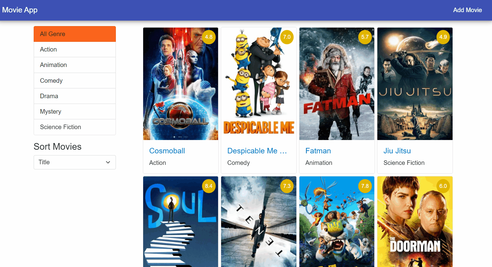
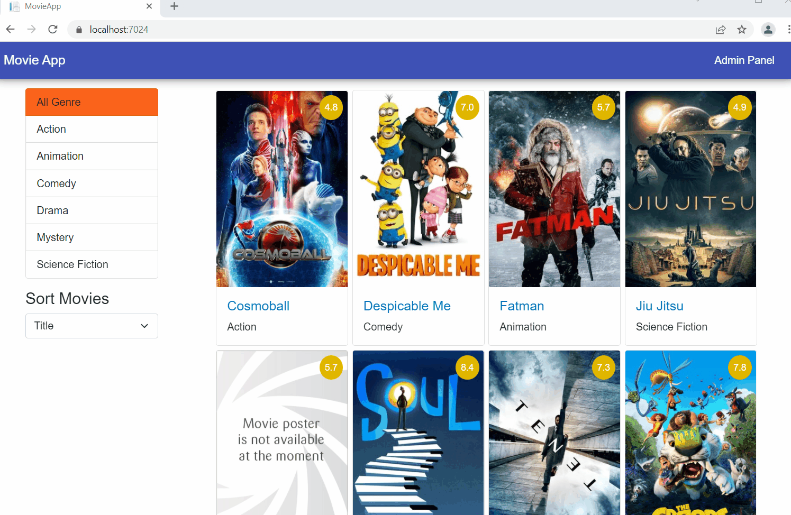

# A Full-Stack Web App Using Blazor WebAssembly and GraphQL: Part 3

In [part 1](https://www.syncfusion.com/blogs/post/a-full-stack-web-app-using-blazor-webassembly-and-graphql-part-1.aspx "Blog: A Full-Stack Web App Using Blazor WebAssembly and GraphQL: Part 1") and [part 2](https://www.syncfusion.com/blogs/post/a-full-stack-web-app-using-blazor-webassembly-and-graphql-part-2.aspx "Blog: A Full-Stack Web App Using Blazor WebAssembly and GraphQL: Part 2") of this series, we learned how to create a GraphQL mutation and we created a GraphQL client with the help of the [Strawberry Shake](https://chillicream.com/docs/strawberryshake "Strawberry Shake tool documentation") tool, which allowed us to consume server endpoints.

Continuing with this application, this article will cover how to add the edit and delete capabilities to the movie data. We will configure the home page of our app to display the list of movies and will provide sort and filter movie options to the user.

## Update the IMovie interface

Update the **IMovie.cs** file by adding the following method declaration:

```
publicinterfaceIMovie{// other methodsTask<List<Movie>>GetAllMovies();TaskUpdateMovie(Movie movie);Task<string>DeleteMovie(int movieId);}
```

## Update the MovieDataAccessLayer class

Update the **MovieDataAccessLayer** class by implementing the **GetAllMovies** method as shown below.

```
publicasyncTask<List<Movie>>GetAllMovies(){returnawait _dbContext.Movies.AsNoTracking().ToListAsync();}
```

The GetAllMovies method will return the list of all the movies from the database.

Add the definition for the **UpdateMovie** method as shown below:

```
publicasyncTaskUpdateMovie(Movie movie){try{var result =await _dbContext.Movies.FirstOrDefaultAsync(e => e.MovieId== movie.MovieId);if(result isnotnull){
            result.Title= movie.Title;
            result.Genre= movie.Genre;
            result.Duration= movie.Duration;
            result.PosterPath= movie.PosterPath;
            result.Rating= movie.Rating;
            result.Overview= movie.Overview;
            result.Language= movie.Language;}await _dbContext.SaveChangesAsync();}catch{throw;}}
```

The UpdateMovie method accepts an object of the type Movie.

To see the method in action,query the database to find the existing movie record based on the movieId. If the movie exists in the database, this method updates it based on the parameter passed to the method.

Finally, add the definition for the **DeleteMovie** method as shown below:

```
publicasyncTask<string>DeleteMovie(int movieId){try{Movie? movie =await _dbContext.Movies.FindAsync(movieId);if(movie isnotnull){
            _dbContext.Movies.Remove(movie);await _dbContext.SaveChangesAsync();return movie.PosterPath;}returnstring.Empty;}catch{throw;}}
```

The DeleteMovie method accepts the movieId as the parameter and deletes the movie from the database based on the movieId passed to it.The DeleteMovie method returns the poster path of the movie so that we can delete its poster in the server.

## Add the GraphQL server query to fetch all movie data

Add the following query definition in the **MovieQueryResolver** class:

```
[GraphQLDescription("Gets the list of movies.")][UseSorting][UseFiltering]publicasyncTask<IQueryable<Movie>>GetMovieList(){List<Movie> availableMovies =await _movieService.GetAllMovies();return availableMovies.AsQueryable();}
```

The **GetMovieList** method invokes the **GetAllMovies** method of the movie service to fetch the list of all the available movies.

We have annotated the GetAllMovies method with the following two attributes:

- **UseSorting**: Sorts the movie data either in ascending or descending order based on the object properties.
- **UseFiltering**: Filters the movie data based on the object properties such as movieId, title, rating, etc.

## Add GraphQL server mutation to edit and delete movie data

Add the mutation for editing the movie data in the **MovieQueryResolver** class as shown below.

```
[GraphQLDescription("Edit an existing movie data.")]publicasyncTask<AddMoviePayload>EditMovie(Movie movie){boolIsBase64String=CheckBase64String(movie.PosterPath);if(IsBase64String){string fileName =Guid.NewGuid()+".jpg";string fullPath =System.IO.Path.Combine(posterFolderPath, fileName);byte[] imageBytes =Convert.FromBase64String(movie.PosterPath);File.WriteAllBytes(fullPath, imageBytes);

        movie.PosterPath= fileName;}await _movieService.UpdateMovie(movie);returnnewAddMoviePayload(movie);}staticboolCheckBase64String(string base64){Span<byte> buffer =new(newbyte[base64.Length]);returnConvert.TryFromBase64String(base64, buffer,outint bytesParsed);}
```

The **EditMovie** method accepts an object of the type Movie as a parameter, and it helps us to update the existing movie data. While updating the movie data, we also need to handle the following two cases:

- Case 1: If the user has updated the poster of the movie.
- Case 2: If the poster image is not updated.

In case 1, we receive a base64 string in the **PosterPath** property of the movie object.

In case 2, we receive the name of the image which was saved to the database while adding the movie.

For this reason, we created the method **CheckBase64String**, which helps us to check if the PosterPath property contains a base64 string. This method will return a Boolean value if the PosterPath property contains a base64 string.

If the user has updated the poster image, then convert the base64 string to a byte array and save it as a file to the **Poster** folder on the server. This process is the same as what we did in the AddMovie method.

Then, invoke the UpdateMovie method of the movie service.

Similarly, add the mutation for deleting the movie data as shown below:

```
[GraphQLDescription("Delete a movie data.")]publicasyncTask<int>DeleteMovie(int movieId){string coverFileName =await _movieService.DeleteMovie(movieId);if(!string.IsNullOrEmpty(coverFileName)  coverFileName != _config["DefaultPoster"]){string fullPath =System.IO.Path.Combine(posterFolderPath, coverFileName);if(File.Exists(fullPath)){File.Delete(fullPath);}}return movieId;}
```

The **DeleteMovie** method accepts movieId as the parameter. If the poster of the deleted movie is not the default poster, then the method deletes it from the server as well.

## Add the configuration for sorting and filtering

To add the sorting and filtering options, register the extension methods in the **Program.cs** file as shown below:

```
 builder.Services.AddGraphQLServer().AddQueryType<MovieQueryResolver>().AddMutationType<MovieMutationResolver>().AddFiltering().AddSorting();
```

Let us now focus on the client-side of the application.

## Add GraphQL client queries

Since we have added new methods on the server, [regenerate the GraphQL client](https://www.syncfusion.com/blogs/post/a-full-stack-web-app-using-blazor-webassembly-and-graphql-part-2.aspx#general-graphql-client-using-server-schema "Generate the GraphQL client using the server schema") using the process discussed in part 2 of this series.

Add a file named **FetchMovieList.graphql** inside the **MovieApp.ClientGraphQLAPIClient** folder. Add the GraphQL query to fetch the list of movies as shown below:

```
 query FetchMovieList{
  movieList{
    movieId,
    title,
    posterPath,
    genre,
    rating,
    language,
    duration
  }}
```

To filter the movie data based on the movieId, use the Schema Definition Language (SDL) query as shown below. This query will return the movie with the movieId 20.

```
 query{ movieList(where:{
    movieId:{eq:20}}){
    movieId,
    title,
    rating,
    genre,
    duration,
    overview,
    posterPath
  }}
```

Write the generic query to filter the movie data. Add a new file named **FilterMovieData.graphql** and add the following GraphQL query:

```
 query FilterMovieByID($filterInput:MovieFilterInput){
  movieList(where:$filterInput){
    movieId,
    title,
    posterPath,
    genre,
    rating,
    language,
    duration,
    overview
  }}
```

Allow sorting of movie data based on the movie title, rating, and duration using the following SDL query. This query will return the list of movies in the ascending order of rating.

```
 query{ movieList(
  order:{rating:ASC}){
    movieId,
    title,
    rating,
    genre,
    duration,
    overview,
    posterPath
  }}
```

Write the generic query to sort the movie data. Add a new file named **SortMovieData.graphql** and add the following GraphQL query to sort the movies:

```
 query SortMovieList($sortInput:MovieSortInput!){
  movieList(order:[$sortInput]){
    movieId,
    title,
    posterPath,
    genre,
    rating,
    language,
    duration
  }}
```

Add a new file named **EditMovieData.graphql** and add the following GraphQL mutation for editing the movie:

```
 mutation EditMovieData($movieData:MovieInput!){
  editMovie(movie:$movieData){
  movie{
      title
    }}}
```

Finally, add a file named **DeleteMovieData.graphql** and add the following GraphQL mutation for deleting the movie:

```
 mutation DeleteMovieData($movieId:Int!){
    deleteMovie(movieId:$movieId)}
```

We can also write the mutation for deleting using the following SDL. This will delete the movie with movieId 20.

```
 mutation{
    deleteMovie(movieId:20)}
```

## Configure Bootstrap and Font Awesome

We use Font Awesome icons and Bootstrap modal dialogs in this application. Therefore, we need to configure our app to use them.

Navigate to the **MovieApp.Clientwwwrootindex.html** file and add the CDN link for Font Awesome in the **<head>** section as shown below:

```
<linkrel="stylesheet"type="text/css"href="https://cdnjs.cloudflare.com/ajax/libs/font-awesome/5.15.4/css/all.min.css"/>
```

Add the CDN link for Bootstrap at the end of the **<body>** section.

```
<scriptsrc="https://cdn.jsdelivr.net/npm/@popperjs/core@2.10.2/dist/umd/popper.min.js"integrity="sha384-7+zCNj/IqJ95wo16oMtfsKbZ9ccEh31eOz1HGyDuCQ6wgnyJNSYdrPa03rtR1zdB"crossorigin="anonymous"></script><scriptsrc="https://cdn.jsdelivr.net/npm/bootstrap@5.1.3/dist/js/bootstrap.min.js"integrity="sha384-QJHtvGhmr9XOIpI6YVutG+2QOK9T+ZnN4kzFN1RtK3zEFEIsxhlmWl5/YESvpZ13"crossorigin="anonymous"></script>
```

You can also refer to [Bootstrap’s official page](https://getbootstrap.com/docs/5.1/getting-started/download/ "Downlaod Bootstrap") to get the CDN links.

We will display the movie in a card layout on the home page. Each card will display the movie title, poster, and the rating of the movie. Upon clicking the card, the user will be navigated to a movie details page, where they can see the complete movie data. The home page contains a list of genres which will allow us to filter the movie data based on genre. A dropdown list will also be provided to sort the movie data.

Let us proceed to create all the required components.

## Create the rating component

We display the movie rating on both the home page and the movie details page with a custom style as shown below.


Therefore, we will create a sharable component for it.

Create a new component and name it **MovieRating.razor** under the **Pages** folder. Add a base class for the component and name it **MovieRating.razor.cs**.

Add the following code to the base class.

```
usingMicrosoft.AspNetCore.Components;namespaceMovieApp.Client.Pages{publicclassMovieRatingBase:ComponentBase{[Parameter]publicdecimal?Rating{get;set;}}}
```

This component will accept a parameter of type decimal to display the rating.

Add the following code in the **MovieRating.razor** file:

```
@inheritsMovieRatingBase<span class="movie-rating">@Rating</span>
```

To add the custom style to the component, add a stylesheet named **MovieRating.razor.css**. Put the following code inside it:

```
.movie-rating {
    background:#e0b600;
    border:3px solid #e0b600;
    padding:5px;
    color:#fff;
    text-align: center;
    display: block;
    z-index:100;
    min-width:35px;
    font-size:14px;
    border-radius:50%;}
```

## Create the movie details component

The movie details component helps us to display the complete information of a movie to the user.

Add a component named **MovieDetails.razor**. Add the base class and stylesheet for this component.

Add the following code to the base class:

```
publicclassMovieDetailsBase:ComponentBase{[Inject]MovieClientMovieClient{get;set;}=default!;[Parameter]publicintMovieID{get;set;}publicMovie movie =new();protectedstring imagePreview =string.Empty;protectedstring movieDuration =string.Empty;protectedoverrideasyncTaskOnParametersSetAsync(){MovieFilterInput movieFilterInput =new(){MovieId=new(){Eq=MovieID}};var response =awaitMovieClient.FilterMovieByID.ExecuteAsync(movieFilterInput);if(response.Dataisnotnull){var movieData = response.Data.MovieList[0];

            movie.MovieId= movieData.MovieId;
            movie.Title= movieData.Title;
            movie.Genre= movieData.Genre;
            movie.Duration= movieData.Duration;
            movie.PosterPath= movieData.PosterPath;
            movie.Rating= movieData.Rating;
            movie.Overview= movieData.Overview;
            movie.Language= movieData.Language;

            imagePreview ="/Poster/"+ movie.PosterPath;ConvertMinToHour();}}voidConvertMinToHour(){TimeSpan movieLength =TimeSpan.FromMinutes(movie.Duration);
        movieDuration =string.Format("{0:0}h {1:00}min",(int)movieLength.TotalHours, movieLength.Minutes);}}
```

This component will accept the parameter **MovieID** of type integer. In the **OnParametersSetAsync** lifecycle method, we will create an object of the type MovieFilterInput to filter the movie data based on the component parameter. Then, invoke the **FilterMovieByID** method of the MovieClient to get the filtered movie data. Since the movieId is a primary key for our object, the method will return a single value.

Now, fetch the movie poster directly from the server using the **posterPath** property.

The movie length is defined as minutes. Use the **ConvertMinToHour** method to convert the length of movies to the hour and minute format.

Add the following code to the **MovieDetails.razor** file:

```
@page"/movies/details/{movieID:int}"@inheritsMovieDetailsBase@if(movie.MovieId>0){<div class="row justify-content-center"><div class="col-md-10"><h1 class="display-4">MovieDetails</h1><hr /><div class="card mt-3 mb-3 p-3"><div class="row"><div class="col-md-3"></div><div class="d-flex col"><div class="d-flex flex-column justify-content-between w-100"><div><div class="d-flex justify-content-between"><h1>@movie.Title</h1><span><MovieRatingRating="@movie.Rating"></MovieRating></span></div><p>@movie.Overview</p></div><div class="d-flex justify-content-between"><span><strong>Language</strong> : @movie.Language</span><span><strong>Genre</strong> : @movie.Genre</span><span><strong>Duration</strong> : @movieDuration</span></div></div></div></div></div></div></div>}else{<p><em>Loading...</em></p>}
```

Display all the movie data on a Bootstrap card. Use the **<MovieRating>** component to display the rating.

Update the stylesheet by adding the following code:

```
 img {
    overflow: hidden;
    transition: transform .5s;}

 img:hover {
    transform: scale(1.5);}
```

This will add a magnifying effect to the poster image on hover.

## Create the card component

Add a component named **MovieCard.razor** and add the base class and stylesheet for it.

Add the following code to the base class:

```
usingMicrosoft.AspNetCore.Components;usingMovieApp.Server.Models;namespaceMovieApp.Client.Pages{publicclassMovieCardBase:ComponentBase{[Parameter]publicMovieMovie{get;set;}=new();protectedstring imagePreview =string.Empty;protectedoverridevoidOnParametersSet(){
            imagePreview ="/Poster/"+Movie.PosterPath;}}}
```

This component will accept a parameter of type Movie. Inside the **OnParametersSet** lifecycle method, set the movie poster directly from the server using the **posterPath** property.

Add the following code in the **MovieCard.razor** file:

```
@inheritsMovieCardBase<div class="card movie-card"><a href='/movies/details/@Movie.MovieId'></a><div class="card-body"><span class="card-rating"><MovieRatingRating="@Movie.Rating"></MovieRating></span><a href='/movies/details/@Movie.MovieId'><h5 class="card-title">@Movie.Title</h5></a><p class="card-text">@Movie.Genre</p></div></div>
```

We will display the movie title, poster image, and genre in this component. Clicking on the movie title or the poster image will redirect the user to the MovieDetails component.

Update the stylesheet by adding the following code:

```
.movie-card {
    min-width:200px;
    max-width:200px;
    max-height:400px;
    margin:3px;}

 a {
    text-decoration: none;}.card-rating {
    position: absolute;
    right:7px;
    top:7px;}.card-title {
    text-overflow: ellipsis;
    white-space: nowrap;
    overflow: hidden;}.card {
    transition:.3s;}.card:hover {
    box-shadow:05px5px-3px#777, 0 8px 10px 1px #777, 0 3px 14px 2px #777;}
```

## Create the genre component

The genre component will display the list of genres and allow us to filter the movies based on the selected genre.

Add a component named **MovieGenre.razor** and add the base class and stylesheet for this component.

Add the following code to the base class:

```
publicclassMovieGenreBase:ComponentBase{[Inject]NavigationManagerNavigationManager{get;set;}=default!;[Inject]MovieClientMovieClient{get;set;}=default!;[Parameter]publicstringSelectedGenre{get;set;}=string.Empty;protectedList<Genre> lstGenre =new();protectedoverrideasyncTaskOnInitializedAsync(){var results =awaitMovieClient.FetchGenreList.ExecuteAsync();if(results.Dataisnotnull){
            lstGenre = results.Data.GenreList.Select(x =>newGenre{GenreId= x.GenreId,GenreName= x.GenreName,}).ToList();}}protectedvoidSelectGenre(string genreName){if(string.IsNullOrEmpty(genreName)){NavigationManager.NavigateTo("/");}else{NavigationManager.NavigateTo("/category/"+ genreName);}}}
```

We have injected the **NavigationManager** and **MovieClient** into the component. The component will accept the parameter SelectedGenre of type string.

Inside the **OnInitializedAsync** method, fetch the list of genres by invoking the **FetchGenreList** method of the MovieClient.

SelectGenre will accept a genreName as a parameter. If the genreName is not null, then redirect the user to the route to filter the movie based on the selected genre.

**Note:** We will define the route to filter the movies based on the genre in the next section when configuring the home component.

Add the following code in the **MovieGenre.razor** file:

```
@inheritsMovieGenreBase<div class="list-group mb-3 col-md-2"><a @onclick="(() => SelectGenre(string.Empty))"class="list-group-item list-group-item-action
        @(string.IsNullOrEmpty(SelectedGenre) ? "active-genre" : "")">AllGenre</a>@foreach(var genre in lstGenre){<a @onclick="(() => SelectGenre(genre.GenreName))"class="list-group-item list-group-item-action
            @(SelectedGenre==genre.GenreName ? "active-genre" : "" )">@genre.GenreName</a>}</div>
```

We will display the list of genres as a list group. Clicking on the genre name will invoke the SelectGenre method.

Update the stylesheet by adding the following code:

```
.active-genre {
    background-color:#fb641b;}

 a {
    cursor: pointer;}@media only screen and(max-width:768px){.list-group{
        position: relative;
        width:100%;}}
```

## Create the home component

The home component displays the movie data in a card layout. This will be the landing page for our application.

Add a component named **Home.razor**. Add the base class and stylesheet for this component.

Add the class definition inside the **Home.razor.cs** file as shown below.

```
publicclassHomeBase:ComponentBase{[Parameter]publicstringGenreName{get;set;}=default!;[Inject]MovieClientMovieClient{get;set;}=default!;protectedList<Movie> lstMovie =new();protectedList<Movie> filteredMovie =new();}
```

This component will accept the parameter GenreName of the type string. The parameter will be sent via the URL. The lstMovie property helps us to store the list of movies that will be displayed via the templates. The filteredMovie property helps us to store the list of movies to filter the movie data based on genre.

Add the method to fetch the movie list.

```
protectedoverrideasyncTaskOnInitializedAsync(){MovieSortInput initialSort =new(){Title=SortEnumType.Asc};awaitGetMovieList(initialSort);}asyncTaskGetMovieList(MovieSortInput sortInput){var results =awaitMovieClient.SortMovieList.ExecuteAsync(sortInput);if(results.Dataisnotnull){
        lstMovie = results.Data.MovieList.Select(x =>newMovie{MovieId= x.MovieId,Title= x.Title,Duration= x.Duration,Genre= x.Genre,Language= x.Language,PosterPath= x.PosterPath,Rating= x.Rating,}).ToList();}

    filteredMovie = lstMovie;}
```

Inside the **OnInitializedAsync** lifecycle method, define the initial sort order for the movie data on the home page. By default, the movie data on the home page will be sorted by ascending order of movie title.

We will fetch the sorted movie list by calling the **GetMovieList** method.

The SortEnumType is defined in the generated GraphQL client file MovieApp.ClientGraphQLAPIClientGeneratedMovieClient.StrawberryShake.cs.

Filter the movie data based on the parameter GenreName. Add the following methods:

```
protectedoverridevoidOnParametersSet(){FilterMovie();}voidFilterMovie(){if(!string.IsNullOrEmpty(GenreName)){
        lstMovie = filteredMovie.Where(m => m.Genre==GenreName).ToList();}else{
        lstMovie = filteredMovie;}}
```

The **FilterMovie** method will be called inside the **OnParametersSet** lifecycle method. If the component parameter and GenreName are not null, then filter the list of movies based on the genre.

**Note:** The component parameter GenreName is set by the SelectGenre method from the MovieGenre component as discussed in the previous section.

Finally, add the function to sort the movie data.

```
protectedasyncTaskSortMovieData(ChangeEventArgs e){switch(e.Value?.ToString()){case"title":MovieSortInput titleSort =new(){Title=SortEnumType.Asc};awaitGetMovieList(titleSort);break;case"rating":MovieSortInput ratingSort =new(){Rating=SortEnumType.Desc};awaitGetMovieList(ratingSort);break;case"duration":MovieSortInput durationSort =new(){Duration=SortEnumType.Desc};awaitGetMovieList(durationSort);break;}}
```

The SortMovieData method helps us to sort the list of movies. It can sort movies in ascending order of title, descending order of rating, descending order of duration, and so on.

Then, create an object of type MovieSortInput and invoke the GetMovieList to sort the movie data.

Add the following code in the **Home.razor** file:

```
@page"/"@page"/category/{GenreName}"@inheritsHomeBase<div class="row"><div class="col-md-3 col-sm-12"><div class="row g-0"><div class="filter-container"><MovieGenreSelectedGenre="@GenreName"></MovieGenre><div class="col-md-2 my-2"><h4>SortMovies</h4><select@onchange="SortMovieData"class="form-select"><option value="title" selected>Title</option><option value="rating">Rating</option><option value="duration">Duration</option></select></div></div></div></div><div class="col mb-3">@if(lstMovie.Count==0){<p>No data to display</p>}else{<div class="d-flex flex-wrap">@foreach(var movie in lstMovie){<MovieCardMovie="movie"></MovieCard>}</div>}</div></div>
```

There are two routes defined for this page:

- / : This is the default home page path of the app. This indicates that the component will be displayed as the app launches.
- /category/{GenreName}: This route helps us to display the filtered list of movies based on the URL parameter GenreName.

Now, provide a dropdown list for sorting the movies. The SortMovieData method will be invoked on the onchange event of the dropdown. We will iterate over the list of movies and display each movie using the **<MovieCard>** component.

Update the stylesheet by adding the code as shown below.

```
.filter-container {
    position:fixed;}@media screen and(max-width:768px){.filter-container {
        position: relative;}}
```

**Note:** We have created and configured the Home component, so we can now delete the **PagesIndex.razor** file.

## Execution demo

Launch the application and you can perform all the operations shown below:



## Install Syncfusion Toast package

The Syncfusion Blazor Toast component allows us to show toast messages to the user. Refer to this [getting started](https://blazor.syncfusion.com/documentation/toast/getting-started "Getting Started with Blazor Toast Component") document for adding the Toast component in a Blazor App.

Open the **Package Manager Console** and execute the following command in the **MovieApp.Client** project:

```
Install-PackageSyncfusion.Blazor.Notifications-Version20.1.0.XX
```

To register the Syncfusion Toast service, add the following line to the **MovieApp.ClientProgram.cs** file:

```
 builder.Services.AddSyncfusionBlazor();
```

Then, add the following imports to the **MovieApp.Client\_Imports.razor** file to use the Toast component:

```
@usingSyncfusion.Blazor@usingSyncfusion.Blazor.Notifications
```

Add the following lines of code in the **MovieApp.ClientSharedMainLayout.razor** file. This will provide a global configuration to the Syncfusion Toast component.

```
<SfToastID="toast_default" @ref="ToastObj"Title="Adaptive Tiles Meeting"Content="@ToastContent"Timeout="5000"Icon="e-meeting"><ToastPositionX="@ToastPosition"></ToastPosition></SfToast>
```

Add the reference to the stylesheet of the Syncfusion Toast component. Add the following line in the **<head>** section of the **MovieApp.Clientwwwrootindex.html** file:

```
<head>
    ....
    <linkhref="_content/Syncfusion.Blazor.Themes/bootstrap5.css"rel="stylesheet"/><scriptsrc="_content/Syncfusion.Blazor.Core/scripts/syncfusion-blazor.min.js"type="text/javascript"></script></head>
```

## Update the AddEditMovie component

Now, update the **AddEditMovie** component to include the edit functionality.

Add the **OnParametersSetAsync** lifecycle method to the **AddEditMovie.razor.cs** file as shown below:

```
protectedoverrideasyncTaskOnParametersSetAsync(){if(MovieID!=0){Title="Edit";MovieFilterInput movieFilterInput =new(){MovieId=new(){Eq=MovieID}};var response =awaitMovieClient.FilterMovieByID.ExecuteAsync(movieFilterInput);var movieData = response?.Data?.MovieList[0];if(movieData isnotnull){
            movie.MovieId= movieData.MovieId;
            movie.Title= movieData.Title;
            movie.Genre= movieData.Genre;
            movie.Duration= movieData.Duration;
            movie.PosterPath= movieData.PosterPath;
            movie.Rating= movieData.Rating;
            movie.Overview= movieData.Overview;
            movie.Language= movieData.Language;

            imagePreview ="/Poster/"+ movie.PosterPath;}}}
```

If the component parameter MovieID is set, then it means that the movie data already exists, and the component is invoked for editing the movie.

In the OnParametersSetAsync lifecycle method, we will create an object of the type MovieFilterInput to filter the movie data based on the component parameter. We will invoke the FilterMovieByID method of the MovieClient to get the movie data to be edited.

Update the **SaveMovie** method as shown below:

```
protectedasyncTaskSaveMovie(){MovieInput movieData =new(){MovieId= movie.MovieId,Title= movie.Title,Overview= movie.Overview,Duration= movie.Duration,Rating= movie.Rating,Genre= movie.Genre,Language= movie.Language,PosterPath= movie.PosterPath,};if(movieData.MovieId!=0){awaitMovieClient.EditMovieData.ExecuteAsync(movieData);}else{awaitMovieClient.AddMovieData.ExecuteAsync(movieData);}NavigateToAdminPanel();}
```

If the MovieId property of the MovieInput object is not set, then it means we are trying to add new movie data. In this case, invoke the **AddMovieData** method.

If the MovieId property of the MovieInput object is set, then it means we are trying to edit the existing movie data. In this case, invoke the **EditMovieData** method.

Update the **NavigateToAdminPanel** method as shown below:

```
protectedvoidNavigateToAdminPanel(){NavigationManager?.NavigateTo("/admin/movies");}
```

We will create the admin panel in the next section and configure the route for it.

## Create the admin panel

In this section, we are going to implement role-based authorization in our app. The admin user has access to add, edit, and delete a movie. Therefore, we will create an admin panel to manage the admin rights.

Add a component called **ManageMovies.razor** and add the base class for the component.

Include the class definition inside the **ManageMovies.razor.cs** file as shown below:

```
publicclassManageMoviesBase:ComponentBase{[Inject]MovieClientMovieClient{get;set;}=default!;[Inject]publicNavigationManagerNavigationManager{get;set;}=default!;[Inject]IToastServiceToastService{get;set;}=default!;protectedList<Movie>? lstMovie =new();protectedMovie? movie =new();}
```

Add the following method to fetch the list of movies:

```
protectedoverrideasyncTaskOnInitializedAsync(){awaitGetMovieList();}protectedasyncTaskGetMovieList(){var results =awaitMovieClient.FetchMovieList.ExecuteAsync();

    lstMovie = results?.Data?.MovieList.Select(x =>newMovie{MovieId= x.MovieId,Title= x.Title,Duration= x.Duration,Genre= x.Genre,Language= x.Language,PosterPath= x.PosterPath,Rating= x.Rating,}).ToList();}
```

Use the **GetMovieList** method to fetch the list of movies. Then, fetch the data by invoking the **FetchMovieList** method of the **MovieClient** and then map it to the **lstMovie** variable.

Finally, add the method to handle the delete operation as shown below:

```
protectedvoidDeleteConfirm(int movieID){
    movie = lstMovie?.FirstOrDefault(x => x.MovieId== movieID);}protectedasyncTaskDeleteMovie(int movieID){var response =awaitMovieClient.DeleteMovieData.ExecuteAsync(movieID);if(response.Dataisnotnull){awaitGetMovieList();ToastService.ShowSuccess("Movie data is deleted successfully");}}
```

The DeleteConfirm method will accept the movieID as a parameter. It will then find the movie to delete from the lstMovie variable based on the movieID supplied to it.

The DeleteMovie method will invoke the DeleteMovieData method of MovieClient to delete the movie from the database. Then, invoke the **GetMovieList** method to fetch the updated list of movies and use the Toast to display the success message.

Add the following code in the **ManageMovies.razor** file:

```
@page"/admin/movies"@inheritsManageMoviesBase<div class="row"><div class="col" align="right"><a href='/admin/movies/new'class="btn btn-primary" role="button"><i class="fas fa-film"></i>AddMovie</a></div></div><br />@if(lstMovie?.Count==0){<p><em>Loading...</em></p>}else{<table class="table shadow table-striped align-middle table-bordered"><thead class="table-success"><tr class="text-center"><th>Title</th><th>Genre</th><th>Language</th><th>Duration</th><th>Rating</th><th>Actions</th></tr></thead><tbody>@if(lstMovie isnotnull){@foreach(var movie in lstMovie){<tr class="text-center"><td>@movie.Title</td><td>@movie.Genre</td><td>@movie.Language</td><td>@movie.Duration min</td><td>@movie.Rating</td><td><a href='/admin/movies/edit/@movie.MovieId'class="btn btn-outline-dark" role="button">Edit</a><button class="btn btn-danger"
                                 data-bs-toggle="modal"
                                 data-bs-target="#deleteMovieModal"@onclick="(() => DeleteConfirm(movie.MovieId))">Delete</button></td></tr>}}</tbody></table>}
```

The route of the page is set as **/admin/movies**. We have provided the Add Movie button at the top and displayed the list of movies in a table. Every row of the table will have Edit and Delete buttons.

Clicking on the Edit button will navigate the user to the AddEditMovie component with the movieID parameter set.

Clicking on the Delete button will invoke the DeleteConfirm method. It opens a modal dialog to ask for a confirmation to delete the movie.

To add the modal dialog to handle the delete operation, add the following lines of code just after closing the **<table>** tag:

```
<divclass="modal fade"id="deleteMovieModal"data-bs-backdrop="static"data-bs-keyboard="false"><divclass="modal-dialog"><divclass="modal-content"><divclass="modal-header"><h3class="modal-title">Delete Movie</h3></div><divclass="modal-body"><h4>Do you want to delete this Movie ??</h4><tableclass="table"><tbody><tr><td>Title</td><td>@movie?.Title</td></tr><tr><td>Genre</td><td>@movie?.Genre</td></tr><tr><td>Language</td><td>@movie?.Language</td></tr><tr><td>Duration</td><td>@movie?.Duration</td></tr></tbody></table></div><divclass="modal-footer"><buttonclass="btn btn-danger"
                    @onclick="(() => DeleteMovie(movie.MovieId))"
                    data-bs-dismiss="modal">
                    Yes
                </button><buttonclass="btn btn-warning"data-bs-dismiss="modal">No</button></div></div></div></div>
```

This modal will display the details of the movie to be deleted and ask the user to confirm that they want to delete the movie data. If the user clicks the Yes button, the DeleteMovie method will be invoked and the modal will be closed.

If the user selects No, then the modal will close, and no action will be taken.

## Update the navigation bar

Open the **NavMenu.razor** file. Then, remove the **Add Movie** nav-link, and add the link to the admin panel as shown below:

```
<aclass="nav-link"href="admin/movies">Admin Panel</a>
```

## Demo execution

Launch the application and perform the edit and delete operations on the movie list. Refer to the following image to see it in action:



## Resource

The complete source code of this application is available on [GitHub](https://github.com/suresh-mohan/Blazor-WebAssembly-GraphQL "A Full-Stack Web App Using Blazor WebAssembly and GraphQL GitHub demo").

## Summary

Thanks for reading! In this article, we configured the app to provide edit and delete functionality to the movie data, added sort and filter options for the list of movies, and added a movie details page to display all the data of a movie.

In our next article of this series, we will learn how to add authentication and authorization to our app. We will add the login and registration functionality, and we will also configure client-side state management in our app.

Syncfusion’s [Blazor](https://www.syncfusion.com/blazor-components "Syncfusion Blazor UI components library") component suite offers over 70 UI components that work with both server-side and client-side (WebAssembly) hosting models seamlessly. Use them to build marvelous apps!

If you have any questions or comments, you can contact us through our [support forums](https://www.syncfusion.com/forums "Syncfusion support forum"), [support portal](https://support.syncfusion.com/ "Syncfusion support portal"), or [feedback portal](https://www.syncfusion.com/feedback/ "Syncfusion Feedback Portal"). We are always happy to assist you!

## Related blogs
