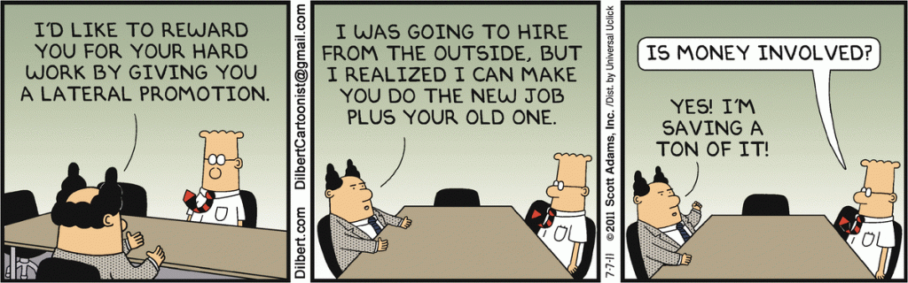

# Lessons learned from becoming CTO of a small startup

**Update 2021:** I wrote this in 2018, a year and a half after joining a startup to lead their development. Nowadays, I manage development at a [digital agency](https://mindnow.io/), [help early-stage startups](https://vadimkravcenko.com/qa/) kick-off their development and write guides for [Technical Managers](https://vadimkravcenko.com/technical-manager-guide/) and [Startup Founders](https://vadimkravcenko.com/founders-guide/).

---

I want to share with you my experience in moving to a CTO position. This post will mainly concern management on the technical side, CTOs, VP of Engineering, Heads of Departments, etc.

In every software engineer’s life comes a time when they need to decide if they want to pursue a career in engineering or switch to management. There are pros and cons to both of those choices, and it all depends on what your character is like, what you want out of life, and how well you can manage work-life balance.

I became CTO of a small company (< 40 Employees) a year ago, and that switch made me work harder than ever before; suddenly, the things I needed to do didn’t fit on a single to-do list, and as the weeks went by the list kept getting bigger. During that year, I finally managed to structure my work, and I would like to share a few things with you that I think are essential and would have made my life easier if I had known them back then.

## Moving up in the same company

First, you need to keep an eye on some points while transitioning from a developer position to a management position from the same team or just in the same company.

### **If you’re moving from the same team to become their manager, you need to make sure they respect you as a developer first.**

This is an important one, as otherwise, your teammates will question your management, and there will be a sense of distrust between you and the team. Remember how your manager used to suggest some bizarre stuff to improve the team’s efficiency? The more respect you have before becoming the manager, the less friction you will have with your ideas that not everyone agrees with.

### **Your friendship with your teammates will suffer once you’re their boss.**

If you want to continue being friends outside of your job, it’s best to leave work conversations inside the office building. This problem has several sides to it. The first one is that people on your team might view your friendship as a source of bias towards that person. They will assume that if your friend supports you, she is doing that not because it’s objectively reasonable but also because of friendship.

Another problem is that there will come a time when you will have to have unpleasant talks with that friend – no matter how strongly you support your friend, everyone makes mistakes. And if you don’t make the unpleasant conversation, then others will see this as unfair.

## Habits to get rid of

Usually, a transition to a leading position results in some habits needing to be rid of. Here are some of the habits that I needed to let go.

### **Desire to do everything yourself.**

Of course, you can do it better. Of course, you can do it faster. But your time is limited, and other more critical tasks at hand need to be prioritized. Learn to delegate and learn not to look over the shoulder of the person you’re delegating to.

Assume they will finish the job in a timely matter and as good as you. Only after the person fails to deliver should you talk about your expectation of standard, how fast you expect the tasks to be done, and the result’s quality.

It’s also possible that once you start doing everything by yourself, people will start expecting the same from you next time.

> Don’t be a bottleneck. If a matter is not a decision for the President or you, delegate it. Force responsibility down and out. Find problem areas, add structure, and delegate. The pressure is to do the reverse. Resist it. – *Donald Rumsfeld*

### **Desire to be the know-it-all.**

You can’t know all the answers, and it’s OK when you answer with “I don’t know” to some weird technical question. The important part is that you can connect the person asking the question with the person who knows the answer. Or at least set him on a path that leads to the solution.

> None of us is as smart as all of us.

### **Closing up and working alone.**

Sadly you will not be able to work alone anymore. The whole workflow of getting a task -> doing the task, -> submitting the job for review without zero human interaction is gone. (Although you will have to maintain that healthy workflow environment for your developers.)

The essential quality you will be required to improve is communication. You will need to talk with your developers—a lot. You will need to speak with your Directors—a lot. You will have a lot of calls and a lot of emails during the day. That’s just how it is, and there’s no way of avoiding it.

Unless you maintain a healthy environment bubble around your developers, people will start approaching them directly and annoying them with their stuff. These distractions will make your team unhappy. So take care of communication for them.

### **Caring only about your part of the work.**

“My module works, so it’s not my problem” or something similar along those lines should now be taboo in your vocabulary. Your responsibility now is the company’s success, so you’re not allowed to say that you did your part and everything else doesn’t matter. It matters.

If some other department is causing your team/department speed to slow down, it’s now your problem. If there’s a blocker somewhere outside of the company, like with third-party providers – you need to sort this out. Either delegate that to someone or solve the problem yourself, but there should be no “Our work/their work” mentality now.

## Habits to improve

There are also things that I needed to learn and improve after switching to a management position. Here are some of the things I consider essential:

### **Communication**

I’m going to repeat this here as this is so important. The amount of communication you have will increase ten-fold. You will need to hire people. You will have to talk to other people to make them more productive, discuss their problems, etc. Soft skills are critical in any management position.

> The art of communication is the language of leadership.

### **Stress management**

If you think you had stress when you couldn’t fix a bug or couldn’t finish enough tasks during a sprint, think again. Now you will be the shield for your developers, so everything negative to your team will go to you. Interesting fact, everything positive will also go your way, so there’s that.

You will have multiple stakeholders pressuring you and think the thing they want is the most important one. Instead of having one manager telling you that you need to work faster, you will have multiple people wanting different things from you and wanting them quickly.

You will need to learn how to deal with stress, personal advice – meditation, sports, and digital detox during the weekend.

> Paying attention to your body and taking care of yourself will help you deal with leadership stress.

### **Decision making**

Every decision you make from now on will probably concern your whole team and the company in general. You will need to think about all the trade-offs you’re making. Decisions usually contain some trade-offs. For example, refactoring some part of the code is a trade-off between current stability and future maintainability. Rewriting some Monolith into a bunch of Microservices is usually a trade-off between scalability, development cost, complexity, performance, and maintenance.

Leaders are often responsible for making challenging decisions, such as whether to rewrite the service from scratch, keep an employee, or let them go.

### **Ability to learn and adapt to new things**

There’s constantly new stuff on the market, new programming methods. It’s necessary to stay open and absorb as much information as possible to stay ahead of the curve.

Being in management does not mean that you need to stop watching Coursera videos or doing Udemy courses about Distributed systems. For you as a decision-maker, it’s crucial to have a broad knowledge of many things. The only way to achieve that is never to stop learning.

### **Accept that you will be wrong.**

Being wrong is an unpleasant feeling, but you will probably experience it multiple times if you have people working for you that are smarter than you. It’s OK to be proven wrong. You being wrong means that the suggested solution is better than yours, which is eventually better for the company. Please do not hold a grudge against someone with whom you argue, as that will lower their desire to discuss with you in the future. Only in arguments will the most optimal solution be found.

### **Caring about small things**

If you’re the department head, you will need to be the one who enforces standards, who cares about documentation, workflow, technical debt, etc.

Not many developers enjoy writing tests – this is now your responsibility to ensure that all of the “hygiene” things are getting done.

## Good things about being in Management

### **You will meet a lot of interesting people.**

As you’re in a position where you’re forced to communicate constantly, you meet many intelligent people. It will give a boost to your professional network.

### **You influence the direction of the company**

You are now part of the company’s driving force, and you get to decide, or at least vote on, some parts of the strategy. Driving the technical vision is a very fulfilling feeling, and the smaller the company – the more significant an impact you get to have. But remember, with great power comes great responsibility.

### **Experience!**

It’s a fantastic opportunity to learn new things that were unthinkable for you before. As Software Developers, we’re primarily focused on single bugs or part of a feature without expanding our horizons (during work hours, we can still build side projects with new technology over the weekend). But switching from development to management is a whole new field, and there are just so many new things to learn.

---

Thanks for reading! Here are some things I think you might like:

---

If you're interested in getting bi-weekly insights from me, sign up for the newsletter. Some of the topics that I like researching are: Growing a business, leading people, controlling chaos inside a startup. In general I write about being a good founder and a decent person.

June 16, 2022 at 3:43 am

Great article. Thank you so much for sharing this!

June 15, 2022 at 2:27 pm

Great advise. Thanks for sharing.

June 15, 2022 at 1:07 pm

again testing

June 15, 2022 at 11:52 am

Thanks for this great article!

June 15, 2022 at 8:43 am

Insightful. Can connect a lot with this article.

June 15, 2022 at 4:16 am

Thank you for sharing your beautiful stories, especially about “accepting that you will be wrong”

June 12, 2022 at 1:55 pm

I found this very useful! I’m personally thinking about this a lot and this personal experience will definitely help me.

June 12, 2022 at 1:40 pm

Testing comments
