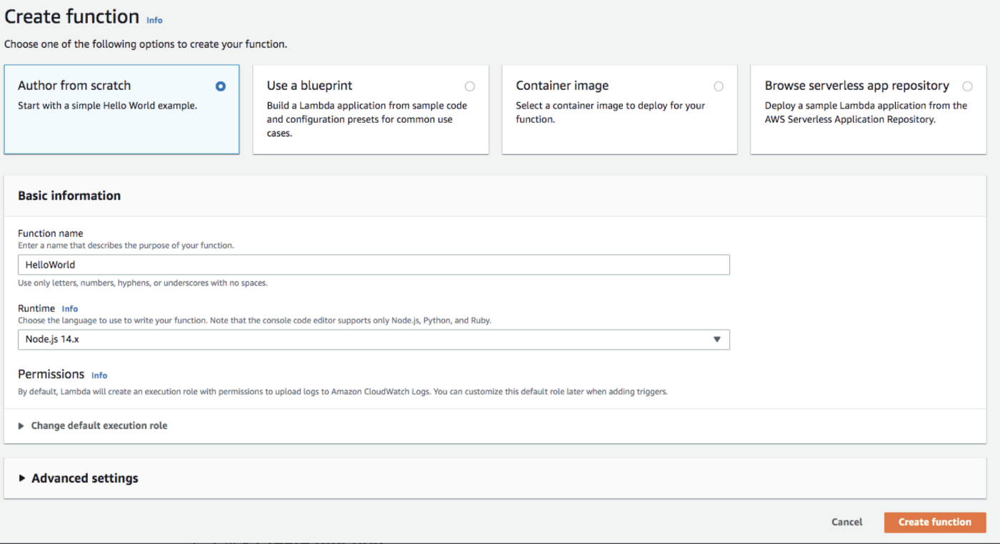
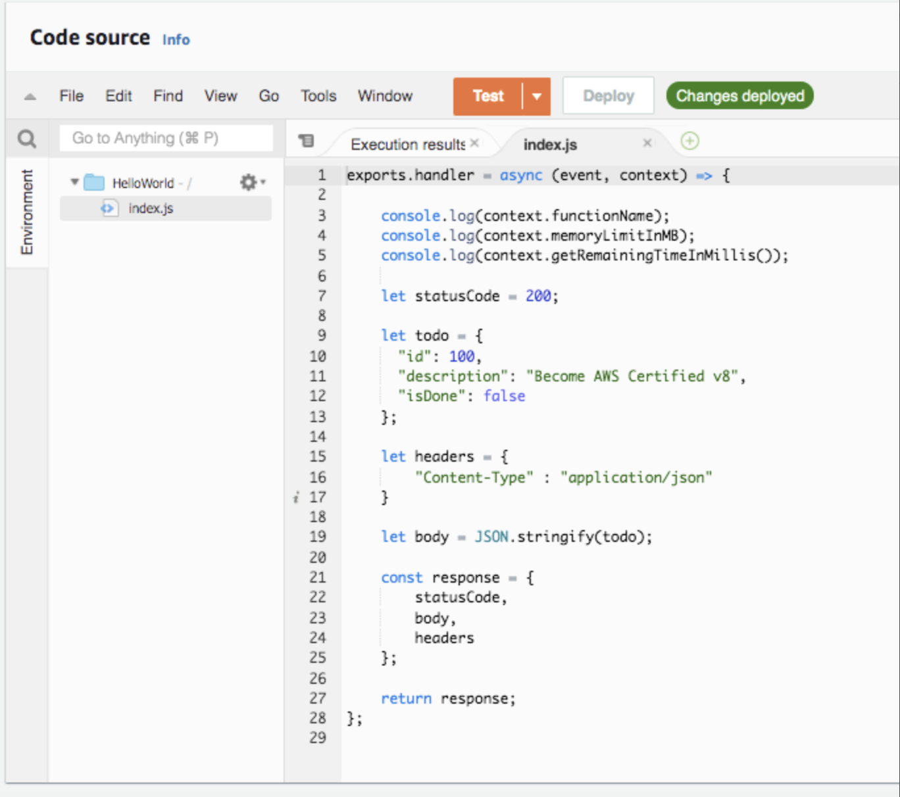
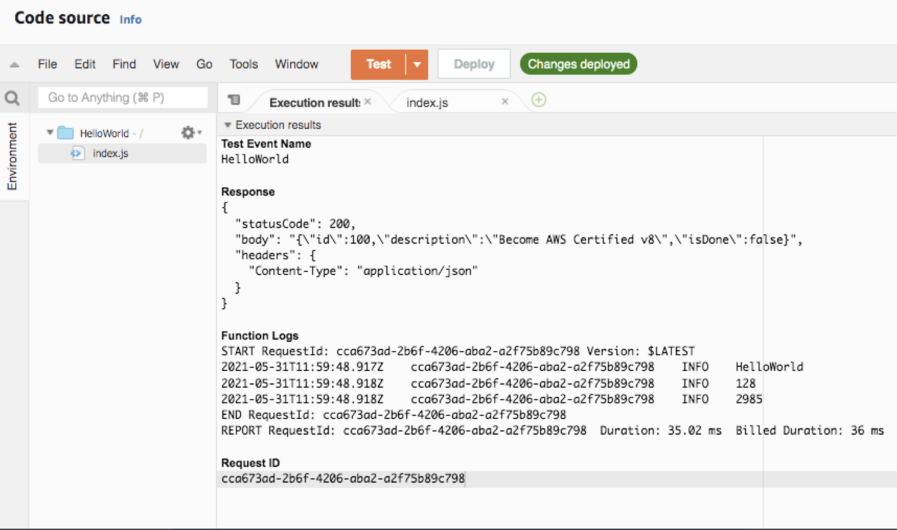

# Create your own AWS lambda function (Server-less)

> **Create a** hello world **Lambda Function**

*Your task is to create a hello world Lambda Function returning a JSON response. Example JSON Response:* `{“statusCode”: 200, “body”: “SOME_JSON”}.`

1. Select **region** US East (N. Virginia) — us-east-1. All our resources in this lab will be created in us-east-1.

2. In the **AWS Console**, from **Services** menu — choose **Lambda**. Click **Create function**.

4. Choose **Runtime** as Node.js 14.x. Choose defaults for the rest of the options.



5. Click **Create function.**

6. On the **Lambda Source Code** screen, Under **Code** > **Code Source** > Select the file **index.js** under the folder **HelloWorld**. Your screen should look like:



```
exports.handler = async (event, context) => {  
  
console.log(context.functionName);  
    console.log(context.memoryLimitInMB);  
    console.log(context.getRemainingTimeInMillis());    let statusCode = 200;  
  
let todo = {  
      "id": 100,  
      "description": "Become AWS Certified v8",  
      "isDone": false  
    };  
  
let headers = {  
        "Content-Type" : "application/json"  
    }  
  
let body = JSON.stringify(todo);  
  
const response = {  
        statusCode,  
        body,  
        headers  
    };  
  
return response;  
};
```

7. Click **Deploy . (** Your hello world Lambda function is ready )

8. Click **Test**

9. On the **Configure test event** screen, select **Create new test event**.

10. Choose **Event template** hello-world. Enter the Event name as HelloWorld and click **Create**.

11. Click **Test** again

Result of execution is shown below:



Lambda function returns a *JSON response* containing the fields — *statusCode*, *body* and *headers*. This will be mapped to the REST API response from API Gateway in the subsequent steps.
