# Let’s go Serverless.

Opting for a serverless architecture, minimizes lot of management and administration overhead. Does Serverless imply no servers? Nope. It simply means that the servers are managed by some one else for you.

Serverless is a cloud native execution model in which the cloud provider dynamically allocates the resources needed to execute a particular piece of code. This offers automatic scaling, built-in high availability and cost optimization with pay-per-use billing.

Let’s build a simple serverless architecture with API Gateway, Lambda functions, Dynamo DB and S3.Do more with less, let’s go serverless.

Use Case:

A URL is exposed for submitting small text documents. The payload will be scanned to get information about the document (ex:- document number and shipper details).These details will be extracted and saved in a NoSQL database. The entire message will be logged in an Object Store for later reference. A response is returned back to intimate the status of the operation. There should be provision to handle any failures during processing.

The sample architecture looks like this.

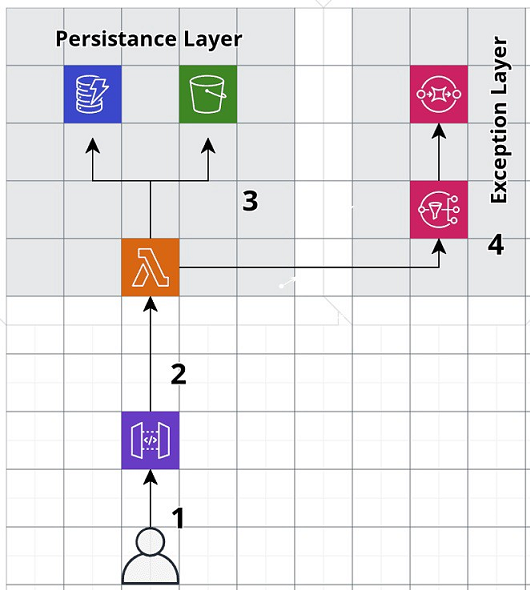

1. User will be invoking URL endpoint exposed by API Gateway. Protocol is REST over HTTPS.
2. Gateway invokes a lambda function.
3. Lambda function scans the message, extracts the details and saves in Dynamo DB. Lambda logs the received message in S3 as well.
4. Exceptions during processing are pushed to an SNS topic which has a SQS queue as a subscriber. Further integrations can be added here to process the error details, notify support team etc.

Come. Let’s build.

**Step 1:**Create a DynamoDB table say DocumentTable with 2 columns, DocumentNumber and PartyDetails.

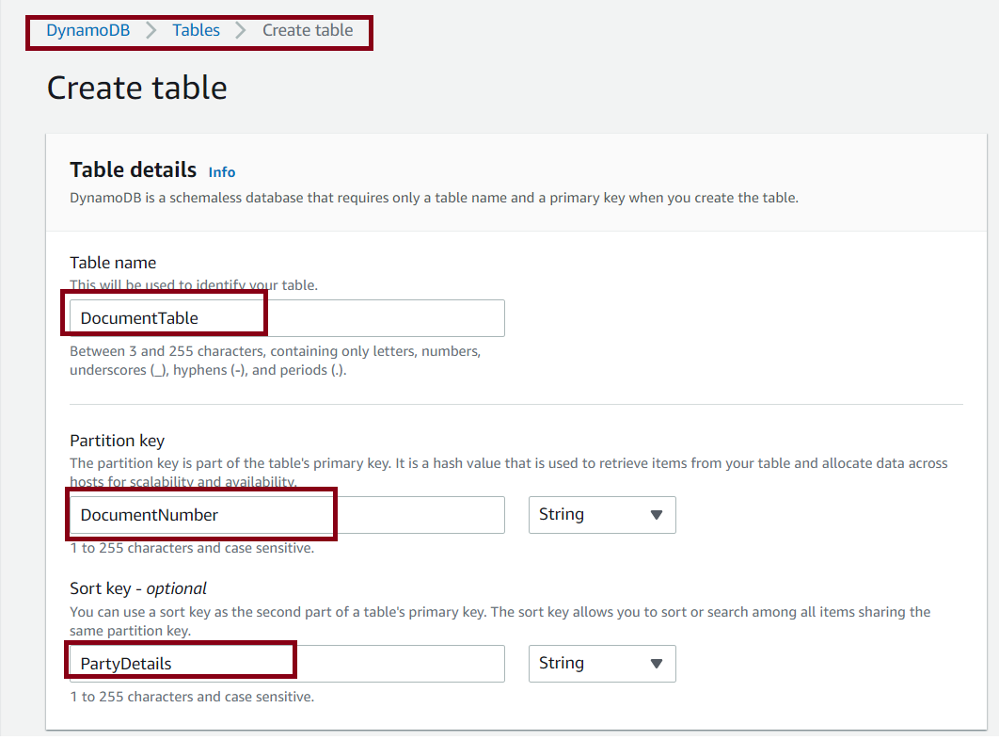

Keep all other settings as default and create the table.

**Step 2**

Create an S3 bucket to save the received message content.

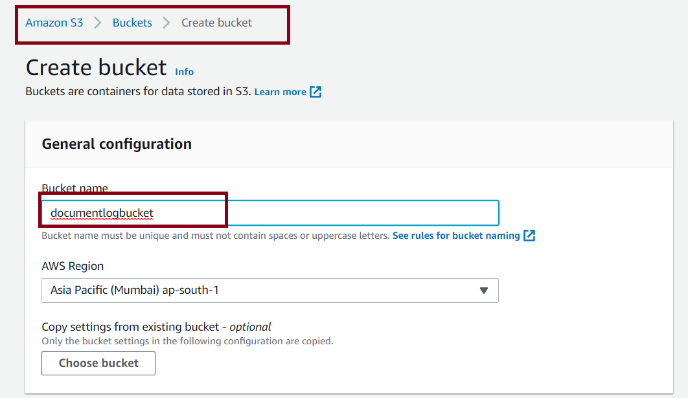

Create the bucket with default settings. Optionally versioning can be enabled if you wish to see multiple versions of the request with same document number.

**Step 3**

Create a service role to be assigned to the lambda function as its execution role which permits lambda to access S3, DynamoDB, CloudWatch and SNS.

Navigate to IAM -> Roles-> Create Role.

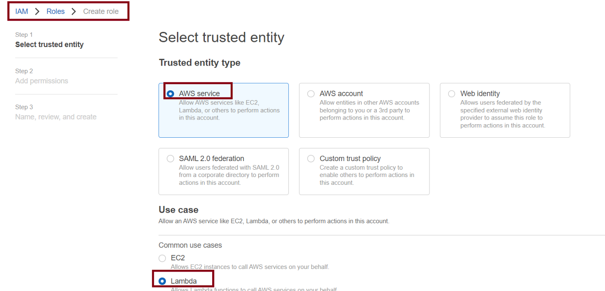

Select Trusted entity type as ‘AWS Service’ and Common Use Case as ‘Lambda’. Click Next and in Add Permissions section, search and select the preconfigured policies provided by AWS as shown.

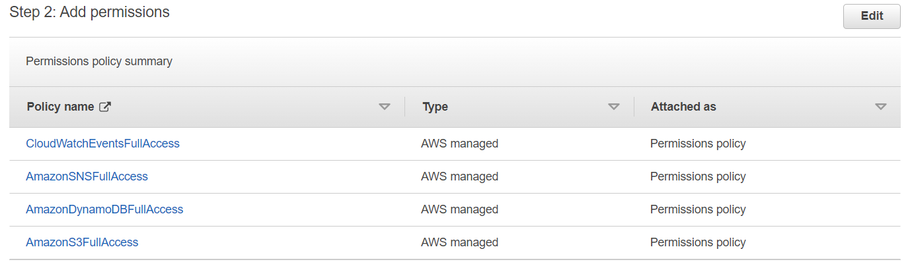

For the purpose of this case study, let’s assign pre configured permissions which gives full access to all the required resources. But always the principle of least privilege to be maintained during actual implementation.

Lambda needs Cloud Watch permissions to upload the logs of the execution. SNS permission is needed later for handling the exception scenarios.

**Step 4**

Create an SNS Topic with default values for Exception Flows so that lambda will publish a message in case of any failures.

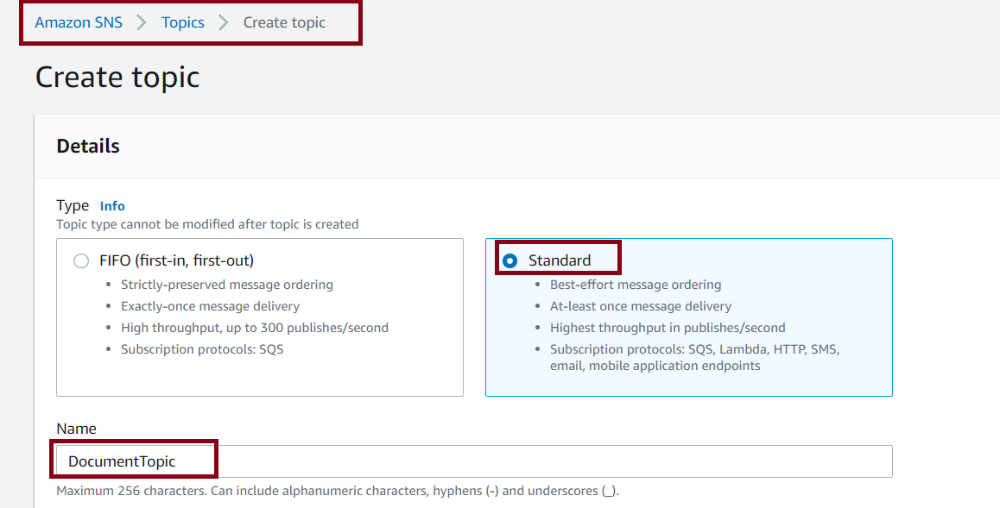

**Step 5**

Create a SQS queue as a subscriber to the above topic so that error messages can be polled for taking any action later.

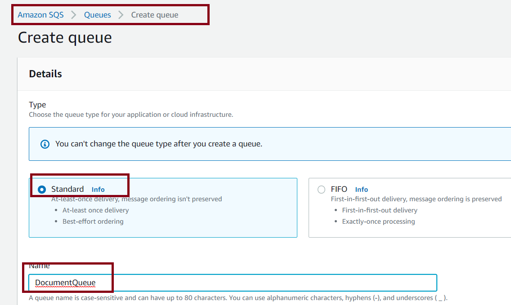

After creating the queue, subscribe to the previously created topic by clicking the highlighted button.

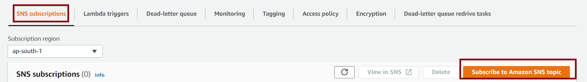

Navigate to the Access Policy tab and you can now see that a policy is added which permits the SNS Topic to send the message to queue.

Under the Subscriptions section of the SNS topic, the SQS queue will be listed. Ensure that Raw message delivery is turned on to see the message as is. When you enable raw message delivery for SQS, any Amazon SNS metadata is stripped from the published message and the message is sent as is.

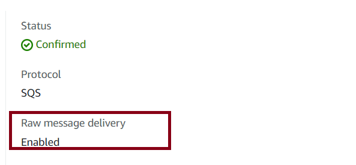

Create the lambda function. Navigate to the Lambda console and create the function with Node.js as runtime.

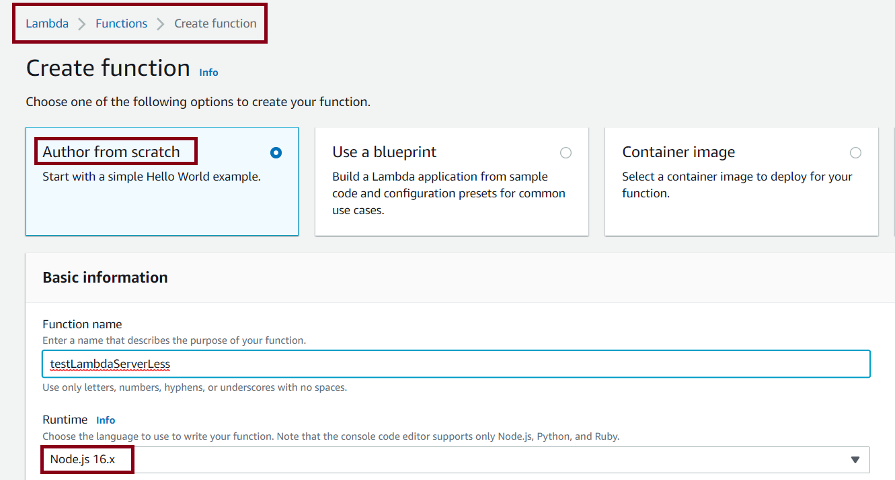

*Change default execution role to the existing role and select the previously created role in Step 3.*

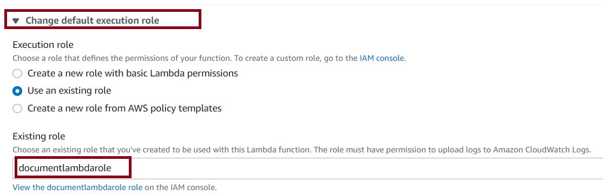

Under the ‘Code’ tab, replace the contents of the index.js file with the index.js file from GitHub repo after making necessary modifications. <https://github.com/asnakhader/aws-serverless>

Points to Note:

1. All the initialization and reusable components can be kept before the handler function. For ex:-Database Configuration and connection settings. Reason: Any variable outside the handler function will be frozen in between Lambda invocations and possibly reused. So all the variables can be placed inside the handler.

*var dynamoDB = new AWS.DynamoDB();*

*const tableName = “DocumentTable”;*

2. Environment Variables  
An environment variable is a pair of strings that is stored in a function’s configuration. You can use environment variables to adjust your function’s behavior without updating code. The Lambda runtime makes environment variables available to your code.  
Lets keep the code to be extracted from the text message as an environment variable. Navigate to Configuration -> Environment Variables and click ‘Edit’.

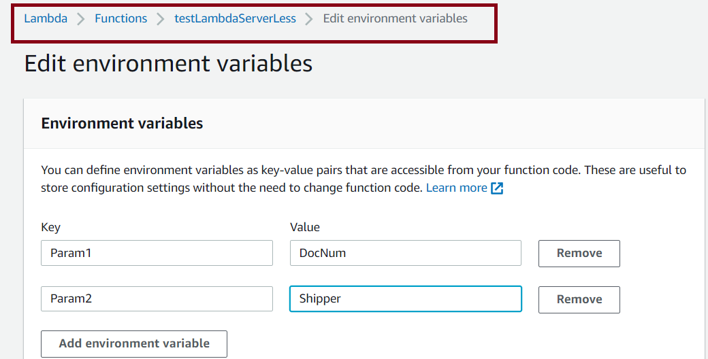

The function logic will scan for the occurrence of this parameters and extract it and save in DynamoDB.

*//extraction parameters   
 let param1 = process.env.PARAM1;  
 let param2 = process.env.PARAM2;*

If the parameters are not found in the received message, an error response will be sent back. Also, the function supports HTTP Post method. Invocation with any other request type will result in error.

3. Exception Flows

Lambda supports adding Destinations to handle success / failure scenarios for asynchronous invocation. Since we are using API Gateway to invoke lambda, this can not be used. However, we can programmatically push to SNS topic on failures.

3. Test the function

Under the ‘Test’ tab, create a test event. A sample payload with message body and request method is provided below.

We have configured parameters as ‘DocNum’ and ‘Shipper’. Run the test and details of the execution are listed.

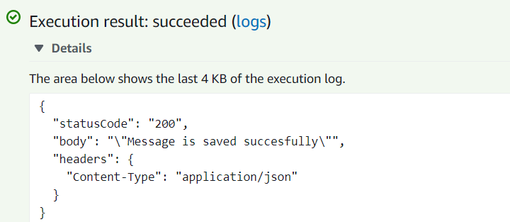

**Step 8**

Create a Trigger for Lambda and select API Gateway . Choose API Type as REST and Security as ‘Open’.

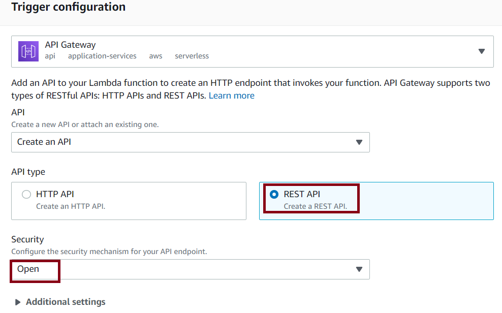

**Step 9**

Test the setup. You can use any software / plugin of your choice. I have installed Talend API tester which is a light weight Chrome plugin.

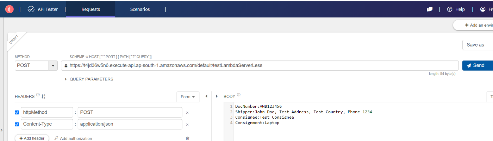

API gateway provides a URL invocation point. Copy the URL and configure the request parameters.

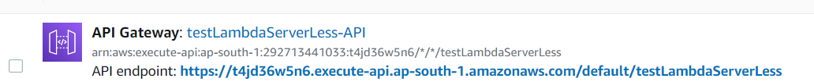

Sample payload given below.

You may notice slight difference in the test data used directly to test the function and below payload. This is because the tool will add the necessary tags like ‘header’ / ‘body’ etc.

Yay! Results are displayed and invocation is success.

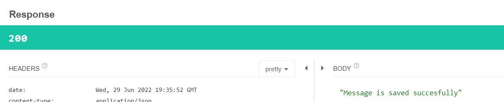

Navigate to S3 bucket to see the message logged.

Navigate to DynamoDB and record is created.

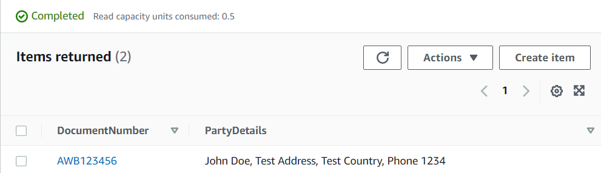

We can see that lambda invocation details are logged in CloudWatch as well.

Note : Using the same payload again will rewrite the data as DocumentNumber is used as the key in DynamoDB and S3.

Lets test the function for a failure. Invoke the function with ‘PUT’ method. Error response is returned. We are expecting the function to push a message to SNS.

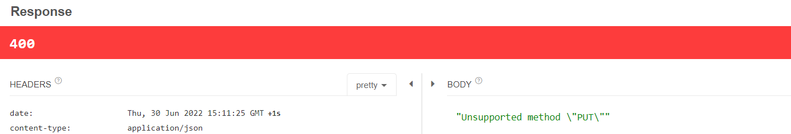

Navigate to SQS and poll for messages. The status of the polling is displayed and messages are getting listed.

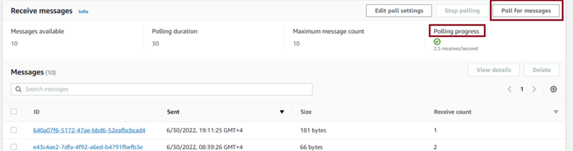

Click on the latest message to view the details of the error.

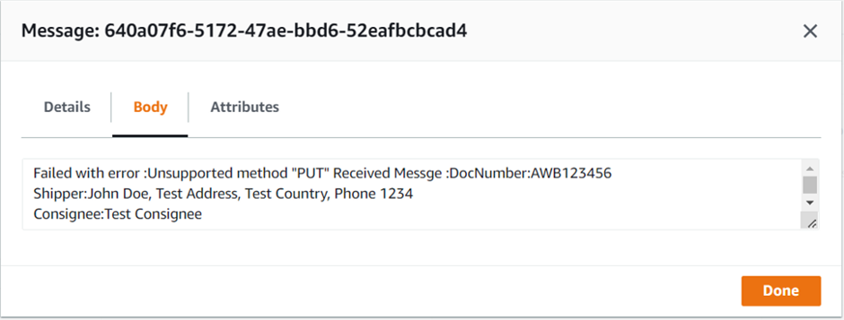

This can be used for further integrations like executing another lambda function / notifying support etc.

We have successfully completed a simple serverless architecture with persistence and exception layers in very less time. That’s cool.

Do more with less. Let’s go Serverless!!
