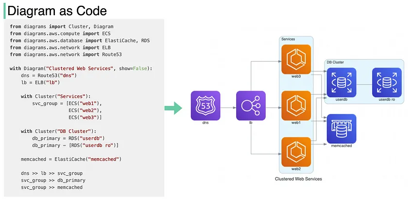
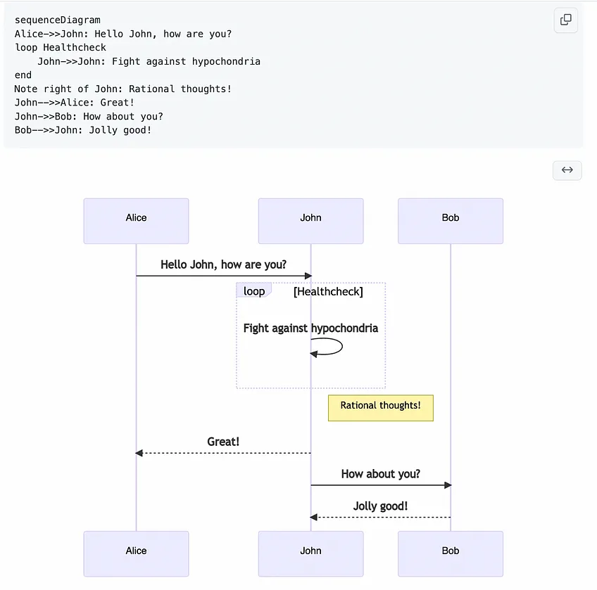
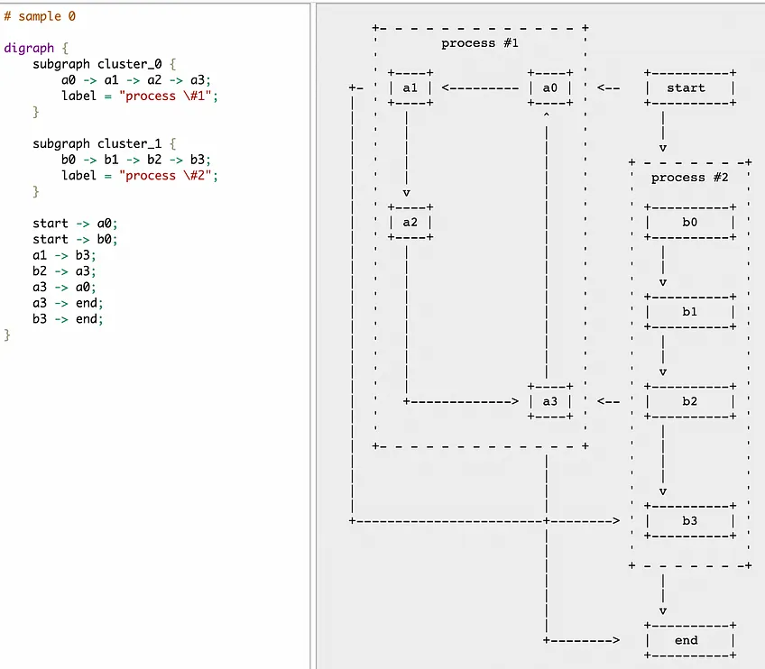
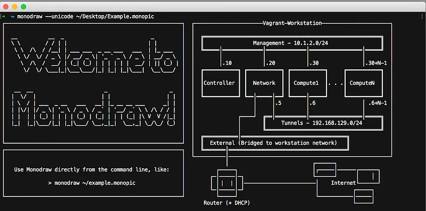
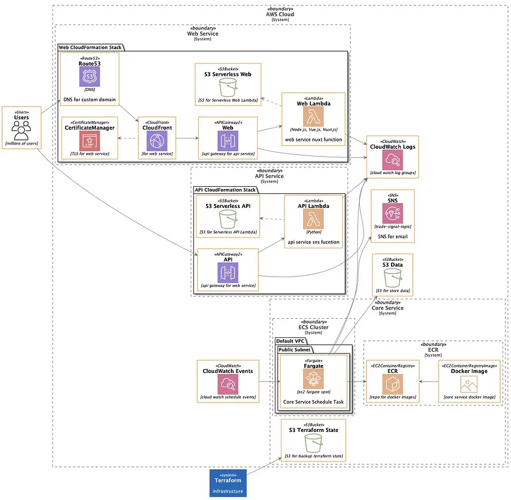
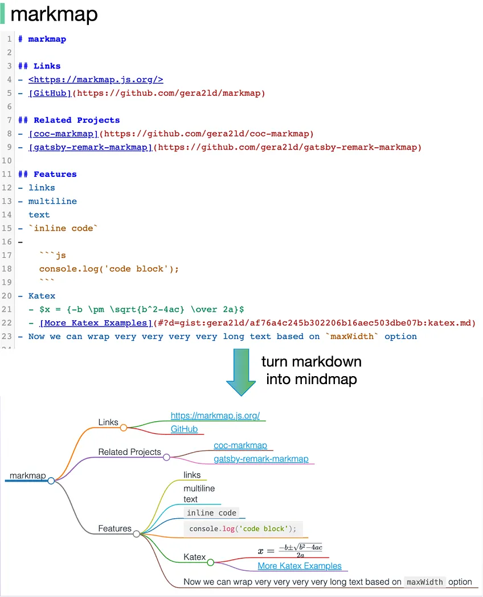
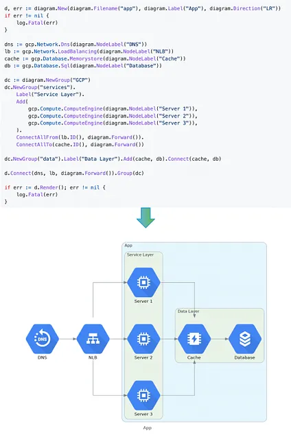

# Diagram as Code

### 6 different ways to turn code into beautiful architecture diagrams

24

#### **1. Diagrams**

Turn python code into cloud system architecture diagrams

Link: <https://github.com/mingrammer/diagrams>

Thanks for reading ByteByteGo Newsletter! Subscribe for free to receive new posts and support my work.

#### **2. Mermaid**

Generation of diagram and flowchart from text in a similar manner as markdown

Link: <https://github.com/mermaid-js/mermaid>

Example:

#### **3. ASCII editor**

Free editor:

<https://asciiflow.com/#/>

Free:

<https://dot-to-ascii.ggerganov.com/>

Paid editor:

<https://monodraw.helftone.com/>

#### **4. PlantUML**

It is an open source tool allowing users to create diagrams from a plain text language.

Link: <https://github.com/plantuml/plantuml>

Source code for the diagram: <https://raw.githubusercontent.com/bmpi-dev/bmpi.dev/master/content/dev/guide-to-serverless/arch_aws.plantuml>

Thanks for reading ByteByteGo Newsletter! Subscribe for free to receive new posts and support my work.

#### **5. Markmap**

Visualize your Markdown as mindmaps. It supports the VS code plugin.

Link: [https://markmap.js.org/rep](https://markmap.js.org/repl)

#### **6. Go diagrams**

Create beautiful system diagrams with Go

Link: <https://github.com/blushft/go-diagrams>

Thanks for reading ByteByteGo Newsletter! Subscribe for free to receive new posts and support my work.
