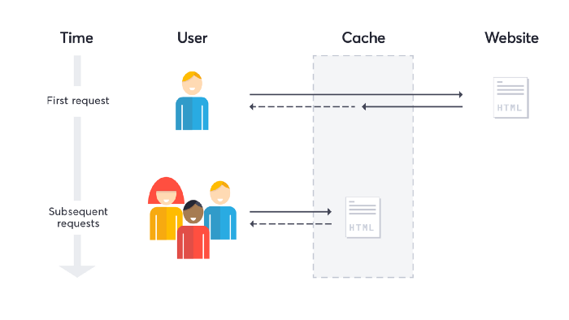
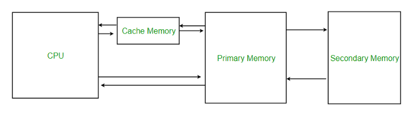
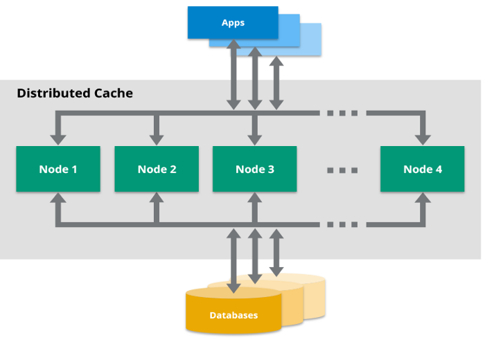
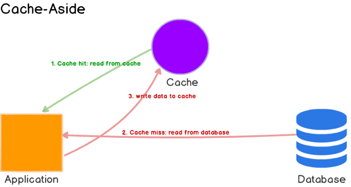
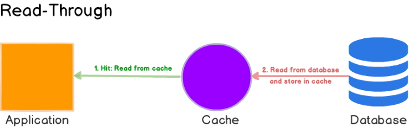
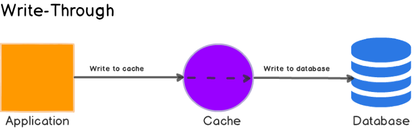
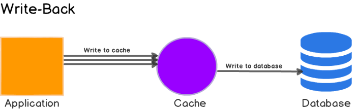
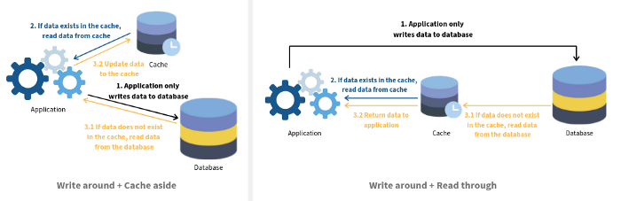

# Caching things every Programmer must know



Image Source: <https://blog.detectify.com/2020/07/28/do-you-trust-your-cache-web-cache-poisoning-explained/>

Hello everyone. Caching is one of the simplest yet complex topics and one of the basic things every programmer must understand. In this article, let me explain everything you need to know about Caching

# What is Caching?

A cache is an intermediary data store which can be hardware or software that can serve its data faster than the original data source (database, web service, etc). Caching is a mechanism to increase the speed and performance of an application by storing the data in a temporary memory instead of making costly database calls. It reduces the performance of the application by not using the DB connection and also less load on the database.

For example, when we load the profile page in any social media application, the profile information is retrieved from the database. The next time you click refresh, again the same call is made to the database to reload the information. Instead of that, the information can be stored in the temporary memory called Cache and it will load the details much faster without hitting the database. This is the reason that the first time profile page loads slower and the subsequent times, it is faster on most of the social networking sites and many others.

Let us take another example of Caching. Assume that Netflix has released a new movie for the Asia region and the first time when a user clicks the movie, the movie data is Cached to the CDN (Content Delivery Network). **A CDN, or content delivery network, caches content (Like images, videos, or webpages) in proxy servers that are located closer to end-users than origin servers.** For the subsequent users who request for the same movie in the same region, the movie will be loaded faster from the CDN cache.

# When caching is important?

Caching is very important for use cases like

- When an application needs to access resources that are hosted externally (for external APIs)
- When the application needs to access resources that do not change frequently (Static Content)
- When the application needs to access the same resources repeatedly
- When the application produces the same output frequently
- When the application needs to run extensive aggregation calculations (computation-intensive processing)
- Long-running queries on databases

The types of data that are typically cached include expensive database queries, user session data, and API responses.

# Benefits of Caching

- Improve Application Performance
- Reduce Database Cost
- Reduce the Load on the Backend
- Predictable Performance
- Eliminate Database Hotspots
- Increase Read Throughput (IOPS)
- System Scalability

# Structure of a Cache Memory

Having seen the above Cache, let us see the structure of a Cache memory in this section. In the below diagram, there are 4 parts namely CPU, Cache Memory, Primary Memory (RAM), and the Secondary Memory (Disk).



Image Source: <https://media.geeksforgeeks.org/wp-content/uploads/cache.png>

- **Level 1 or Register –**

Level 1 cache is very small and it is inside the CPU. The size normally ranges between 2 kilobytes (KB) and 64 KB and it is used to store data that are immediately processed in the CPU commonly used registers are accumulator, Program counter, address register, etc.

- **Level 2 or Cache memory –**

The Cache Memory is the fastest memory which has faster access time where data is temporarily stored for faster access. It is relatively bigger (4 MB typically) than the L1 Cache but slower when compared to L1

- **Level 3 or Main Memory –**

It is the memory on which the computer works i.e the RAM (Random Access Memory). It is bigger (in GBs) than L1 and L2 but slower than both.

- **Level 4 or Secondary Memory –**

The Level 4 or Secondary memory is slower than all the three levels above but this has a huge memory and data stored here is permanent and it can withstand the power loss

The cached data which is stored between the CPU and the main RAM is potentially stored in multiple levels: L1, L2, and L3. The system checks for the requested cache data first in L1, then in L2, and followed by L3. These three levels are temporary and faster while the L4 is permanent but slower.

The database server stores its data in the disk which is L4. That is the reason, the retrieval is very slow whereas the Cache server stores the data in the cache memory (L1 to L3) hence it is very fast but temporary and expensive.

# Types of Caching

- Application Caching (Accelerate application performance and data access)
- Database Caching (Reduce latency associated with database query requests)
- DNS Caching (Domain to IP Resolution)
- Client-Side Caching (Accelerate retrieval of web content from websites)
- CDN Cache (Accelerate retrieval of web/media content closer to the user's location)
- API Gateway Cache (Accelerates the data retrieval from the API gateway instead of hitting any backend servers)

# Distributed Caching



Image Source: <https://hazelcast.com/wp-content/uploads/2021/12/39_Distributed-Cache.png>

A distributed cache is nothing but a system that combines the RAM of multiple servers (known as nodes) and forms a cluster called a distributed cluster. The whole cluster acts as a single Cache component to the application and it scales up very fast based on the requests received. The cluster can add more nodes on-demand and reduce when the demand is down. An example of this is AWS Elastic Cache which supports the cloud-native applications like microservice architecture

A distributed cache pools the RAM of multiple computers into a single in-memory data store used as a data cache to provide fast access to data.

# Cache Hit and Cache Miss

When the data requested by the application is found in the Cache (L1, L2, L3), then it is considered to be a Cache Hit

When the data requested from the application is not in Cache, then it is considered to be a Cache Miss

# Caching Strategies

Now lets us look at the different ways we can cache the data

## 1. Cache Aside

We read from the Cache first and if there is a Cache Miss, then we read from the Database and then save the retrieved data to Cache so that next time we will get the Cache Hit



Image Source: <https://codeahoy.com/img/cache-aside.png>

## 2. Read Through

The read-through cache sits in line with the database. Here the application talks only to the Cache which checks for data in its memory. If there is a Cache miss, it will retrieve from the database, stored in Cache and responds to the application



Image Source: <https://codeahoy.com/img/read-through.png>

## 3. Write Through

When we save any data to the DB, we go through the Cache. We save to Cache first and then to the DB



Image Source: <https://codeahoy.com/img/write-through.png>

## 4. Write Back or Write Behind

The application writes data to the Cache and it acknowledges back to the application. The Cache writes to DB once in a while



Image Source: <https://codeahoy.com/img/write-back.png>

## 5. Write Around

Here, the data is written directly to the database and only the data that is read is stored in the Cache



Image Source: <https://s3.amazonaws.com/bluzelle-craft-private-storage/6.png?mtime=20190401053318>

# Caching Eviction or Invalidation

**Cache eviction** means freeing the memory of the old, unused data in the cache to make way for the new data. This is very important because the Cache memory should not be huge as it is expensive and it becomes slow. It is always better to keep the Cache compact so that it retrieves data faster while keeping your bills small

```
There are only two hard things in Computer Science: cache invalidation and naming things. — Phil Karlton
```

There are a lot of strategies we can implement to help the Cache identify which data to be removed and which one to be retained. Some of them are

- **First-in first-out** (FIFO). Based on the FIFO Queue mode, the earliest added entries must be evicted from the cache once the new entries come in
- **Last in first-out** (LIFO). This policy evicts the recently added data entries in the cache.
- **Least recently used** (LRU). This policy evicts the data in the cache that was last accessed the longest time ago.
- **Most recently used** (MRU). This policy evicts the data that is most recently accessed in the cache

These strategies vary from application to application and their use cases

In this article, we saw what is Cache, when do we need to Cache, and the benefits of Caching. Then we explored the Structure of a Cache Memory, which will give you all a good understanding of how is the data stored physically in a Cache. Then we saw the different types of Caching and also learned about Distributed Caching. Then the focus shifted to the Caching Strategies and the Cache Eviction.

Thanks for reading this and stay tuned!!! I believe this article will be a one-stop to learn everything you need to know about Cache. Please continue to read my next article

[## What is Redis Cache and how to use it in Spring Boot using Spring-Data-Redis?

### Hello everyone. In this article let us see how to use a Redis cache with a Spring Boot application. If you want to know…

dineshchandgr.medium.com](https://dineshchandgr.medium.com/what-is-redis-cache-and-how-to-use-it-in-spring-boot-using-spring-data-redis-d5ef9967f9e)

```
If you like to get more updates from me, please follow me on Medium and subscribe to email alert.  
If you are considering to buy a medium membership, please buy through my referral link https://dineshchandgr.medium.com/membership
```
