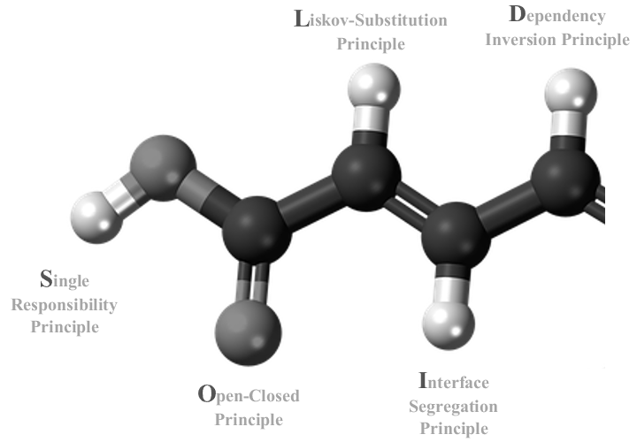
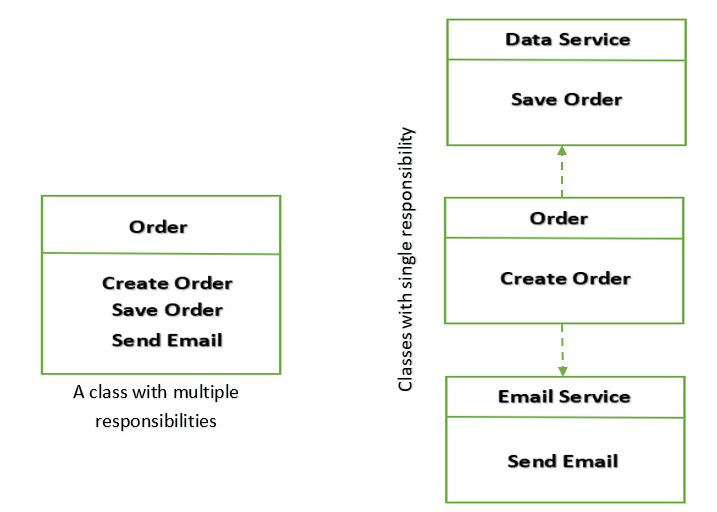
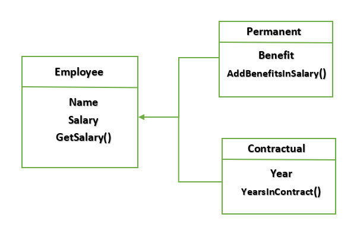
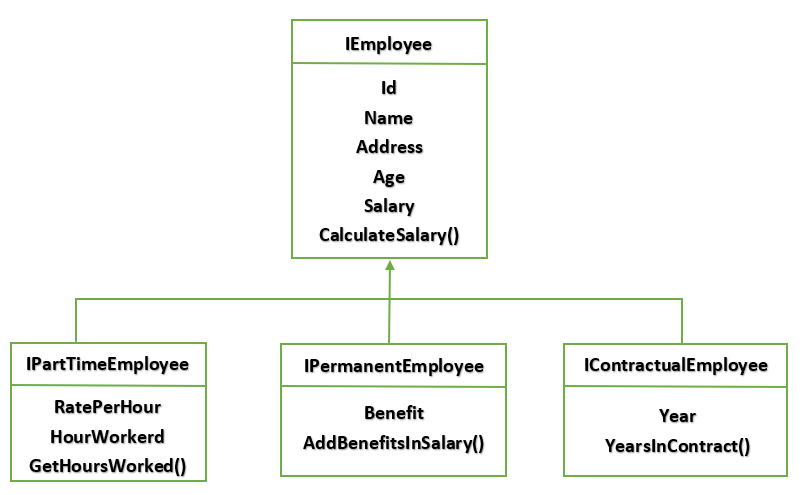
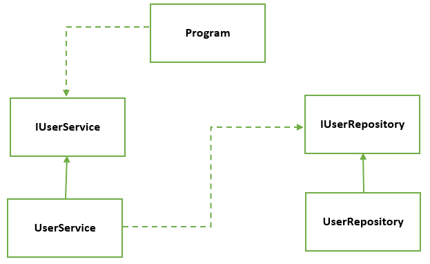

# Solid Principles Simplified (C#, .Net 5)

## Introduction

This article is about one of the basic **design principles** known as **SOLID** principles. Here you will see examples of **problems** one face while violating the principles and their **solutions** in Object Oriented Programming applications using C# as programming language and .Net 5 as Framework.

## Content Covered

- SOLID Principles
- Why SOLID Principles
- Single Responsibility Principle
- Open-Closed Principle
- Liskov Substitution Principle
- Interface Segregation Principle
- Dependency Inversion Principle

## SOLID Principles

These are design principle which help in writing code that is easy to **understand**, **adapt**, **extend**, **scale,** and **maintain**. One of the biggest advantages of implementing these principles is achieving **loose coupling**, as dependencies leads to difficulties where it becomes very hard to change something or add new feature. SOLID principles were introduced by **Robert C. Martin** (aka Uncle Bob). SOLID is an **acronym** which means as follows:



## Why SOLID Principles

SOILD principles makes it easy when it comes to **accessibility**, helps you achieve loose coupling, and **refactoring** becomes a lot easier if these design principles are properly implemented in applications. Code **readability** increases which makes it easier for other developers to extend, scale and maintain the classes or modules. If these basic design principles are not implemented in code, then it will be too difficult to maintain the application over time as development progresses. It might not seem difficult with smaller applications but as size grows things will become difficult when it comes to **changeability**, **extensibility**, **scalability** or **maintainability**. Because when the code is tightly coupled and there arises a need to change some part, then it will affect other parts also which are not related. We will explore what happens when SOLID principles are not there and how to fix those issues.

## Single Responsibility Principle

This is the first and very simple principle which states that each and every function, class or module should only be responsible for single thing. All the functions and properties defined in class should be related to single functionality to perform.

**“A Class should have only one reason to change**”

By reason, means the single functionality it is responsible of. To solve a complex problem, multiple classes work side by side but none of the class should **share** responsibility with one another. Each class should do its job by completing the life cycle of functionality it is responsible for, then the next class will come into picture but not in between.

It makes easier to achieve **encapsulation** as each class can hide its data from access by other code because all the properties defined are related that specific class.



**Example Without SRP**

Here we have an example which is violating the Single Responsibility Principle where three responsibilities are being handled by a single class **Order w**here **creation** of order, **storing** it to database and **sending** **email** to customer on successful creation are part of single class.

```
class OrderWithoutSRP {
    public string CreateOrder() => StoreToDatabase() ? (SendEmailToUser("email@example.com", new MailMessage()) ? "Order Created and email send" : "Order Created But failed to send email") : "Failed to Store in database";
    public bool StoreToDatabase()
        //Store Order to database
        => true;
    public bool SendEmailToUser(string email, MailMessage message) {
        if (ValidateEmail(email)) {
            // Send an email to specified address
            new SmtpClient().Send(message);
            return true;
        }
        return false;
    }
    public bool ValidateEmail(string email)
        // check whether the email is valid email or not
        => true;
}
```

**Example With SRP**

An order class is responsible for creating order of the customer but not storing data to database directly and sending email to user from within the class.So, there should be two other classes, one for storing order to database, and other for sending an email to customer. And both classes should be used in side order class to achieve the functionality.

```
class OrderWithSRP {
    public string CreateOrder() => new DatabaseService().StoreToDatabase() ? (new EmailService().SendEmailToUser("email@example.com", new MailMessage()) ? "Order Created and email send" : "Order Created But failed to send email") : "Failed to Store in database";
}
class DatabaseService {
    public bool StoreToDatabase()
        //Store data to database
        => true;
}
class EmailService {
    public bool SendEmailToUser(string email, MailMessage message) {
        if (ValidateEmail(email)) {
            // Send an email to specified address
            new SmtpClient().Send(message);
            return true;
        }
        return false;
    }
    public bool ValidateEmail(string email)
        // check whether the email is valid email or not
        => true;
}
```

## Open-Closed Principle

“**Entities should be open for extension but closed for modification**”

In this principle the objective is not to extend the implementation of class without any changes. It means creating derived classes without changing implemented functionality of base class. Abstract classes and Interfaces can be used in order to keep classes extendable and intact as well. **Inheritance** is used when a class extends a base class but in Open-Closed principle base class is being extended but locked for modifications.


**Example Without OCP**

If we have to calculate the Carbon Foot Print of diesel vehicle and there is a class responsible of calculating the total emission.

```
class DieselVehicle {
    public
    const double DieselCarbonFootPrintEmissionFactor = 12.9;
}
class CarbonFootPrintCalculater {
    public void TotalCarbonFootPrintEmission(List < DieselVehicle > dieselVehicles, double averageFuelComsumed) {
        double totalCarbonFootPrintEmission = 0;
        foreach(var dieselVehicle in dieselVehicles) {
            totalCarbonFootPrintEmission += DieselVehicle.DieselCarbonFootPrintEmissionFactor * averageFuelComsumed;
        }
        Console.WriteLine($ "Total CO2 Emission is {totalCarbonFootPrintEmission}");
    }
}
```

It will work fine unless we have to calculate the emission of some other types of car such as Electric and Hybrid Vehicle. To accomplish this **CarbonFootPrintCalculater** Class has to change the implementation of **TotalCarbonFootPrintEmission**() functions by adding conditional statement to check the relevance of object with particular class to distinguish between the emission factors while calculating the total emission by all vehicles.

```
class DieselVehicle {
    public
    const double DieselCarbonFootPrintEmissionFactor = 12.9;
}
class ElectricVehicle {
    public
    const double ElectricCarbonFootPrintEmissionFactor = 4.5;
}
class HybridVehicle {
    public
    const double HybridCarbonFootPrintEmissionFactor = 10.5;
}
class CarbonFootPrintCalculater {
    public void TotalCarbonFootPrintEmission(List < object > vehicles, double averageFuelComsumed) {
        double totalCarbonFootPrintEmission = 0;
        foreach(var vehicle in vehicles) {
            if (vehicle is DieselVehicle) totalCarbonFootPrintEmission += DieselVehicle.DieselCarbonFootPrintEmissionFactor * averageFuelComsumed;
            else if (vehicle is ElectricVehicle) totalCarbonFootPrintEmission += ElectricVehicle.ElectricCarbonFootPrintEmissionFactor * averageFuelComsumed;
            else totalCarbonFootPrintEmission += HybridVehicle.HybridCarbonFootPrintEmissionFactor * averageFuelComsumed;
        }
        Console.WriteLine($ "Total CO2 Emission is {totalCarbonFootPrintEmission}");
    }
}
```

**Example With OCP**

Creating an interface can help here, so all three vehicles can implement the same functionality inside them and adding new class will not impact the **CarbonFootPrintCalculator** Class.

```
interface IVehicle {
    double CalculateCarbonFootPrint(double averageFuelComsumed);
}
class DieselVehicle: IVehicle {
    public
    const double DieselCarbonFootPrintEmissionFactor = 12.9;
    public double CalculateCarbonFootPrint(double averageFuelComsumed) => DieselCarbonFootPrintEmissionFactor * averageFuelComsumed;
}
class ElectricVehicle: IVehicle {
    public
    const double ElectricCarbonFootPrintEmissionFactor = 4.5;
    public double CalculateCarbonFootPrint(double averageFuelComsumed) => ElectricCarbonFootPrintEmissionFactor * averageFuelComsumed;
}
class HybridVehicle: IVehicle {
    public
    const double HybridCarbonFootPrintEmissionFactor = 10.5;
    public double CalculateCarbonFootPrint(double averageFuelComsumed) => HybridCarbonFootPrintEmissionFactor * averageFuelComsumed;
}
class CarbonFootPrintCalculator {
    public void TotalCarbonFootPrintEmission(List < IVehicle > vehicles, double averageFuelComsumed) {
        double totalCarbonFootPrintEmission = 0;
        foreach(var vehicle in vehicles) {
            totalCarbonFootPrintEmission += vehicle.CalculateCarbonFootPrint(averageFuelComsumed);
        }
        Console.WriteLine($ "Total CO2 Emission is {totalCarbonFootPrintEmission}");
    }
}
```

## Liskov Substitution Principle

**“An object of Base class should be replaced by instance of its subtypes (derived classes) without any modifications and behave same as its parent”**

In a nutshell, every **derived** class should behave as a **substitute** for its **base** class. And it can be considered as an **enhancement** of the Open-Closed principle. Simply a derived (sub type) class should be able to accomplish all the functionality of base class along with having some implementation specific to it.

This principle is introduced by Jeannette Wing and Barbara Liskov that’s why it named as Liskov Substitution Principle.



**Example Without LSP**

Think of an **Employee** class where at start there are only **permanent employees** and all employees are receiving **benefits**.

```
class Employee {
    private readonly double Benefit;
    private double Salary;
    public Employee(double benefit, double salary) {
        Benefit = benefit;
        Salary = salary;
    }
    public double GetSalary() => Salary;
    public double UpdateSalary(double newSalary) => Salary = newSalary;
    public double AddBenefitsInSalary() => Salary + Benefit;
}
class Program {
    static void Main(string[] args) {
            var employees = new List < Employee > {
                new Employee("John", 10000, 50000),
                new Employee("Sam", 10000, 50000)
                UpdateEmployeeSalary(employees);
            }
            public static void UpdateEmployeeSalary(List < Employee > employees) {
                foreach(var employee in employees) {
                    Console.WriteLine($ "Updated salary of john is  {
                            employee.UpdateSalary(10000)
                        }
                        ");
                        Console.WriteLine($ "Salary after adding benefits of john is" + employee.AddBenefitsInSalary());
                    }
                }
            }
```

Everything was working smooth but when the company hired people on **contractual basis** and they are not eligible to the **benefits** then the upper class needs to be modified for contractual employees

```
class ContractualEmployee: Employee {
    public int _years;
    public ContractualEmployee(double benefits, double salary, int years): base(benefits, salary) {
        _years = years;
    }
    public int YearsInContract() => _years;
}
```

Because of contractual employee, **AddBenefitsInSalary**() function needs to add a check whether the employee is contractual or not for adding **AddBenefitsInSalary**() needs to add the employee parameter to check whether the **benefit** will be added into the salary.

```
class Employee {
    private readonly double Benefit;
    private double Salary;
    public string Name {
        get;
        private set;
    }
    public Employee(string name, double benefit, double salary) {
        Benefit = benefit;
        Salary = salary;
        Name = name;
    }
    public double GetSalary() => Salary;
    public double UpdateSalary(double increment) => Salary += increment;
    public double AddBenefitsInSalary(Employee employee) => (employee is not ContractualEmployee) ? Salary + Benefit : Salary;
}
class Program {
    static void Main(string[] args) {
        var employees = new List < Employee > {
            new Employee("John", 10000, 50000),
            new Employee("Sam", 10000, 50000),
            new ContractualEmployee("Eddie", 2, 0, 70000),
            new ContractualEmployee("Thomas", 1, 0, 70000)
        };
        UpdateEmployeeSalary(employees);
    }
    public static void UpdateEmployeeSalary(List < Employee > employees) {
        foreach(var employee in employees) {
            Console.WriteLine($ "Updated salary of {employee.Name} is {
                employee.UpdateSalary(10000)
            }
            ");
            Console.WriteLine($ "Salary after adding benefits of {employee.Name} is " + employee.AddBenefitsInSalary(employee));
        }
    }
}
```

**Example With LSP**

Both classes **PermanentEmployee** and **ContractualEmployee** can replace the **Employee** class and using the function of **UpdateSalary**() function. And **UpdateSalary**()  function will only update the salary but not the benefit. So, the **AddBenefitsInSalary**() will add the benefits in employee salary, nothing will **modify** the base class.

```
class Employee {
    private double Salary;
    public string Name {
        get;
        private set;
    }
    public Employee(double salary, string name) {
        Salary = salary;
        Name = name;
    }
    public double GetSalary() => Salary;
    public double UpdateSalary(double newSalary) => Salary = newSalary;
}
class PermanantEmployee: Employee {
    private double Salary;
    public string Name {
        get;
        private set;
    }
    public double Benefit {
        get;
        set;
    }
    public PermanantEmployee(string name, double benefit, double salary): base(salary, name) {
        Benefit = benefit;
        Salary = salary;
        Name = name;
    }
    public double AddBenefitsInSalary() => Salary + Benefit;
}
class ContractualEmployee: Employee {
    public int _years;
    public ContractualEmployee(string name, double salary, int years): base(salary, name) {
        _years = years;
    }
    public int YearsInContract() => _years;
}
```

Now there are two different classes inherited from **Employee** class and both can be replaced by the class without modification as both are using **UpdateSalary()** functions of base class.

```
class Program {
    static void Main(string[] args) {
        var permanentEmployees = new List < PermanantEmployee > {
            new PermanantEmployee("John", 10000, 50000),
            new PermanantEmployee("Sam", 10000, 50000)
        };
        var contractualemployees = new List < ContractualEmployee > {
            new ContractualEmployee("Eddie", 70000, 1),
            new ContractualEmployee("Thomas", 70000, 2)
        };
        UpdatePermanentEmployeeSalary(permanentEmployees);
        UpdateContractualEmployeeSalary(contractualemployees);
    }
    public static void UpdatePermanentEmployeeSalary(List < PermanantEmployee > permanentEmployees) {
            foreach(var employee in permanentEmployees) {
                employee.AddBenefitsInSalary();
                Console.WriteLine($ "Updated salary of {employee.Name} is  {
                        employee.UpdateSalary(10000)
                    }
                    ");
                }
            }
            public static void UpdateContractualEmployeeSalary(List < ContractualEmployee > contractualemployees) {
                foreach(var employee in contractualemployees) {
                    Console.WriteLine($ "Updated salary of {employee.Name} is  {
                            employee.UpdateSalary(10000)
                        }
                        ");
                    }
                }
            }
```

## Interface Segregation Principle

**“Client should not be forced to implement unnecessary methods which it will not use.  Instead of one large interface, there should be small interfaces for each functionality”**

Its similar to Single Responsibility Principle, an interface should have **single** **purpose** or **responsibility**. As it grows in number of methods, turns into a size where not all methods are needed for each class to implement.

Interfaces are **contracts** signed by implementing classes where all the methods other than **default** are mandatory to implement. This principle enforces to write interfaces that stick to single purpose rather than one interface with all the methods.



**Example Without ISP**

The example below has one large interface catering all general functionality for Employees whether Its **permanent**, **contractual** or **part time** in nature. Each class has to implement the functionality, however not all functions from interface are required. Such as Permanent employee is eligible for benefit but contractual and part timer are not. Similarly, a contractual employee is not eligible for benefits but has years in contract to serve the company. Part timers only work for number of hours and get salary on per hour rate.

```
interface IEmployee {
    public Guid Id {
        get;
        set;
    }
    public string Name {
        get;
        set;
    }
    public string Age {
        get;
        set;
    }
    public string Address {
        get;
        set;
    }
    public double Benefit {
        get;
        set;
    }
    public double Salary {
        get;
        set;
    }
    public double RatePerHour {
        get;
        set;
    }
    public double Year {
        get;
        set;
    }
    public double WorkingHour {
        get;
        set;
    }
    double CalculateSalary();
    double AddBenefitsInSalary();
    double YearsInContract();
    double GetHoursWorked();
}
class PermanentEmployee: IEmployee {
    public Guid Id {
        get;
        set;
    }
    public string Name {
        get;
        set;
    }
    public string Age {
        get;
        set;
    }
    public string Address {
        get;
        set;
    }
    public double Benefit {
        get;
        set;
    }
    public double Salary {
        get;
        set;
    }
    public double RatePerHour {
        get;
        set;
    }
    public double Year {
        get;
        set;
    }
    public double WorkingHour {
        get;
        set;
    }
    public double AddBenefitsInSalary() => Salary + Benefit;
    public double CalculateSalary() => Salary;
    public double GetHoursWorked() {
        throw new NotImplementedException();
    }
    public double YearsInContract() {
        throw new NotImplementedException();
    }
}
class ContractualEmployee: IEmployee {
    public Guid Id {
        get;
        set;
    }
    public string Name {
        get;
        set;
    }
    public string Age {
        get;
        set;
    }
    public string Address {
        get;
        set;
    }
    public double Benefit {
        get;
        set;
    }
    public double Salary {
        get;
        set;
    }
    public double RatePerHour {
        get;
        set;
    }
    public double Year {
        get;
        set;
    }
    public double WorkingHour {
        get;
        set;
    }
    public double AddBenefitsInSalary() {
        throw new NotImplementedException();
    }
    public double CalculateSalary() => Salary;
    public double GetHoursWorked() {
        throw new NotImplementedException();
    }
    public double YearsInContract() => Year;
}
class PartTimeEmployee: IEmployee {
    public Guid Id {
        get;
        set;
    }
    public string Name {
        get;
        set;
    }
    public string Age {
        get;
        set;
    }
    public string Address {
        get;
        set;
    }
    public double Benefit {
        get;
        set;
    }
    public double Salary {
        get;
        set;
    }
    public double RatePerHour {
        get;
        set;
    }
    public double Year {
        get;
        set;
    }
    public double WorkedHour {
        get;
        set;
    }
    public double WorkingHour {
        get;
        set;
    }
    public double AddBenefitsInSalary() {
        throw new NotImplementedException();
    }
    public double CalculateSalary() => WorkedHour * RatePerHour;
    public double GetHoursWorked() => WorkedHour;
    public double YearsInContract() {
        throw new NotImplementedException();
    }
}
```

**Example With ISP**

Rather than creating one big interface for everything, here smaller interfaces are created to serve a **single** **purpose**. Now each class will only implement the needed functionality instead of all the properties and functions declared in the interface.

```
interface IEmployee {
    public Guid Id {
        get;
        set;
    }
    public string Name {
        get;
        set;
    }
    public string Age {
        get;
        set;
    }
    public string Address {
        get;
        set;
    }
    public double Salary {
        get;
        set;
    }
    double CalculateSalary();
}
interface IPermanentEmployee: IEmployee {
    public double Benefit {
        get;
        set;
    }
    double AddBenefitsInSalary();
}
interface IContractualEmployee: IEmployee {
    public double Year {
        get;
        set;
    }
    double YearsInContract();
}
interface IPartTimeEmployee: IEmployee {
    public double RatePerHour {
        get;
        set;
    }
    public double WorkingHour {
        get;
        set;
    }
    double GetHoursWorked();
}
```

## Dependency Inversion Principle

**“Higher level modules should not depend on lower level modules. Both should depend on abstraction.**

**Abstraction should not depend upon details. Details should depend on abstraction”**

This principle aims at achieving loose coupling and allows abstraction in place of concretion to be used. When a high-level class depends upon low level classes then it has knowledge about these classes where actual low-level class objects are created inside which leads to tight coupling. To eradicate tight coupling this principle tends to provide a way to use the abstraction where high-level class or module should not depend on low level classes or modules and both should depend on abstraction, through the interfaces or abstract classes which are used to achieve abstraction high level class will communicate with low level classes.



**Example Without DIP**

**User service (High Level Class)** is responsible for user registration and login functionality. For both functions, User service is dependent on **User Repository (Low Level Class)** to interact with data base. The example given is clearly **violating** the Dependency inversion principle. As high level class is dependent on low level class.

```
class User {
    public int Id {
        get;
        set;
    }
    public string Username {
        get;
        set;
    }
    public string Password {
        get;
        set;
    }
}
class UserService {
    public bool Register(User user) => new UserRespository().SaveUser(user);
    public int Login(string username, string password) => new UserRespository().GetUserByCredentials(username, password).Id;
}
class UserRespository {
    private List < User > users = new() {
        new User {
            Id = 1, Username = "Sam", Password = "1234"
        },
        new User {
            Id = 2, Username = "John", Password = "4321"
        },
        new User {
            Id = 3, Username = "Tom", Password = "4567"
        },
    };
    public User GetUserByCredentials(string username, string password) => users.FirstOrDefault(user => user.Username == username && user.Password == password);
    public bool SaveUser(User user) {
        users.Add(user);
        return true;
    }
}
class Program {
    static void Main(string[] args) {
        User user = new User() {
            Id = 4, Username = "Eddie", Password = "1092"
        };
        UserService userService = new();
        Console.WriteLine(userService.Register(user) ? "User Registered Successfully" : "Failed to register user");
        int userId = userService.Login(user.Username, user.Password);
        Console.WriteLine(userId > 0 ? "Login Successful" : "Login Failed");
    }
}
```

**Example With DIP**

After implementing the same **User Service** and **User Repository** with dependency inversion principle, both the classes depends on abstraction using interfaces **IUserService** and **IUserRepository**. Afterwards User Service will use abstraction (IUserRepository) to for data related operations. And IUserService will be used for interaction with the user service class. We have also achieved the **loose coupling** with the help of Dependency Inversion Principle. Now high- and low-level classes are dependent on abstraction. And abstraction is dependent on details.

```
class User {
    public int Id {
        get;
        set;
    }
    public string Username {
        get;
        set;
    }
    public string Password {
        get;
        set;
    }
}
interface IUserService {
    public bool Register(User user);
    public int Login(string username, string password);
}
interface IUserRepository {
    public User GetUserByCredentials(string username, string password);
    public bool SaveUser(User user);
}
class UserService: IUserService {
    private readonly IUserRepository _userRepository;
    public UserService(IUserRepository userRepository) {
        _userRepository = userRepository;
    }
    public int Login(string username, string password) => _userRepository.GetUserByCredentials(username, password).Id;
    public bool Register(User user) => _userRepository.SaveUser(user);
}
class UserRepository: IUserRepository {
    private List < User > users = new() {
        new User {
            Id = 1, Username = "Sam", Password = "1234"
        },
        new User {
            Id = 2, Username = "John", Password = "4321"
        },
        new User {
            Id = 3, Username = "Tom", Password = "4567"
        },
    };
    public User GetUserByCredentials(string username, string password) => users.FirstOrDefault(user => user.Username == username && user.Password == password);
    public bool SaveUser(User user) {
        users.Add(user);
        return true;
    }
}
class Program {
    static void Main(string[] args) {
        User user = new User() {
            Id = 4, Username = "Eddie", Password = "1092"
        };
        IUserService userService = new UserService(new UserRepository());
        Console.WriteLine(userService.Register(user) ? "User Registered Successfully" : "Failed to register user");
        int userId = userService.Login(user.Username, user.Password);
        Console.WriteLine(userId > 0 ? "Login Successful" : "Login Failed");
    }
```

## Summary

In this article, the definition of SOLID principle is discussed along with the reason of using these principles. And as SOLID stands for Single Responsibility Principle, Open-Closed Principle, Liskov Substitution Principle, Interface Segregation Principle and Dependency inversion principle. Each of the mentioned principle is described with help of examples for clear understanding.
