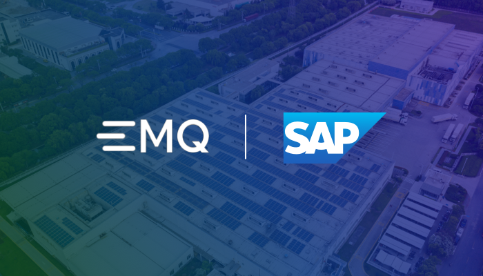
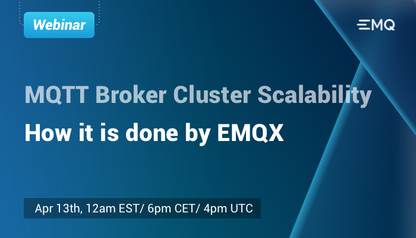
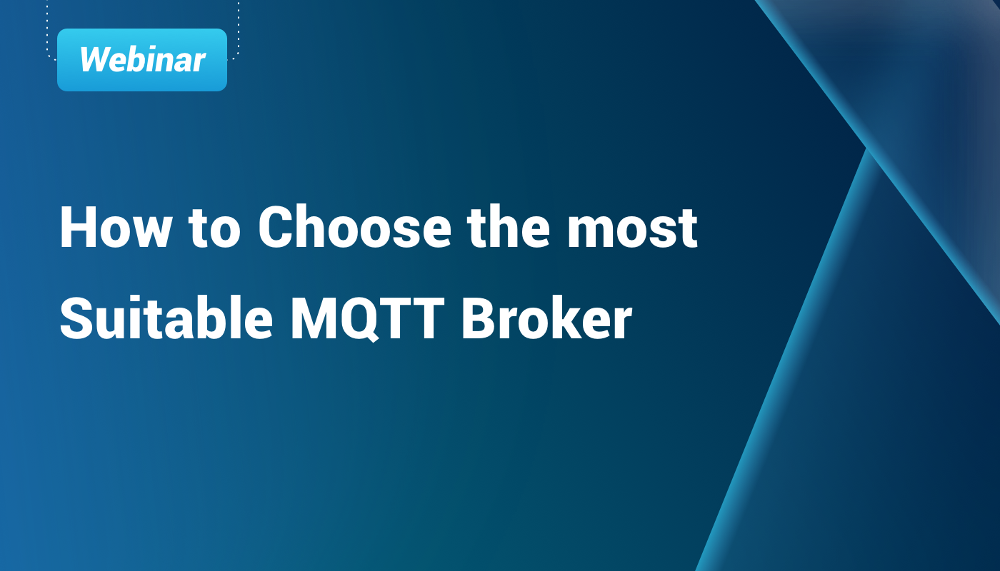

# The World's #1 Open Source Distributed MQTT Broker

[

2022-07-14

##### EMQ and SAP join forces to empower a sustainable, intelligent, and connected world

EMQ announced it had joined SAP’s Strategic Alliance for Sustainable Development and Practice with IBM, Deloitte, and other global partners.

Learn More →](https://www.emqx.com/en/news/emq-enters-sap-strategic-alliance)

[

2022-03-14

##### MQTT Broker Cluster Scalability: How it is done by EMQX

As the IoT market grows, a substantial number of devices are connected. Therefore, organizations should realize that it is essential to ensure their IoT infrastructure is scaling to handle an increase in the number of connections. EMQX can implement 100M subscribers.This webinar will explain why EMQX is so scalable, including the EMQX's foundation, clustering, and demonstrate how to reach 100K in the live show.

Learn More →](https://www.emqx.com/en/events/mqtt-broker-cluster-scalability)

[

2022-04-02

##### How to choose the suitable MQTT Broker

In this video, we are going to share the factors to consider when choosing an MQTT Broker.

Learn More →](https://www.emqx.com/en/resources/how-to-choose-the-suitable-mqtt-broker)
