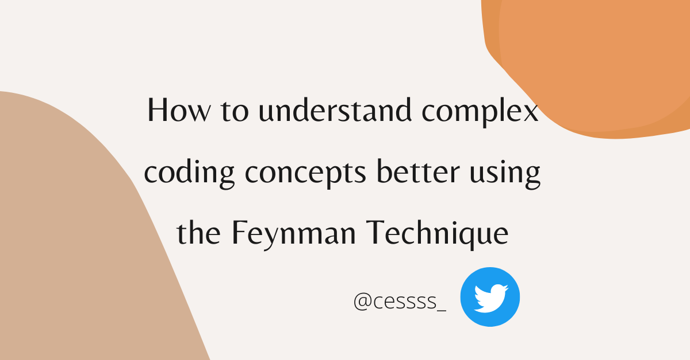

# How to Understand Complex Coding Concepts Using the Feynman Technique

[CESS](https://www.freecodecamp.org/news/author/success/)



The Feynman approach is an excellent way to gain a deeper understanding of a complex topic. It's one of the quickest ways to turn a complex topic into one that you can explain in simple terms to others.

This article will teach you how to break complex coding concepts into the simplest terms.

Let's get started

## The Feynman Technique Of Learning

Richard Feynman, a Nobel Prize-winning physicist, created the Feynman method for learning. He enjoyed explaining complex topics in simpler terms.

In Feynman's view, the best way to study an idea was to ask hard questions and fully understand it.

For more information about Richard Feynman, see this [article.](https://www.nobelprize.org/prizes/physics/1965/feynman/biographical/)

> "If you want to learn something, read about it. If you want to understand something, write about it. If you want to master something, teach it." -  Yogi Bhajan.

Feynman's technique, in a nutshell, revolves around the belief that you can't explain something well if you do not know it well yourself.

When you try to explain what you know to someone who doesn't know anything about it, you'll notice the flaws in your understanding. The goal is to communicate what you've learned in a simple way that a child can understand.

## What Are the Benefits of Using the Feynman Technique?

Here are a few of the benefits of using Feynman's learning techniques:

- It helps you gain a thorough understanding of what you're learning. If you're having trouble understanding JavaScript loops, for example, try this learning method.
- It helps you **learn new ideas.** This technique allows you to learn new things fast, recall what you have learned, and be more productive.
- It helps you become a better teacher. You get better at teaching when you keep sharing your knowledge with others.
- It improves your critical thinking ability. You will be able to reason in an organized manner to explain complex stuff in simpler terms.

## The Four Steps of the Feynman Technique

The Feynman Technique is made up of four significant steps:

- Choose a topic you want to learn about.
- Explain it to a 12-year-old.
- Review your explanation.
- Simplify.

### Step 1 - Choose a topic you want to learn about

First, you should come up with a subject or topic you would like to learn and then write it at the top of a piece of paper.

For example, if you want to study JavaScript loops, write it as a heading on a blank piece of paper. As you keep learning about JavaScript loops, write whatever you know on that piece of paper. Write it so that someone who knows nothing about JavaScript loops will understand it.

### Notes on JavaScript Loops

Loops allow us to repeatedly run a code block until we meet a specific condition. We call this condition the stop condition.

### Types of loops

- for loop
- for-of loop
- for-in loop
- While loop
- Do-while loop

#### For loop

For loop allows us to repeat a series of actions until a specific condition is false. When a stop condition is true, the for loop runs, and when it is false, it stops running.

For loop syntax:

```
for (initialExpression; stopCondition; incrementExpression) {
  // code block to be executed
}
```

Example of a for loop:

```
for (let i = 1; i<=10; i++) {
   console.log(i);
}  // 1,2,3,4,5,6,7,8,9,10
```

#### While loop

The while loop continues to run as long as the stop condition is true. It will stop running if the condition resolves to false.

We use a while loop when we are unsure of the number of times the loop will run before it starts running.

While loop syntax:

```
while (stop condition) {
   // code block to be executed
}
```

Example of a While loop:

```
let i = 1;

while(i <=10) {
   console.log(i);
   i++
}  // 1,2,3,4,5,6,7,8,9,10
```

#### Do-while loop

Do-while loops run a block of code (loop's body) at least once before rerunning if the stop condition is true or false.

Do-while loop syntax:

```
do {   
  // code to be executed 
} while(stop condition)
```

Example of a Do-while loop:

```
let i = 1;
do {
  console.log(i);
  i++;
} while(i <= 10) // 1,2,3,4,5,6,7,8,9,10
```

Check out this article for a detailed explanation of [JavaScript Loops](https://cesscode.hashnode.dev/what-are-the-different-javascript-loops).

Before moving on to step 2, do more research on JavaScript loops or take a practice test to see how good you are.

Check out this article for resources to help you practice [web development](https://cesscode.hashnode.dev/resources-to-help-you-practice-web-development).

Once you have a firm understanding of the topic (JavaScript loops), proceed to step 2.

Also, just a note – paper can be anything you use for writing, such as your phone's notebook app to any other app you use every day.

### Step 2 - Explain it to a 12-year-old

Now that you have a clear understanding of JavaScript loops, it's time to explain it to a 12-year-old.

You don't have to look for an actual 12-year-old to teach. All you have to do is explain loops in the most basic terms possible, such that even a child can understand.

### Explanation of loops to a 12year old

Imagine you have a box of 20 candies and want to give them to your schoolmates. Each time there is still candy in the candy box, someone gets one until there is none left.

A classmate gets candy as long as there's candy in your box. If there's no candy left in the box, no one gets candy. To keep sharing sweets with more of your friends, you'll need to go out and buy more.

[JavaScript loops](https://cesscode.hashnode.dev/what-are-the-different-javascript-loops) help to make a series of activities repeat themselves. It allows you to run a code block repeatedly until we meet a specific condition and it stops running.

Loops operate similarly to your candy box. The code block must meet a specific condition to run or stop running.

- If the condition is true, your code runs
- If the condition is false, your code stops running

```
for (let candyBox = 1; candyBox <=20; candyBox++) {
   console.log(candyBox);
}  // 1,2,3,4,5,6,7,8,9,10,11,12,13,14,15,16,17,18,19,20
```

- `let candyBox = 1` means that your code should start counting at 1
- `candyBox <= 20` is the condition that must be met for your code to run. It means that your code should stop counting when it gets to 20.
- `candyBox++` means that your code should increase by 1 for every time it runs

There's a saying that using complex terms to explain a topic masks your lack of understanding. So your ability to explain loops in the simplest terms possible means you know what you are saying through and through.

### How to explain your code – when you don't have a 12 year old to talk to

I know some of you reading this article are thinking, but what if I don't have somebody to explain what I'm learning?

That's not a problem. You can use a variety of methods to explain what you've learned, including:

**Technical writing:** You don't have to be a great writer to start writing. All you have to do is start getting knowledge down on paper, so to speak.

Open platforms like dev.to, Hashnode, and Medium make it easy to share what you learn. So sign up for one of the platforms and begin writing. Also, you can check out Google's free technical writing [course](https://developers.google.com/tech-writing).

**Join online communities:** Join online communities to share what you have learned. When you join online developer groups, you'll meet people who share your interests. This can help you become comfortable sharing and answering questions.

A fantastic developer community to join is the freeCodeCamp online [forum](https://forum.freecodecamp.org/). You can also use social media platforms like YouTube, TikTok, Twitter, and so on.

[You can also join my community for developers](https://twitter.com/i/communities/1532313139810906114) on Twitter to ask questions, share ideas, and more.

Another way you can explain what you've learned is by doing it in front of an imaginary audience. Pretend you're teaching a group of 12-year-olds about JavaScript loops.

Teaching to an imaginary audience might be fun, but they cannot ask questions. This learning method works best when you use a real audience because they can ask questions.

When your audience asks you questions, you get to identify areas in which you need to improve.

**Fun tip:** you can also try out the [rubber duck technique](https://www.freecodecamp.org/news/rubber-duck-debugging/), where you explain your code to a rubber duck (or another inanimate object) to make sure you've thought it through clearly.

### Step 3 - Review Your Explanation

Step 2 will help you identify specific areas where you need to improve. And then in step 3, you can review how you explained the topic to see what you could do better.

Review your loop explanation and identify areas where you think it fell short. Now that you know where you fell short, go back over your learning material to understand better.

Consider using other learning resources if possible. Study until everything you couldn't explain before is clearer to you.

Step 3's goal is to change your areas of weakness into your areas of strength.

### Step 4 - Simplify Your Explanation

As a result of step 3, you now have a better knowledge of JavaScript loops. Step 4 requires you to practice step 2 again with your new understanding of loops.

Take up your notes and simplify every area of loops you couldn't explain before. Rewrite your loops article or give someone else a better explanation.

You can also pretend you're teaching a group of 12-year-olds again about JavaScript loops. If you cannot explain a particular part of the topic, go back to step 3 to understand it better.

This method of learning works best for topics that are tough to understand. It is not an effective learning method if you already understand a concept.

## Conclusion

This learning style is all about understanding a topic to the point where you can explain it in your own words. When you describe it, act as though you're educating a child to see how well you know the subject.

Also, keep in mind that you can use this learning method to study any concepts that you find difficult.

Thank you for reading. I hope you enjoyed the article! If you have any questions or a learning strategy you would love to share? Send a message on [Twitter](https://twitter.com/Cessss_) or [LinkedIn](https://www.linkedin.com/in/success-eriamiantoe).

## Resources

Here are some resources that may be useful to you:
