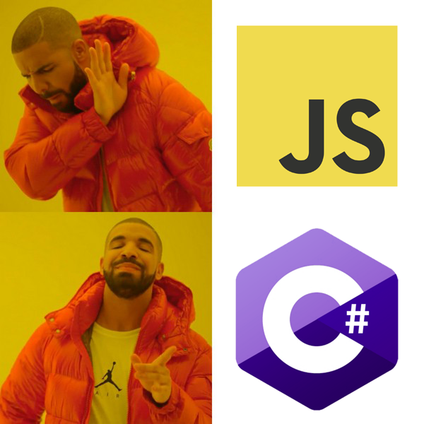
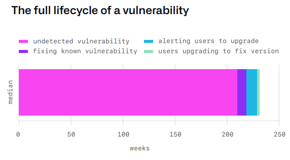
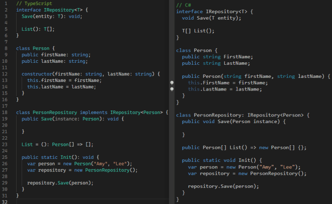

# The Case for C# and .NET

It has been interesting as I’ve shifted out of .NET ecosystem which I’ve worked with on the server side (and some stints of desktop client/tooling work) since the beta versions just before the first release.

In the era before ASP.NET, I was writing ASP using server-side JScript. It’s true: it was possible to use JScript instead of VBScript though it was rare to see in the wild in those days because everyone wrote ASP in VBScript. But for me, it felt more natural and I had been writing JavaScript since the late 90’s in high school so why not write it on the server? In fact, after my first few encounters with ASP.NET Web Forms, [I hated it](https://charliedigital.com/2009/07/23/why-asp-net-webforms-sucks/)!

[It turns out that Bloomberg at some point in 2005 even started migrating their back-end code from C/C++ to JavaScript](https://www.techatbloomberg.com/blog/10-insights-adopting-typescript-at-scale/) which I think is quite cool.

If you were to ask me even 6 years ago what my favorite programming language was, I’d say JavaScript.

Fast forward to the modern day and I can hardly recognize server-side JavaScript development.

To understand why, it is instructive to take a look at [GitHub’s State of the Octoverse report](https://octoverse.github.com/).

## The Dependency Problem

Unlike .NET, JavaScript does not have a rich set of base class libraries. It has been dependent on the community to fill that gap by writing open source projects and publishing shared packages to NPM. Whereas in the .NET ecosystem, Microsoft provides a rich set of professionally developed and curated first party libraries for many, many scenarios, JavaScript has no such governance.

This model has its benefits as it allows for innovation and creativity at a much faster pace. (In fact, one could argue that it has forced Microsoft to move faster and be more open with .NET Core.)

But the downside of that lack of governance has many, many deficiencies. One of which is an **explosion** of the dependency chain:

We all know the pain of managing `node_modules`. Hundreds of dependencies and often hundreds of megabytes of space. In an ecosystem with strong governance in place, perhaps we would see some of these libraries rolled into a curated and well maintained core set of libraries that is less polluted and less sprawling.

[There are even developers out there who “farm” NPM packages to pad their resumes](https://www.npmjs.com/package/is-even) (this library has 180k weekly downloads)!

This in and of itself may seem like a minor annoyance, but this leads to our next problem…

## The Security Problem

Because there are layers and layers of dependencies deep in the bowels of your code and because of the nature of JavaScript (e.g. Prototype Pollution), it creates these scenarios where vulnerabilities and even malware can be introduced to your code!

More surprisingly, according to GitHub, vulnerabilities can often go undetected for ***extended***periods of time:

> A vulnerability typically goes undetected for 218 weeks (just over four years) before being disclosed. From there, it typically takes 4.4 weeks for the community to identify and release a fix for the vulnerability, and then 10 weeks to alert on the availability of a security update.

Yikes. This is a legitimate problem that sucks productivity as you scramble to update your dependencies and then end up having to migrate whole codebases to newer, breaking versions of upstream dependencies.

## The Performance Problem

To add insult to injury, JavaScript isn’t particularly performant. The best set of test cases that I have found for this is a set of benchmarks comparing AWS Lambda performance for identical workloads across a series of runtimes. These benchmarks are particularly interesting because they model identical workloads in an identical runtime environment.

The first by

[Tai Nguyen Bui](https://medium.com/u/7d6846ad348f?source=post_page-----72ee933da304--------------------------------)

in 2019: <https://medium.com/the-theam-journey/benchmarking-aws-lambda-runtimes-in-2019-part-ii-50e796d3d11b>

The second by

[Aleksandr Filichkin](https://medium.com/u/c56a66a35b74?source=post_page-----72ee933da304--------------------------------)

in 2021: <https://filia-aleks.medium.com/aws-lambda-battle-2021-performance-comparison-for-all-languages-c1b441005fd1>

While Node.js has an advantage in cold starts, the runtime performance of .NET is among the top 3 in these benchmarks and often 2x faster than Node.js.

From Bui’s 2019 benchmarks:

Create:

List:

Get:

Update:

Delete:

[Even the latency from AWS API Gateway is worse for Node.js](https://miro.medium.com/max/700/1*1UQV7LRNBGgSOya3Z687ow.png)!

Filichkin’s 2021 update reveals more or less the same:

Filichkin’s results are ***even more damning*** as .NET Core has made performance improvements that now push it past ***3x as fast*** as JavaScript in Node.js under the same memory constraints in typical use cases. *Modern .NET is on par with Go and Rust in performance*. [Raygun’s 2017 switch to .NET Core from Node.js saw the realization of *a 2000% increase in server throughput*](https://raygun.com/blog/dotnet-vs-nodejs/).

Because serverless workloads are priced by invocations and memory-time, one would expect to pay less for operating a serverless workload written in ***anything but*** JavaScript running on Node.js.

***[July 2022 Update]*** [The latest Round 21 TechEmpower open source benchmarks](https://www.techempower.com/benchmarks/#section=data-r21&hw=ph&test=composite) show that .NET continues to be one of the fastest, highest throughput web servers in real-world workloads, hanging up there with C++ and Rust-based application servers:

Round 21 results from July, 2022 with .NET at #7

## The Productivity Problem

In those early days when I wrote JScript ASP, I had to load huge stacks into my brain. There was little to no tooling for intellisense in those days so you *had* to write really good JavaScript via convention and class-like constructs to make the code manageable. I *had* to write good comments to communicate the connectedness of the different parts of the code.

Eventually, Microsoft introduced TypeScript to address this issue by adding a layer of type declaration onto JavaScript to make it manageable.

But in my mind, this had led to a generation of engineers that write poor JavaScript because now they are reliant purely on the tooling to provide productivity instead of using the tooling to *improve* productivity and using plain old good practices for organizing code, naming things well, encapsulating logic, and so on.

Steve McConnell’s *Code Complete* talks extensively about how important good practices are:

> *The information contained in a program is denser than the information contained in most books. Whereas you might read and understand a page of a book in a minute or two, most programmers can’t read and understand a naked program listing at anything close to that rate. A program should give more organizational clues than a book, not fewer.*
>
> *The smaller part of the job of programming is writing a program so that the computer can read it; the larger part is writing it so that other humans can read it.*

And yet I find that in the hands of inexperienced developers, TypeScript adds to the mess (particularly indiscriminate use of operations like `Pick`).

The current trend of using arrow functions everywhere is absolutely killing me [and I’m not the only one](https://davidwalsh.name/i-dont-hate-arrow-functions). It makes code unreadable when developers think that `function` is apparently a dirty word.

It can actually hamper productivity when the type system is tacked on as an afterthought.

## OK, So Server-Side JavaScript Sucks? Why Is It EVERYWHERE?

I think the answer to this question is actually quite simple:

1. JavaScript is easy and flexible; you can uses it in so many ways. As a programming language, it was my first love.
2. For new developers, it’s easier to learn one language and apply it to the front-end and back-end rather than learn two languages for front- versus back-end development.
3. Hot reload is like crack.

The proliferation of demand for software engineers meant that many developers coming out of bootcamps were taught JavaScript for front-ends. Since they are already using the Node toolchain for the front-end, developers from this track only needed to stretch a bit more to become “full-stack” engineers. *When all you have is a hammer, every problem looks like a nail*. It’s cheaper and less time consuming to train new engineers in one multi-purpose language than to train them to use the right tool.

Rather than have to teach new developers complex, battle-tested concepts like encapsulation, polymorphism, abstraction, and inheritance for managing complex software projects, let’s just focus on cutting code.

## So Why/Not .NET?

As a senior engineering leader now, my own perspective on JavaScript has shifted. I just want a low-fuss, low-drama, low-maintenance, high-performance, highly secure programming language and runtime for my applications.

I want teams to be productive and not have to waste time dealing with handling dependency vulnerabilities on the daily and funky type behavior caused by layering a type system on top of a language that doesn’t want to be typed. While a loosey-goosey type system is fantastic for building UIs, it’s **terrible** for building back-ends where strong contracts for system level interactions are desirable.

For the front-end, JavaScript is unavoidable (for now). But for the back-end? No thank you. **Give me C#**.

Prior to .NET Core, the main problem with .NET was that while it purported cross platform runtime compatibility, it depended on third party implementations such as mono in the early days. And of course, because the .NET Framework had underlying dependencies on Win32, it wasn’t *truly* portable. This had big problems in the modern era of Docker because non-Windows runtimes were treated as second class citizens.

However, as .NET has transitioned to .NET Core and `dotnet` (Microsoft really needs to work on their branding), I sense that the tide has been slow to turn back to .NET. Part of this has been the poor branding and poor marketing of .NET. Part of this has been the baggage that Microsoft carries and sometimes surfaces [with debacles like the recent one with](https://www.theverge.com/2021/10/22/22740701/microsoft-dotnet-hot-reload-removal-decision-open-source) `dotnet watch`. Part of this is that Microsoft just isn’t the cool kid.

**But the state of .NET is better than ever** and Microsoft’s innovation on C# has oddly made it more and more like JavaScript both syntactically and practically with each iteration. It is no coincidence that modern JavaScript programming with TypeScript has some congruency with C# given that [Anders Hejlsberg](https://en.wikipedia.org/wiki/Anders_Hejlsberg) was the lead architect of the C# language and also led development of TypeScript.

I bring this up only because it seems natural, then, to transition developers already comfortable with TypeScript to C#. .NET is also now truly cross platform for building server side applications. [My recent CovidCureID project is a perfect example](https://github.com/CharlieDigital/covidcureid): written in C# on a Windows machine, built and deployed via a Linux runner on GitHub.

It seems that even as .NET itself has grown and improved leaps and bounds, its legacy and limitations prior to .NET Core seem to still hold it back from broader adoption. I even recently saw a job posting by Accenture that shunned “legacy” languages “such as Java and .NET” in favor of [Go](https://bluxte.net/musings/2018/04/10/go-good-bad-ugly/). Why lump .NET with Java?!?

My hope is that .NET and C# have a resurgence as .NET 6 rounds the corner. With .NET 6, C# 10, and [minimal APIs](https://www.hanselman.com/blog/exploring-a-minimal-web-api-with-aspnet-core-6), the language feels more modern than ever and is the perfect gateway from TypeScript/JavaScript on the server to .NET.
