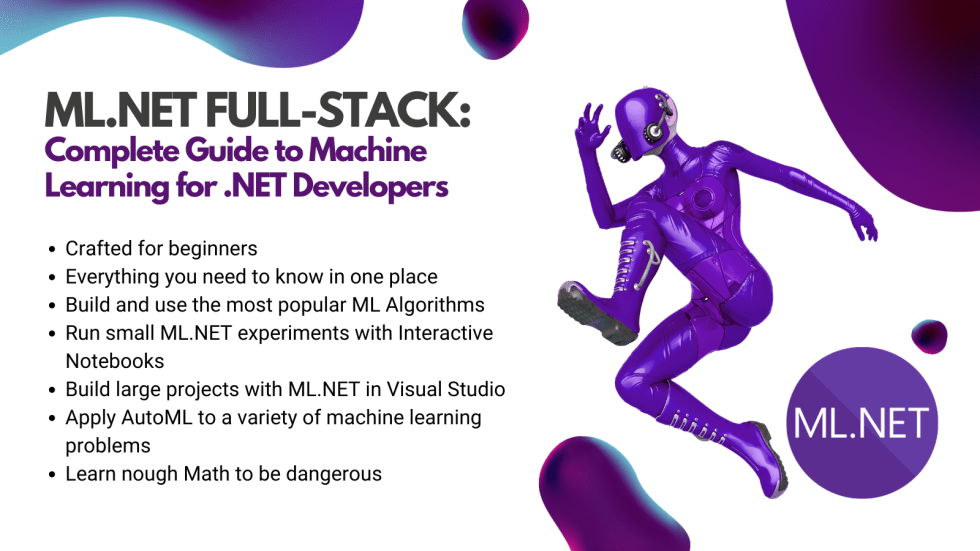
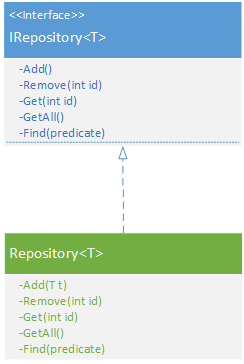
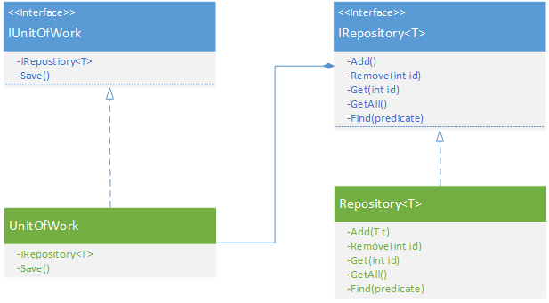

# Implementing & Testing Repository Pattern using Entity Framework

Jul 11, 2022 | [.NET](https://rubikscode.net/category/net/) | [0 comments](https://rubikscode.net/2022/07/11/implementing-and-testing-repository-pattern-using-entity-framework/#respond)


There are many blog posts and misconceptions about Repository Pattern, especially since the introduction of the OR/M libraries, like Entity Framework. In this article, we will investigate why this pattern is still useful, what are the benefits of using it and how we can use it in combination with Entity Framework. Even though Microsoft defines its  *DbContext* and *DbSet* classes as a replacement for this pattern, we will see how this pattern still can help us make our code cleaner.

[](https://rubikscode.net/ml-net-full-stack-landing-page/)

From the basics of machine learning to more complex topics like neural networks, object detection and NLP, this course will guide you into becoming [**ML.NET superhero**](https://rubikscode.net/ml-net-full-stack-landing-page/).

Let’s start with the definition of Repository Pattern. One of the best definitions of this pattern could be found in Martin Fowler’s book [Patterns of Enterprise Architecture](https://www.amazon.com/Patterns-Enterprise-Application-Architecture-Martin/dp/0321127420):

A Repository mediates between the domain and data mapping layers, acting  
 like an in-memory domain object collection.

Martin Fowler

Why is this definition so cool, one might ask. Well, I personally like it because of the way it emphasizes two very important attributes of the Repository pattern. The first attribute is that this pattern is an abstraction that aims to reduce complexity. The second important attribute is that this pattern is, in fact, an in-memory collection that mirrors database tables.

So, in this article we cover:

1. Repository Pattern – Benefits and Misconceptions

2. Repository Pattern Overview

3. Entity Framework Brief Overview

4. Implementation, Tests and Mocking

## 1. Repository Pattern – Benefits and Misconceptions

Even if we use Entity Framework, we might end up with a lot of duplicate query code. For example, if we are implementing a blog application and we want to get the most viewed articles in a few places, we might end up with repeated query logic which would look  something like this:

```
var twentyMostViewedPosts = context.Articles
  .Where(a => a.IsPublished)
  .OrderBy(a => a.Views).Take(20);
```

We could end up with even more complicated queries, that potentially could be repeated through the code. Changing and maintaining this kind of code is not something that could be done in an easy manner. So, we still call our Repository to help us with this. We can encapsulate that behavior inside Repository and just call it like this:

```
var twentyMostViewedPosts = repository.GetTopTwentyArticles(context);
```


It is much cleaner this way, isn’t it? Plus, if we want to change something in this logic, we will do it only in one place, which is a huge benefit. There you go, the first benefit of using Repository Pattern – no duplicate query logic.

The second obvious benefit is that it separates application code from the persistence framework, and with that from the database that we are using. Basically, we could use different OR/M in our repository, or use completely different technology, like [MongoDB](https://rubikscode.net/2017/10/16/mongodb-serial/) or [PostgreSQL](https://www.postgresql.org/), for example.

Looking at the changes in the database trends in the last decade it is quite obvious why we would like to have flexibility like this. The valid question here is “Yes, but how often are you going to change the Database really?” Recently I worked on a project that changed from SQL Server to ElasticSearch to RavenDB.

The last, but probably one of the main benefits of using this pattern is that it eases unit testing. However, people often have the misconception that this pattern enables you to test the data access layer in an easier manner. That is not true, but it is becoming a great asset in testing business logic. It is easy to mock repository implementation in the business logic.

## 2. Repository Pattern Overview

As we already mentioned, a Repository is an in-memory collection of objects and that collection needs to have an interface using which we can access elements from that collection. That is why Repository should expose classical CRUD operations. Some people choose to skip the Update operation because updating an object from the in-memory collection is essentially getting it and changing its value. I am one of those people Of course, if you like it you can implement this function as well.

To sum it up, this is what repository interface and implementation look like:



As you can see we are aiming for a generic solution. We will define the interface *IRepository*that is exposing these functions:

- Add – Method that will add an object of defined type *T* into our repository
- Remove – Method that will remove the object of defined type *T* from our repository
- Get – Method that will get an object of defined type *T* from our repository
- GetAll – Method that will get all objects from our repository
- Find – Method that will find and retrieve objects that match certain criteria from our repository

Notice that there is nothing like the *Save*method in our Repository, as well. This is where another pattern, called Unit of Work comes into the picture. This is a separate component that holds information about different repositories and implements saving functionality; something like this:



## 3. Entity Framework Brief Overview

At this moment we know that we will use Entity Framework and if you are not familiar with it you can check [MSDN articles](https://msdn.microsoft.com/en-us/library/aa937723(v=vs.113).aspx) about it. In essence, Entity Framework is an object-relational mapper (O/RM) that enables .NET developers to work with a database using .NET objects. It eliminates the need for most of the data-access code that developers usually need to write. In a nutshell, it maps code objects to database tables and vice versa.

There are two approaches when it comes to using EntityFramework. The first one is called the database-first approach. In this approach, we create a database that uses Entity Framework to create domain objects and build code on top of that. The second one is called the code-first approach. This is the approach that we will for building our Repository.


There are two important classes that we need to know –  *DbContext* and *DbSet.**DbContext* is one important class for Entity Framework. When using Entity Framework we need to have one class that derives this class in our system. This way Entity Framework will know what needs to be created. A class that inherits this DbContext exposes DbSet properties for the types that you want to be part of the model.

## 4. Implementation, Tests and Mocking

Cool, now that we know how our Repository should look, we can start writing our tests for the *Repository* class. One small note before we continue, in this example, I am using the xUnit unit test framework and Moq mocking framework. Also, in the spirit of [TDD](https://www.packtpub.com/application-development/introducing-test-driven-development-c-video), we will write our tests first and implementation afterward. Apart from that testing type that will be used in this example is simple *TestClass,*and here is how it looks:

```
public class TestClass
{
    public int Id { get; set; }
}
```

Very simple, right? It just has one property – *Id.*Let’s define how the interface of our Repository should look so we can understand our implementation better later:

```
public interface IReporitory<TEntity> where TEntity : class 
{
    void Add(TEntity entity);
    void Remove(TEntity entity);
    TEntity Get(int id);
    IEnumerable<TEntity> GetAll();
    IEnumerable<TEntity> Find(Expression<Func<TEntity, bool>> predicate);
}
```

### 4.1 Add Method

Ok, let’s now see what the test for *Add*method looks like.

```
[Fact]
public void Add_TestClassObjectPassed_ProperMethodCalled()
{
    // Arrange
    var testObject = new TestClass();

    var context = new Mock<DbContext>();
    var dbSetMock = new Mock<DbSet<TestClass>>();
    context.Setup(x => x.Set<TestClass>()).Returns(dbSetMock.Object);
    dbSetMock.Setup(x => x.Add(It.IsAny<TestClass>())).Returns(testObject);

    // Act
    var repository = new Repository<TestClass>(context.Object);
    repository.Add(testObject);

    //Assert
    context.Verify(x => x.Set<TestClass>());
    dbSetMock.Verify(x => x.Add(It.Is<TestClass>(y => y == testObject)));
}
```

There are quite a few things that require explanation here. Firstly, the assumption is that the Repository pattern will rely on *DbContext* class and that it will receive it through the constructor. That is why in the *Arrange*section of the test we mocked this class. We created a mock object of the *DbSet* class, as well.


Then we set it up in a way that *Add* method of the *DbSet*returns *testObject,* which is just an object of the *TestClass,* and the *Set* method of the *DbContext* returns *DbSet* mock object. This is done like this so we can later test these methods being called, which is something you can see in the *Assert* part of the test.

To sum it up, we mock the *DbContext*and *DbSet*, then we call the *Add*method of the repository, and finally, we finally verify those methods from mock objects that have been called. The implementation of this method is very straightforward. Here it is:

```
public class Repository<TEntity> : IReporitory<TEntity> where TEntity : class
{
      protected readonly DbContext Context;
      protected readonly DbSet<TEntity> Entities;

      public Repository(DbContext context)
      {
          Context = context;
          Entities = Context.Set<TEntity>();
      }

      public void Add(TEntity entity)
      {
          Entities.Add(entity);
      }
}
```

Now you can see why we needed to mock the *Set*method of the *DbContext.*This method returns a non-generic *DbSet*instance, using which we can access to entities of the given type in the context. Then we use that instance in the method to add another object.

### 4.2 Remove Method

The implementation of this method is similar to the implementation of the *Add* method. Let’s see what the test looks like:

```
[Fact]
public void Remove_TestClassObjectPassed_ProperMethodCalled()
{
    // Arrange
    var testObject = new TestClass();

    var context = new Mock<DbContext>();
    var dbSetMock = new Mock<DbSet<TestClass>>();
    context.Setup(x => x.Set<TestClass>()).Returns(dbSetMock.Object);
    dbSetMock.Setup(x => x.Remove(It.IsAny<TestClass>())).Returns(testObject);

    // Act
    var repository = new Repository<TestClass>(context.Object);
    repository.Remove(testObject);

    //Assert
    context.Verify(x => x.Set<TestClass>());
    dbSetMock.Verify(x => x.Remove(It.Is<TestClass>(y => y == testObject)));
}
```


Almost the same as for the *Add* method, we just need to set up the *Remove*method of the *DbSet.* Here is how the implementation of the Repository class looks once we add the *Remove* method:

```
public class Repository<TEntity> : IReporitory<TEntity> where TEntity : class
{
    protected readonly DbContext Context;
    protected readonly DbSet<TEntity> Entities;

    public Repository(DbContext context)
    {
        Context = context;
        Entities = Context.Set<TEntity>();
    }

    public void Add(TEntity entity)
    {
        Entities.Add(entity);
    }

    public void Remove(TEntity entity)
    {
        Entities.Remove(entity);
    }
}
```

Now, since during the implementation of the *Add*method we properly initialized *DbContext*and *DbSet,* it is easy for us to add other methods.

### 4.3 Get Method

During the implementation of the *Get*method, we are following the same principles. Test for this method looks like this:

```
[Fact]
public void Get_TestClassObjectPassed_ProperMethodCalled()
{
    // Arrange
    var testObject = new TestClass();

    var context = new Mock<DbContext>();
    var dbSetMock = new Mock<DbSet<TestClass>>();

    context.Setup(x => x.Set<TestClass>()).Returns(dbSetMock.Object);
    dbSetMock.Setup(x => x.Find(It.IsAny<int>())).Returns(testObject);

    // Act
    var repository = new Repository<TestClass>(context.Object);
    repository.Get(1);

    // Assert
    context.Verify(x => x.Set<TestClass>());
    dbSetMock.Verify(x => x.Find(It.IsAny<int>()));
}
```


Repository class after the addition of the *Get* method looks like this:

```
public class Repository<TEntity> : IReporitory<TEntity> where TEntity : class
{
    protected readonly DbContext Context;
    protected readonly DbSet<TEntity> Entities;

    public Repository(DbContext context)
    {
        Context = context;
        Entities = Context.Set<TEntity>();
    }

    public void Add(TEntity entity)
    {
        Entities.Add(entity);
    }

    public void Remove(TEntity entity)
    {
        Entities.Remove(entity);
    }

    public TEntity Get(int id)
    {
        return Entities.Find(id);
    }
}
```

### 4.4 GetAll Method

For *the GetAll* method, we need to shake things up a little bit. This method needs to return the list of objects. This means that we need to create a list of *TestClass*objects and return it trough *DbSet.*Effectively this means that we need to mock part of the *DbSet*that implements *the IQueryable*interface in tests. Here is how it is done:

```
[Fact]
public void GetAll_TestClassObjectPassed_ProperMethodCalled()
{
    // Arrange
    var testObject = new TestClass() { Id = 1 };
    var testList = new List<TestClass>() { testObject };

    var dbSetMock = new Mock<DbSet<TestClass>>();
    dbSetMock.As<IQueryable<TestClass>>().Setup(x => x.Provider).Returns(testList.AsQueryable().Provider);
    dbSetMock.As<IQueryable<TestClass>>().Setup(x => x.Expression).Returns(testList.AsQueryable().Expression);
    dbSetMock.As<IQueryable<TestClass>>().Setup(x => x.ElementType).Returns(testList.AsQueryable().ElementType);
    dbSetMock.As<IQueryable<TestClass>>().Setup(x => x.GetEnumerator()).Returns(testList.AsQueryable().GetEnumerator());

    var context = new Mock<DbContext>();
    context.Setup(x => x.Set<TestClass>()).Returns(dbSetMock.Object);

    // Act
    var repository = new Repository<TestClass>(context.Object);
    var result = repository.GetAll();

    // Assert
    Assert.Equal(testList, result.ToList());
}
```


We needed to mock *Provider, Expression, ElementType*and*GetEnumerator()*with the properties from created test list. As it turns out, writing a test for this method is a bigger challenge than writing the implementation itself. Here is our *Repository*class extended with *the GetAll* method:

```
public class Repository<TEntity> : IReporitory<TEntity> where TEntity : class
{
  protected readonly DbContext Context;
  protected readonly DbSet<TEntity> Entities;

  public Repository(DbContext context)
  {
      Context = context;
      Entities = Context.Set<TEntity>();
  }

  public void Add(TEntity entity)
  {
      Entities.Add(entity);
  }

  public void Remove(TEntity entity)
  {
      Entities.Remove(entity);
  }

  public TEntity Get(int id)
  {
      return Entities.Find(id);
  }

  public IEnumerable<TEntity> GetAll()
  {
      return Entities.ToList();
  }
}
```

### 4.5 Find Method

After learning how to mock *IQueryable* in the previous example, writing tests for *Find*method is much easier. We follow the same principle we used for *the GetAll*method. The test looks like this:

```
[Fact]
public void Find_TestClassObjectPassed_ProperMethodCalled()
{
    var testObject = new TestClass(){Id = 1};
    var testList = new List<TestClass>() {testObject};

    var dbSetMock = new Mock<DbSet<TestClass>>();
    dbSetMock.As<IQueryable<TestClass>>().Setup(x => x.Provider).Returns(testList.AsQueryable().Provider);
    dbSetMock.As<IQueryable<TestClass>>().Setup(x => x.Expression).Returns(testList.AsQueryable().Expression);
    dbSetMock.As<IQueryable<TestClass>>().Setup(x => x.ElementType).Returns(testList.AsQueryable().ElementType);
    dbSetMock.As<IQueryable<TestClass>>().Setup(x => x.GetEnumerator()).Returns(testList.AsQueryable().GetEnumerator());

    var context = new Mock<DbContext>();
    context.Setup(x => x.Set<TestClass>()).Returns(dbSetMock.Object);

    var repository = new Repository<TestClass>(context.Object);

    var result = repository.Find(x => x.Id == 1);

    Assert.Equal(testList, result.ToList());
}
```

And finally, complete implementation of the *Repository* class looks like this:

```
public class Repository<TEntity> : IReporitory<TEntity> where TEntity : class
{
    protected readonly DbContext Context;
    protected readonly DbSet<TEntity> Entities;

    public Repository(DbContext context)
    {
        Context = context;
        Entities = Context.Set<TEntity>();
    }

    public void Add(TEntity entity)
    {
        Entities.Add(entity);
    }

    public void Remove(TEntity entity)
    {
        Entities.Remove(entity);
    }

    public TEntity Get(int id)
    {
        return Entities.Find(id);
    }

    public IEnumerable<TEntity> GetAll()
    {
        return Entities.ToList();
    }

    public IEnumerable<TEntity> Find(Expression<Func<TEntity, bool>> predicate)
    {
        return Entities.Where(predicate);
    }
}
```

## Conclusion

A lot of people argue that if we are going to use *DbContext* and *DbSet* we don’t need to implement Repository Pattern and Unit of Work. If you ask me if this is the case, I would say that it depends on the type of problem. In this article, you had the chance to see how to build and test a generic Repository using Entity Framework. If you choose to use *DbContext* and *DbSet*, there are still some useful tips that you could use from this article, like how to mock these classes. Either way, if you want to learn more about good practices that would make your code better, check out my video course – [**Introduction to TDD in C#**](https://www.packtpub.com/application-development/introducing-test-driven-development-c-video).

Thanks for reading!

[CodeProject](http://www.codeproject.com/script/Articles/BlogFeedList.aspx?amid=13174419)

[](https://rubikscode.net/ml-net-full-stack-landing-page/)

From the basics of machine learning to more complex topics like neural networks, object detection and NLP, this course will guide you into becoming [**ML.NET superhero**](https://rubikscode.net/ml-net-full-stack-landing-page/).
