# How To Implement a TypeScript Web App With Clean Architecture

## A detailed guide on how to structure your next web application


Photo by [Ricardo Viana](https://unsplash.com/@ricardoviana?utm_source=medium&utm_medium=referral) on [Unsplash](https://unsplash.com/?utm_source=medium&utm_medium=referral)

```
Table of ContentsIntroGetting Started  
 —  Layers of the architecture  
 —  General File Structure  
 —  Defining an example application  
 —  Writing your first entity and use case  
 —  Creating Data Sources  
 —  Dependency Injection (with a little help from Angular)  
 —  Creating a UI component that interacts with a use case  
 —  TestingClosing NotesReferences and Links
```

In this guide, I will show you how to write your application using the clean architecture template I created [in this article.](https://medium.com/@aziznal/creating-the-ultimate-clean-architecture-template-for-typescript-projects-e53936269bb9)

[## Creating the Ultimate Clean Architecture Template for Typescript Applications

### A guide on creating a layer-based typescript project template following the principles of clean architecture

medium.com](https://medium.com/@aziznal/creating-the-ultimate-clean-architecture-template-for-typescript-projects-e53936269bb9)

Why clean architecture? Because, depending on the size of your app, the “Keep coding and hope nothing breaks” architecture can only take you so far!

> “The only way to go fast is to go well.” — Bob Martin

# Intro

I think we rely too much on web frameworks when making our applications. While they take care of a lot of the boring stuff, they take away our control of our applications.

I made a project template that takes control away from the framework by isolating different layers of your application into packages.

You’ll notice by the end that we don’t actually need Angular at all, and we can easily swap it for any other framework, which is the entire point of clean architecture.

## **Advantages of this architecture**

- Well-defined boundaries for layers
- Faster build and test-run times thanks to caching
- Significantly easier time writing tests due to loose coupling
- Zero dependence on details like Web Framework, Database, etc
- Promotes code reuse

## **Disadvantages**

- Some boilerplate code
- Requires experience (I explain everything in this article, so don’t worry!)

# Getting Started

The upcoming sections will be structured as follows:

You’ll find a link to the finished implementation at the bottom of the article.

## Layers of the architecture

We’re going to divide our application into three main layers:

- Core: containing our entities, use cases, and repository interface. This is what the application is at its core (hence the name).
- Data: containing implementations of repositories for retrieving data from local and remote storage. This is how we get and store data.
- Presentation: This layer is how the user sees and interacts with our application. It contains our Angular or React code.

There is a fourth auxiliary layer called DI (dependency injection). This layer’s job will be to prevent direct dependencies between presentation and data while at the same time allowing for Presentation to use Data through Core.

The Core layer contains our app logic and defines interfaces for repositories which the Data layer implements. The repositories are used by use cases to do operations on data, but the Core layer doesn’t care where the data comes from or how it’s saved. It delegates the responsibility (a.k.a concern) to the Data layer, which decides whether the data comes from a local cache or a remote API, etc.

Next, the Presentation layer uses the use cases from the Core layer and allows the user a way to interact with the application. Notice that the Presentation layer does NOT interact with the Data layer because the Presentation doesn’t care where data comes from either. The Core is what ties the application layers together.

The diagram below explains the dependencies between and within layers. Notice that, eventually, everything points towards the Core layer.

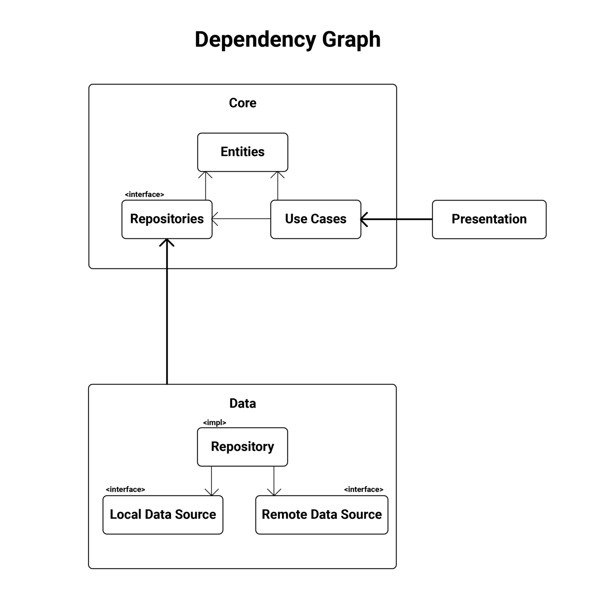

As for data flow, it all starts at the Presentation when the user might click a button or submits a form. The Presentation calls a use case, a method in the repository that retrieves/stores data is called. This data is retrieved from either a local data source, the remote data source, or maybe even both. The repository returns the result of the call back to the use case, which returns it to the Presentation.

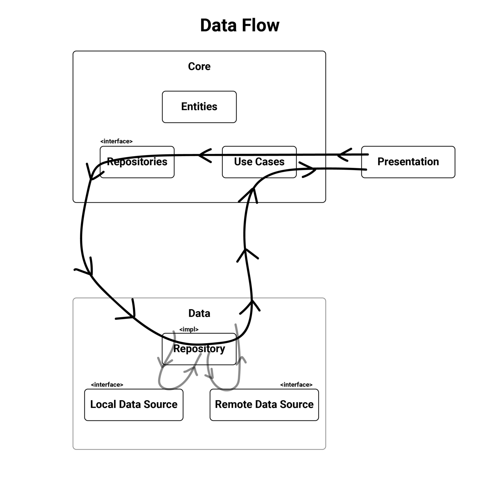

We will implement this data flow by injecting implementations of the repository interface from Data into the Core layer. This way, we keep Core in control, so inversion of control is satisfied. It’s satisfying because Data implements what Core has defined as a repository.

## General File Structure

Inside our main project, we have a folder named `packages` which has a folder for each layer of our application. We will start by creating some stuff in Core.

## Defining an example application


Photo by [Djim Loic](https://unsplash.com/@loic?utm_source=medium&utm_medium=referral) on [Unsplash](https://unsplash.com/?utm_source=medium&utm_medium=referral)

Let’s say we just received the following requirements for an app:

- Create an app that displays counters to the user
- The user should be able to create/delete counters
- The user should be able to increment/decrement a counter by pressing buttons
- The user should be able to change the amount of increment/decrement for a counter
- The user should be able to assign a label to a counter
- The user should be able to filter counters by label
- The user’s counters should be saved if they close the application and open it again.

From these requirements, we can say the following:

- Our main entity is the `Counter`
- Our use cases get all counters, get counters filtered by label, increment, decrement, assign a label, create a counter, and delete counter
- We need a way to store data locally, i.e., a local data source

# Writing Your First Entity and Use Case

Now we’re getting to the fun parts. We start by defining our application’s single entity: the counter.

We’ll create a new directory under `core/src/` named counter, and within it, we’ll create another directory called `entities`, in which we’ll create a file called `counter.entity.ts`:

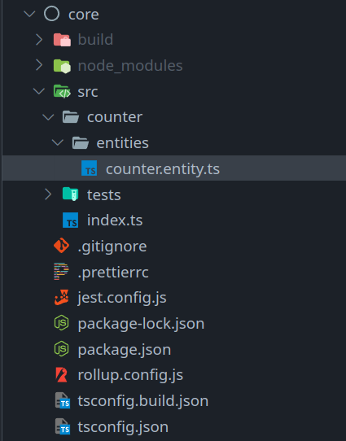

Next, we implement our use cases. We start by defining a standard way to interact with our use cases and each use case’s dependencies.

We create a use case interface under `core/src/base` and call it `usecase.interface.ts`.

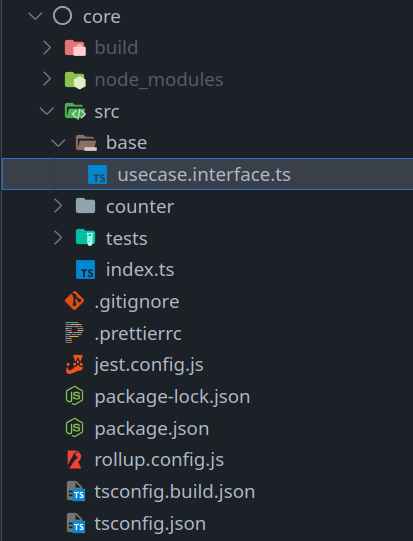

Now, whenever we create a new use case, we make it implement `Usecase` where it must also define its return type. This forces us to be thoughtful about the output of our use cases.

Let’s create the `CreateCounterUsecase` first.

Inside of core, create a folder under `src/counter` called `usecases`, and in it, create `create-counter.ts`.

You’ll see an interface of the use case, and directly below it, an implementation of that interface. Doing things this way helps us define data flow into/out of use cases and also makes dependency injection a walk in the park.

This use case will need a way to create a counter that persists somewhere so that our users will be able to do things like refresh the page and not lose their counters. For this, we create a repository interface under `src/counter/counter-repository.interface.ts`.

Now we add this repository to our create-counter use case’s dependencies and call this new method we added. I like to define dependencies in the constructor because it makes it straightforward to provide them when doing dependency injection.

Congratulations! We’ve just written our first entity, use case, and repository interface!

There’s one last thing we need to do, and that is to export our entities, use case, and repository from the core package. I prefer to do this using `index.ts` files. Here’s how we do it.

Under `core/src/counter`, create a file called `index.ts`. This file will use the `export` statement to make everything inside the counter directory available with a very simple import statement.

Whenever we add a new file to `counter`, and we want to export it, we just add an export statement to this file.

Next, update `core/src/index.ts` to include the following export statement:

We won’t need to update this file again unless we add another module next to `counter`.

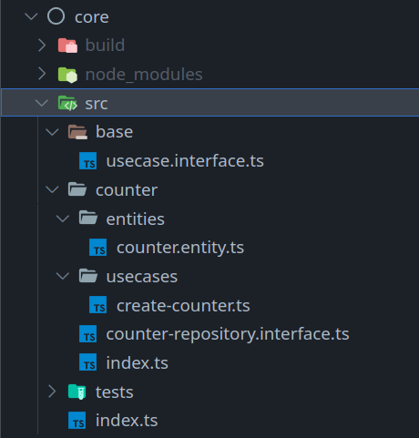

Run the following command to build your `core` package and have it distributed to all the packages that depend on it: `npx lerna run build && npx lerna bootstrap`. You only need to run the bootstrap command if it’s the first time you’re using the template.

Now we’re ready for the next step.

# Creating Data Sources

We need to implement the repository interface that core has defined. I choose to do this in a package called data. That way, I isolate my business rules in the `core` package, and the data sources that support them in another.

Under `packages/data/src`, create a folder called `counter` and, in it, create a file called `counter-repository.impl.ts`. The file extension is completely optional. I just like to make the insides of files a bit more explicit using these extensions. It also makes searching for them a bit easier.

You’ll notice I’ve imported everything in core as the keyword `core`. This is also a personal preference. You could use destructured imports to get things from `core`, but I think it’s better to make it more explicit.

Anyways. How should we implement our repository? We need some way to enable the user to persist their session somehow. *“Oh, I know!”* I hear you say, enthusiastically, *“We can just use the browser’s built-in local storage!”* That is a good solution to get the point across, but there’s a tiny problem.

The `data` package doesn’t have access to the browser’s storage API because it isn’t aware of a browser in the first place. In fact, we want `data` to be this way. Otherwise, we would have made it dependent on a detail, i.e., the platform it’s running on.

Instead, we provide our repo implementation with something called `local storage`. This is a dependency with an interface we define in `data`, and an implementation that we can define literally anywhere we want. This `local storage` dependency will be injected into our repo implementation. We will get to this section soon.

I chose to create this interface under `data/src/common` as `local-storage-service.interface.ts` since we’d want to use it in other repositories as well. Here’s the interface to our `local storage` dependency:

Now we add it as a dependency to our repo implementation, and we implement the `createCounter` method:

I’m implementing this method as simple as I can for now. The cool part is you can choose to make it anything you want in the future without Presentation or Core having to change anything at all.

Congrats! We’ve just implemented all we need in `data`. Now we need to export it as well. Again, let’s make use of index files.

Create an `index.ts` file under `data/src/counter`.

and also one under `data/src/common`

Finally, export both of these in the index file under `data/src`.

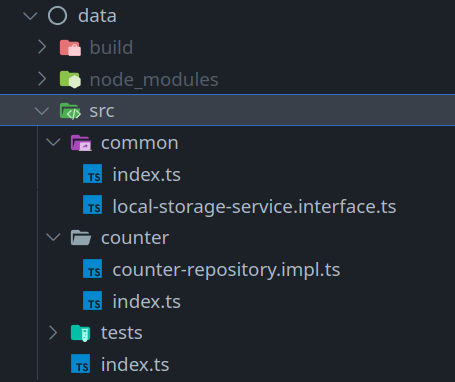

We export the local storage service interface because we will have it implemented in a place with access to the browser’s storage API: Presentation!

But wouldn’t that ruin our dependency graph by making `data` depend on `Presentation`? In fact, it won’t because we’re implementing inversion of control. This means that Presentation will indirectly depend on data rather than the other way around. You’ll see how this works in the upcoming section.

For now, let’s re-build our data package. Run `npx lerna run build` again.

# Dependency Injection (With a Little Help From Angular)

Here’s we bring `core` and `data` together. We want to associate the implementations of use cases and repositories with their interfaces.

I do this using a class that generates these objects with their dependencies given to them, for example, a `Factory`.

Under `di/src`, create a folder called `counter`, and within it, create a file called `counter.factory.ts`:

The `CounterFactory` class is instantiated with all the dependencies we need to instantiate our repository and use case. We don’t expose the repository, only the interface it requires.

We export this factory as well as the local storage service interface it requires by creating an `index.ts` file under `di/src/counter` like the following:

and we export this file in the `index.ts` file under `di/src`:

Here’s how the project dir looks for `di`:

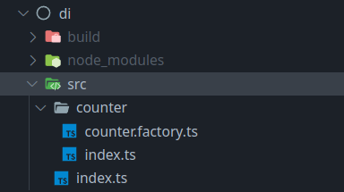

Run `npx lerna run build` to build your package. Notice how Lerna doesn’t rebuild core and data, but uses a cached version of their previous build since they didn’t change. Kinda cool, right?

Now we’re ready to move onto `Presentation`.

We need to make the stuff we just created easily accessible in Presentation. For this, I use Angular’s superb dependency injection. Here’s how I do it.

With Angular, we could do this directly inside of our `app.module` file, but I’m going to make things tidier by doing it all in a folder under `presentation/src/di`, and I’ll make a file inside of it called `counter.ioc.ts`

This file instantiates the `CounterFactory` and provides it with the dependencies it requires. Then, we create a `Provider[]` using Angular’s Provider type and inject our dependencies exactly like we normally do in an Angular application.

Before you panic, here’s the `LocalStorageServiceImpl` file which we create under `presentation/src/services` (or wherever you think is suitable):

One last thing (I swear!). We need to include this `CORE_IOC` provider array in our `app.module` to make it available in all of our applications.

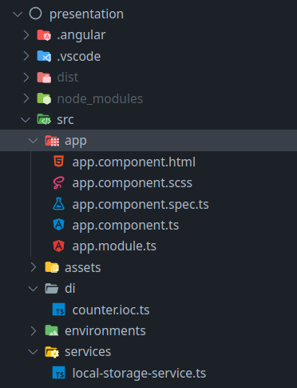

We are officially finished. I knew you could get there!

Keep in mind that a lot of what we’ve done in the previous steps is stuff we will only do once. You’ll see once we get to adding more use cases.

We can get to writing our UI code now.

# Creating a UI Component That Interacts With a Use Case

This is your standard Angular coding procedure. We’ll create a new component called counter under `presentation/src/app`.

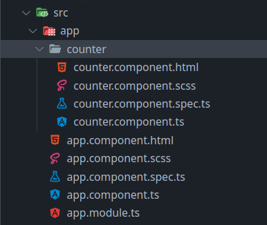

I’m going to skip over the UI code and just show the controllers and how the use cases are used. [You can see the code here](https://github.com/aziznal/typescript-clean-architecture/tree/master/packages/presentation/src/app) if you’re interested in it.

I will remove all the code generated by Angular from `app.component` and add my own. We need a button to create counters for now and a sort of structure to display them. I’ll go with a basic scrollable list. Here’s what our UI looks like:

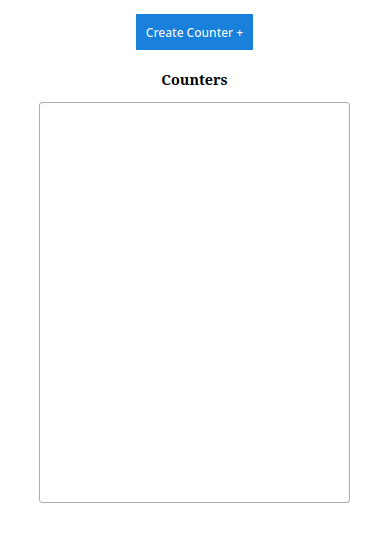

I’m going to hook the blue button to a method in our component’s controller in `app.component.ts`:

We have a list that stores all our counters and a method for creating a counter that pushes a new counter to the list after calling the use case. We inject the use case into the constructor using Angular’s awesome dependency injection. Pretty neat, right?

Now we can press the add-counter button, and we’ll see some stuff pop up in the list. (Again, I’m skipping over the actual HTML and CSS since they’re not relevant).

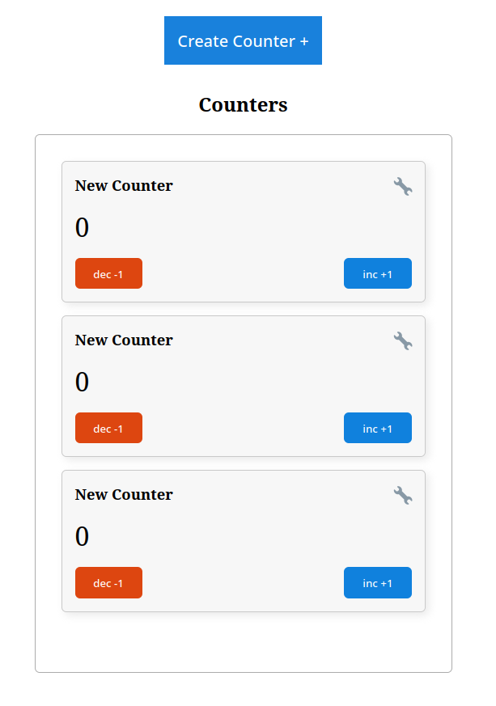

Now press the refresh button, and… it’s all gone. That’s because we need to add a method in our controller that retrieves all the counters when the page loads.

For this, we also need a use case that does this. Let’s get working.

We create a new use case under `core/counter/usecases` named `get-all-counters.ts`

We add a method to the repo interface for getting all counters:

Build `core` with `npx lerna run build` then implement this method in `data`’s repo implementation:

The repository implementation has become a bit complex now. There’s probably a better implementation that can be done here (foreshadowing ;)).

Regardless, build `data` and move on to `di`, so we update the counter factory to account for our new use case:

This was a lot simpler now that we already have the boilerplate code in place, right?

Finally, we inject our use case using Angular’s `di`:

Now we’re ready to use this use case in `app.component`:

We provide the use case in the constructor and then set it to be called in `ngOnInit`. Now, add a counter by pressing the button and refresh the page; the counters will persist! At least until we reset the browser storage.

So, to recap:

1. We created the use case in `core`
2. We implemented repo methods required by the use case in `data`
3. We set up a method to create the factory with its dependencies in `di`
4. We used Angular’s di to provide the use case throughout the project in `presentation`
5. We called the use case!

Steps 1, 2, and 5 are the steps that mean something to us. The rest are glue and make-life-easier solutions.

Adding the rest of the use cases is just rinse and repeat. You can see how I’ve implemented the rest of them [in this repo.](https://github.com/aziznal/typescript-clean-architecture)

# Testing

In this section, I’ll provide an example of writing a unit test for the counter-repository implementation in `data`.

We do this by creating a new file under `data/src/tests/counter` named `counter-repository.test.ts`

Lines 6 to 15 are a basic mock implementation of the local storage service that counter repository implementation requires. We define the body of the test code in lines 17 to 40. Before each test block is run, the counter repository and its dependency are initialized, so we make sure our unit tests are run in a clean environment every time.

I’ve written a single test that creates a new counter and then sees if it’s been stored by calling the method to retrieve all counters. The rest is up to you!

# Closing Notes

We’ve covered quite a bit, and it may seem overwhelming at first. If you have trouble going through it the first time, give it another try and take things slow. Understanding what each layer is actually responsible for will help a lot in getting all the pieces to fall into place!

It’s definitely a slower start than you may be used to, but once you get the basic steps, you’ll appreciate the ease of knowing who is responsible for what, and which code lives where. Not to mention how much easier testing is made when everything is loosely coupled.
