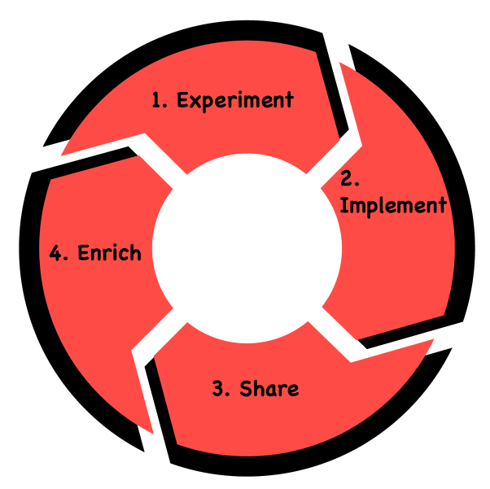
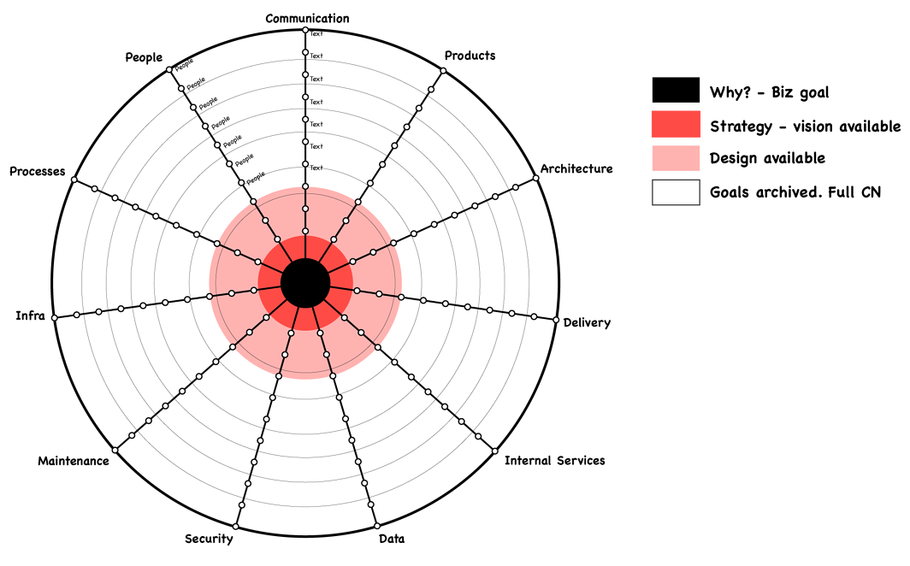
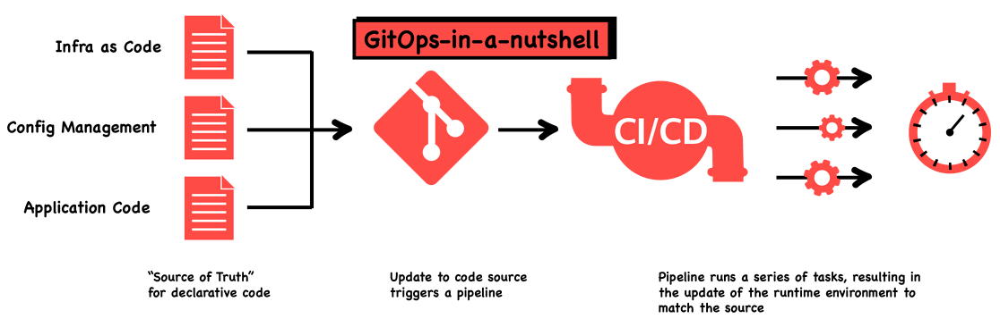
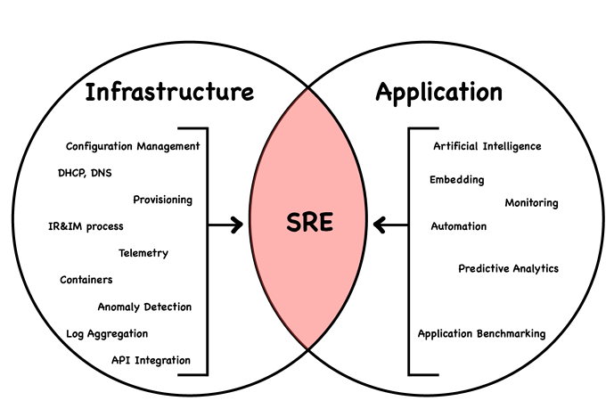

# WTF is Evolutionary Architecture?

> “An evolutionary architecture supports guided, incremental change across multiple dimension*s”.*   
> *From the book [Building Evolutionary Architectures](https://learning.oreilly.com/library/view/building-evolutionary-architectures/9781491986356/)*

There was a point in time where architectural changes were extremely costly. Because of this, once architectures were defined and built, people would avoid change. Jump forward to the advent of cloud computing—now the cost of not changing is greater and staying constant is a costly risk.

New processes have also formed. It’s become an industry standard to follow an Agile approach. Once it was common to create systems in a waterfall-like style, taking months to design a system, then taking years to implement the system. With Agile, the systems are designed and built incrementally. There is no point of completion, just constant improvement.

Agile is often thought of as a practice for software development, but Agile is equally important to architecture. Cloud-based architecture also has no end state. Architecture can, like software, be considered continuous.

Image reference: <https://continuous-architecture.org/>

Change does not mean chaos. Architecture still needs to be predictable. You create this predictability through these practices:

- Prioritising architectural concerns—often referred to as the “ilities”
- Understanding the dimensions of the business and industry
- Adding fitness functions to act as guard rails

## Prioritising architectural concerns

It’s important to choose the right concerns for the business and to focus effort in the right areas. There are [a lot of “ilities”](https://en.wikipedia.org/wiki/List_of_system_quality_attributes) to choose from. It’s possible to get caught up in trying to create the perfect architecture that caters to all concerns. Understanding what should be priority is key.

For example, security might be a primary concern for an organisation operating in a highly regulated sector such as financial services, and that will therefore mean a focus on architecture. In some cases you might decide you can trade this off against another concern like timeliness—in this example security is deemed much more important than meeting deadlines.

### Understanding the dimensions affecting architecture

> “It is not the strongest of the species that survive, nor the most intelligent, but the one most responsive to change”.  
> *Charles Darwin*

Architectural diagrams look at the world in 2D. They create a snapshot of an ideal world. Evolutionary architecture is the practice of considering a spectrum of dimensions around the architecture.

To create evolutionary architecture you also have to consider other forces. There are many dimensions that will affect architecture and impact its evolvability.

The diagram below shows some important dimensions:

As you can see from the diagram, there are multiple competing forces at play for any given project at any given point in time. Being aware of them and making them visual can help your team think of the appropriate architecture.

## Fitness functions

Fitness functions are guardrails for architecture. They support the practice of iterative change and offer confidence that the architecture is not degrading. Allowing the business to trust the architecture still caters to the main concerns.

There are many types of fitness functions to consider; some broader categories of fitness functions are triggered and continual.

### Triggered

The commonly known triggered fitness functions are the automated scans that can be added to the practice of continuous delivery, and also as part of DevSecOps practices. These get triggered as changes are made.

These can include:

- Tests for software
- Code-quality scans
- Security scans
- Integration tests

### Continual

Good examples of continual fitness functions are the monkey scripts in [Netflix’s Simian Army](https://netflixtechblog.com/the-netflix-simian-army-16e57fbab116). The most known is usually the Chaos Monkey, but another notable one is the Conformity Monkey, which finds instances that don’t adhere to best-practices and shuts them down.

You may not choose to be as aggressive as Netflix and shut down services on production, but you can set up scripts to continuously collect information. Through the collected information you can set up dashboards, trigger notifications to teams, and also generate reports over time. You want a way to monitor over time that architectural concerns are being adhered to and notify the relevant people when they aren’t.

### Relativity of architecture

A final thought on fitness functions—consider the relativity of the parts in a system. One change in the architecture could have a knock-on effect on another part. By putting in place the right fitness functions, you can anticipate the knock-on effects of architectural changes.

An example is integration tests in a microservice architecture. When a new change is deployed to a microservice, or any change made to the ecosystem—like replacing AWS API Gateway with Kong—run integration tests to confirm the architectural concerns are still being met.

## In practice

With evolutionary architecture, change is a first-class consideration. Change is encouraged.

Putting evolutionary architecture into practice allows us to explore patterns like [gitops](https://info.container-solutions.com/what-is-gitops-ebook?hsLang=en), where architecture can be changed as easily as updating a configuration file in a git-based repository.

Image reference: [https://blogs.vmware.com](https://blogs.vmware.com/)

This flexibility also means the approach of top-down architectural instructions will only slow down the overall progress. Architecture can now shift left, and teams can architect their domains. Having teams wait for architectural instructions will cause a big bottleneck,which you want to avoid.

Another practice that supports evolutionary architecture is Site Reliability Engineering ([SRE](https://sre.google/sre-book/table-of-contents/)). SRE helps make systems observable, giving visibility across all the systems your teams create. You’ll also gain other benefits like being able to set up alerts for any architectural degradation.

Image reference: [https://www.comparethecloud.net](https://www.comparethecloud.net/)

Once you have this set up, you have the ability to allow team autonomy. You have fitness functions in place so you can trust changes won’t degrade the architecture and you have SRE and have visibility over everything.

### Conclusion

Evolutionary architecture is considered as one of the “-ilities”. The evolvability of architecture is what makes it resilient to change. Creating an architecture that allows for constant change doesn’t mean allowing chaos. You can use a range of practices that allow your architectures to remain predictable.

In Enterprise Architecture one of your goals is to make sure teams understand their own architectures, as well as making sure they feel comfortable proposing new ideas and don’t fear change.

