# ‍‍‍ JavaScript Visualized: Prototypal Inheritance

## [JavaScript Visualized (7 Part Series)](https://dev.to/lydiahallie/series/3341)

Ever wondered why we can use built-in methods such as `.length`, `.split()`, `.join()` on our strings, arrays, or objects? We never explicitly specified them, where do they come from? Now don't say "It's JavaScript lol no one knows, it's magic ‍♂️", it's actually because of something called *prototypal inheritance*. It's pretty awesome, and you use it more often than you realize!

We often have to create many objects of the same type. Say we have a website where people can browse dogs!

For every dog, we need object that represents that dog! Instead of writing a new object each time, I'll use a constructor function (I know what you're thinking, I'll cover ES6 classes later on!) from which we can create Dog **instances** using the `new` keyword (this post isn't really about explaining constructor functions though, so I won't talk too much about that).

Every dog has a name, a breed, a color, and a function to bark!

[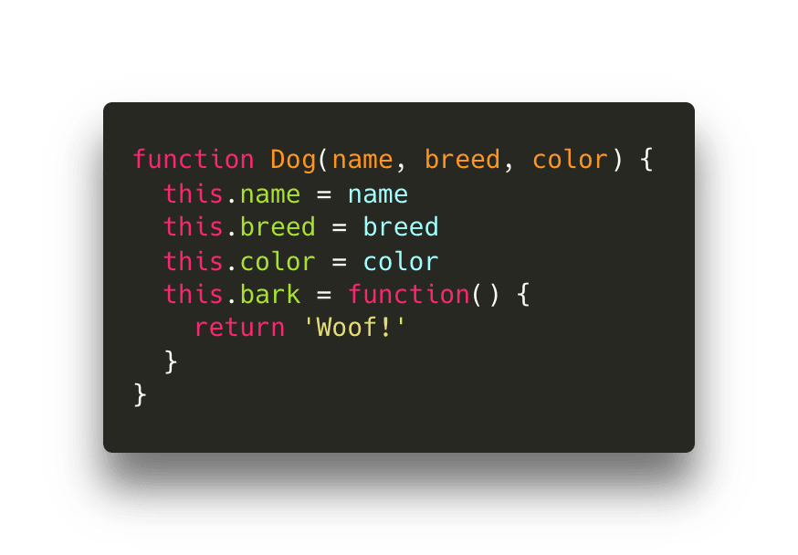](https://res.cloudinary.com/practicaldev/image/fetch/s--pDfw39RK--/c_limit%2Cf_auto%2Cfl_progressive%2Cq_auto%2Cw_880/https://thepracticaldev.s3.amazonaws.com/i/caurw7uuk62htpldgtln.png)

When we created the `Dog` constructor function, it wasn't the only object we created. Automatically, we also created another object, called the *prototype*! By default, this object contains a *constructor* property, which is simply a reference to the original constructor function, `Dog` in this case.

[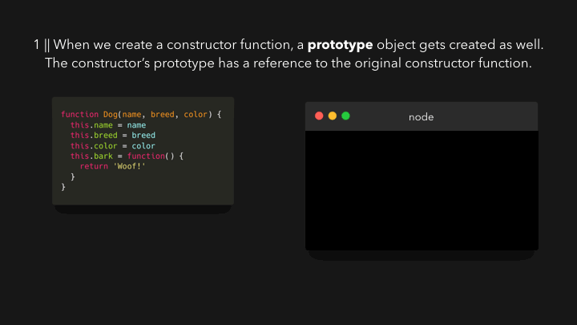](https://res.cloudinary.com/practicaldev/image/fetch/s--dWGIZ_zz--/c_limit%2Cf_auto%2Cfl_progressive%2Cq_66%2Cw_880/https://thepracticaldev.s3.amazonaws.com/i/9howj4i3zvlgun3svppp.gif)

The `prototype` property on the Dog constructor function is non-enumerable, meaning that it doesn't show up when we try to access the objects properties. But it's still there!

Okay so.. Why do we have this *property* object? First, let's create some dogs that we want to show. To keep it simple, I'll call them `dog1` and `dog2`. `dog1` is Daisy, a cute black Labrador! `dog2` is Jack, the fearless white Jack Russell

[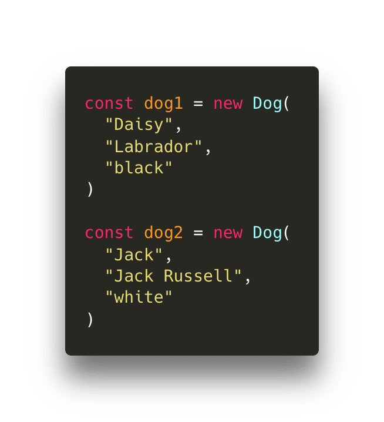](https://res.cloudinary.com/practicaldev/image/fetch/s--O_jSVpBB--/c_limit%2Cf_auto%2Cfl_progressive%2Cq_auto%2Cw_880/https://thepracticaldev.s3.amazonaws.com/i/lyajz4lade30ci2koirq.png)

Let's log `dog1` to the console, and expand its properties!

We see the properties we added, like `name`, `breed`, `color`, and `bark`.. but woah what is that `__proto__` property! It's non-enumerable, meaning that it usually doesn't show up when we try to get the properties on the object. Let's expand it!

[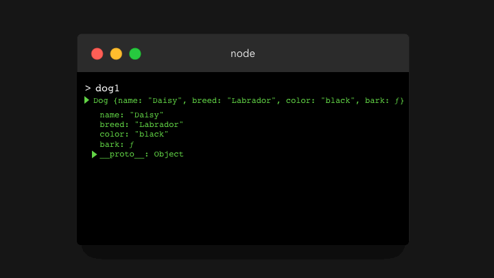](https://res.cloudinary.com/practicaldev/image/fetch/s--zxO-eMV0--/c_limit%2Cf_auto%2Cfl_progressive%2Cq_66%2Cw_880/https://thepracticaldev.s3.amazonaws.com/i/dye57pcku5cfaz0er60c.gif)

Woah it looks exactly like the `Dog.prototype` object! Well guess what, `__proto__` is a reference to the `Dog.prototype` object. This is what **prototypal inheritance** is all about: each instance of the constructor has access to the prototype of the constructor!

[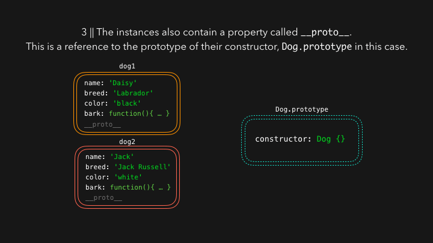](https://res.cloudinary.com/practicaldev/image/fetch/s--FBGV--dx--/c_limit%2Cf_auto%2Cfl_progressive%2Cq_66%2Cw_880/https://thepracticaldev.s3.amazonaws.com/i/t6kiav029gl2e0hv1xct.gif)

So why is this cool? Sometimes we have properties that all instances share. For example the `bark` function in this case: it's the exact same for every instance, why create a new function each time we create a new dog, consuming memory each time? Instead, we can add it to the `Dog.prototype` object!

[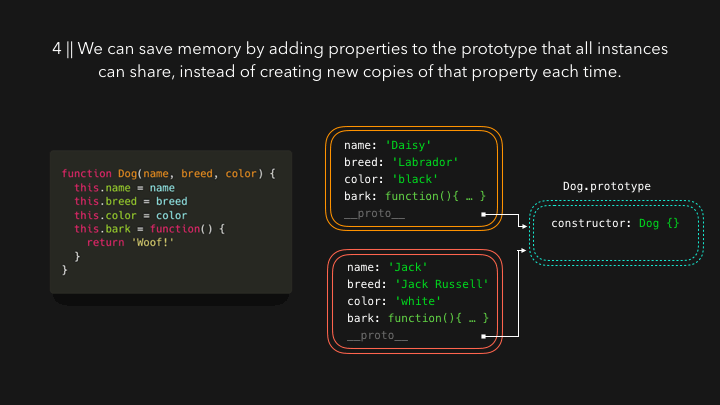](https://res.cloudinary.com/practicaldev/image/fetch/s--2026kdwz--/c_limit%2Cf_auto%2Cfl_progressive%2Cq_66%2Cw_880/https://thepracticaldev.s3.amazonaws.com/i/59nlnyqioosaowj09xn8.gif)

Whenever we try to access a property on the instance, the engine first searches locally to see if the property is defined on the object itself. However, if it can't find the property we're trying to access, the engine **walks down the prototype chain** through the `__proto__` property!

[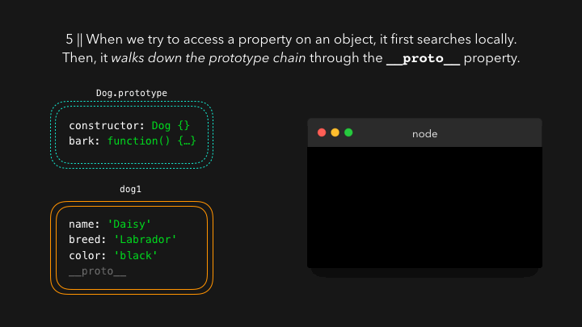](https://res.cloudinary.com/practicaldev/image/fetch/s--gg5KU5nB--/c_limit%2Cf_auto%2Cfl_progressive%2Cq_66%2Cw_880/https://thepracticaldev.s3.amazonaws.com/i/fabyyjot1s78mttyzzk8.gif)

Now this is just one step, but it can contain several steps! If you followed along, you may have noticed that I didn't include one property when I expanded the `__proto__` object showing `Dog.prototype`. `Dog.prototype` itself is an object, meaning that it's actually an instance of the `Object` constructor! That means that `Dog.prototype` also contains a `__proto__` property, which is a reference to `Object.prototype`!

[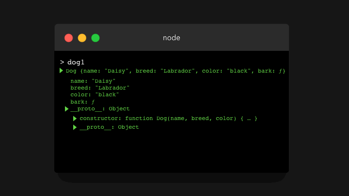](https://res.cloudinary.com/practicaldev/image/fetch/s--vJ7k8Gb3--/c_limit%2Cf_auto%2Cfl_progressive%2Cq_66%2Cw_880/https://thepracticaldev.s3.amazonaws.com/i/8vk5w6loliot818f2lcd.gif)

Finally, we have an answer to where all the built-in methods come from: they're on the prototype chain!

For example the `.toString()` method. Is it defined locally on the `dog1` object? Hmm no.. Is it defined on the object `dog1.__proto__` has a reference to, namely `Dog.prototype`? Also no! Is it defined on the object `Dog.prototype.__proto__` has a reference to, namely `Object.prototype`? Yes!

[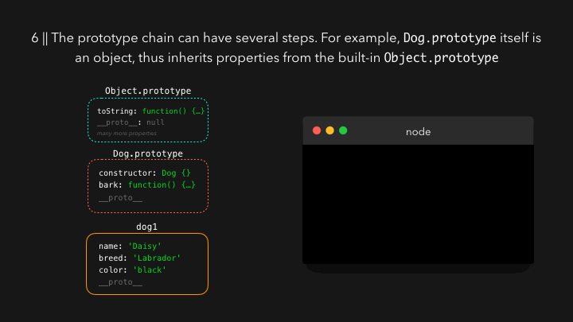](https://res.cloudinary.com/practicaldev/image/fetch/s--16IwaVkk--/c_limit%2Cf_auto%2Cfl_progressive%2Cq_66%2Cw_880/https://thepracticaldev.s3.amazonaws.com/i/fpt5nndkbq5kau0nqeqj.gif)

Now, we've just been using constructor functions (`function Dog() { ... }`), which is still valid JavaScript. However, ES6 actually introduced an easier syntax for constructor functions and working with prototypes: classes!

> Classes are only **syntactical sugar** for constructor functions. Everything still works the same way!

We write classes with the `class` keyword. A class has a `constructor` function, which is basically the constructor function we wrote in the ES5 syntax! The properties that we want to add to the prototype, are defined on the classes body itself.

[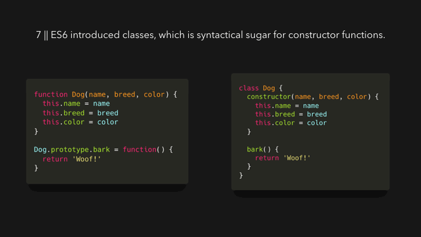](https://res.cloudinary.com/practicaldev/image/fetch/s--3PePIjz5--/c_limit%2Cf_auto%2Cfl_progressive%2Cq_66%2Cw_880/https://thepracticaldev.s3.amazonaws.com/i/qnbqubcipqjl5pb3i8ds.gif)

Another great thing about classes, is that we can easily **extend** other classes.

Say that we want to show several dogs of the same breed, namely Chihuahuas! A chihuahua is (somehow... ) still a dog. To keep this example simple, I'll only pass the `name` property to the Dog class for now instead of `name`, `breed` and `color`. But these chihuahuas can also do something special, they have a small bark. Instead of saying `Woof!`, a chihuahua can also say `Small woof!`

In an extended class, we can access the parent class' constructor using the `super` keyword. The arguments the parent class' constructor expects, we have to pass to `super`: `name` in this case.

[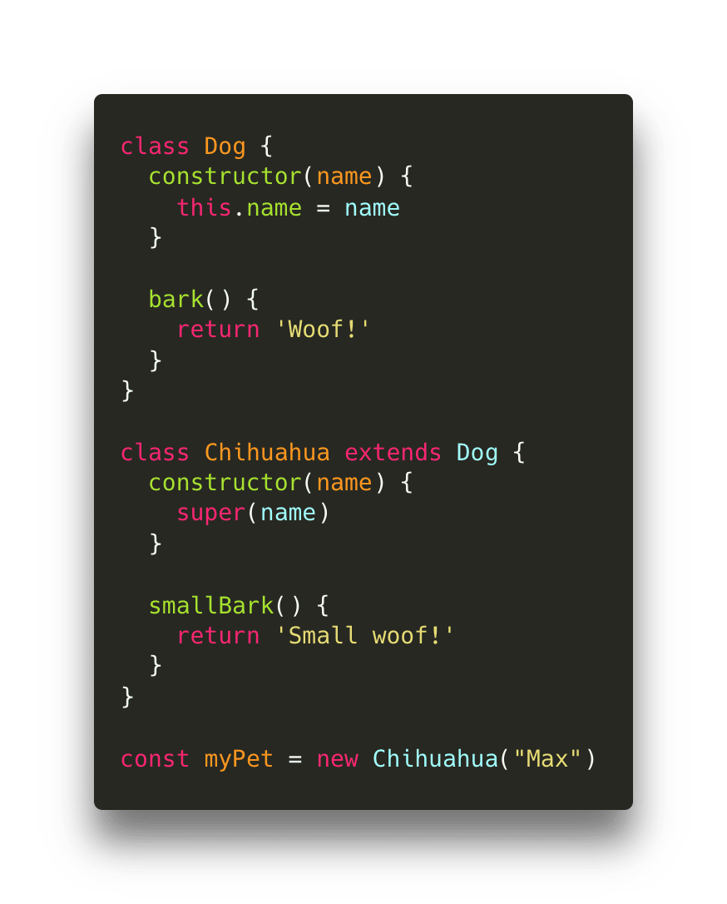](https://res.cloudinary.com/practicaldev/image/fetch/s--Fitn1c9K--/c_limit%2Cf_auto%2Cfl_progressive%2Cq_auto%2Cw_880/https://thepracticaldev.s3.amazonaws.com/i/tx25dar3duqo0z2bpfam.png)

`myPet` has access to both the `Chihuahua.prototype` and `Dog.prototype` (and automatically `Object.prototype`, since `Dog.prototype` is an object).

[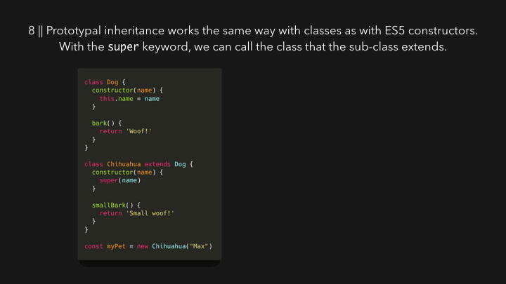](https://res.cloudinary.com/practicaldev/image/fetch/s--WOeqUeM3--/c_limit%2Cf_auto%2Cfl_progressive%2Cq_66%2Cw_880/https://thepracticaldev.s3.amazonaws.com/i/qija16dju8t5j1ksy0ps.gif)

Since `Chihuahua.prototype` has the `smallBark` function, and `Dog.prototype` has the `bark` function, we can access both `smallBark` and `bark` on `myPet`!

Now as you can imagine, the prototype chain doesn't go on forever. Eventually there's an object which prototype is equal to `null`: the `Object.prototype` object in this case! If we try to access a property that's nowhere to be found locally or on the prototype chain, `undefined` gets returned.

---

Although I explained everything with constructor functions and classes here, another way to add prototypes to objects is with the `Object.create` method. With this method, we create a new object, and can specify exactly what the prototype of that object should be!

We do this, by passing an *existing object* as argument to the `Object.create` method. That object is the prototype of the object we create!

[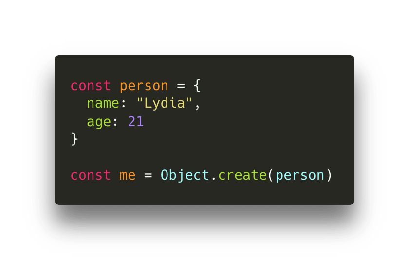](https://res.cloudinary.com/practicaldev/image/fetch/s--uw9DJFU0--/c_limit%2Cf_auto%2Cfl_progressive%2Cq_auto%2Cw_880/https://thepracticaldev.s3.amazonaws.com/i/kbwwsn1fd4gngd05tm9a.png)

Let's log the `me` object we just created.

[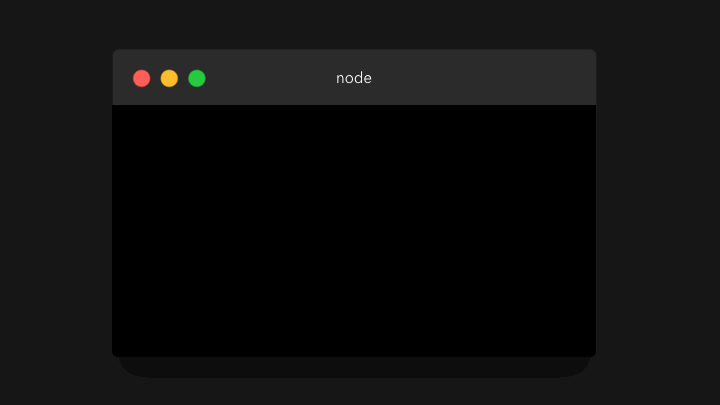](https://res.cloudinary.com/practicaldev/image/fetch/s--9sWtvaRG--/c_limit%2Cf_auto%2Cfl_progressive%2Cq_66%2Cw_880/https://thepracticaldev.s3.amazonaws.com/i/6zzt8zpy85gtitxmpwi9.gif)

We didn't add any properties to the `me` object, it simply only contains the non-enumerable `__proto__` property! The `__proto__` property holds a reference to the object we defined as the prototype: the `person` object, which has a `name` and an `age` property. Since the `person` object is an object, the value of the `__proto__` property on the `person` object is `Object.prototype` (but to make it a bit easier to read, I didn't expand that property in the gif!)

---

Hopefully, you now understand why prototypal inheritance is such an important feature in the wonderful world of JavaScript! If you have questions, feel free to reach out to me!
