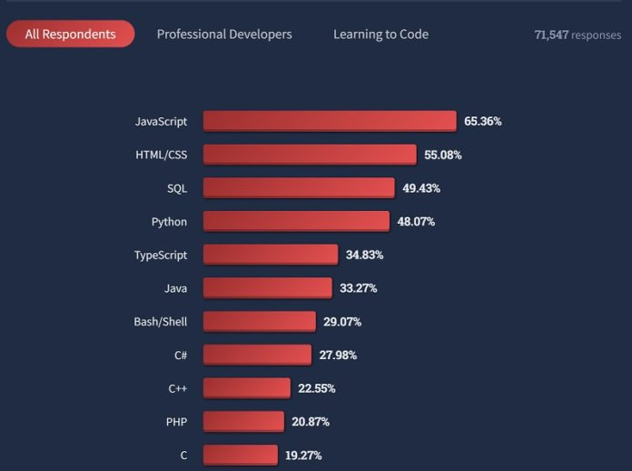

# ‘The best thing we can do today to JavaScript is to retire it,’ says JSON creator Douglas Crockford

August 4, 2022

JavaScript, the world’s most popular programming language according to most surveys, has become a barrier to progress, according to Douglas Crockford, creator of the JSON (JavaScript Object Notation) specification used everywhere for serializing data in web applications.

Crockford made this assertion in an [interview last month](https://evrone.com/douglas-crockford-interview):

“The best thing we can do today to JavaScript is to retire it. Twenty years ago, I was one of the few advocates for JavaScript. Its cobbling together of nested functions and dynamic objects was brilliant. I spent a decade trying to correct its flaws. I had a minor success with ES5. But since then, there has been strong interest in further bloating the language instead of making it better. So JavaScript, like the other dinosaur languages, has become a barrier to progress. We should be focused on the next language, which should look more like E than like JavaScript.”

*JavaScript is the world’s most popular programming language according to most surveys*

According to a StackOverflow survey earlier this year, JavaScript is used by over 65% of developers, way ahead of second placed Python at 48 percent (ignoring HTML, CSS and SQL which are not general purpose languages). It is an unlikely achievement considering its origins.

Brendan Eich invented the language for Netscape in 1995, apparently in just 10 days. “In May I did 10 days of hard work, I didn’t sleep much,” [Eich](https://www.youtube.com/watch?v=GxouWy-ZE80) told the dot.JS conference in 2018. In 2012 Eich [told](https://www.youtube.com/watch?v=IPxQ9kEaF8c) Computer’s Charles Severance that: “I went in to do … a programming language for HTML, for web designers and programmers to use, embedded directly in the web page … not like Java which was a professional’s language where you would run real code with type declarations, and you’d have to write in a way that compiled.” He added that, “the name is a total lie. It is not so much related to Java so much as to a common ancestor, C, in syntax.”

Eich called the work “a rush job” but also said that “I knew there would be mistakes, there would be gaps, so I made it very malleable as a language. That has enabled web developers to make it be what they want it to be.”

## Why has JavaScript been such a wild success?

There are multiple reasons, including Eich’s foresight, ease of learning, and tolerance of code that would be mistakes in many languages, like comparing strings to numbers and getting a common-sense result – though Eich later [called this](https://thenewstack.io/brendan-eich-on-creating-javascript-in-10-days-and-what-hed-do-differently-today/) “a big regret, because that breaks an important mathematical property.”

Another big factor is that Google’s determination to make browser-based applications competitive with the desktop gave the world the V8 engine (2008), which along with Mozilla’s SpiderMonkey and Apple’s JavaScript Core gave the language amazing JIT-compiled performance. In 2009, Ryan Dahl came up with Node.js, enabling V8 to run outside the browser. Dahl had server applications in mind, but today Node.js and NPM (Node Package Manager) are also essential to the development process for most web applications.

Development process? Part of the problem referenced by Crockford is that along with increased capability JavaScript has acquired lots of complexity, and a typical application today includes a build process using WebPack, Rollup or some other bundler, a long way from Eich’s original concept.

Further, many web developers do not write JavaScript; rather, they write TypeScript, which compiles to JavaScript. TypeScript was invented by Anders Hejlsberg at Microsoft, the rationale being that JavaScript’s malleability and lack of type safety made it unsuitable for large applications. TypeScript is now the number three language in the survey mentioned above, and is evidence that JavaScript is not altogether loved. The advent of WebAssembly, a binary format that can be targeted by languages including C, C++, C# and Rust, is another innovation that may undermine JavaScript’s dominance.

“JavaScript has exploded in popularity in just a few years and yes, the ecosystem is horribly complex. It’s a running gag even among full time JS devs how crazy it’s gotten. None of us can keep up,” confessed a developer in a [recent discussion](https://news.ycombinator.com/user?id=solardev) on Hacker News.

JavaScript is evolving with many new features and progress can be tracked [here](https://github.com/tc39/ecma262/), though the demands of compatibility means that some flaws cannot be corrected, and at the other end feature bloat is a constant risk.

Crockford’s pick to replace JavaScript, [E](http://erights.org/), is an outlier. Created by Mark Miller, Crockford and others, E is an object-oriented language designed for secure computing and in Crockford’s words, “eliminating many of the bad parts of Java.”

Crockford also notes though that JavaScript will be hard to shift, in particular because it is the language supported by every browser for DOM (Document Object Model) manipulation. Asked about what can replace it there, Crockford said: “There are two difficulties. First, we don’t have the next language yet. It needs to be a minimal capability-based actor language that is designed specifically for secure distributed programming. Nothing less should be considered.

“Second, we need all of the browser makers to adopt it and to simultaneously replace the DOM with a well designed interface. Good luck with that.”
