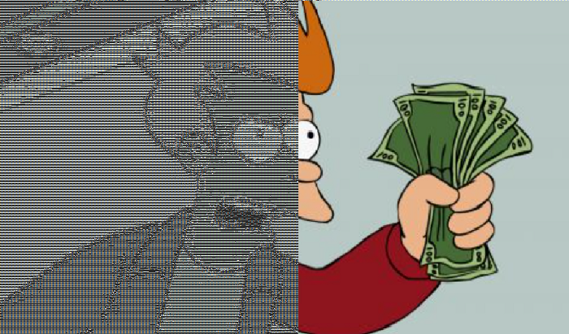
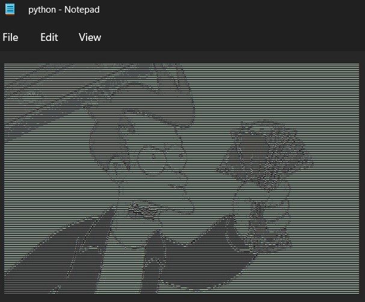
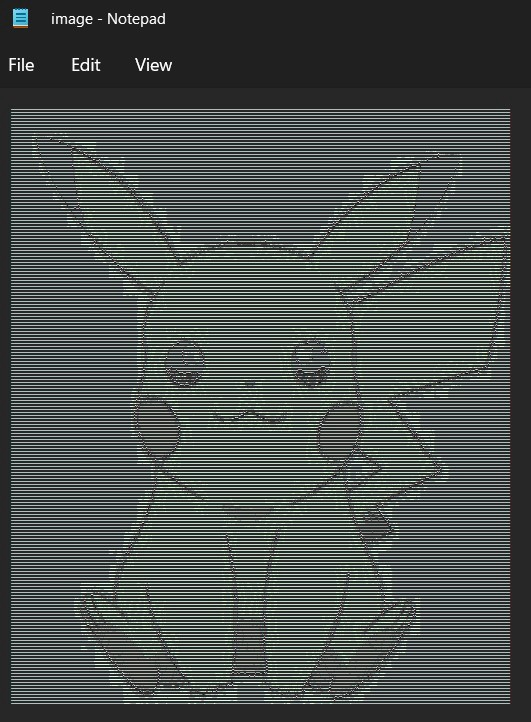
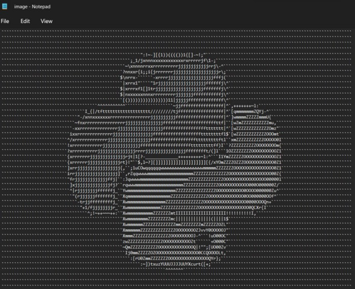

# How to Convert an Image to ASCII Art with Python in 5 Steps



take my pixels and leave!

**In this simple and straightforward article, we’ll convert an image into ASCII characters with Python.**

If you are a Junior developer looking for a new challenge, this might be a good exercise!

## 1. ASCII Characters Map

Firstly, we’ll create a *String* with all the characters that will be used for generating the ASCII art.

```
ascii_characters_by_surface = "`^",:;Il!i~+_-?][}{1)(|/tfjrxnuvczXYUJCLQ0OZmwqpdbkhao*#MW&8%B@$"
```

These characters are ordered based on the surface they occupy when they are rendered. For instance, the character “**`**" uses the least surface on the screen, while the character “**$**” is having the biggest area.

## 2. Calculating a Pixel’s Brightness

A pixel will be represented as a tuple of three integers with values between 0 and 255— equivalent to the red, green, and blue values.

The higher these values are, the brighter the pixel is. For example, a white pixel will be represented as (255, 255, 255).

Therefore, we’ll sum up the three integer fields in order to decide how brighter the pixel is.

This also means that the maxim value we can get for the pixel’s brightness will be 765 — the brightness of the white pixels *(255 +255 +255)*.

```
(r, g, b) = pixel  
pixel_brightness = r + g + b  
max_brightness = 255 * 3
```

## 3. Converting a Pixel to a Character

Now, we can convert a pixel to an ASCII character.

Firstly, we’ll need to calculate the brightness weight. To achieve this, we’ll divide the length of our ASCII characters list by the maximum brightness value.

```
brightness_weight = len(ascii_characters_by_surface) / max_brightness
```

After that, for a given pixel we can find its corresponding index from the ASCII characters list like this:

```
index = int(pixel_brightness * brightness_weight) - 1
```

Finally, we can convert the pixel to a character by returning the character corresponding to this index:

```
return ascii_characters_by_surface[index]
```

## 4. Parsing an Image

We’ll use the *Pillow* module to load an image, read all its pixels, and convert them to (r, g, b) tuples.

First, we’ll need to import the module and read the image:

```
from PIL import Image  
  
image = Image.open('image.jpg')  
(width, height) = image.size
```

After that, we’ll iterate through all the pixels and read them one by one:

```
for y in range(0, height - 1):  
    for x in range(0, width - 1):  
        px = image.getpixel((x, y))
```

We’ll map each of these pixels to its corresponding ASCII character and create a String for each row of the image:

Finally, we’ll write everything into a text file:

Let’s see all the code in a single snippet:

## 5. Have Fun!

Open the resulted file in a text editor and zoom out to see the bigger picture.

Now, run the app and share your best result.







# Level Up Coding

Thanks for being a part of our community! Before you go:

- Clap for the story and follow the author
- View more content in the [Level Up Coding publication](https://levelup.gitconnected.com/?utm_source=pub&utm_medium=post)
- Follow us: [Twitter](https://twitter.com/gitconnected) | [LinkedIn](https://www.linkedin.com/company/gitconnected) | [Newsletter](https://newsletter.levelup.dev/)

[**Join the Level Up talent collective and find an amazing job**](https://jobs.levelup.dev/talent/welcome?referral=true)
