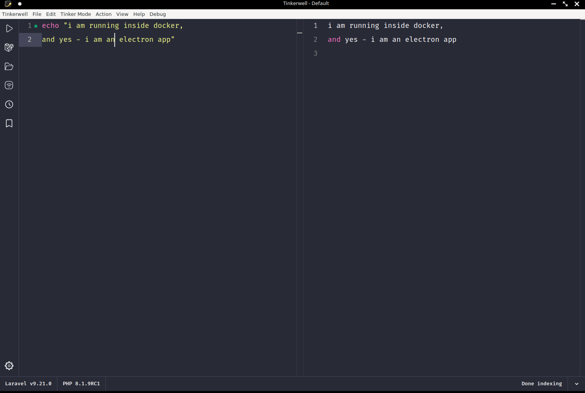
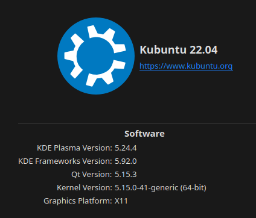
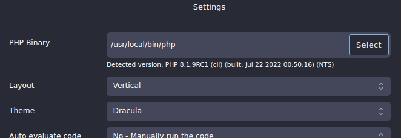
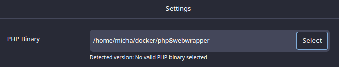
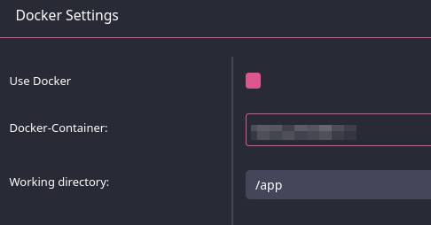
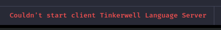
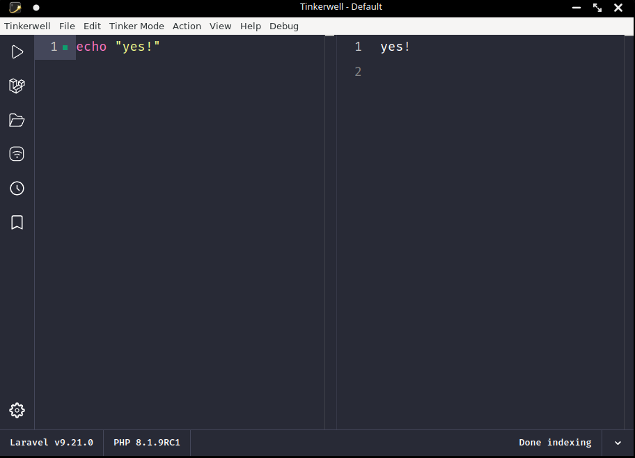
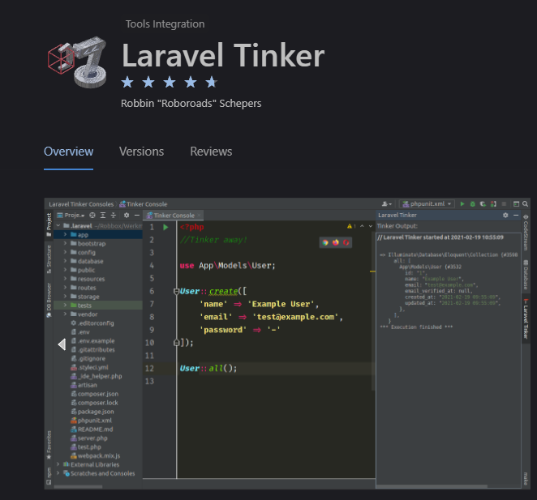
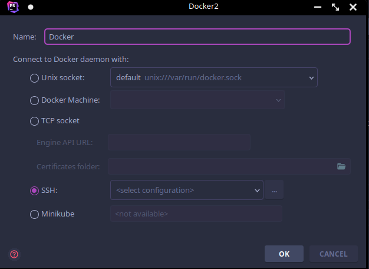

# A Company banned me because I made their Electron App running inside Docker

Okay, to be honest, because: I was impudent to ask questions as well ;)


The original title of this story should be:

> Run Tinkerwell (electron) inside Docker

but because I got some mail, I couldn’t resist making fun of it and creating one of these stupid dramatic clickbait titles some people are using, sorry! ;-))



Tinkerwell (electron) running inside Docker

Actually, the technical part should start here, but I got some mail from someone, and…. you should know…..


Photo by [Bank Phrom](https://unsplash.com/@bank_phrom?utm_source=medium&utm_medium=referral) on [Unsplash](https://unsplash.com/?utm_source=medium&utm_medium=referral)

**Breaking News on a Sunday afternoon (31.07.2022 17:00h CEST):**

Before I was able to finish this story, the CEO of BeyondCode, Sebastian Schlein, wrote to me, on a Sunday (keep that in mind), to explain to me, that he is unable to support me — a paying customer — because I don‘t use their software, as they intended to be used and if they would answer my questions — I asked 3 things - they won´t be able to pay their rent. This may sound like a funny bad joke, but it’s not. It’s the real truth about (some) Companies, that are very active in the PHP (and Laravel) world, take money for Software but when people start asking questions, you are not a valuable customer that offers a chance to make things better, to provide an opportunity for ideas, no, if you write more than 2 emails, your are a “troublemaker” — and what´s best  
to get rid of troublemakers? Just tell them: I won´t support you! You have paid, but I don´t care. Why do I not care? Simple: I just had to find a reason and I have found one: You are not using the Software as we want. And yes, of course, I had to tell you this on a Sunday ;-))) LOL.

I told him: If I would work like him, there would be much more things than my rent I wouldn´t be able to pay.

In a world, where you are thankful for every paying customer, who takes a lot of effort testing and using your software, doesn´t matter — the way it should be used or not — I would be so thankful for every single customer. Would be open-minded to every idea, would listen, and would use every feedback and question as an opportunity to involve my software and make things better.

But the CEO of BeyondCode sadly taught me a better lesson.

I told him, it´s okay if he apologizes and leaves Support to someone, who properly has more knowledge in technique, like Marcel (CTO), his partner.  
Instead, he offered me a full refund and told me to never write again or use any of their software ever again. Can you believe that? Btw… to make this story complete, here are the things I asked, as a paying customer:

1. Does Tinkerwell has to create the Index every time I start it or should the Index be already available (from the last run).
2. When writing “config(…..)” (this comes from Laravel), I would expect Tinkerwell to offer me auto-completion, but it doesn´t — so I asked if that does not exist or if something is wrong
3. When writing “User::” (this comes from Laravel), I would expect Tinkerwell to offer me auto-completion, for example: “User::first()”, but it does not. So I asked if that is just missing or if I should see that.

There is no documentation out there, that answers these questions. I am always reading first before I write, but when I don´t find anything and paid for something, I really believe, I am not a bad person, if I ask ;-))

Does this have anything to do with the fact, that I am running Tinkerwell inside Docker? Maybe, maybe not. But paying 49€ is not enough to get answers. Instead, the CEO explains to you — on a Sunday- that he is unable to answer these questions, otherwise, he wouldn´t be able to pay his rent (if his company would waste time on people using their software in an inappropriate way, like I do).

To be honest, I am shocked. I spend hours delivering the solution for running their software within Docker, which would be a great thing to announce to everybody who works like me — instead, I get a kick in the a\*\* and get told, to stay away, like a criminal. Crazy fact: I don´t even have any history with that guy.

In case you don’t know [BeyondCode](https://beyondco.de/about-us), here’s their “philosophy”:

- We make a difference
- Made for developers, by developers
- Giving back to the future
- You’re in good company

<https://media.giphy.com/media/xUA7b2ZsWYo4QiScg0/giphy.gif>

It got even better: Last mail from Mr. CEO:

> I made a refund, but your licence stays active. It’s up to you to decide to use Tinkerwell or not.

I guess the hidden part says: You won´t get any updates and we still won´t support you in any way in the future ;-) Which makes this gesture even more strange. Oh boy, it has been a very hot day in Germany, maybe too hot in some regions ;-)))

Last but not least:

A few days earlier I wrote to the Support (a different Person):

> I just want you to know: I will buy your Tinkerwell again, because I see a chance to make it working for me. I just wanted to let you know, so you don’t see my 2nd payment as some kind of scam.

“She” answered (about my information that it should be possible to run electron inside docker):

> That’s a very interesting idea. We are going to look into that (some day).

You see, all this is pure comedy ;-)  
But if the CEO itself is the problem, you are lost, on every level ;)

Sorry for this off-topic part, but before this story inspires you to give money to these poor people, having problems paying their rent — you… let’s say… should know :-)

**Now back to the original story I was going to post:**

**Important:**

This is about Linux, Docker, and PHP.  
The solution I am providing here is for Linux only.   
In case you are using Mac, you have to adapt it to your needs, [this](https://jaked.org/blog/2021-02-18-How-to-run-Electron-on-Linux-on-Docker-on-Mac) might help.  
If you are a Windows user, you have chosen anyway the worst OS on this planet you can use (as a PHP developer), no pity for you ;-)

> btw… a Windows User is talking here, but thanks to VMWare,   
> I feel 100% Linux :)

My host System:



So Marcel did a great job creating [this little helper](https://tinkerwell.app/) called Tinkerwell, an electron App that helps PHP developers.

But sadly many App Developers think you always have a “php” binary somewhere on your host.

To be honest, my daily life as a developer dramatically changed the day I got known to Docker. This really changed everything for me. No more package conflicts, running multiple versions of everything (even in parallel). Having only 1 Dev-Host and not one for each project/client, oh boy, this way a game-changer these days :)

No more hacks, no extra workarounds, no more of everything!   
Everything became clean, well configurable, and interchangeable.

So today, I cannot understand how to develop without Docker, why people still hold to these stone-aged principles, that everything has to be installed on their host (locally). Obviously, because they don’t know Docker, which is super sad. And if you are one of those, get into it, NOW! ;-)

So [Electron](https://www.electronjs.org/) is a good choice for a Fullstack developer, to deliver Tools everybody (should) be able to use, doesn’t matter which OS you are using.

But when it comes to these kinds of Apps, the creators always think, you work like in the Stone Age where you have “php” binary somewhere on your host.

But in the modern world of Docker, you don’t!  
Yes yes, you still can install PHP on your local host (without docker), but why should you, seriously? Just because some Tools force you to do? Wherever there is a problem, there is a solution, and this story is just one way to handle this, even though it might feel overkilled to you, my dear reader :)



with docker there is no binary php

So to understand, why I had to try to run Electron inside Docker, you have to understand, how things work with Docker. Usually, everything becomes super easy, but the opposite happens if someone creates Tools not made for the Docker world.

Because there is no “php” binary, when you work with docker, there are different options to run your code. You can use “[docker-compose exec](https://docs.docker.com/engine/reference/commandline/compose_exec/)”  
or simply “[docker run](https://docs.docker.com/engine/reference/run/)….” or “[docker exec](https://docs.docker.com/engine/reference/commandline/exec/)” if you already have containers running for the project you are currently working on.

To make things much easier, you can create a global alias like this (simplified):

So for you personally, nothing really has changed while working with PHP,  
you still have your “php” command everywhere available. If your project has other specs or needs, you modify your alias, whatever, there are tons of possibilities.

Back to Tinkerwell: So this App wants to know where my php-binary is,  
my first try has been creating a wrapper for my PHP alias:



looks bad, does not work

the alias is simple:

#!/bin/bash  
source $HOME/docker/.aliases # ← to load all my aliases  
php “$@”

but that didn´t work. I tried some other things — I cannot remember today and gave up. Money back, okay, let´s wait, maybe Marcel realizes, that talking with PHP also has to work without direct access to the PHP binary.  
I suggested creating a PHP stand-alone server and Tinkerwell should talk to PHP via Socket, for instance, which would offer huge possibilities here.

Then, accidentally I found some information while reading the web, that “it should be possible” to run electron inside Docker. Okay, I thought, this could solve all my problems and Tinkerwell finally will get its so-loved PHP binary :)  
Besides that, the “Language Server” also should work, which wouldn´t be possible anyway with my wrapper-thing.


Photo by [bill wegener](https://unsplash.com/@wegenerb?utm_source=medium&utm_medium=referral) on [Unsplash](https://unsplash.com/?utm_source=medium&utm_medium=referral)

So here the fun began. I never worked with electron and I have absolutely no clue how this could work, but [the first hint I found](https://trigodev.com/blog/develop-electron-in-docker) was this when using “docker run”:

`-e DISPLAY=$DISPLAY`

and [this](https://stackoverflow.com/a/60164852/1092858):

`-v /tmp/.X11-unix:/tmp/.X11-unix`

On that website, I also got a clue, about what you need to get in the right direction. I believe I had found some comment where that said “you cannot use electron with docker alpine” but I cannot find it and I am not sure about that, sorry. If you know, please leave a comment.

So to make things less complicated I took a regular Debian image and searched the web like hell, piece by piece the puzzle become a picture.


Photo by [Jake Ingle](https://unsplash.com/@ingle_jake?utm_source=medium&utm_medium=referral) on [Unsplash](https://unsplash.com/?utm_source=medium&utm_medium=referral)

Long story short: I made it. I don´t know if there are things NOT working but should, but for me, everything feels “working”. Okay, here comes the magic:

The Dockerfile, the Image:

Yes, this is a very bad, not optimized Dockerfile, you don´t have to tell me.  
I am too lazy to make it pretty for this article here, it’s just the result of my trials and errors — and believe me, I had tons of that.

There are things in there, I have no clue why and what they are for ;-)))  
But hey, in the end, it works :)

So some things to mention (lines 35 to 40):

- the image runs as user “docker” with the same UID as my local Linux user, with that I don´t have any permission conflicts
- the user “docker” is part of the group “docker” as well but the group also has a very specific GID: 134. just because my local group “docker” has the same

You might ask, why docker itself is installed inside a docker image, yeah, looks strange, but Tinkerwall actually gives you the option to use PHP from an existing running container:



But the main problem stays:



That’s the thing where Tinkerwell needs the “php” binary.

So installing docker itself gives Tinkerwell the ability to talk with docker and use that existing feature.

Back to the Dockerfile:

- line 6 to 10, don´t ask me, it’s copy&paste ;-)
- line 3: trails and error, while trying to start electron, there have always been libraries missing, this is just the result of what I had to install
- line 12 to 14: “pcntl” is needed, I cannot remember what’s for, but we need it ;)

finally, here is my “docker run” command:

run\_tinkerwell.sh

Of course, everything is highly adapted to my personal setup, but it shouldn’t be that hard to adjust things to your own setup. For instance:

`-e DISPLAY="unix:0.0"`

may be replaced with

`-e DISPLAY="unix$DISPLAY"`

and if your UID is not 1000, you know what to do.


Photo by [Vlad Bagacian](https://unsplash.com/@vladbagacian?utm_source=medium&utm_medium=referral) on [Unsplash](https://unsplash.com/?utm_source=medium&utm_medium=referral)

This was quite a journey, as always, I learned a lot (about Linux, and of course about a German Company and its “real” philosophy).  
Tinkerwell works, the Language-Server is running, and Docker is working.  
I can browse my projects, and use existing running containers, mission accomplished ;-)

**and the funniest thing is:**

I will delete Tinkerwell right now, because…. you know ;-)



And before you invest time into someone else software, make sure they are interested as much, as you are ;-))


Photo by [Nathan Dumlao](https://unsplash.com/@nate_dumlao?utm_source=medium&utm_medium=referral) on [Unsplash](https://unsplash.com/?utm_source=medium&utm_medium=referral)

**In case you are a Jetbrains-IDE user:**

Before you spend money and then have to beg for support, check out this plugin first, it works very well and because Jetbrain already supports PHP interpreters running inside Docker, you don´t have to deal with all that crap here:



<https://plugins.jetbrains.com/plugin/14957-laravel-tinker>

**Best of all:** You have the full power of auto-completion and error reporting because you are still inside your IDE. Tinkerwell — of course, is unable to provide this, because it’s a stand-alone editor.

Someone might say: But Tinkerwell is able to connect to any host via SSH.  
Don’t worry, Jetbrains can too:



JetBrains offers a lot of ways to connect to your Docker

I did not test it yet, but this should work.

And yes, I don´t want to hide the fact that there is also a Tinkerwell plugin for Jetbrains, but the very first try, only showed me:

```
Could not open input file: /opt/tinkerwell2/tinker_prepared.phar
```

Of course, I don’t care (any longer), because this would require asking the Support — and because — according to “Mr. CEO” I belong to the group of 20% of people who uses their software in a wrong way, I won’t get any support ;-))

**Yeah, whatever, eat my shorts! ;-)**


Photo by [Evan Bollag](https://unsplash.com/@evanbollag?utm_source=medium&utm_medium=referral) on [Unsplash](https://unsplash.com/?utm_source=medium&utm_medium=referral)

As always, as every Youtuber says in the first 10 Minutes: If this was interesting or useful to you in any way or just entertaining, please consider some “claps” and/or a “follow” ;-)

Thank you!  
Micha
