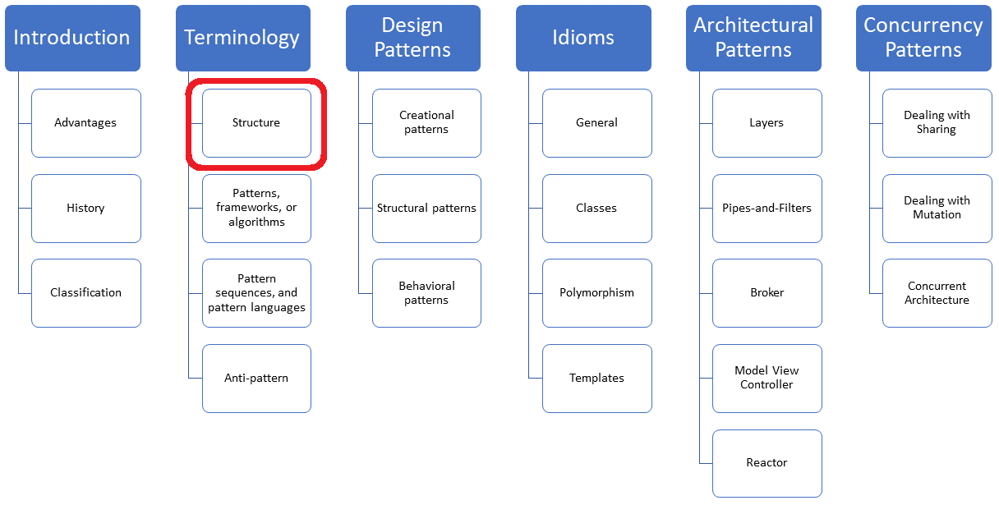
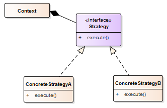

# The Structure of Patterns

15 August 2022

The classics "[Design Patterns: Elements of Reusable Object-Oriented Software"](https://en.wikipedia.org/wiki/Design_Patterns), and ["Pattern-Oriented Software Architecture, Volume 1](https://en.wikipedia.org/wiki/Pattern-Oriented_Software_Architecture)" use similar steps to present their pattern. Today, I will present this structure of a pattern.



Before I write about the structure of a pattern, let me bring you on the same page and start with the definition of a pattern according to Christopher Alexander.

- **Patttern**: "*Each pattern is a three part rule, which expresses a relation between a certain context, a problem, and a solution.*"

This means that a pattern describes a generic solution to a design problem that recurs in a particular context.

- The **context** is the design situation.
- The **problem** are the forces acting in this context.
- The **solution** is a configuration to balance the forces.

Christopher Alexander uses the three adjectives useful, usable and used to describe the benefits of patterns.

- **Useful**: A pattern needs to be useful.
- **Usable**: A pattern needs to be implementable.
- **Used**: Patterns are discovered, but not invented. This rule is called the rule of three:  "*A pattern can be called a pattern only if it has been applied to a real world solution at least three times*." (<https://wiki.c2.com/?RuleOfThree>)

Now, let me write about the structure of a pattern.

## Structure of a Pattern

Honestly, there is a strange phenomenon. On the one hand, both books "[Design Patterns: Elements of Reusable Object-Oriented Software"](https://en.wikipedia.org/wiki/Design_Patterns) and ["Pattern-Oriented Software Architecture, Volume 1](https://en.wikipedia.org/wiki/Pattern-Oriented_Software_Architecture)"  are the most influential books ever written about software development. On the other hand, both books have a great fall-asleep factor. This fall asleep factor is mainly due to the fact that both books present their patterns in monotonously repeating 13 steps.

In order to bore you not to death, I present these 13 steps concisely by applying the "[Design Patterns: Elements of Reusable Object-Oriented Software"](https://en.wikipedia.org/wiki/Design_Patterns)  structure to the [strategy pattern](https://en.wikipedia.org/wiki/Strategy_pattern). The intention of each step is displayed in italic. The non-italic contents refer to the strategy pattern.

### Name

*A concise name that is easy to remember.*

Strategy pattern

### Intent

*An answer to the question: What is the purpose of the pattern?*

Define a family of algorithms, encapsulate them in objects, and make them interchangeable at the run time of your program.

### Also known as

*Alternative names for the pattern if known.*

Policy

### Motivation

*A motivational example for the pattern.*

A container of strings can be sorted in various ways. You can sort them lexicographically, case-insensitive, reverse, based on the length of the string, based on the first n characters ... . Hard coding your sorting criteria into your sorting algorithm would be a maintenance nightmare. Consequentially, you make your sorting criteria an object that encapsulates the sorting criteria and configures your sorting algorithm with it.

### Applicability

*Situations in which you can apply the pattern.*

The strategy pattern is applicable when

- many related classes differ only in their behavior.
- you need different variants of an algorithm.
- the algorithms should be transparent to the client.

### Structure

*A graphical representation of the pattern.*



### Participants

*Classes and objects that participate in this pattern*.

- `Context`: uses a concrete strategy, implementing the `Strategy` interface
- `Strategy`: declares the interface for the various strategies
- `ConcreteStrategyA, ConcreteStrategyB`: implements the strategy

### Collaboration

*Collaboration with the participants.*

The context and the concrete strategy implement the chosen algorithm. The context forward client request to the used concrete strategy.

### Consequences

*What are the pros and cons of the pattern?*

The benefits of the strategy pattern are:

- Families of related algorithms can be used uniformly.
- The client is hidden from implementation details.
- The algorithms can be exchanged during run time.

### Implementation

*Implementation techniques of the pattern.*

1. Define the context and the Strategy interface.
2. Implement concrete strategies.
3. The context can take its arguments at run time or at compile time as a template parameter.

### Sample Code

*Code snippets illustrating the implementation of the pattern. This book uses Smalltalk and C++.*

The strategy pattern is so baked in the design of the Standard Template Library that we may not see it. Additionally, the STL often uses lightweight variants of the strategy pattern.

Here are two of many examples:

#### STL Algorithms

`std::sort` can be parametrized with a sorting criterion. The sorting criteria must be a binary predicate. Lambdas are perfect fits for such binary predicates:

```
// strategySorting.cpp

#include <algorithm>
#include <functional>
#include <iostream>
#include <string>
#include <vector>

void showMe(const std::vector<std::string>& myVec) {
    for (const auto& v: myVec) std::cout << v << " ";
    std::cout << "nn";
}

int main(){

    std::cout << 'n';

    // initializing with a initializer lists
    std::vector<std::string> myStrVec = {"Only", "for", "Testing", "Purpose", "!!!!!"};
    showMe(myStrVec);     // Only for Testing Purpose !!!!! 

    // lexicographic sorting
    std::sort(myStrVec.begin(), myStrVec.end());
    showMe(myStrVec);    // !!!!! Only Purpose Testing for 

    // case insensitive first character
    std::sort(myStrVec.begin(), myStrVec.end(), 
              [](const std::string& f, const std::string& s){ return std::tolower(f[0]) < std::tolower(s[0]); });
    showMe(myStrVec);   // !!!!! for Only Purpose Testing 

    // sorting ascending based on the length of the strings
    std::sort(myStrVec.begin(), myStrVec.end(), 
              [](const std::string& f, const std::string& s){ return f.length() < s.length(); });
    showMe(myStrVec);   // for Only !!!!! Purpose Testing 

    // reverse 
    std::sort(myStrVec.begin(), myStrVec.end(), std::greater<std::string>() );
    showMe(myStrVec);   // for Testing Purpose Only !!!!! 

    std::cout << "nn";

}
```

The program `strategySorting.cpp` sorts the vector lexicographically, case-insensitive, ascending based on the length of the strings, and in reverse order. For the reverse sorting, I use the predefined [function object](https://en.cppreference.com/w/cpp/utility/functional) `std::greater.` The output of the program is directly displayed in the source code.

#### STL Containers

A policy is a generic function or class whose behavior can be configured. Typically, there are default values for the policy parameters. `std::vector` and `std::unordered_map` exemplifies these policies in C++. Of course, a policy is a strategy configured at compile time on template parameters.

```
template<class T, class Allocator = std::allocator<T>>          // (1)
class vector; 

template<class Key,
    class T,
    class Hash = std::hash<Key>,                               // (3)
    class KeyEqual = std::equal_to<Key>,                       // (4)
    class allocator = std::allocator<std::pair<const Key, T>>  // (2)
class unordered_map;
```

This means each container has a default allocator for its elements, depending on `T` (line 1) or on `std::pair<const Key, T>` (line 2). Additionally, `std::unorderd_map` has a default hash function (line 3) and a default equal function (4). The hash function calculates the hash value based on the key, and the equal function deals with collisions in the buckets.

### Known uses

*At least two examples of known use of the pattern.*

There are way more use cases of strategies in modern C++.

- In C++17, you can configure about 70 of the STL algorithms with an execution policy. Here is one overload of `std::sort`:

```
template< class ExecutionPolicy, class RandomIt >
void sort( ExecutionPolicy&& policy,
           RandomIt first, RandomIt last );
```

Thanks to the execution policy, you can sort sequentially `(std::execution::seq`), parallel (`std::execution::par`), or parallel and vectorized (`std::execution::par_unseq`).

- In C++20, most of the classic STL algorithms have a ranges pendant. These ranges pendants support additional customization points such as projections. Read more about them in my previous post, "[Projection with Ranges](https://www.modernescpp.com/index.php/projections-with-ranges)".

### Related Patterns

*Patterns that are closely related to this pattern.*

Strategy objects should be lightweight objects. Consequentially, lambda expressions are an ideal fit.

## What's next?

You may wonder, what is the difference between a pattern, an algorithm, or a framework? Let me clarify this in my next post and introduce terms such as pattern sequences and pattern languages.

**Thanks a lot to my [Patreon Supporters](https://www.patreon.com/rainer_grimm)****: Matt Braun, Roman Postanciuc, Tobias Zindl, Marko,** **G Prvulovic, Reinhold Dröge, Abernitzke,** **Frank Grimm****, Sakib, Broeserl,** **António Pina, Sergey Agafyin, Андрей Бурмистров, Jake, GS, Lawton Shoemake, Animus24, Jozo Leko, John Breland, Louis St-Amour, Venkat Nandam, Jose Francisco, Douglas Tinkham, Kuchlong Kuchlong, Robert Blanch, Truels Wissneth, Kris Kafka, Mario Luoni, Neil Wang, Friedrich Huber, lennonli, Pramod Tikare Muralidhara, Peter Ware, Daniel Hufschläger, Alessandro Pezzato, Evangelos Denaxas, Bob Perry, Satish Vangipuram, Andi Ireland, Richard Ohnemus, Michael Dunsky,** **Leo Goodstadt, John Wiederhirn, Yacob Cohen-Arazi, Florian Tischler, Robin Furness, Michael Young, Holger Detering, Bernd Mühlhaus, Matthieu Bolt, Stephen Kelley, Kyle Dean, Tusar Palauri, Dmitry Farberov, Ralf Holly, Juan Dent, George Liao, Daniel Ceperley, Jon T Hess, and Stephen Totten.**

**Thanks in particular to Jon Hess, Lakshman,** **Christian Wittenhorst, Sherhy Pyton, Dendi Suhubdy, Sudhakar Belagurusamy, Richard Sargeant, Rusty Fleming, Ralf Abramowitsch, John Nebel, Mipko, and Alicja Kaminska.**

**My special thanks to [Embarcadero](https://www.embarcadero.com/de/products/cbuilder)**

**My special thanks to [PVS-Studio](https://pvs-studio.com/modernes_cpp)**

## Mentoring Program in English

- ["Fundamentals for C++ Professionals":](https://www.modernescpp.org/fundamentals-for-c-professionals/) Reopens October 2022
- "Design Patterns and Architectural Patterns in C++": Start January 2023

Do you want to stay informed about my mentoring programs? Write to [info@ModernesCpp.de](https://www.modernescpp.com/index.php/the-structure-of-patternsmailto:info@ModernesCpp.de).

## Seminars

I'm happy to give online seminars or face-to-face seminars worldwide. Please call me if you have any questions.

### Bookable (Online)

#### German

- [C++20](https://www.modernescpp.de/index.php/c/2-c/38-c-20): 23.08.2022 - 25.08.2022 (Termingarantie)
- [Clean Code: Best Practices für modernes C++](https://www.modernescpp.de/index.php/c/2-c/39-clean-code-best-practices-fuer-modernes-c): 11.10.2022 - 13.10.2022 (Termingarantie)
- [Design Pattern und Architekturpattern mit C++](https://www.modernescpp.de/index.php/c/2-c/36-design-pattern-und-architekturpattern-mit-c): 08.11.2022 - 10.11.2022 (Termingarantie)
- [Embedded Programmierung mit modernem C++](https://www.modernescpp.de/index.php/c/2-c/40-embedded-programmierung-mit-modernem-c20220806074522) 31.01.2023 - 02.02.2023

### Standard Seminars (English/German)

Here is a compilation of my standard seminars. These seminars are only meant to give you a first orientation.

#### New

### Contact Me

- Phone: +49 7472 917441
- Mobil:: +49 176 5506 5086
- Mail: [schulung@ModernesCpp.de](https://www.modernescpp.com/index.php/the-structure-of-patternsmailto:schulung@ModernesCpp.de)
- German Seminar Page: [www.ModernesCpp.de](https://www.modernescpp.de/)
- English Seminar Page: [www.ModernesCpp.net](http://www.modernescpp.net/)
- Mentoring Page: [www.ModernesCpp.org](https://www.modernescpp.org/)

### Modernes C++,


