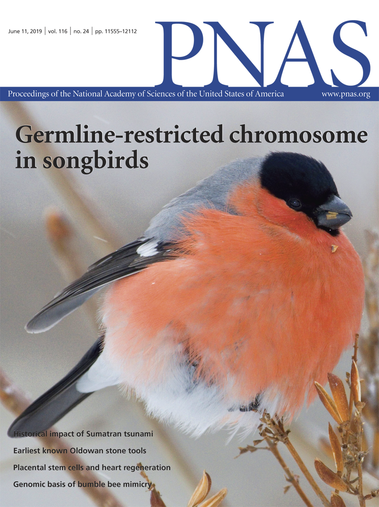

A scarcity mindset alters neural processing underlying consumer decision making | PNAS

<https://www.pnas.org/doi/10.1073/pnas.1818572116>

Not having enough of what one needs has long been shown to have detrimental consequences for decision making. Recent work suggests that the experie...
