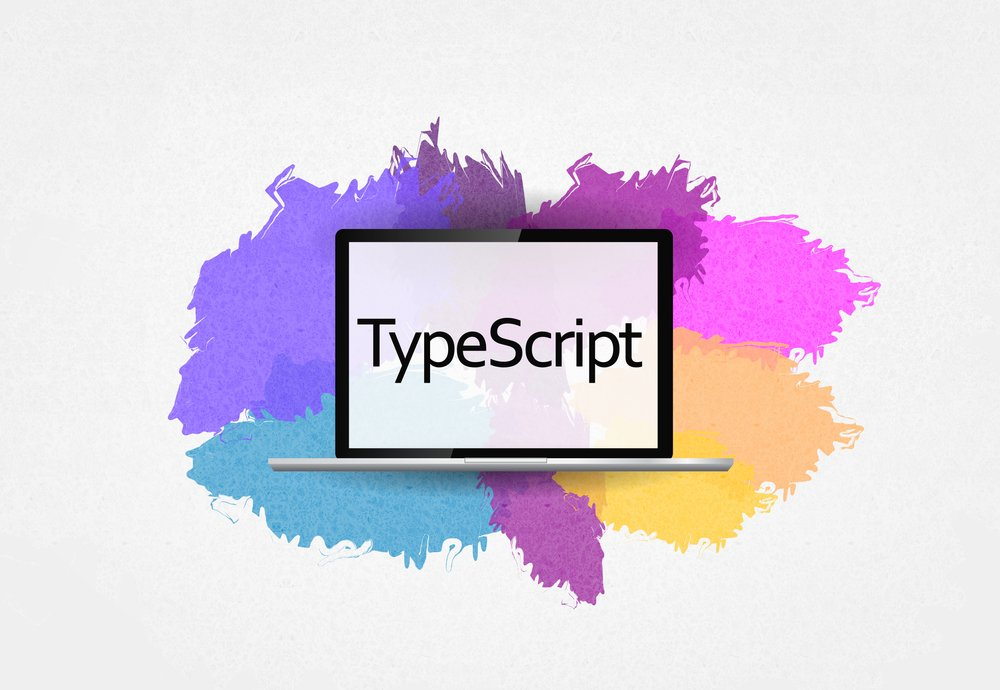
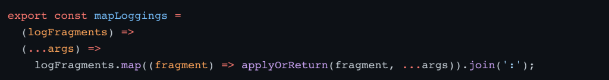
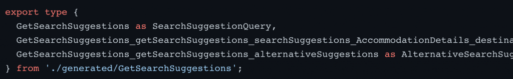

# What Trivago Learned Adopting TypeScript

3 Aug 2022 10:00am,
by 
[Jessica Wachtel](https://thenewstack.io/author/jessica-wachtel/ "Posts by Jessica Wachtel")

Recently, the hotel search company [Trivago](http://trivago.com/) migrated its core website, along with over 50 other Trivago domains, [from PHP/ JavaScript to TypeScript](https://thenewstack.io/from-php-to-next-js-what-trivago-learned-rewriting-its-web-app/). The final version of this mid-to-large scale project includes 200,000 lines of code spread across 2,600 .ts files and 115,000 lines of code spread across 1,500 .tsx files.

[Tom Bartel](https://www.linkedin.com/in/twbartel/), Trivago team lead interface for the platform, explained in a [recent blog post](https://tech.trivago.com/post/2022-08-01-three-learnings-switching-to-typescript/) that most of the developers on the team didn’t have a lot of experience with [TypeScript](https://thenewstack.io/what-is-typescript/). But, for the migration, every imaginable detail was heavily considered so it made sense that the programming language would be evaluated as well.

There’s a learning curve when moving from JavaScript to TypeScript and it does slow down the average pace of code writing, he wrote. Some of that slowdown, the time dedicated to thinking about the flow of data moving through the application, is well worth it in the long run. Bartel explained that it, “sharpens your thinking and increases your discipline.” Defining the types correctly is almost half of the battle.

## **Love at Second Sight**

Before starting to code with TypeScript, the engineers, even those with more limited experience went in with an open mind and some education. Nonetheless, the developers initially found that it was easy to get frustrated. The code below illustrates the highly functional style of JavaScript code (including a lot of map, reduce, and currying) often used before the migration. You see there is more ease in passing arguments from one function to another when the data shape isn’t explicitly defined.

This type of code comes with many additional challenges in TypeScript as the type definitions need to be correct. The options here are either to put much effort into getting the types right (which likely means heavy use of generics) or change the coding style to something less functional.

> Even if every detail of the code isn’t understood 100%, as long as the types are correct,it’s likely that the code will work properly.

Once the adaptation process was finished, Trivago’s engineers found that “TypeScript gives you a lot of confidence in your code,” explained Bartel. While this is a plus when writing new code, there is an extra value when working on code that already exists. Bartel added the tip of even if every detail of the code isn’t understood 100%, as long as the types are correct,it’s likely that the code will work properly.

Now that the rewrite has come to a close, Bartel shares that it feels strange for anyone from the team to work in a non-TypeScript code base. He asked the question, “how do you even reason about the code without knowing what’s in this variable, or if this parameter can ever be null?”

## **Rely on Your (GraphQL) Schema Types**

Trivago auto-generated TypeScript type definitions by leveraging the [GraphQL schemas](https://thenewstack.io/decoupling-frontends-and-backends-with-graphql/) they were already using in their legacy code. The command `apollo client:codegen` contacted the GraphQL server and updated the client-side types:

GraphQL types is the package where Trivago writes the auto-generated code; they isolate it from the hand-written code as a precautionary measure to keep the files conflict-free.

The code below illustrates the auto-generated files and that the interface names are “not pretty,” Bartle admitted.

Trivago exports them under different names which can be seen in the example below.

The example below is one of two best practices. This has worked well for Trivago. The second of the two best practices is to connect the application type system to the automatically generated schema types.

## **Insight: Prefer ‘Connected’ Types Wherever Possible**

Here we discuss the pros, cons, and ins and outs of type casting. For Trivago, data modeling and the creation of types in TypeScript was expected and, as a general concept, unproblematic. The challenge and solution Bartel discussed is the introduction of hand-written types of core entities that are also part of the schema. Some of the core entities in Trivago’s application are Accommodation, Price, etc.

The code below shows the incorrect way to type cast as they were just type casting one into the other:

The correct way to type cast is as follows:

By type casting this as an object, its deals field is also type casted even though the deals field coming from the server has a slightly different type.This “mostly worked” as the hand-written types were “rather similar” to the auto-generated ones but in the end, this can be a “recipe for disaster because you fool yourself and prevent TypeScript from spotting bugs for you,” says Bartel.

Two common problems missed during type casting are:

- **Missing Fields:** This takes place when the hand-written type as a field that doesn’t exist in the schema. Developers will tryst that a field is there when this is impossible as the server doesn’t deliver it.
- **Null/ non-null:** This happens when the server delivers a null value but the hand-written type says a field is set.

Both problems are similar in that TypeScript says a field is there, but in reality, it’s undefined or null, leading to bugs that Bartel described as, “Nasty and very unexpected runtime errors.” Manual testing is the only way it would be caught and that’s really only by luck as it’s challenging to test for specifically and automatic testing most likely will not catch it as those tests would also have to circumvent type safety with a similar type cast which Bartel explained is rather unlikely. This kind of bug, unfortunately, is one that hits in production.

## **Conclusion**

Bartel recommended TypeScript for new projects and libraries. He also recommends it for existing projects due to the ability to migrate gradually. He believes, “the benefits will soon outweigh the initial adaptation problems.”
