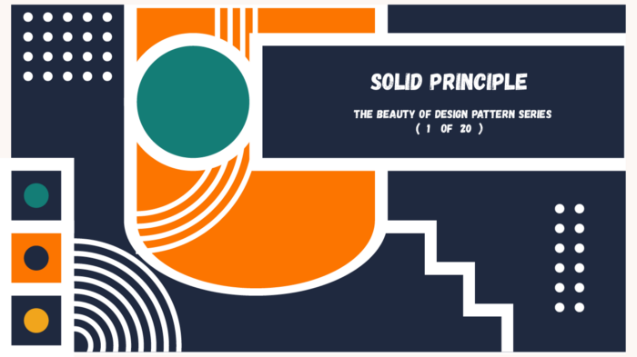

# Solid Principles

## The Beauty of Design Pattern Series (1 of 20)

the beauty of design pattern — solid principle

# Learning objectives and initial explanation

Making software is an art of placing source code that can make us more fun or difficult. Namely **the art of placing source code** and **managing the flow of data** between the codes. It is really depend on the design we are making at the beginning. By understanding from the beginning the importance of the basics of design pattern we can create software that agile for changes in the future. For sure it is needed now.

An Application that are easy to develop are more important than optimizing or tune-up, because easy to change in making the application in doing work will be fun. When it becomes painful it is a sign that we believe we could, and should be doing more.

An Application is difficult to develop if there is no good management of dependencies between modules. If a module depends on another module and this dependency is acute, then this application will be difficult to develop, For example

- module A depends on B
- module B depends on C
- module C depends on D and E
- then when module D changes, it will cause A, B, and C to change

Example above is not good for software development future.

# SOLID concepts in Object Oriented Programming

Michael Feathers and Robert martin introduce 5 concepts in OOP called SOLID, OOP must

1. Single Responsibility
2. Open-Closed
3. Liskov-substitution
4. Interface Segregation
5. Dependency Inversion

If we encounter various kinds of development problems (cases), then we can group these cases based on the pattern, to study the pattern we can learn from a book made by 4 professors who are known as **The Gang of Four, entitled Design pattern.**

If we think an Application that we created as a **Wooden Chair**, then these SOLID and Design patterns can be considered as **wooden tools (axes, sandpaper, etc.)** to create wooden chairs. Of course, before we make a wooden chair, we should learn how to use these tools.

An application that is made without a design they can say **as a time boom** that explodes when there is a demand for change.

# Find the problem and when to Design solution

Building software cannot be done in one or two meetings, it must be done iterations of scheduled meetings with client (it can be once a week or twice a month).

When I first meet the customer, they generally want to express **their wishes and pains**, but the conditions in the field sometimes don’t match what was stated, so it can be considered at the initial meeting to get a general picture, but the detailed development of the software must be carried out in an iterative process as I mentioned above.

Agile prototype for initial design may be needed. Agile prototype means that the initial design must be simple and flexible, so that when meeting with the customer he will have a lot of room for development.

Below some of statements that can be considered when we meet our client.

- We can not do programming using **the BUFD — Big Up Front Design method**, because later when it is practiced in the field there will be many that are not suitable
- When will the **application be finished?**, the answer cannot be predicted, because it depends on the development of requests and the conditions of business changes.
- Buying complex software is applied in company A, obviously not necessarily the same if it is applied in company B, even though companies A and B are similar in their fields of business, because **the human factor** working in the two companies is not the same

# How you can know when your software design is not good enough.

below are some conditions that shows that your software design is not good enough. usually it calls **code smells**:

1. **Rigidity**, if there is a slight change request, but the program is already difficult to change or it can be changed but it takes a long time to think about it
2. **Fragility**, a time when programmers are afraid to change source code because they are afraid that if they change the program it won’t work. When changing one part of the program, but instead causing other parts of the program to be damaged
3. **Immobility**, If there are parts of the same program but copied in many places so that there is a lot of “duplication code” as a result. source becomes a lot, so if you want to change, it will take more time, if you change one part that is duplication code, then automatically we also have to look for another part to change too. generally this happens because programmers don’t do “*refactoring*”
4. **Viscosity**, when a module is run but it’s very slow, it means that this module most likely has too much code. It should be broken down again so that if a test is carried out it can also be done per sub module, so that the time for testing is also faster.
5. **Needless Complexity**, many sources that are no longer needed, are not deleted so that it can be said that the source code is “useless” but is still executed by the system

# Summary

An application that is very complex if from the beginning it is not designed properly it will be difficult to change. With the changing times that are very fast today, if you can’t keep up with the changes, you will be left behind and have less competitiveness

If the system is not good, then this can make our client not competitive, below are some condition samples:

- **Speed of service**, for example there is a customer ordering goods/services, if you have a good system it may be possible to immediately send it, but if not it can take days
- **Circulation of money,** if the system is not good then the customer receivables that should be billed become overdue so that this causes losses to the company’s liquidity (finance)
- **Inventory turnover,** if too many items accumulate in the warehouse, it will cause costs, while if the customer’s stock is empty, the customer cannot be served immediately, then a good stock system is also an important factor in business continuity.
