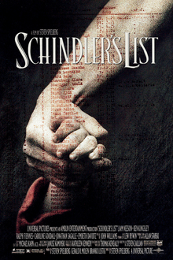

> Drama dirigido por Steven Spielberg, baseado no livro Schindler's Ark de Thomas Keneally (1982). Liam Neeson faz Oskar Schindler, industrial alemão que, na Cracóvia ocupada pelos nazistas, usa sua fábrica e propinas para proteger trabalhadores judeus. Ben Kingsley e Ralph Fiennes no elenco. 195 minutos. Levou sete Oscars, incluindo Melhor Filme e Melhor Direção.

Bad vibes 😢. Fui ver Bastardos Inglórios na sequência para aliviar.

