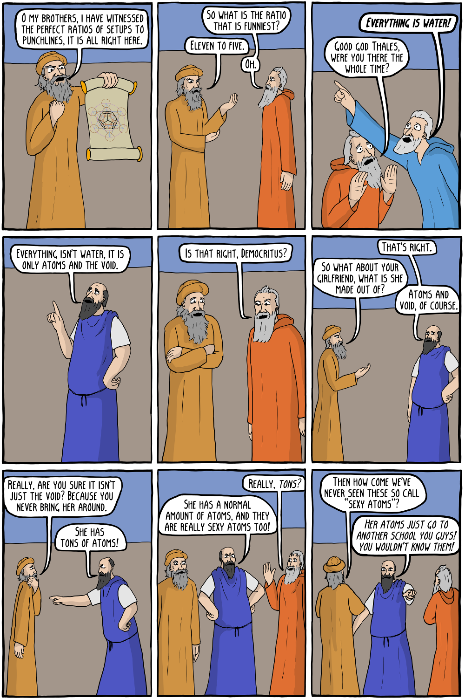

Comic by Corey Mohr (Existential Comics).

![Page 1: “Hey Heraclitus.” / “Heraclitus.” / “Hey. Hey.” / “What is it Parmenides?” / “I just wanted to give you an update on some of the changes in my life.” / “Parmenides...come on, I've already hear–” / “There are none, because change is impossible!” / “Just because the jokes you tell never change, doesn't mean that nothing does.” / “What's amazing is that it never gets less funny, proving that change is impossible.” / “It doesn't get less funny because it wasn't funny to begin with...” / “It wasn't funny because it lacks the balance of perfect integers in relation to divine ratios.” / “Oh god damnit, who invited Pythagoras?” / “Heed my words, brother!” / “Comedy, like all things, hinges on the relationship between the underlying mathematical properties of nature.” Page 2: “O my brothers, I have witnessed the perfect ratios of setups to punchlines, it is all right here.” / “So what is the ratio that is funniest?” / “Eleven to five.” / “Oh.” / “Everything is water!” / “Good god Thales, were you there the whole time?” / “Everything isn't water, it is only atoms and the void.” / “Is that right, Democritus?” / “That's right.” / “So what about your girlfriend, what is she made out of?” / “Atoms and void, of course.” / “Really, are you sure it isn't just the void? Because you never bring her around.” / “She has tons of atoms!” / “She has a normal amount of atoms, and they are really sexy atoms too!” / “Really, tons?” / “Then how come we've never seen these so call "sexy atoms"?” / “Her atoms just go to another school you guys! You wouldn't know them!”](a-presocratic-get-together-1.png)

