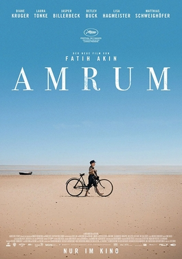

> Drama histórico dirigido por Fatih Akin, escrito com Hark Bohm a partir das memórias de infância de Bohm na ilha de Amrum, no Mar do Norte alemão. Estreou no Festival de Cannes em maio de 2025. Acompanha um menino de doze anos nas últimas semanas da Segunda Guerra, entre o trabalho na lavoura, a coleta de lenha e a vida em família. 93 minutos.

Filme sobre o crescimento de um menino que não pertence a nenhum mundo.

