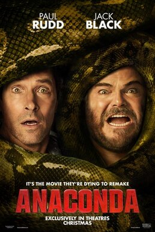

> Comédia dirigida por Tom Gormican, escrita com Kevin Etten, produzida pela Columbia Pictures e distribuída pela Sony. Jack Black e Paul Rudd são Doug e Griff, amigos de infância insatisfeitos com a vida que obtêm os direitos para refilmar Anaconda (1997) e viajam à Amazônia para rodar uma versão independente de baixo orçamento. No set aparece uma anaconda gigante e real. Steve Zahn, Thandiwe Newton, Daniela Melchior e Selton Mello completam o elenco. Estreou nos cinemas dos EUA e do Brasil em 25 de dezembro de 2025, e em Portugal em 24 de dezembro. 99 minutos.

Vi com a Layla em fevereiro. Melhor filme de comédia em muito tempo. Cenas geniais, um roteiro nonsense bem estruturado. Jack Black dando seu melhor.

Jack Black aparece também em [The Super Mario Galaxy Movie](/notes/super-mario-galaxy/).

