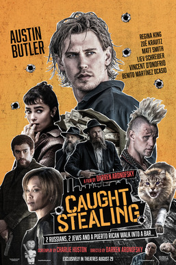

> Comédia negra criminal dirigida por Darren Aronofsky, baseada no romance de Charlie Huston. Austin Butler faz Henry "Hank" Thompson, ex-jogador de baseball que virou barman e cuida do gato de um vizinho. Matt Smith, Zoë Kravitz, Regina King, Liev Schreiber e Bad Bunny no elenco. Ambientado na Nova York dos anos 90. Estreou nos cinemas dos EUA em 29 de agosto de 2025. 107 minutos.

Aronofsky é sempre interessante. Matt Smith muito divertido.

