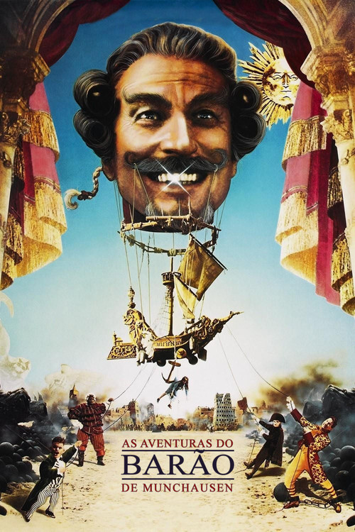

**Karl Friedrich Hieronymus von Münchhausen** (1720–1797) foi um barão de Hanover que serviu no exército russo nas guerras contra o Império Otomano. Depois de se aposentar, ficou conhecido por contar histórias absurdas sobre suas aventuras — cavalgava balas de canhão, viajava à lua, puxava a si mesmo (e ao cavalo) de um pântano pelo próprio cabelo.

Em 1785, Rudolf Erich Raspe publicou em inglês uma coletânea dessas histórias sem autorização. Münchhausen odiou a fama e tentou processar o tradutor alemão, Gottfried August Bürger, sem sucesso. A Síndrome de Münchhausen (fabricar doenças para receber atenção médica) foi batizada em sua homenagem em 1951.

### O filme de Terry Gilliam (1988)

*The Adventures of Baron Munchausen* fecha a trilogia da imaginação de Gilliam, junto com *Time Bandits* (1981, infância) e *Brazil* (1985, vida adulta). O filme trata da velhice e da batalha entre fantasia e razão.

Numa cidade sitiada pelos turcos na "Era da Razão", um velho se apresenta como o verdadeiro Barão e parte com uma criança (Sarah Polley) para reunir seus antigos companheiros — cada um com um poder impossível. A viagem passa pela lua (Robin Williams, não creditado), pelo estômago de um monstro marinho e pelo Vesúvio, onde moram Vulcano (Oliver Reed) e Vênus (Uma Thurman).

O orçamento saiu de US$ 23,5 milhões para US$ 46,6 milhões. A Columbia Pictures enterrou o filme porque a direção do estúdio estava trocando de mãos — lançaram apenas 117 cópias nos EUA. Foi um desastre de bilheteria e quase encerrou a carreira de Gilliam.

