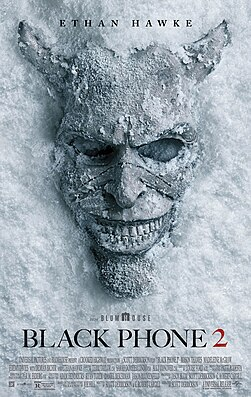

> Terror sobrenatural dirigido por Scott Derrickson, escrito com C. Robert Cargill. Sequência de The Black Phone (2021). Mason Thames e Madeleine McGraw reprisam Finney e Gwen Blake; Ethan Hawke volta como The Grabber. Demián Bichir entra no elenco. Quatro anos após derrotar um serial killer, os irmãos enfrentam ocorrências sobrenaturais ao chegar num acampamento de inverno. Estreou no Fantastic Fest em setembro de 2025; cinemas EUA em 17 de outubro. 114 minutos.

Filme interessante. Abraça o sobrenatural, achei que não funcionaria como continuação mas é divertido.

