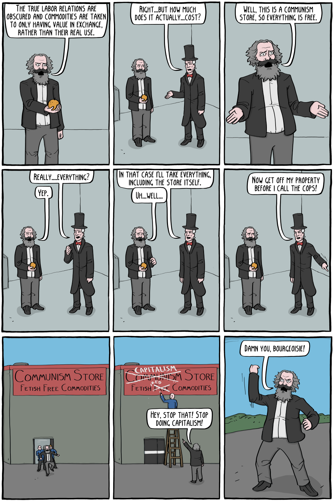

Comic by Corey Mohr (Existential Comics).

![Page 1: storefront sign reading “Communism Store / Fetish Free Commodities”. Inside, crates labeled “Oranges”. “Hi! Welcome to the Communism Store, what do you need?” / “How much do oranges cost?” / “How much do they cost?” / “They cost the labor of the workers who planted the seeds and harvested the fruit!” / “They cost the time and energy of those who drove the trucks and stocked the shelves!” / “Here at the Communism Store we do not fetishize our commodities by imbuing them with the mystical property of price, which masks the human relations in the exchange of labor.” / “In a true marketplace, commodities are exchanged by human beings for their use by other human beings, labor for labor. But capitalism has distorted this market, and produces commodities purely for profit.” Page 2: “The true labor relations are obscured and commodities are taken to only having value in exchange, rather than their real use.” / “Right...but how much does it actually...cost?” / “Well, this is a Communism store, so everything is free.” / “Really....everything?” / “Yep.” / “In that case I'll take everything, including the store itself.” / “Uh...well...” / “Now get off my property before I call the cops!” Guards drag the bearded man out of the store; the sign is changed to “Capitalism Store / Fetish Red Commodities” (with “Communism” and “Free” crossed out). “Hey, stop that! Stop doing capitalism!” / “Damn you, bourgeoisie!”](communism-store-1.png)

