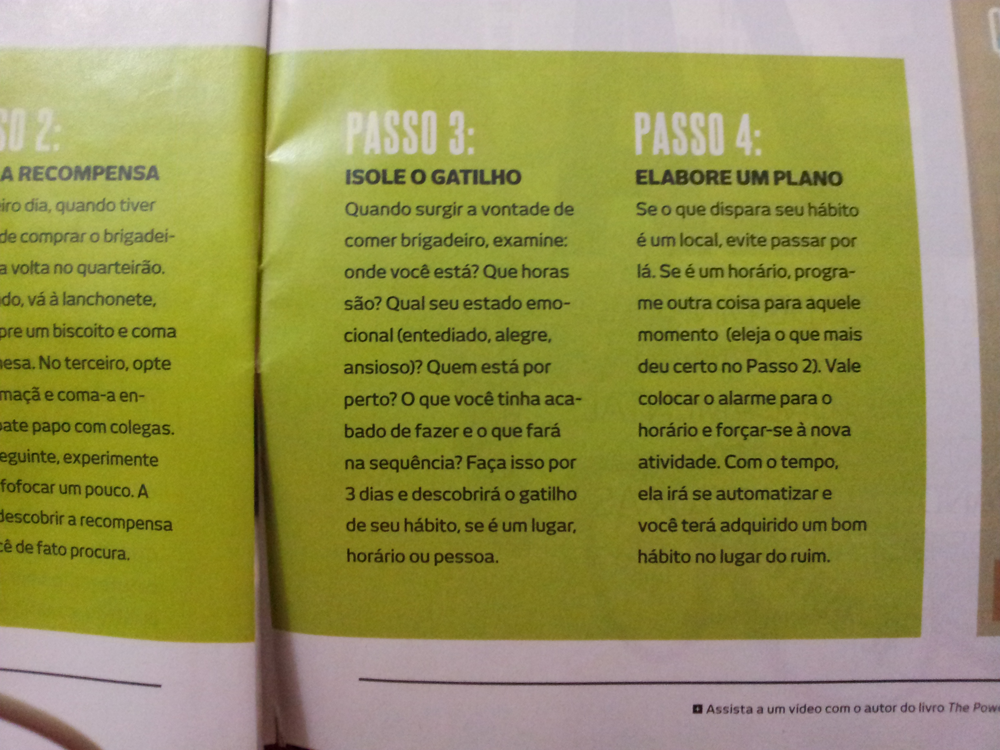
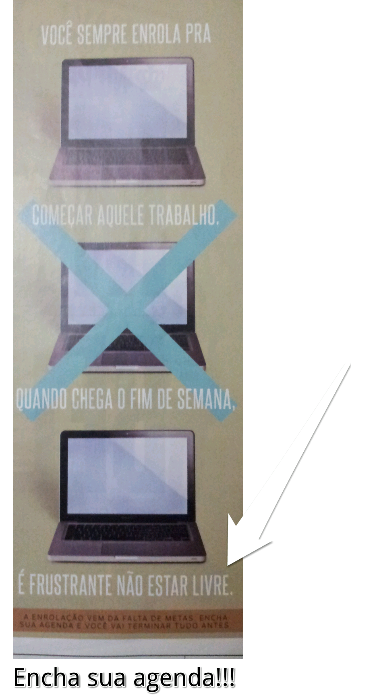

Página de revista impressa, autoria desconhecida (junho de 2012).

![Três fotos de página de revista impressa. Primeira foto: seção "MANUAL PARA DIAGNOSTICAR SEU MAU HÁBITO E CONVERTÊ-LO EM UM BOM", com "PASSO 1: IDENTIFIQUE O CICLO" (texto sobre notar o gatilho, a rotina e a recompensa de um hábito, usando como exemplo comer um brigadeiro) e o início de "PASSO 2: TESTE A RECOMPENSA" (sugestão de substituir o hábito por alternativas ao longo de alguns dias para descobrir a recompensa real buscada); rodapé datado "JUNHO - 2012". Segunda foto: continuação de "PASSO 2", "PASSO 3: ISOLE O GATILHO" (perguntas sobre onde, quando e com quem o hábito ocorre) e "PASSO 4: ELABORE UM PLANO" (substituir o gatilho por uma nova atividade até ela se automatizar); nota de rodapé convidando a assistir a um vídeo com o autor do livro "The Pow(er of Habit)". Terceira foto: anúncio não relacionado sobre procrastinação, com três laptops (dois riscados com um X) e o texto "VOCÊ SEMPRE ENROLA PRA COMEÇAR AQUELE TRABALHO QUANDO CHEGA O FIM DE SEMANA, É FRUSTRANTE NÃO ESTAR LIVRE" e "A ENROLAÇÃO VEM DA FALTA DE METAS. ENCHA SUA AGENDA E VOCÊ VAI TERMINAR TUDO ANTES. Encha sua agenda!!!".](eliminando-um-mau-habito-1.jpg)

