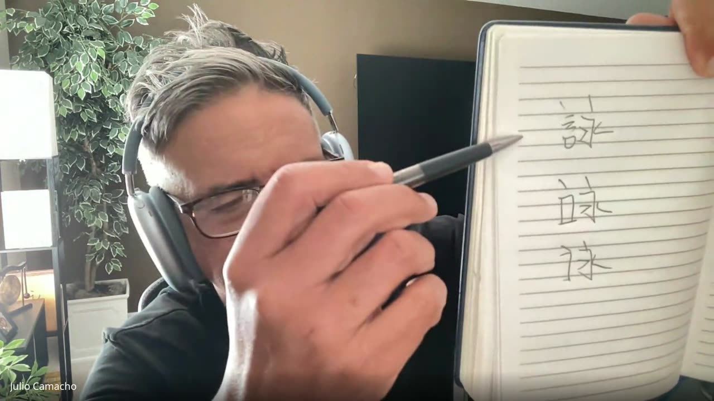
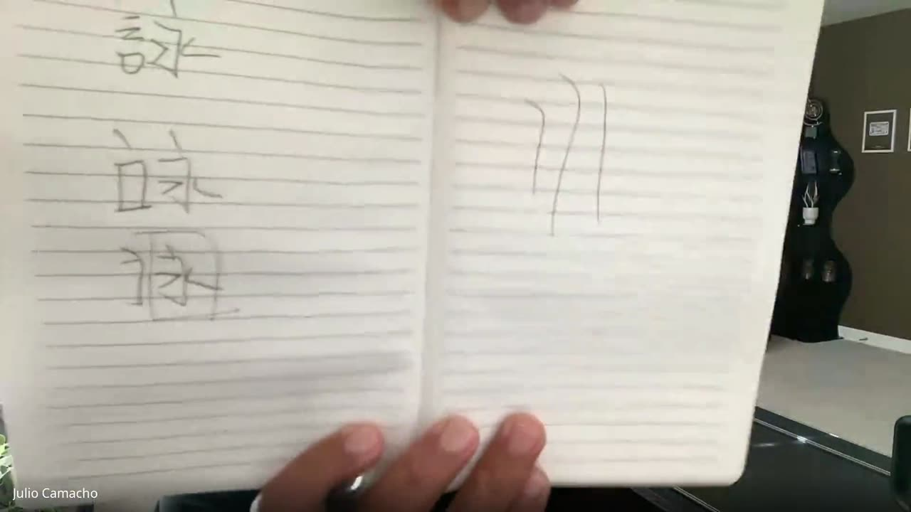
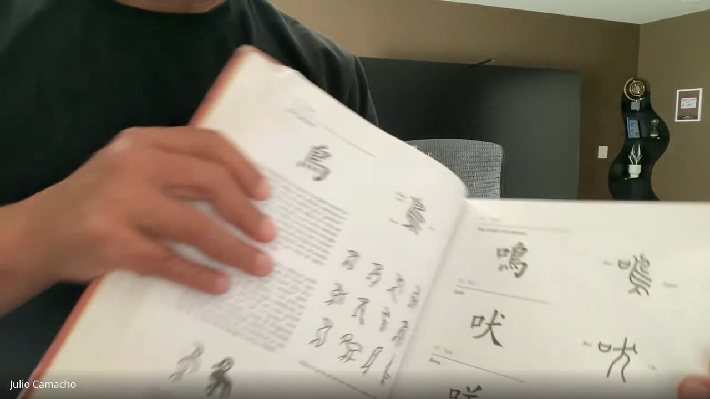

Anotações do primeiro encontro de Chinês Instrumental, conduzido por Si Fu, com Claudio Teixeira. O recorte combinado foi Chinês instrumental, mas esse primeiro encontro percorreu o mapa todo: como se escreve o ideograma, por que isso importa para quem ensina, o que separa Mandarim de Cantonês, o que o Pinyin é de fato, e como tudo isso se amarra ao projeto de unificação do Império do Centro. As próximas aulas pousam em ideogramas específicos; este encontro foi para deixar o terreno claro.

### A escrita do ideograma e o grid

Si Fu passou um *template* de quadradinhos divididos em quatro porções, com diagonais e quadrados internos como guia. A regra é simples: o ideograma chinês não flutua, ocupa um quadrado, e o equilíbrio interno desse quadrado é metade do que ele comunica. O exercício é pegar o grid e treinar um ideograma por vez (foi sugerido começar pelo *siu nim tau*), uns dez minutos por dia, para desenvolver percepção espacial da escrita antes de qualquer preocupação com beleza.

Si Fu lembrou que a escrita é um aspecto central do chinês, muito mais central do que o ocidental costuma intuir. Aprender a escrever bem é o que sustenta a comunicação no longo prazo, não um capricho estético.

### Por que escrever bem importa

A razão de aprender a escrever bem não é vaidade nem autoridade de internet. É evitar virar analfabeto funcional dentro da própria tradição que se ensina. Quando o praticante erra a escrita das técnicas que pratica, abre flanco para que terceiros questionem seu saber por motivo bobo, e essa exposição é desnecessária. Si Fu foi explícito: o objetivo da *expertise* na escrita é blindar o trabalho de questionamentos triviais, não disputar palco.

### Chinês, Mandarim, Cantonês: o que é o quê

Antes de qualquer aula de língua, é preciso desfazer o nó terminológico. "Chinês" é palavra genérica nossa, e a aula foi recortada como Chinês instrumental por demanda do Claudio. Si Fu contrastou o Cantonês: carrega uma lógica mais interna e política, ligada às divisões regionais e à tradição genealógica das famílias do sul. Não é dialeto no sentido de versão regional fraca, é um sistema com história própria, mas não é a língua oficial.

### O nome do Império

Si Fu observou que o país não se chama China na própria China: o nome é 中國, *Zhōngguó*, o País do Centro ([Names of China — Wikipedia](https://en.wikipedia.org/wiki/Names_of_China)). Daí ele puxou o traço que separa o chinês das línguas alfabéticas: para ele, cada caractere é uma unidade de sentido antes de ser uma unidade de som.

### Mandarim como latim do Império

Si Fu fez a comparação que destrava a confusão: Mandarim está para a China como o Latim esteve para Roma. Para ele, Mandarim é a língua oficial do Império, e tudo o resto, Cantonês, Hokkien, Xangainês, é dialeto, no sentido técnico de língua que não foi adotada como eixo administrativo. A comparação com o Latim não é só decorativa: é a língua que permite ao Estado existir como Estado em escala continental.

### Escrita unificada e simplificação

Si Fu lembrou que a unificação da escrita é a parte antiga do projeto: falantes que não se entendem de ouvido conseguem se ler, porque o ideograma não depende do som.

A parte moderna é a simplificação. O Esquema de Simplificação dos Caracteres Chineses, promulgado pela República Popular da China em 1956, fez parte do esforço do governo para promover a alfabetização. Os caracteres simplificados são o padrão na China continental, na Malásia e em Singapura; Hong Kong, Macau e Taiwan seguem oficialmente com os tradicionais ([Simplified Chinese characters — Wikipedia](https://en.wikipedia.org/wiki/Simplified_Chinese_characters)).

### Pinyin: romanização e sistema

A romanização é o uso do alfabeto latino para representar sons do chinês, e o Pinyin é o sistema romanizado oficial do Mandarim. Funciona como pista fonética para o som dos ideogramas: 中 vira *zhōng*, com a marca tonal em cima da vogal.

Surgiu na aula a pergunta se Pinyin é um *sistema* ou só um *mapeamento*, uma tabela de conversão. Si Fu concordou que dá para enxergar como tabela. Mas vale insistir: é as duas coisas, e a distinção importa. Por baixo, parece tabela, par de som e símbolo. Por cima, é sistema, porque tem regras de silabação, marcação de tom, separação de palavras, e só funciona porque existe uma única língua oficial para romanizar. O Hanyu Pinyin foi aprovado na Quinta Sessão da 1ª Assembleia Popular Nacional, em 11 de fevereiro de 1958, e entrou nas escolas primárias para ensinar a pronúncia do mandarim padrão; também serviu à alfabetização de adultos ([Pinyin — Wikipedia](https://en.wikipedia.org/wiki/Pinyin)).

### Cantonês: dialeto sem sistema oficial

O Cantonês não passou pela simplificação, embora falantes de Cantonês quase sempre consigam ler texto simplificado, porque aprenderam isso na escola sob o currículo oficial. Si Fu apontou particularidades que o Mandarim não tem: palavras do dia a dia sem par escrito em ideograma, para as quais se usa um substituto improvisado. O exemplo que ele deu foi a palavra "lápis".

Ligou isso à falta de um padrão único de romanização do Cantonês: é por isso, explicou, que o sobrenome 梅 aparece grafado como Mo, Moy, Mui, conforme a família e a época em que ela registrou a romanização. A família Moy Yat Sang é um caso concreto. Ver [etimologia de 梅](/notes/etimologia-de-moy-mei/).

### Tons

Outro ponto que não tem equivalente em português: o tom muda o significado da palavra. Não é sotaque nem ênfase, é parte da identidade lexical do termo. Mandarim tem quatro tons e um tom neutro, sem marca ([os quatro tons do Mandarim](/notes/os-quatro-tons-do-mandarim-em-pinyin/)). No Cantonês a contagem depende da análise: seis tons na análise moderna usada pelo Jyutping, nove na tradicional, que conta à parte os tons de entrada ([os tons do Cantonês](/notes/os-tons-do-cantones-em-jyutping/)). Mais tons significa mais discriminação semântica por sílaba, e também mais espaço para erro quando se está aprendendo.

### Ver também

- [Os quatro tons do Mandarim em Pinyin](/notes/os-quatro-tons-do-mandarim-em-pinyin/): diacríticos, contornos e regras de sandhi.
- [Os tons do Cantonês em Jyutping](/notes/os-tons-do-cantones-em-jyutping/): os seis (ou nove) tons do Cantonês e o sistema de transliteração.
