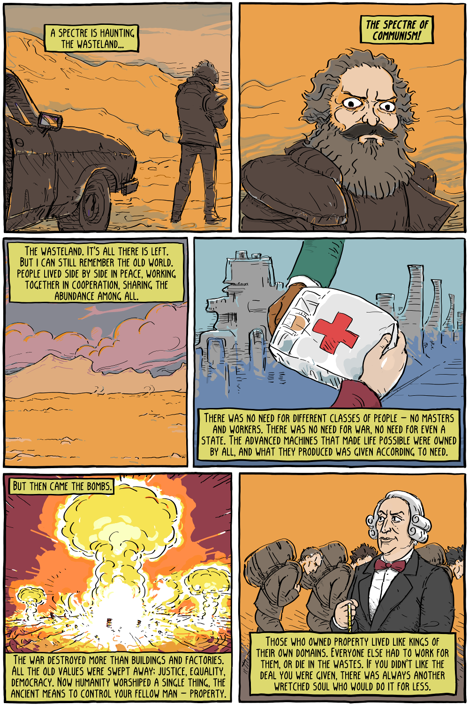
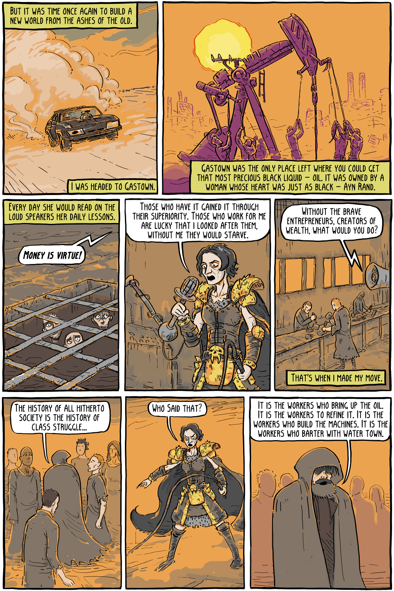
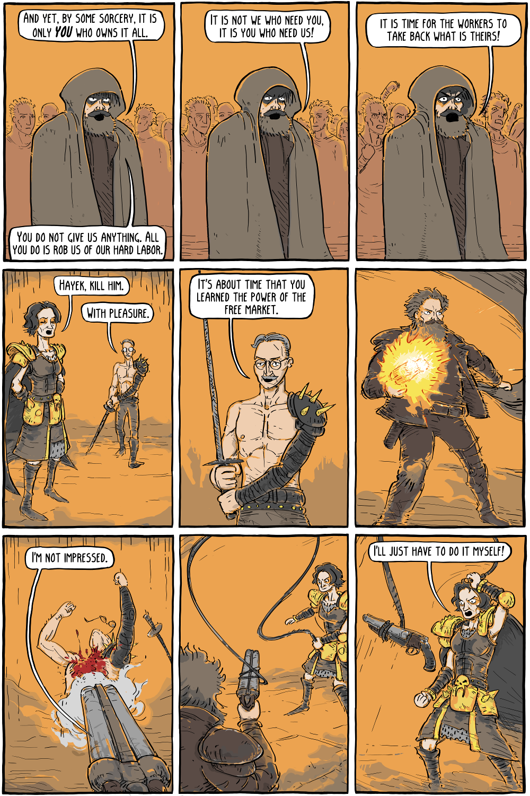
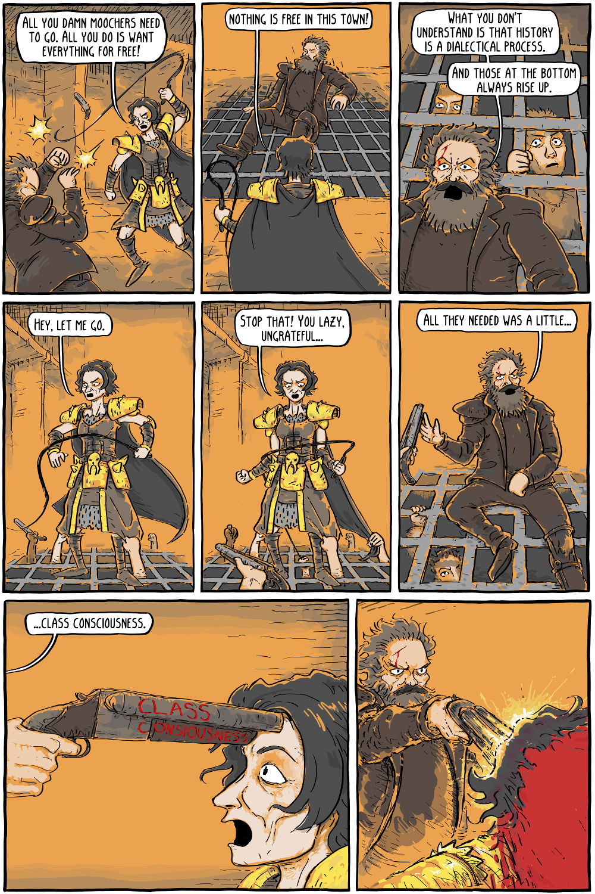

Tirinha de Corey Mohr (Existential Comics).

![Capa: “MAD MARX / THE CLASS WARRIOR”, barbudo de casaco segurando uma espingarda. Página 1: “A spectre is haunting the wasteland...” / “The spectre of communism!” / “The wasteland. It's all there is left. But I can still remember the old world. People lived side by side in peace, working together in cooperation, sharing the abundance among all.” / “There was no need for different classes of people – no masters and workers. There was no need for war, no need for even a state. The advanced machines that made life possible were owned by all, and what they produced was given according to need.” / “But then came the bombs.” / “The war destroyed more than buildings and factories. All the old values were swept away; justice, equality, democracy. Now humanity worshiped a single thing, the ancient means to control your fellow man – property.” / “Those who owned property lived like kings of their own domains. Everyone else had to work for them, or die in the wastes. If you didn't like the deal you were given, there was always another wretched soul who would do it for less.” Página 2: “But it was time once again to build a new world from the ashes of the old.” / “I was headed to Gastown.” / “Gastown was the only place left where you could get that most precious black liquid – oil. It was owned by a woman whose heart was just as black – Ayn Rand.” / “Every day she would read on the loud speakers her daily lessons.” / “Money is virtue!” / “Those who have it gained it through their superiority. Those who work for me are lucky that I looked after them, without me they would starve.” / “Without the brave entrepreneurs, creators of wealth, what would you do?” / “That's when I made my move.” / “The history of all hitherto society is the history of class struggle...” / “Who said that?” / “It is the workers who bring up the oil. It is the workers to refine it. It is the workers who build the machines. It is the workers who barter with Water Town.” Página 3: “And yet, by some sorcery, it is only YOU who owns it all.” / “You do not give us anything. All you do is rob us of our hard labor.” / “It is not we who need you, it is you who need us!” / “It is time for the workers to take back what is theirs!” / “Hayek, kill him.” / “With pleasure.” / “It's about time that you learned the power of the free market.” / “I'm not impressed.” / “I'll just have to do it myself!” Página 4: “All you damn moochers need to go. All you do is want everything for free!” / “Nothing is free in this town!” / “What you don't understand is that history is a dialectical process.” / “And those at the bottom always rise up.” / “Hey, let me go.” / “Stop that! You lazy, ungrateful...” / “All they needed was a little...” / “...class consciousness.” (inscrição na espingarda: “Class Consciousness”). Contém violência gráfica cartunesca (tiros e sangue).](mad-marx-the-class-warrior-1.png)

